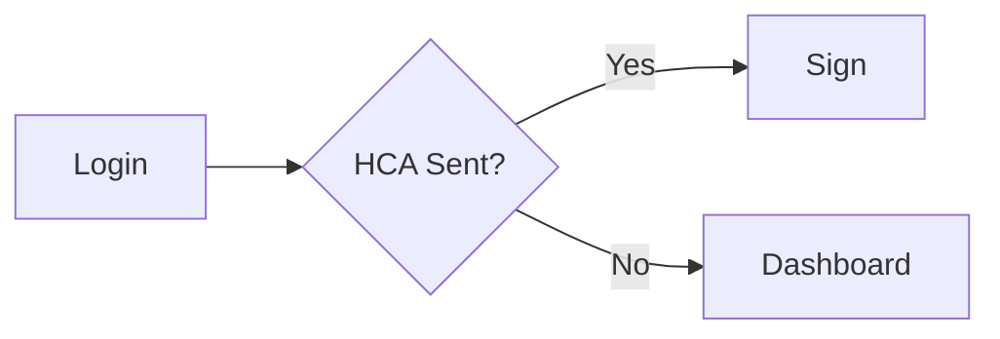
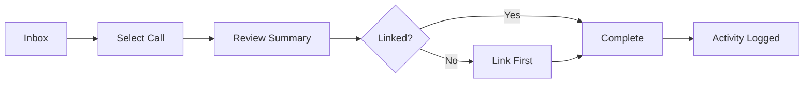
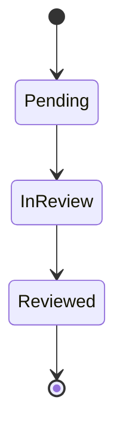

# Trilogy Flow Diagram Skill

Generate visual flow diagrams from user scenarios in `spec.md` to replace lengthy prose with digestible single-page visuals.

## Purpose

Flow diagrams eliminate word overload by showing:
- All user paths at a glance
- Decision points (where users choose different actions)
- Error handling (what happens when things fail)
- Success/failure states (where flows end)

Use after `/speckit.clarify` when spec is finalized but still text-heavy.

## Epic Detection & Routing (NEW CHAT)

```bash
find .tc-docs/content/initiatives -name "spec.md" -type f 2>/dev/null | sort
```

**If spec.md exists**: Load and proceed to flow diagram generation
**If no spec.md found**: Ask user to create spec first

## Format

**Default to Mermaid** format for embedding in spec.md (renders in VS Code, GitHub, and documentation sites).

Only use ASCII if user explicitly requests it for terminal viewing or git diffs.

## Execution Flow

### 1. Load Spec

Read `spec.md` and extract from "User Scenarios & Testing":
- Actor (who is using)
- User Flow (numbered steps)
- Edge Cases (alternative paths)
- Acceptance Scenarios (validation rules)

### 2. Identify Flow Elements

For each scenario, find:
- **Start point** (user action that triggers flow)
- **Steps** (what user does, what system does)
- **Decisions** (if/then branches, user choices)
- **Errors** (validation failures, permission denials)
- **End state** (success message, error, etc.)

### 3. Generate Diagram

#### ASCII Format (`user-flow.txt`)

**Symbols:**
```
START/DONE              → Plain text at top/bottom
Process/Step           → [Box with text]
Decision Point         → ╔Box╗ with options below
User Action            → User does X
System Response        → System shows/does X
Success Path           → ✓ Message
Error Path             → ✗ Error message
Multiple Paths         → Branch left/right
```

**Layout:**
- Top-to-bottom main flow
- Branch left/right for alternate paths
- Converge back when paths rejoin
- Error paths clearly separated

#### Mermaid Format (`user-flows.md`)

**Compact Mermaid (MANDATORY — no exceptions):**
- **ALWAYS `flowchart LR`** — horizontal, left-to-right. NEVER use `flowchart TD` (too tall, wastes vertical space in docs)
- Keep node labels SHORT (5-15 chars max) — abbreviate aggressively
- Single-letter IDs: `A`, `B`, `C` — not `start`, `userClicksButton`
- Max ~8 nodes per diagram — if more, split into two diagrams or simplify
- No subgraphs — keep flat
- Use `&` operator to merge parallel paths
- Use `-.->` for optional/interrupt paths

**Mermaid Symbols:**
```
[Text]     → Rectangle (process)
{Text}     → Diamond (decision)
((Text))   → Circle (end state)
-->        → Arrow
-.->       → Dotted arrow (optional path)
```

**Example Compact Flow:**


### 4. Embed Flows in Spec

**IMPORTANT**: Flows should be embedded directly in `spec.md`, NOT as a separate file.

**Placement Options:**

1. **Inline with user story** (preferred): If flow is specific to one story, add it immediately after the acceptance scenarios
2. **Shared section**: If flow covers multiple stories, add a "User Flows" section after all stories

**Inline Example (in spec.md):**
```markdown
### User Story 3 - Complete Call Reviews from Inbox

**Acceptance Scenarios:**
1. Given... When... Then...
2. Given... When... Then...

**Flow:**

```

**Why embed in spec?**
- Keeps flow with the story context
- Single source of truth
- Stakeholders see story + flow together
- No separate file to maintain

### 4b. Complex Flows (Optional Separate Section)

For complex flows spanning multiple stories (e.g., state diagrams, error paths), add a section at the end of User Scenarios:

```markdown
### User Flow Summary

**Phase 1 MVP Flow:**


**State Transitions:**

```

### 5. Migrate Existing Flows

If flows were previously in a separate file (user-flows.md), migrate them into the spec and remove the separate file.

### 6. Validation

- All user stories represented
- All decision points shown
- Error paths included
- Success/failure states marked
- Diagram readable (not too dense)

## When to Use

**Placed after** `/speckit.clarify` when spec is fully clarified but text-heavy

**Before** `/trilogy.clarify-db` or `/trilogy.clarify-design`

**Typical workflow:**
```
/speckit.specify → /speckit.clarify → /trilogy.flow-diagram → /speckit.plan
```

## Behavior Rules

- Simple specs → Quick diagram
- Complex specs with 4+ paths → Suggest multiple focused diagrams
- If diagram gets unreadable → Split into master + per-path diagrams
- Always show error paths
- Validate every acceptance scenario can be traced through diagram
