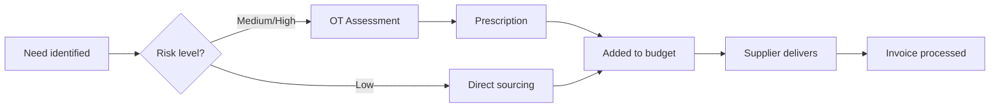

Assistive Technology (AT) refers to items, equipment, or products that help people do things more easily or independently.

---

## What Is Assistive Technology?

Equipment and aids that support daily living activities. Unlike home modifications (structural changes), assistive technology is portable or semi-portable equipment.

| Category | Examples |
|----------|----------|
| **Mobility** | Walking frames, wheelchairs, scooters, lifting devices |
| **Self-care** | Shower chairs, toilet aids, dressing aids, adapted utensils |
| **Communication** | Reading aids, AAC devices, hearing amplifiers |
| **Domestic** | Reaching aids, jar openers, kitchen aids |
| **Body support** | Pressure cushions, support stockings, positioning aids |

---

## Funding Under Support at Home

Assistive technology has its own funding stream under the AT-HM scheme, separate from ongoing care services.

### Funding Tiers

| Tier | Amount | Period | Notes |
|------|--------|--------|-------|
| **Low** | Up to $500 | 12 months | Basic equipment |
| **Medium** | Up to $2,000 | 12 months | Standard equipment |
| **High** | $15,000+ | 12 months | **NOT capped** - can access additional with valid prescription |

### Key Rules

- **12-month spending period** — Funds must be SPENT within 12 months
- **No lifetime cap** — Unlike home modifications, AT funding renews annually
- **Prescription requirements** — Higher-tier items need OT assessment
- **Tier 5 codes required** — All claims must have ISO classification codes

---

## Five-Tier Classification System

Equipment is classified into tiers based on complexity and risk:

| Tier | Description | Examples | Prescription |
|------|-------------|----------|--------------|
| **Tier 1** | Low-cost consumables | Non-slip mats, basic aids | No |
| **Tier 2** | Basic equipment | Walking sticks, shower stools | Under advice |
| **Tier 3** | Standard equipment | Walking frames, shower chairs | OT recommendation |
| **Tier 4** | Complex equipment | Wheelchairs, hoists | Full OT prescription |
| **Tier 5** | Complex items | Powered equipment, custom items | Full OT + detailed codes |

---

## Common Assistive Technology

### Mobility Aids

- Walking frames and rollators
- Manual and powered wheelchairs
- Mobility scooters
- Transfer aids and hoists

### Bathroom Aids

- Shower chairs and stools
- Toilet frames and raised seats
- Bath boards and transfer benches
- Grab rails (portable)

### Daily Living Aids

- Reaching aids and grabbers
- Adaptive cutlery and plates
- Dressing aids
- Memory and cognitive aids

---

## The Process

1. **Need identified** — Care Partner or client identifies equipment need
2. **Risk assessment** — Determine if OT assessment is required
3. **Prescription** — For higher-tier items, OT recommends specific equipment
4. **Budget** — Equipment added to AT-HM budget with Tier 5 codes
5. **Delivery** — Supplier delivers equipment
6. **Billing** — Invoice matched to prescription and claimed

---

## Coordination Fee Caps

| Type | Cap |
|------|-----|
| Assistive Technology Administration | 10% of item cost OR $500 (whichever lower) |

---

## What's NOT Covered

- Everyday household appliances (dishwashers, microwaves)
- Assessment/therapy tools used by therapists
- Items funded through alternative programs (NDIS, DVA)
- General consumer electronics

---

## Related

- [Home Modifications](/context/concepts/home-modifications) - Structural changes to the home
- [AT-HM Scheme](/context/concepts/assistive-technology-home-modifications) - Full AT-HM scheme technical details
- [Budget Domain](/features/domains/budget) - How AT-HM integrates with budget management
