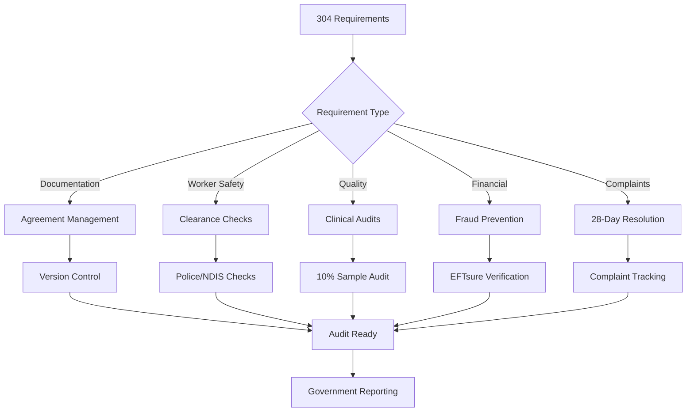
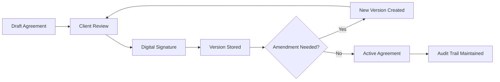
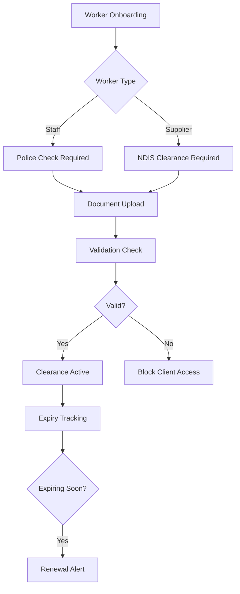
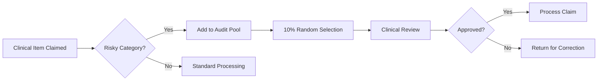
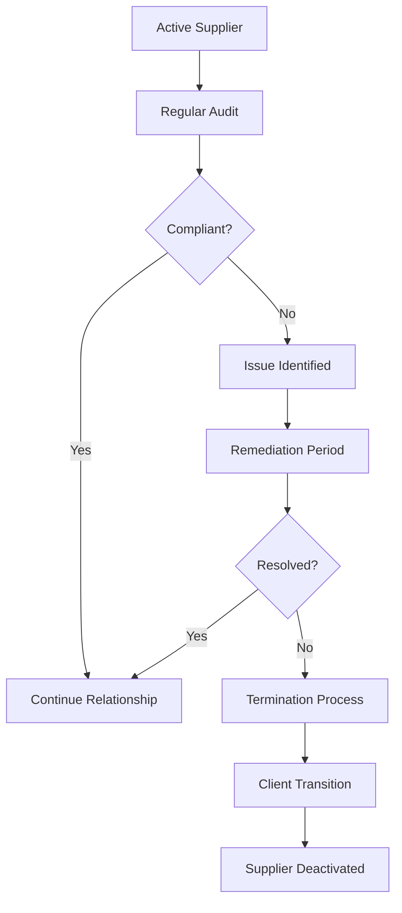

> Regulatory compliance, audit trails, and quality assurance for aged care services

---

## Quick Links

| Resource | Link |
|----------|------|
| **Claims** | [Claims Dashboard](https://tc-portal.test/staff/claims) |
| **Documents** | [Document Management](https://tc-portal.test/staff/documents) |
| **Suppliers** | [Supplier Verification](https://tc-portal.test/staff/suppliers) |

---

## TL;DR

- **What**: Framework for meeting 304 Support at Home compliance requirements across agreements, audits, worker checks, and reporting
- **Who**: Compliance Team, Operations, Finance, Care Partners
- **Key flow**: Requirement Identified → Controls Implemented → Evidence Captured → Audit Ready
- **Watch out**: 28-day complaint SLA, 1,500 clients need new agreements for Support at Home transition

---

## Key Concepts

| Term | What it means |
|------|---------------|
| **Compliance Requirement** | Regulatory obligation from Support at Home program (304 identified) |
| **Audit Trail** | Documented evidence of activities, decisions, and approvals |
| **Worker Clearance** | Police check and NDIS clearance requirements for staff and suppliers |
| **Agreement Versioning** | Tracking changes to client and supplier agreements over time |
| **Clinical Audit** | 10% sample review of risky clinical items for quality assurance |
| **EFTsure** | Fraud verification system for supplier payment validation |

---

## How It Works

### Main Flow: Compliance Framework

### Agreement Lifecycle

### Other Flows

<strong>Worker Clearance Verification</strong> - staff and supplier checks

All workers require valid clearances before client contact.

<strong>Clinical Item Audit</strong> - 10% sample review

Risky clinical items require sample-based quality review.

<strong>Supplier Audit and Termination</strong> - compliance lifecycle

Ongoing supplier compliance monitoring with termination pathway.

---

## Compliance Requirements Overview

### Support at Home Requirements

| Category | Count | Key Items |
|----------|-------|-----------|
| **Documentation** | ~80 | Agreement signing, version control, consent records |
| **Worker Safety** | ~50 | Police checks, NDIS clearances, training records |
| **Quality Assurance** | ~40 | Clinical audits, care plan reviews, incident reporting |
| **Financial** | ~60 | Fraud prevention, claims accuracy, billing compliance |
| **Complaints** | ~30 | 28-day resolution, escalation, root cause tracking |
| **Reporting** | ~44 | Government submissions, audit responses |

---

## Business Rules

| Rule | Why |
|------|-----|
| **28-day complaint resolution** | Regulatory SLA for formal complaints |
| **10% clinical audit sample** | Quality assurance for risky items |
| **Agreement signing required** | 1,500 clients need new Support at Home agreements |
| **Version control for agreements** | Audit trail for changes and amendments |
| **Police check validity tracking** | Worker clearances must be current |
| **EFTsure verification for suppliers** | Fraud prevention before payment |
| **Activity logging for care management** | Demonstrate 15 min/month minimum care |

---

## Agreement Management

### Client Agreements

| Status | Count | Action Required |
|--------|-------|-----------------|
| **Pending Signature** | ~1,500 | Support at Home transition agreements |
| **Active** | Current clients | Monitor for amendments |
| **Expired** | Historical | Archive with audit trail |

### Version Control Requirements

- All agreement changes create new versions
- Previous versions retained for audit
- Digital signatures timestamped
- Amendment reasons documented

---

## Worker Clearance Requirements

| Check Type | Applies To | Validity | Renewal Lead Time |
|------------|------------|----------|-------------------|
| **Police Check** | All staff | 3 years | 3 months |
| **NDIS Worker Screening** | Suppliers | 5 years | 6 months |
| **First Aid Certificate** | Care workers | 3 years | 1 month |
| **Professional Registration** | Clinical staff | Annual | 2 months |

---

## Fraud Prevention

### EFTsure Integration

| Check | When | Purpose |
|-------|------|---------|
| **Bank Account Validation** | New supplier | Verify payment destination |
| **ABN Cross-Check** | Onboarding | Confirm business legitimacy |
| **Payment Destination Review** | Account changes | Prevent fraud |

---

## Common Issues

<strong>Issue: Agreements not signed before service delivery</strong>

**Symptom**: Services delivered without signed agreement

**Cause**: Manual tracking, high volume of transitions

**Fix**: Automated agreement status checks before booking confirmation

<strong>Issue: Expired worker clearances</strong>

**Symptom**: Staff working with expired police checks

**Cause**: Manual expiry tracking, no automated alerts

**Fix**: Automated expiry alerts, system blocks for expired clearances

<strong>Issue: Audit trail gaps</strong>

**Symptom**: Cannot demonstrate compliance for specific requirement

**Cause**: Activity not logged, document not stored

**Fix**: Enhanced logging across care management activities, mandatory document capture

<strong>Issue: Complaint SLA breaches</strong>

**Symptom**: Complaints exceeding 28-day resolution target

**Cause**: Manual tracking, unclear ownership

**Fix**: Automated escalations, dashboard visibility improvements

---

## Who Uses This

| Role | What they do |
|------|--------------|
| **Compliance Team** | Monitor requirements, audit evidence, government reporting |
| **Operations Team** | Worker clearance verification, supplier audits |
| **Finance Team** | EFTsure checks, claims compliance |
| **Care Partners** | Agreement management, activity logging |
| **Clinical Team** | Sample audits, clinical item review |
| **POD Leaders** | Complaint resolution within SLA |

---

## Technical Reference

<strong>Related Models & Tables</strong>

### Core Entities

| Entity | Purpose | Location |
|--------|---------|----------|
| **Complaint** | 28-day tracking | Zoho CRM |
| **Document** | Agreement storage | `domain/Document/Models/` |
| **SupplierVerification** | Worker checks | `domain/Supplier/Models/` |
| **CareManagementActivity** | Activity audit trail | `domain/CareManagement/Models/` |
| **Claim** | Government reporting | `domain/Claims/Models/` |

### Audit Trail Sources

| Source | What it captures |
|--------|------------------|
| `activity_log` | Model changes, user actions |
| `care_management_activities` | Direct/indirect care time |
| `documents` | Versioned agreements |
| `supplier_verifications` | Clearance records |

<strong>Integrations</strong>

| System | Purpose |
|--------|---------|
| **Zoho CRM** | Complaint tracking |
| **EFTsure** | Supplier fraud prevention |
| **Services Australia API** | Claims and IPA data |
| **Document Storage (S3)** | Agreement versioning |

---

## Reporting Requirements

### Government Reporting

| Report | Frequency | Content |
|--------|-----------|---------|
| **Complaint Summary** | Monthly | Volume, resolution times, trends |
| **Quality Indicators** | Quarterly | Care quality metrics |
| **Compliance Declaration** | Annual | 304 requirements attestation |
| **Incident Reports** | As required | Serious incidents within 24 hours |

### Internal Reporting

| Report | Frequency | Audience |
|--------|-----------|----------|
| **SLA Dashboard** | Real-time | Operations, Compliance |
| **Clearance Expiry** | Weekly | HR, Operations |
| **Agreement Status** | Daily | Care Partners |
| **Audit Readiness** | Monthly | Executive |

---

## Related

### Domains

- [Complaints](/features/domains/complaints) - 28-day SLA tracking and resolution
- [Supplier](/features/domains/supplier) - EFTsure, clearance verification, audits
- [Care Management Activities](/features/domains/care-management-activities) - Activity logging for compliance
- [Documents](/features/domains/documents) - Agreement storage and versioning
- [Claims](/features/domains/claims) - Government claims and reporting

### Context

- Support at Home program replacing Home Care Packages (July 2025)
- 304 compliance requirements identified across all categories
- Transition period requires new agreements with existing clients
- 10% care management fee subject to compliance demonstration

---

## Status

**Maturity**: In Development
**Pod**: Operations / Compliance
**Initiative**: Support at Home Transition

---

## Source Context

| Source | Key Topics |
|--------|------------|
| Fireflies Research (Aug 2025 - Jan 2026) | 304 requirements, agreement signing, audit trails |
| BRP January 2026 | Worker clearances, clinical audits, fraud prevention |
| Support at Home Program Manual | Regulatory requirements, SLAs, reporting obligations |
