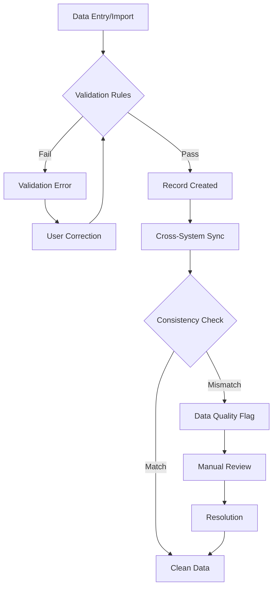
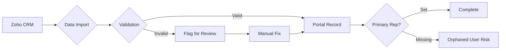
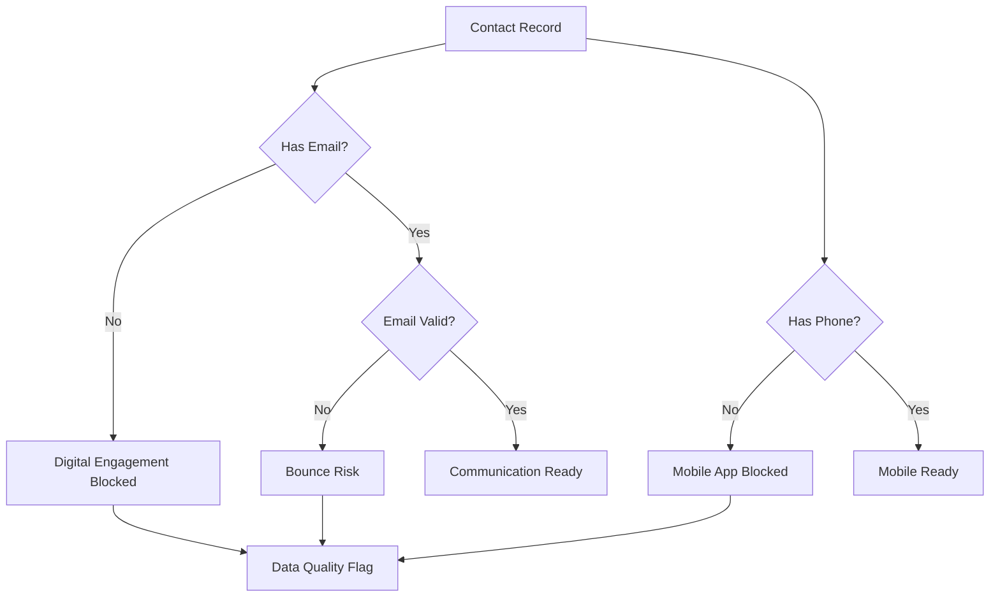
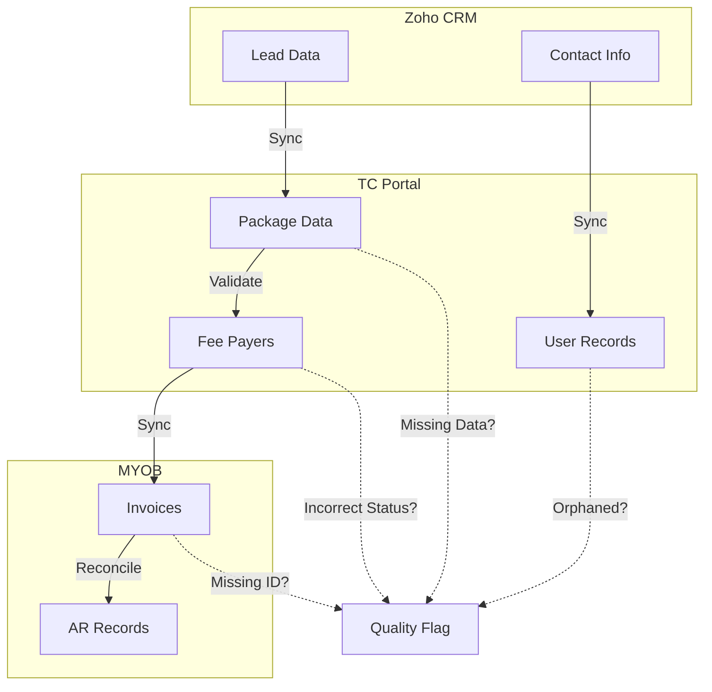

> Data integrity, validation, and cross-system consistency

---

## Quick Links

| Resource | Link |
|----------|------|
| **Nova Admin** | [Data Quality Reports](https://tc-portal.test/nova) |
| **Databricks** | Data quality dashboards (via Databricks integration) |

---

## TL;DR

- **What**: Ensure data accuracy, completeness, and consistency across Portal, CRM, and external systems
- **Who**: All teams - data quality issues cascade through every domain
- **Key flow**: Data Entry/Import → Validation → Flagging → Resolution → Audit
- **Watch out**: Poor contact data affects care circle, billing, compliance, and digital engagement. ~700 clients lack email addresses.

---

## Key Concepts

| Term | What it means |
|------|---------------|
| **Data Validation** | Rules that check data correctness at entry or import |
| **Orphaned Record** | Record without required parent relationships (e.g., user without package) |
| **Duplicate Record** | Multiple records representing the same entity |
| **Data Sync** | Keeping data consistent between Portal, CRM, and external systems |
| **Referential Integrity** | Ensuring relationships between records remain valid |
| **Primary Representative** | The main contact for a package - critical for communications |

---

## How It Works

### Main Flow: Data Quality Lifecycle

### CRM to Portal Sync Flow

### Contact Data Quality Flow

---

## Business Rules

| Rule | Why |
|------|-----|
| **Email required for portal access** | Users cannot log in without valid email |
| **Primary rep must be set** | Packages need clear communication owner |
| **Referral code validation** | Invalid codes delay onboarding and billing |
| **Fee payer DD status accuracy** | Incorrect status causes collection failures |
| **No duplicate leads on reactivation** | Prevents data fragmentation |
| **Invoice IDs required** | 15% of invoices lacking IDs causes reconciliation issues |

---

## Current Challenges

From Fireflies research (Aug 2025 - Jan 2026):

| Challenge | Impact | Metric |
|-----------|--------|--------|
| **Missing email addresses** | Blocks digital engagement and portal access | ~700 clients affected |
| **Inconsistent CRM data** | Creates orphaned users, incorrect primary reps | Ongoing |
| **Duplicate records** | Lead reactivation creates duplicates | Unknown volume |
| **Missing/incorrect referral codes** | Delays onboarding and billing | Ongoing |
| **Incorrect DD status** | Collection failures and cash flow issues | 600+ fee payers |
| **Missing invoice IDs** | Reconciliation failures | 15% of invoices |
| **Phone number gaps** | Blocks mobile app adoption | Unknown volume |

---

## Data Quality Categories

### Contact Data

| Field | Required For | Impact if Missing |
|-------|--------------|-------------------|
| **Email** | Portal login, statements, notifications | Blocked digital engagement |
| **Phone** | Mobile app, SMS notifications | Limited communication channels |
| **Address** | Mail correspondence, service delivery | Service coordination issues |

### Package Data

| Field | Required For | Impact if Missing |
|-------|--------------|-------------------|
| **Primary Rep** | Communications, decision-making | Unclear responsibility |
| **Referral Code** | Billing, compliance reporting | Onboarding delays |
| **Fee Payer Link** | Collections, invoicing | Payment failures |

### Financial Data

| Field | Required For | Impact if Missing |
|-------|--------------|-------------------|
| **Invoice ID** | MYOB reconciliation | Manual matching required |
| **DD Authority Status** | Collection processing | Failed collections |
| **Payment Method** | Billing workflows | Manual intervention |

---

## Validation Between Systems

---

## Who Uses This

| Role | What they do |
|------|--------------|
| **All Staff** | Entry point for data - quality starts here |
| **Care Partners** | Primary contact data management |
| **Finance Team** | Invoice and payment data integrity |
| **Collections Team** | Fee payer and DD status accuracy |
| **Growth Team** | Lead data quality and deduplication |
| **Data/Tech Team** | Monitoring, reporting, bulk fixes |

---

## Quality Improvement Priorities

### Phase 1: Contact Data (Current Focus)

| Action | Target |
|--------|--------|
| Email collection campaign | Address ~700 missing emails |
| Phone number validation | Enable mobile app rollout |
| Primary rep audit | Ensure all packages have clear ownership |

### Phase 2: Financial Data

| Action | Target |
|--------|--------|
| DD status cleanup | Fix 600+ incorrect records |
| Invoice ID enforcement | Reduce 15% gap to 0% |
| Fee payer linking | Complete package-to-payer relationships |

### Phase 3: Cross-System Consistency

| Action | Target |
|--------|--------|
| CRM-Portal sync validation | Eliminate orphaned records |
| Referral code validation | Automated checks at entry |
| Duplicate detection | Lead reactivation safeguards |

---

## Technical Reference

<strong>Validation Points</strong>

### Entry Validation

- Form validation rules in Form Request classes
- Email format and uniqueness checks
- Required field enforcement

### Import Validation

- CRM sync validation before record creation
- Duplicate detection on import
- Referential integrity checks

### Ongoing Monitoring

- Databricks data quality dashboards
- Scheduled consistency reports
- Automated flagging for review

<strong>Common Data Issues</strong>

### Orphaned Users

**Symptom**: User exists without package association

**Cause**: CRM sync creates user before package, or package deleted

**Fix**: Manual review and package assignment or user cleanup

### Duplicate Leads

**Symptom**: Multiple lead records for same person

**Cause**: Reactivation creates new record instead of updating existing

**Fix**: Merge records, update reactivation logic

### Incorrect DD Status

**Symptom**: Fee payer shows active DD but collections fail

**Cause**: Status not updated after DD cancellation

**Fix**: Status sync with Easy Collect, manual cleanup

---

## Testing

### Key Test Scenarios

- [ ] Email validation rejects invalid formats
- [ ] Duplicate email prevented within same context
- [ ] CRM import flags records with missing required fields
- [ ] Primary rep required before package activation
- [ ] Invoice creation requires valid invoice ID
- [ ] DD status syncs correctly with Easy Collect
- [ ] Lead reactivation updates existing record (no duplicate)

---

## Related

### Domains

- [Care Circle / Package Contacts](/features/domains/package-contacts) - primary contact data source
- [Lead Management](/features/domains/lead-management) - lead data quality and duplicates
- [Collections](/features/domains/collections) - fee payer and DD data quality
- [Onboarding](/features/domains/onboarding) - referral code validation
- [MYOB](/features/domains/myob) - invoice data integrity

### All Domains

Data quality is foundational - issues here cascade to:
- Billing and collections
- Clinical documentation
- Compliance reporting
- Digital engagement
- Mobile app adoption

---

## Status

**Maturity**: In Development
**Pod**: Cross-functional (All pods affected)
**Owner**: TBD

---

## Source Context

Key insights from Fireflies research (Aug 2025 - Jan 2026):

| Topic | Finding |
|-------|---------|
| **Contact data gaps** | ~700 clients without email addresses blocking digital engagement |
| **CRM consistency** | Inconsistent data leads to orphaned users, incorrect primary reps |
| **Mobile readiness** | Contact data quality prioritised for mobile app experience |
| **Collections impact** | 600+ fee payers incorrectly marked as having active DDs |
| **Invoice integrity** | 15% of invoices missing essential IDs |
| **Lead duplicates** | Reactivation process creates duplicate records |
