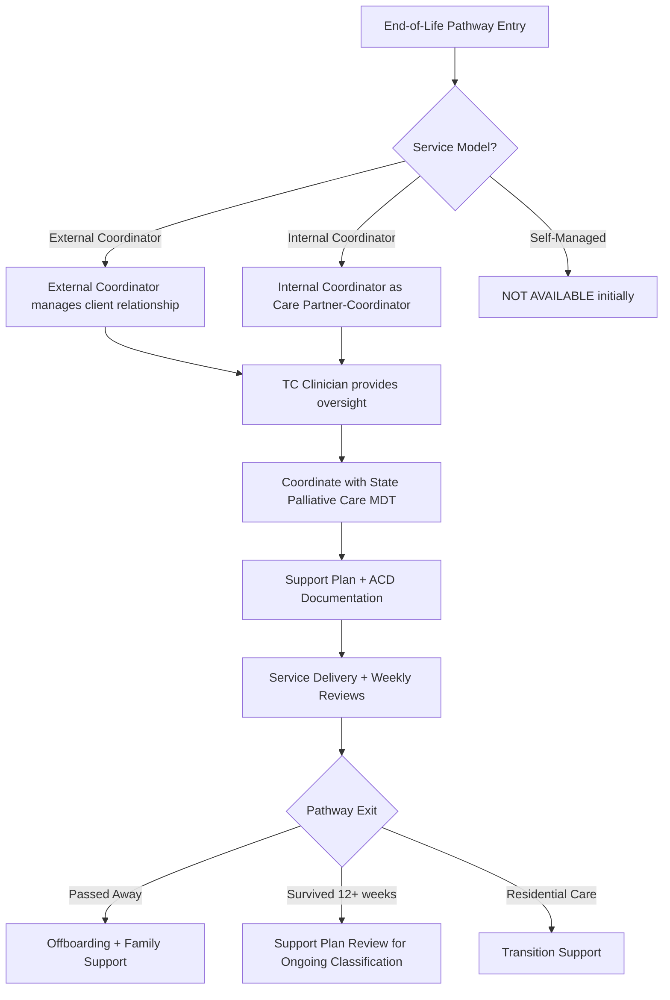
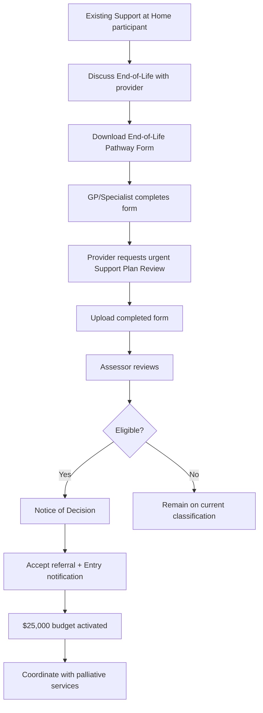
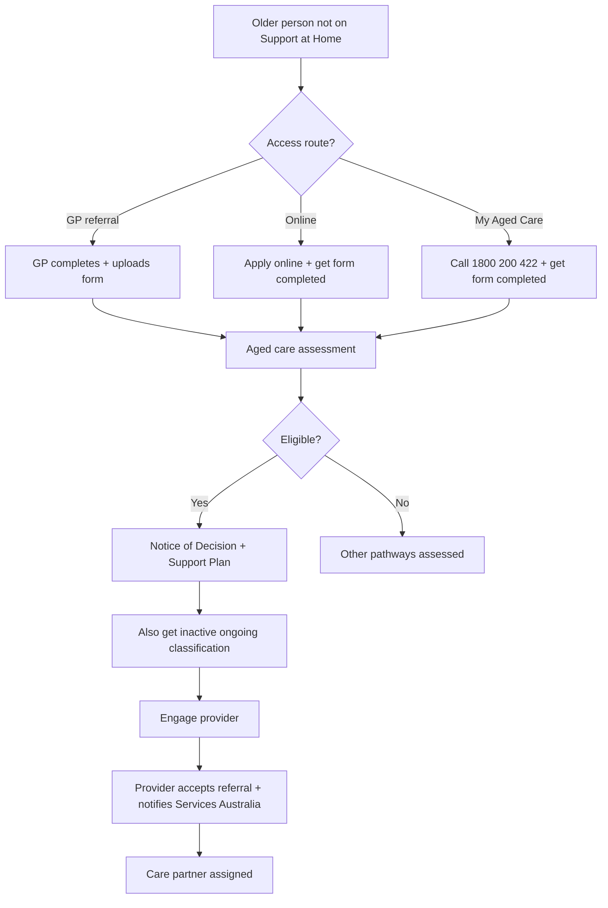
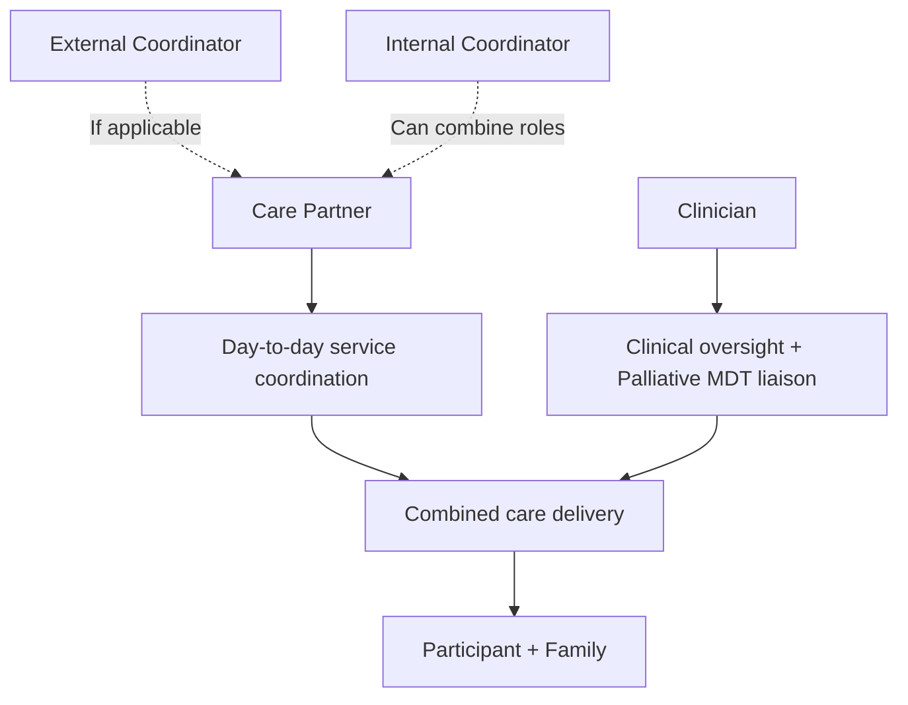

> Supporting older people to remain at home during their final months with dignity, comprehensive care, and robust clinical coordination

---

## Quick Links

| Resource | Link |
|----------|------|
| **Portal** | TBD |
| **Nova Admin** | TBD |
| **End-of-Life Pathway Form** | Download from department website |
| **AKPS Score Information** | Australian-modified Karnofsky Performance Status |
| **ELDAC** | [End of Life Directions for Aged Care](https://www.eldac.com.au/) |
| **palliAGED** | Palliative care evidence and practice information |

---

## TL;DR

- **What**: Highest funding ($25,000) for participants with 3 months or less to live - requires dedicated clinical coordination model
- **Who**: Eligible participants, Care Partners with clinical oversight, Internal Coordinators, Palliative Care Services
- **Key flow**: End-of-Life Form completed by doctor → Support Plan Review → $25,000 budget → Care partner + clinician + palliative services coordination
- **Watch out**: BOTH eligibility criteria must be met (3 months prognosis AND AKPS score ≤40); pathway is "dirty and complex" requiring specialised upskilling
- **TC Portal approach**: Care partner with dedicated clinician oversight; limited to coordinated or internal coordination models initially (not self-managed)

---

## Key Concepts

| Term | What it means |
|------|---------------|
| **End-of-Life Pathway** | Short-term classification providing highest funding for end-of-life care at home |
| **AKPS Score** | Australian-modified Karnofsky Performance Status - measures ability to perform daily activities (100=normal, lower=reduced ability) |
| **End-of-Life Pathway Form** | Medical form required for eligibility - completed by GP, specialist, or nurse practitioner |
| **Palliative Care** | Care focused on comfort and quality of life for people with terminal illness (can last years - distinct from hospice) |
| **Hospice Care** | More immediate end-of-life care focused on comfort in final weeks/days |
| **Clinical Oversight Model** | TC Portal's approach: clinician oversees care partner to deliver palliative coordination |
| **Supported Decision Making** | Process for helping individuals make informed decisions about their care, including advance care directives |
| **Advance Care Planning** | Discussions and documentation of individual's preferences for future care when they cannot speak for themselves |
| **Advance Health Directive (AHD)** | Legal document outlining medical treatment preferences - varies by state/territory |
| **MDT (Multidisciplinary Team)** | State/territory palliative care teams including nurses, GPs, specialists |

---

## TC Portal Implementation Approach

### Why End-of-Life Is Complex

Based on internal planning discussions, the End-of-Life Pathway has been described as "dirty and complex" for several key reasons:

1. **Clinical Coordination Requirements**: The pathway requires robust liaison and coordination with state/territory-based palliative care services, GPs, and MDTs - this is not a function that standard care partners can simply take on
2. **Upskilling Required**: Staff working in this space require specialised training in palliative and end-of-life care
3. **Multiple Stakeholders**: Unlike standard services, end-of-life care involves multiple Trilogy people (care partner + coordinator + clinician) plus external palliative services
4. **Sensitive Conversations**: Budget discussions are particularly sensitive when dealing with uncertain timelines ("there's a book that has your death time in it when no one else knows it")
5. **Co-Contributions Still Apply**: Surprisingly, independence/everyday living contribution rates still apply, requiring careful conversations with families

### TC Portal's Service Delivery Model

### Key Design Decisions

| Decision | Rationale |
|----------|-----------|
| **Not available for self-managed initially** | Pathway is too complex for self-managed clients; need to retain control during first quarters to learn |
| **Clinical oversight mandatory** | Care partner alone cannot meet palliative liaison requirements |
| **Internal coordination as strategic arm** | Internal coordinators can be upskilled to take care partner-coordinator combined role |
| **Conservative approach first** | Plan to start conservatively, learn from mistakes, then potentially expand to self-managed |
| **Separate from Restorative Care** | Though both are short-term pathways, they are distinct and should not be conflated |

### Risk Considerations

> **Key Insight from HRVC Meeting**: If TC accepts clients with higher risk appetite for end-of-life (expecting deterioration), but they outlive the pathway and transition to ongoing services, we may have a client who is higher risk than normally accepted.

**Mitigation Strategies**:
- Review eligibility criteria around Notice of Assessment
- Clear pathway to residential care if participant becomes bed-bound after 4 months
- Use HRVC (High Risk Vulnerable Client) process for complex cases

---

## Government References

### Support at Home Program Manual V4.2

**Chapter 15: End-of-Life Pathway** (pp. 197-209)

| Section | Topic | Key Points |
|---------|-------|------------|
| 15.1 | Overview | Highest funding per day; $25,000 over 12 weeks; complements state/territory palliative care |
| 15.2 | Eligibility | 3 months or less to live AND AKPS ≤40 |
| 15.3 | Funding | $25,000 one-off budget; 12-week period (extendable to 16) |
| 15.4 | Access | Existing participants via Support Plan Review; new participants via assessment |
| 15.5 | Care Management | No cap on care management claims; coordinate with palliative services |
| 15.6 | Services | Support at Home service list; AT for equipment (no home mods unless in-train) |
| 15.7 | Contributions | Independence/everyday living rates apply; clinical supports 0% |
| 15.8 | Exiting | Death, no longer able to stay home, or funding period finished |

---

## Eligibility Requirements

**BOTH criteria must be met:**

| Criteria | Requirement |
|----------|-------------|
| **Life Expectancy** | 3 months or less to live (certified by medical/nurse practitioner) |
| **AKPS Score** | 40 or less (mobility/frailty indicator) |

### AKPS Score Explained

- **100**: Normal physical abilities, no evidence of disease
- **40**: In bed more than 50% of the time
- Lower scores = reduced ability to perform daily activities

**Note**: These requirements align with residential aged care palliative care entry pathway.

---

## Funding

| Element | Amount |
|---------|--------|
| **Total Budget** | $25,000 (one-off) |
| **Standard Period** | 12 weeks |
| **Maximum Period** | 16 weeks |
| **Care Management Cap** | None (proportionate to participant needs) |

### Key Funding Rules

- **Replaces** ongoing classification (not concurrent)
- **Cannot accrue** funds - no rollover
- Discrete from other Support at Home classifications
- Primary supplements apply if eligible
- AT funding available (but NOT home modifications unless already in-train)

### Beyond 12 Weeks

If participant lives beyond 12 weeks:
1. Continue drawing from $25,000 until 16-week mark (if funding available)
2. Use HCP Commonwealth unspent funds until 16-week mark (if End-of-Life funding exhausted)
3. Request Support Plan Review (from 12-week mark) to move to ongoing classification

---

## How It Works

### Existing Participants Flow

### New Participants Flow

---

## End-of-Life Pathway Form

**Who can complete:**
- General Practitioner (GP)
- Non-GP Specialist
- Nurse Practitioner

**Form captures:**
- Medical condition information
- Evidence of end-of-life prognosis
- AKPS score assessment

**Submission:**
- Upload via 'Make a Referral' or 'GP e-referral' channels, OR
- Provide hardcopy to participant who contacts My Aged Care

---

## Care Management

### Key Differences from Ongoing Services

| Aspect | End-of-Life Pathway |
|--------|---------------------|
| Budget deduction | No fixed % - claim from $25,000 budget |
| Cap | No cap on care management claims |
| Expectation | Proportionate and in best interests |
| Coordination | Must include medical team and palliative services |
| Clinical oversight | Required (TC Portal model adds clinician layer) |

### Care Partner Responsibilities

- Liaise with participant's doctor, medical team
- Coordinate with state/territory palliative care services
- Understand existing supports in place
- Notify additional services if needed (e.g., palliative care if not engaged)
- Document all information from treating professionals

### TC Portal Clinical Oversight Model

Based on internal discussions, the model for end-of-life care:

**Why the overlay approach:**
- Department states only a "care partner" (not clinical care partner) is required
- However, the liaison requirements with state palliative care/GPs/MDTs are substantial
- TC Portal adds clinician oversight similar to the old clinical management plan model

---

## Services Available

**Can access from Support at Home service list:**
- Personal care
- Domestic assistance
- General nursing care
- Care management
- Other approved services

**Assistive Technology:**
- Can access AT if approved
- Use AT-HM List items

**Home Modifications:**
- NOT eligible for new home modifications
- Exception: Can complete modifications already underway before entering pathway

---

## Palliative Care Coordination

### State/Territory Services

End-of-Life Pathway **complements** state/territory palliative care:
- Australian Government funds states/territories for generalist and specialist palliative care
- Each jurisdiction makes delivery decisions
- Includes hospital and community service provision

**Example integration:**
- State services: Palliative nursing, medication management
- Support at Home: Additional meals, personal care, domestic assistance

### Resources for Providers

| Resource | Description |
|----------|-------------|
| PEPA | Program of Experience in the Palliative Approach |
| ELDAC | End of Life Directions for Aged Care |
| PACOP | Palliative Aged Care Outcomes Program |
| palliAGED | Palliative care evidence and practice information |
| caring@home | Practical resources for home-based end-of-life care |

### Aboriginal and Torres Strait Islander Resources

- Aboriginal and Torres Strait Islander Peoples Palliative Care Resources
- Gwandalan National Palliative Care Project
- Indigenous Program of Experience in the Palliative Approach (IPEPA)
- Caring@home Resources for Aboriginal and Torres Strait Islander families

---

## Business Rules

### Government Rules

| Rule | Why |
|------|-----|
| **Replaces ongoing classification** | End-of-Life is discrete classification |
| **No fund accrual** | Unspent budget does not follow to ongoing classification |
| **16-week maximum** | Can extend to 16 weeks, then must transition |
| **Single provider model** | Same branch delivers all services |
| **Clinical services 0%** | Nursing and clinical supports fully funded |
| **One episode only** | Participant can access one End-of-Life Pathway episode |
| **Co-contributions apply** | Independence/everyday living rates still apply (often surprising to families) |

### TC Portal Business Rules

| Rule | Why |
|------|-----|
| **Not available for self-managed** | Pathway too complex; need control to learn |
| **Clinical oversight required** | Standard care partners cannot meet palliative liaison requirements |
| **Advance care planning captured** | Record ACD status, substitute decision maker, GP details |
| **Communication to support workers** | Care plan must include ACD location, emergency protocols |
| **Budget sensitivity conversations** | Train coordinators on having sensitive budget discussions when timeline uncertain |
| **HRVC escalation path** | Complex cases go to High Risk Vulnerable Client meeting |
| **Internal coordination preferred** | Strategic opportunity for internal team to develop expertise |

### Budget Conversation Guidelines

When participant says "I've only got one month so I want to use all the budget":

**Approach:**
- Have sensitive conversation using common sense
- Explain uncertainty of timelines
- Avoid leaving participant short if they survive longer than expected
- Clinical focus on what's genuinely needed, not budget depletion

---

## Exiting the Pathway

### Exit Reasons

1. **Participant has passed away**
2. **No longer wishes/able to remain at home**
3. **Funding period finished** (maximum 16 weeks)

### If Ongoing Services Needed After

- New participants receive **inactive ongoing classification** at assessment
- Can be activated if participant lives beyond funding period
- Request Support Plan Review from 12-week mark

---

## Quality Standards

**Strengthened Quality Standard Outcome 5.7** requires:
- Recognise older person's needs, goals and preferences for end-of-life care
- Preserve dignity
- Provide access to palliative and end-of-life care when required
- Inform and support participants, families and carers during last days

### Standard 3.16 - Advance Care Planning

The provider must have processes for advanced care planning that:
- Support individual to discuss medical treatment and care needs
- Support individual to complete and review advance care planning documents
- Support individual to nominate substitute decision maker
- Ensure advance care planning documents are stored, managed, used and shared

**TC Portal Implementation:**
- Question at intake: "Do you have an advance health directive or end-of-life plan?"
- Answers: Yes (provide copy) / No but interested / No not interested
- **Gap identified**: Currently no action taken on "more information" responses
- **Future state**: Booked appointment with clinical care partner (billable service)

---

## Advance Care Planning

### Current State Assessment

Based on internal review, advance care planning at TC Portal needs development:

| Element | Current State | Target State |
|---------|---------------|--------------|
| **Intake Question** | Asked but answers not actioned | Trigger appropriate workflows |
| **ACD Storage** | Inconsistent | Systematic storage + QR code access |
| **Support Worker Access** | Limited | Care plan includes ACD location |
| **Billable Service** | Not offered | Advance care planning appointment with clinician |

### Key Learnings

From real-world experience:
> A support worker knew where a participant's ACD was kept, knew where the Webster pack was, and knew what to take to hospital during a sepsis emergency - this information was more valuable than what family knew

**Implication**: Support workers need visibility of:
- ACD location (physical copy)
- GP who has copy
- Emergency care plan
- Key documents location (like a "hospital go-bag")

### Supported Decision Making

End-of-life pathway requires robust supported decision-making processes:
- Connect to supporter provisions under new Aged Care Act
- Next of kin is NOT automatically authorised to receive care plans
- Explicit consent and substitute decision maker documentation required

---

## Who Uses This

| Role | What they do |
|------|--------------|
| **Clinical Care Partners** | Provide clinical oversight, liaise with palliative MDT, conduct advance care planning |
| **Care Partners** | Day-to-day service coordination, support plan implementation |
| **Internal Coordinators** | Can take combined care partner-coordinator role with upskilling |
| **External Coordinators** | Maintain client relationship, work with TC clinician |
| **Palliative Care Services** | State/territory MDT provides specialist palliative nursing, medication management |
| **GP/Specialists** | Complete End-of-Life Pathway Form, provide medical oversight |
| **Support Workers** | Deliver services, need access to ACD location and emergency protocols |
| **Families/Carers** | Receive support during final stages, may be substitute decision makers |
| **HRVC Team** | Review complex cases, determine offboarding if required |

---

## Common Issues

<strong>Issue: Participant survives beyond 12-16 weeks</strong>

**Symptom**: Participant on End-of-Life Pathway lives longer than expected

**Cause**: Palliative care has improved dramatically - people can be in palliative care for years

**Fix**:
1. From 12-week mark, request Support Plan Review for ongoing classification
2. If bed-bound, initiate residential care pathway
3. Use inactive ongoing classification (assigned at assessment for new participants)
4. Consider risk implications of retaining higher-risk client

<strong>Issue: Family pushes for rapid budget spend</strong>

**Symptom**: Family wants to use all $25,000 quickly because of terminal prognosis

**Cause**: Understandable urgency, but creates risk of running out of funds

**Fix**:
- Sensitive conversation using common sense
- Focus on clinical needs, not budget depletion
- Explain uncertainty of timelines
- Ensure services are proportionate and in best interests

<strong>Issue: Advance care directive not accessible in emergency</strong>

**Symptom**: Support worker or emergency services cannot locate ACD during crisis

**Cause**: ACD location not documented or communicated to support workers

**Fix**:
- Document ACD location in care plan "About Me" section
- Ensure GP has copy
- Create emergency protocol including key document locations
- QR code access to care plan in future state

---

## Technical Reference

<strong>Portal Requirements (In Development)</strong>

### Required Functionality

| Feature | Description | Status |
|---------|-------------|--------|
| **End-of-Life Flag** | Package-level flag indicating end-of-life pathway | Planned |
| **ACD Storage** | Document storage for advance care directives | Planned |
| **Substitute Decision Maker** | Contact record with decision-making authority | Planned |
| **Clinical Oversight Assignment** | Assign clinician to oversee care partner | Planned |
| **Budget Tracking** | $25,000 discrete budget with no accrual | Planned |
| **Exit Workflow** | Offboarding process specific to end-of-life | Planned |

### CRM Integration

- Record eligibility date
- Track pathway entry/exit
- Link to clinical oversight clinician
- Document Support Plan Review requests

---

## Related

### Domains

- [Care Management Activities](/features/domains/care-management-activities) - Care management requirements
- [Assessments](/features/domains/assessments) - Support Plan Review process
- [Assistive Technology & Home Modifications](/features/domains/assistive-technology-home-modifications) - AT access under pathway
- [Service Cessation](/features/domains/service-cessation) - Exit arrangements
- [Care Plan](/features/domains/care-plan) - Care planning including advance care planning
- [Compliance](/features/domains/compliance) - Quality standards requirements
- [Restorative Care Pathway](/features/domains/restorative-care-pathway) - Related short-term pathway (but distinct)

### Regulatory Context

- Support at Home Program Manual V4.2, Chapter 15
- Strengthened Quality Standards (Standard 3.16, 5.7)
- Aged Care Act supporter provisions
- State/territory advance care directive legislation

---

## Status

**Maturity**: In Development (Support at Home launch July 2025)
**Pod**: Clinical / Care
**Owner**: Patrick Hawker (Clinical), Sian (Care), Marianne (Clinical Policies)

### Implementation Timeline

| Milestone | Target | Notes |
|-----------|--------|-------|
| Pathway model finalised | Q2 2025 | Care partner + clinician model confirmed |
| CRM configuration | Q2 2025 | Track pathway entry/exit |
| Portal functionality | Q3 2025 | Budget, documents, clinical oversight |
| Staff training | Q2-Q3 2025 | Upskilling for clinical care partners |
| Dress rehearsals | May-June 2025 | Test workflows before July launch |
| Production launch | July 1, 2025 | Support at Home go-live |

### Open Questions

- Headcount planning for clinical oversight roles
- Training requirements and timeline
- Self-managed pathway availability (deferred to Q4 2025 or later)
- Family network assessment for potential future self-managed access

---

## Research Sources

### Fireflies Meeting Transcripts Analysed

| Meeting | Date | Key Insights |
|---------|------|--------------|
| **Support at Home Weekly Working Group** | May 5, 2025 | End-of-life pathway model discussion; restorative care vs end-of-life distinction; dress rehearsal timeline |
| **SQS Standard 3 and 4 Ownership** | May 26, 2025 | Advance care planning gaps; Standard 3.16 requirements; supported decision making policy development |
| **HRVC (High Risk Vulnerable Client)** | Nov 13, 2025 | Risk appetite for end-of-life clients; sudden death case highlighting proactive communication needs |

### Key Quotes from Discussions

**On pathway complexity:**
> "The end of life pathway is dirty and complex... palliative care, end of life care is a tricky space to play in and it definitely requires upskilling of people who work in that space."

**On clinical model:**
> "The department stating that we only require a care partner, not a clinical care partner to undertake the requirements of this pathway. But they have extra requirements for what you need to do, which is robust liaison in coordination with state and territory based palliative care GPs MDTs. That's simply not a function we can ask our care partners to do."

**On service model decision:**
> "My initial thoughts is that this would not be a pathway available to self managed clients and end of life care because I think it would be too complex for us to try and manage."

**On advance care planning:**
> "We do ask the question currently and we do nothing with the answer... No, and I'm not interested or no, but I'd like more information. And we don't do anything with the more information."

**On palliative vs hospice:**
> "It is interesting how many people now go into palliative. And they're into palliative care for years and they come in and out. Not hospice care, but palliative care because we've got such better symptom control."
