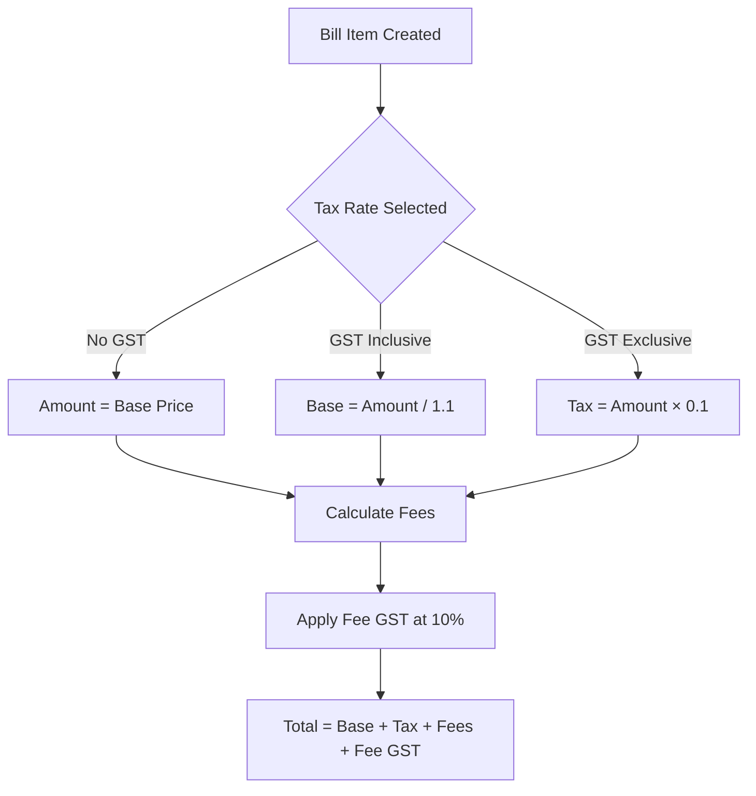
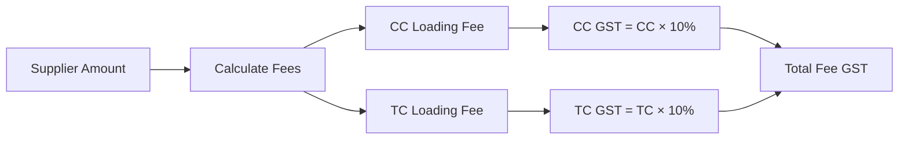

> Tax compliance for Australian aged care services

---

## TL;DR

- **What**: Manages GST calculations for bills, fees, and service payments at 10% Australian GST rate
- **Who**: Bill processors, care partners, finance team, coordinators
- **Key flow**: Bill submitted → Tax rate applied → GST calculated → Fee GST added → Total determined
- **Watch out**: Two tax models exist (GST-inclusive vs GST-exclusive). Fees have separate GST on top of fee amounts

---

## Key Concepts

| Term | What it means |
|------|---------------|
| **Tax Rate** | Percentage applied to services (0%, 10% inclusive, 10% exclusive) |
| **GST Inclusive** | Tax already included in the quoted price (divide by 1.1 to get base) |
| **GST Exclusive** | Tax added on top of quoted price (multiply by 1.1 for total) |
| **Fee GST** | Separate 10% GST applied to TC and CC loading fees |
| **Provider Take-Home** | Amount supplier receives after fees and GST deductions |

---

## How It Works

### Main Flow: Bill Tax Calculation



### Tax Rate Options

The system supports three tax rate configurations:

| ID | Name | Rate | Behaviour |
|----|------|------|-----------|
| 1 | No GST | 0% | GST-free services (e.g., care management) |
| 2 | GST Incl | 10% | Tax included in quoted price |
| 3 | GST Excl | 10% | Tax added to quoted price |

### Fee GST Calculation



Fees incur 10% GST, configured in `support-at-home.fee_gst_rate`.

---

## Business Rules

| Rule | Why |
|------|-----|
| **10% GST Rate** | Australian GST applies to most aged care services |
| **GST-free care management** | SERV-0018 and SERV-0019 are fee-exempt |
| **Fee GST separate** | GST on fees calculated independently from service GST |
| **Inclusive tax reduces base** | When tax is included, base amount for fee calculation is lower |

### Tax Rate Selection Logic

```
If service is GST-free → Use "No GST" (ID: 1)
If supplier invoice shows GST-inclusive pricing → Use "GST Incl" (ID: 2)
If supplier invoice shows GST-exclusive pricing → Use "GST Excl" (ID: 3)
```

### Total Amount Calculation

For a bill item, the total is calculated as:

```php
$total = ($service_hours × $unit_amount) + $tax - $discount
```

Where tax handling varies:
- **GST Exclusive**: Tax amount added to total
- **GST Inclusive**: Tax already included (not added again)

---

## Tax-Exempt Services

Certain service types do not attract fees or GST:

| Service Type | Code | Reason |
|--------------|------|--------|
| Home Support Care Management | SERV-0018 | Care management activities |
| Restorative Care Management | SERV-0019 | Restorative care activities |

---

## Fee GST Matrix

| Fee Type | Base Calculation | GST Rate | When Applied |
|----------|------------------|----------|--------------|
| CC Loading | Variable % of supplier amount | 10% | Bill approval |
| TC Loading | 10% of (supplier + CC) | 10% | Bill approval |

### Example Calculation

Supplier amount: $100 (GST-exclusive)

**Self-Managed Plus Package:**
```
Base amount:     $100.00
CC Fee (20%):     $20.00
CC GST (10%):      $2.00
TC Fee (10% of $120): $12.00
TC GST (10%):      $1.20
---
Total Fees:       $32.00
Total Fee GST:     $3.20
Service GST:      $10.00
Grand Total:     $145.20
```

---

## Who Uses This

| Role | What they do |
|------|--------------|
| **Bill Processors** | Select correct tax rate for each bill item |
| **Care Partners** | Review tax calculations on bills |
| **Finance Team** | Reconcile GST for BAS reporting |
| **Coordinators** | Understand take-home calculations |

---

## Technical Reference

<details>
<summary><strong>Models & Database</strong></summary>

### Models

```
domain/TaxRate/
├── Models/
│   └── TaxRate.php              # Tax rate configuration
├── Actions/
│   └── FetchTaxRatesAction.php  # Retrieve available tax rates
├── Data/
│   └── TaxRateData.php          # Tax rate DTO
└── Seeders/
    └── InsertTaxRateSeeder.php  # Seed standard tax rates

domain/Fee/
├── Models/
│   └── Fee.php                  # Fee with gst_amount field
├── Data/
│   └── FeeCalculationData.php   # Includes gstAmount
└── EventSourcing/Projectors/
    └── FeeProjector.php         # Applies fee GST on approval
```

### Tables

| Table | Purpose |
|-------|---------|
| `tax_rates` | Stores tax rate configurations (No GST, GST Incl, GST Excl) |
| `fees` | Fee records with `total_amount` and `gst_amount` columns |
| `bill_items` | Service items with `tax_rate_id` and `tax` fields |
| `monthly_fees` | Aggregated monthly fees with `gst` total |

### Key Columns

**bill_items:**
- `tax_rate_id` - FK to tax_rates
- `tax` - Calculated tax amount
- `ex_gst_after_discount_amount` - Base amount for fee calculation

**fees:**
- `total_amount` - Fee amount before GST
- `gst_amount` - GST on the fee

</details>

<details>
<summary><strong>Actions & Services</strong></summary>

```
app/Actions/Bill/BillItem/
└── CalculateTotalAmountWithoutTax.php  # Strips tax for fee base

domain/Fee/Actions/
└── CalculateFeesAction.php              # Fee calculation (no GST here)

domain/Fee/EventSourcing/Projectors/
└── FeeProjector.php                     # Applies gst_amount on approval
```

### CalculateTotalAmountWithoutTax

Calculates the supplier amount excluding GST for fee calculations:

```php
$amount = $billItem->service_unit_amount * $billItem->service_hours
        - $billItem->discount_amount;
$tax = $billItem->taxRate?->included ? $billItem->tax : 0;
return $amount - $tax;
```

</details>

<details>
<summary><strong>Configuration</strong></summary>

```php
// config/support-at-home.php

'fee_gst_rate' => 0.1,  // 10% GST on fees
```

</details>

<details>
<summary><strong>Constants</strong></summary>

```php
// TaxRate model constants
const NO_GST = 1;
const GST_INCL = 2;
const GST_EXCL = 3;

// Fee model constants
const CARE_MANAGEMENT_PERCENTAGE = 10;
const TC_LOADING_PERCENTAGE = 10;
```

</details>

---

## Testing

### Factories & Seeders

```php
// Seed tax rates
php artisan db:seed --class=InsertTaxRateSeeder

// Access tax rates in tests
TaxRate::NO_GST      // ID 1 - No GST
TaxRate::GST_INCL    // ID 2 - GST Inclusive
TaxRate::GST_EXCL    // ID 3 - GST Exclusive
```

### Key Test Scenarios

- [ ] No GST applied for GST-free services (SERV-0018, SERV-0019)
- [ ] GST inclusive correctly reduces base for fee calculation
- [ ] GST exclusive adds tax on top of base amount
- [ ] Fee GST calculated at 10% for both CC and TC fees
- [ ] Monthly fee aggregates include GST totals

---

## Common Issues

<details>
<summary><strong>Issue: Incorrect total amount displayed</strong></summary>

**Symptom**: Bill total doesn't match expected calculation

**Cause**: Mix-up between GST-inclusive and GST-exclusive tax rates

**Fix**: Verify the tax rate selected matches the supplier's invoice format. Check if price includes or excludes GST.

</details>

<details>
<summary><strong>Issue: Fee GST not appearing</strong></summary>

**Symptom**: Fees show but GST amount is null or zero

**Cause**: Bill not yet approved (GST applied on approval event)

**Fix**: Fee GST is calculated when `BillItemApprovedEvent` fires. Approve the bill to see GST amounts.

</details>

<details>
<summary><strong>Issue: GST override needed for rounding</strong></summary>

**Symptom**: Calculated GST differs from supplier invoice by cents

**Cause**: Rounding differences between systems

**Fix**: Use GST override feature (if available) or adjust line item amounts

</details>

---

## Related

### Domains

- [Fees](/features/domains/fees) - Fee calculation rules and percentages
- [Bill Processing](/features/domains/bill-processing) - Bill lifecycle and approval
- [Budget](/features/domains/budget) - Budget allocations with tax considerations
- [Supplier](/features/domains/supplier) - Supplier invoice handling

### External References

- [ATO GST for aged care](https://www.ato.gov.au/businesses-and-organisations/gst-excise-and-indirect-taxes/gst/in-detail/your-industry/gst-and-health) - Government GST guidance
- Support at Home Provider Manual - Tax compliance requirements

---

## Decision History

| Date | Ticket | Decision | Notes |
|------|--------|----------|-------|
| 2025-11 | SAH Launch | 10% fee GST rate | Configured in support-at-home.php |
| 2025-12 | Platform Fee | Flat 12.5% platform fee model | Effective Dec 8 - simplifies calculations |

---

## Status

**Maturity**: Production (Complex)
**Pod**: Bills / Finance
**Owner**: Finance Team
