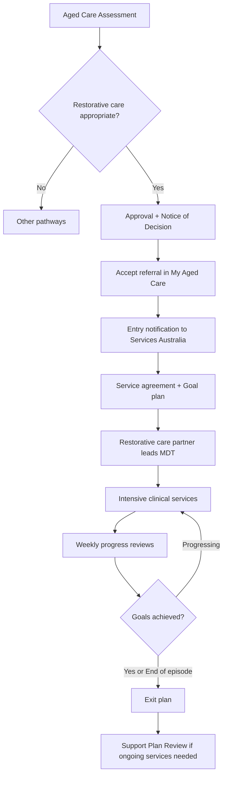
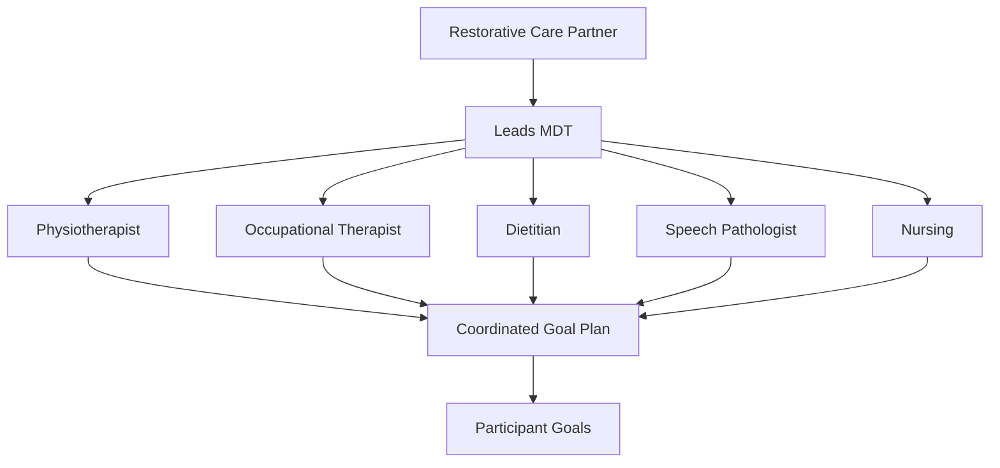

> Early intervention through intensive clinical care to maintain or regain function

---

## Quick Links

| Resource | Link |
|----------|------|
| **Portal** | TBD |
| **Nova Admin** | TBD |
| **Restorative Care Pathway Clinical Guidelines** | External government resource |

---

## TL;DR

- **What**: Short-term (up to 16 weeks) intensive allied health/nursing care to maintain or regain function
- **Who**: Participants assessed for restorative care, Restorative Care Partners, Multidisciplinary Team (MDT)
- **Key flow**: Assessment → Goal plan with MDT → Intensive clinical services → Weekly reviews → Exit plan
- **Watch out**: Max 2 units of funding ($12,000) per 12 months; requires dedicated restorative care partner

---

## Key Concepts

| Term | What it means |
|------|---------------|
| **Restorative Care** | Short-term intensive clinical care focused on regaining/maintaining function |
| **Episode** | Up to 16 consecutive weeks of allied health/nursing services |
| **Unit of Funding** | $6,000 allocation per episode |
| **Restorative Care Partner** | Staff member with clinical qualifications who leads care management |
| **Multidisciplinary Team (MDT)** | Multiple clinicians from different disciplines collaborating on care |
| **Goal Plan** | Replaces care plan for restorative care; specific, measurable, time-bound goals |

---

## Government References

### Support at Home Program Manual V4.2

**Chapter 14: Restorative Care Pathway** (pp. 181-196)

| Section | Topic | Key Points |
|---------|-------|------------|
| 14.1 | Overview | Short-term intensive care; clinical services central to outcomes |
| 14.2 | Goals | Prevent/delay ongoing care; support daily activities; reablement education |
| 14.3 | Eligibility | Assessed suitability; ineligibility criteria |
| 14.4 | Episodes & Funding | Up to 16 weeks; $6,000 per unit; max 2 units per 12 months |
| 14.5 | Care Management | Restorative care partner mandatory; no fixed % deduction |
| 14.6 | Goal Planning | Critical element; goal plan required before/on day 1 |
| 14.7-14.11 | Service List, Stopping, Reviews, Contributions, Exiting | Operational details |

---

## Funding Structure

| Element | Amount | Period |
|---------|--------|--------|
| Per Episode | Up to $6,000 | Up to 16 weeks |
| Max per 12 months | $12,000 (2 units) | Rolling 12 months |

### Funding Options

1. **2 separate episodes** - At different periods (non-consecutive, 90+ days gap)
2. **2 units in single episode** - With assessor approval for higher needs

**Note**: Unlike ongoing services, there is NO fixed % deducted for care management - budget determined between provider and participant.

---

## Eligibility

### Suitability Requirements

| Criteria | Description |
|----------|-------------|
| **Need** | Demonstrated need for short-term targeted support to remain at home or maintain classification |
| **Intensive Clinical** | Will benefit from range of clinical professionals over short-term |
| **Participant Motivation** | Willingness and capacity to engage in goal-setting and interventions |

### Ineligibility Criteria

A person is **ineligible** if they:
- Are eligible for, or recently received, End-of-Life Pathway
- Have accessed 2 units of funding in past 12 months (or finished episode within 90 days)
- Receive or are eligible for Transition Care Programme (TCP)
- Receive permanent residential aged care

---

## How It Works

### Main Flow: Restorative Care Episode

### Multidisciplinary Team Approach

---

## Restorative Care Partner

**Mandatory** staff member who:
- Holds nursing or allied health qualifications (preferably university level)
- Has skills for clinical coordination and oversight
- Can work autonomously

### Clinical Scope

- Complex goal planning activities
- Conducting clinical assessments (within scope)
- Contributing to MDT
- Referral/prescription for AT-HM (if approved and within scope)
- All restorative care management activities

**Note**: Can also be employed as care partner for ongoing services - must coordinate to avoid cross-subsidising.

---

## Care Management Activities

| Activity | Description |
|----------|-------------|
| **Goal Planning** | Identify needs/goals from support plan; establish service agreement; develop goal plan; select MDT services |
| **Service Planning** | Plan and manage clinical supports; communicate with participant/carers/MDT; manage budget; support AT-HM access |
| **Monitoring & Review** | Ongoing care discussions; case conferencing; evaluate goals and outcomes; complete exit plans |
| **Support & Education** | Deliver wellness/reablement approaches; provide age-related health information |

---

## Goal Plan Requirements

The goal plan **replaces** the care plan for restorative care.

**Must include:**
- Identification of needs, goals, preferences, existing supports (from support plan)
- Strategies for risk management and preventative care
- Services to be delivered (frequency, volume, duration)
- Dates of review and proposed exit date

**Goals should be:**
- Specific
- Measurable
- Achievable within 16-week episode

---

## Business Rules

| Rule | Why |
|------|-----|
| **90-day gap required** | Between separate episodes in 12-month period |
| **Single provider model** | Ongoing and restorative care from same service delivery branch |
| **No cross-subsidising** | Keep ongoing and restorative budgets separate |
| **Clinical focus** | Services should complement (not duplicate) ongoing services |
| **Goal plan required** | Before or on day services commence |
| **MDT mandatory** | Multidisciplinary approach required |

### Additional Funding Request

If $6,000 insufficient for single episode:
1. Provider submits Support Plan Review request
2. Evidence required: Goal plan + individualised budget + statement that goals cannot be met
3. If approved: Additional $6,000 (total $12,000 for single episode)
4. No time extension provided
5. No further episodes in 12-month period

**Note**: Additional funding request is NOT a reviewable decision.

---

## Clinical Guidelines Recommendations

Specific recommendations for:
- People at risk of falls
- People with frailty, sarcopenia and/or multimorbidity
- People with dementia
- People requiring mental wellbeing and social connection support
- People requiring nutritional support
- People with swallowing difficulties

---

## Can Run Concurrently With

- Ongoing Support at Home services (existing participants)
- AT-HM services

**Note**: For new participants, approval of ongoing classification ENDS restorative care access. This will change from February 2026 to allow concurrent access for both new and existing participants.

---

## Related

### Domains

- [Care Management Activities](./care-management-activities.md) - Care management requirements
- [Assessments](./assessments.md) - Assessment determines eligibility
- [Assistive Technology & Home Modifications](./assistive-technology-home-modifications.md) - Can access AT-HM concurrently

---

## Status

**Maturity**: Planned (Support at Home)
**Pod**: TBD
**Owner**: TBD
