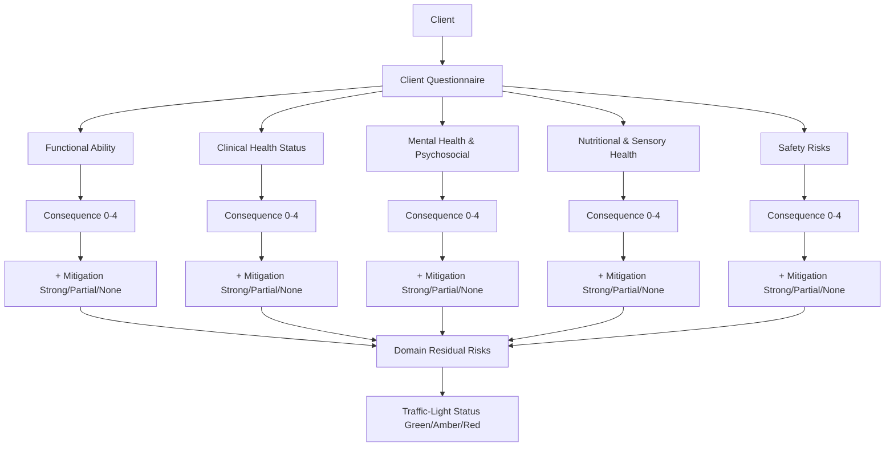

> Whole-of-client residual risk assessment: consequence + mitigation = residual risk → traffic-light status

---

## TL;DR

- **What**: Residual-risk framework that assesses 16 clinical risk areas across 5 domains, factors in mitigation effectiveness, and produces a single traffic-light status (Green/Amber/Red)
- **Who**: Clinical Team (designs framework), Coordinators (assess consequence), Clinicians (assess mitigation), Care Partners (see traffic-light)
- **Key flow**: Client Questionnaire → Consequence (0-4) → Mitigation Assessment (Strong/Partial/None) → Residual Risk → Traffic-Light Status
- **Watch out**: Maryanne has provided the complete framework (Feb 2026) — Clinical Risk Domains, Consequence Table, and Org Risk Management Procedure

---

## Why Replace Subjective Ratings?

| Problem | Impact |
|---------|--------|
| **Different clinicians, different thresholds** | One clinician's "high" is another's "medium" — inconsistent risk classification |
| **No evidence trail** | "High risk" doesn't explain why or what factors contribute |
| **Single-risk escalation** | A high falls risk with strong mitigation triggers unnecessary escalation |
| **No mitigation awareness** | System ignores whether risks are actively managed, controlled, or unaddressed |
| **Can't see whole client** | Isolated risks assessed independently — no synthesis across domains |
| **Can't scale** | Manual review of thousands of records to find who needs attention |

---

## How It Works

### Scoring Model (Maryanne's Residual-Risk Framework)

### Consequence Assessment

Each of the 16 clinical risk areas has a client questionnaire with plain-language questions. The client's response maps directly to a consequence level:

| Level | Score | Meaning |
|---|---|---|
| **Negligible** | 0 | No issue / no impact |
| **Minor** | 1 | Mild, managed, minimal impact |
| **Moderate** | 2 | Recurring or requiring active management |
| **Major** | 3 | Hospital care or significant harm |
| **Extreme** | 4 | Ongoing hospital / full dependency / life-threatening |

**Example — Falls**:

| Question | Consequence |
|---|---|
| Have you stayed steady and not had any falls in the last 6 months? Yes | Negligible (0) |
| Have you had one or two falls but didn't get hurt? | Minor (1) |
| Have you had a few falls that caused bruises or small injuries? | Moderate (2) |
| Have you had a fall that broke a bone and needed hospital care? | Major (3) |
| Have you had a serious fall that broke your hip, leg or head and needed hospital admission? | Extreme (4) |

### Mitigation Assessment

Per-domain mitigation effectiveness is scored by clinicians using structured decision prompts:

| Level | Score | Meaning |
|---|---|---|
| **Strong** | 2 | Controls in place, used correctly, adhered to |
| **Partial** | 1 | Controls present but inconsistently applied or emerging decline |
| **None** | 0 | Controls absent, refused, or ineffective |

**Key principle**: A high falls risk (Major 3) with Strong mitigation (equipment, supervision, insight, no recent incidents) results in lower residual risk than the same consequence with No mitigation.

### Residual Risk

Residual risk = what remains after mitigation is considered. This is the core innovation:
- Not just "how bad is the risk?" but "how bad is it **after** what we're already doing?"
- Prevents over-escalation of stable, well-managed clients
- Surfaces genuinely unmitigated or compounding risks

### Traffic-Light Synthesis

Domain residual risks synthesise into a single status:

| Status | Meaning | Action |
|---|---|---|
| **Green** | Stable, low residual risk across all domains | Routine monitoring |
| **Amber** | Moderate residual risk — monitoring required | Increased oversight, review care plan |
| **Red** | High residual risk — action required | Escalate to clinical review (HRVC) |

A single Red domain drives the overall status to Red.

---

## Clinical Risk Domains (5)

| Domain | Risk Areas | What it captures |
|---|---|---|
| **Functional Ability** | Falls, Mobility, Continence, Cognitive Decline, Dementia | Strongest predictor of adverse outcomes — functional decline precedes clinical deterioration |
| **Clinical Health Status** | Chronic Disease, Infection, Polypharmacy, Chronic Pain, End of Life | Multimorbidity and medical instability — differentiates diagnosis from impact |
| **Mental Health & Psychosocial** | Cognitive Decline, Dementia, Mental Health | Psychological/behavioural factors influencing safety, adherence, care outcomes |
| **Nutritional & Sensory Health** | Nutrition & Hydration, Oral Health, Sensory Impairment | Often modifiable and highly responsive to intervention |
| **Safety Risks** | Choking/Swallowing, Pressure Injuries/Wounds, Falls | Leading causes of preventable harm — assesses risk exposure alongside controls |

**Note**: Some risk areas (Falls, Cognitive Decline, Dementia) contribute to multiple domains.

---

## Clinical Risk Areas (16)

### High Impact and High Prevalence (Aged Care Standards)
1. Choking and Swallowing
2. Continence
3. Falls
4. Mental Health
5. Mobility
6. Nutrition and Hydration
7. Oral Health
8. Pain — Chronic
9. Pressure Injuries and Wounds
10. Sensory Impairment

### Trilogy Care Clinical Risk Indicators
11. Chronic Disease Complications
12. Cognitive Decline
13. Dementia (with staging: Very Early → Early → Middle → Late → End-of-life)
14. End of Life
15. Infection
16. Medication Mismanagement (Polypharmacy)

---

## Data Collection Methods

| Method | Reliability | Coverage |
|--------|-------------|----------|
| **Client questionnaire** | High (structured, plain-language) | Primary — all 16 risk areas have specific questions |
| **Care partner check-ins** | High | Quarterly — captures falls, hospitalisations, functional changes |
| **Clinical observation** | High | Clinician assessment alongside questionnaire |
| **Incident data** | High | Falls incidents feed directly into consequence levels |
| **IAT/Assessment extraction** | High | AI extracts risk factors from clinical documents |

**Best approach**: Client questionnaire at check-ins + clinician mitigation assessment + incident data feed

---

## Whole-of-Client Philosophy

The key principle (from Maryanne's framework):

> A client with a high falls risk but strong mitigation and stability across other domains is not automatically treated as "high risk", avoiding unnecessary escalation while still protecting safety.

**Worked example**: A client has Major (3) falls consequence, but:
- Independently mobile with appropriate gait aids
- Falls management plan in place and followed
- Home environment assessed and modified
- Intact cognition, good insight, seeks assistance
- No other functional impairments

**Result**: Despite the high falls score, Strong mitigation across the Functional Ability domain results in a lower residual risk. The overall traffic-light may be Amber (monitor) rather than Red (escalate).

---

## Governance

- **Clinical judgement override**: If mitigation rating doesn't align with calculated risk, clinician documents rationale in override field
- **Audit trail**: All consequence assessments, mitigation ratings, and overrides recorded with user and timestamp
- **Regulatory alignment**: Framework aligns with ACQSC Toolkit 1, Strengthened Aged Care Quality Standards (Outcome 2.4), Support at Home Program Manual s8.6.2

---

## Two-Level Risk Architecture

| Level | Framework | Audience | Purpose |
|---|---|---|---|
| **Client-level** | Residual Risk (this framework) | Coordinators, Clinicians, Care Partners | Individual client risk assessment, care planning, escalation |
| **Organisational-level** | ISO 31000 Risk Management Procedure | Board, Executive, HoDs | Corporate/strategic/operational risk governance |

These are complementary — the org-level procedure governs enterprise risks, the client-level framework governs clinical care risks. Future integration may bridge client risk patterns into the org register.

---

## Related

### Domains

- [Risk Management](/context/domains/risk-management) — production risk management system
- [Care Plan](/context/domains/care-plan) — risk scores inform care planning priorities
- [Incident Management](/context/domains/incident-management) — incidents feed risk factor data
- [Assessments](/context/domains/assessments) — assessments provide baseline risk data

### Initiatives

| Epic | Description |
|------|-------------|
| [RRA - Risk Radar](/initiatives/Clinical-And-Care-Plan/Risk-Radar/) | Primary epic for implementing this framework |
| [RNC2 - Future State Care Planning](/initiatives/Clinical-And-Care-Plan/Future-State-Care-Planning/) | Maslow-risk mapping integration |
| [ICM - Incident Management](/initiatives/Clinical-And-Care-Plan/Incident-Management/) | Incident → consequence score integration |

---

## Status

**Maturity**: Framework complete (methodology documents provided by Maryanne, Feb 2026) — ready for dev pickup
**Initiative**: Clinical And Care Plan
**Owner**: Maryanne (Clinical Governance)

---

## Key Artifacts

| Artifact | Owner | Status |
|----------|-------|--------|
| **Clinical Risk Domains** (docx) | Maryanne | Complete — 5 domains, mitigation strategies, clinician decision prompts |
| **Clinical Risk Consequence Table** (docx) | Maryanne | Complete — 16 risk areas, client questionnaires, consequence levels |
| **Client Clinical Risk Framework** (email) | Maryanne | Complete — vision, rationale, system-driven design |
| **Organisational Risk Management Procedure** (docx) | Maryanne | Complete — corporate-level risk governance (ISO 31000) |

---

## Source Meetings & Documents

| Date | Meeting / Document | Key Topics |
|------|---------|------------|
| Feb 2026 | Maryanne: Clinical Risk Domains | 5 clinical domains, mitigation scoring, clinician decision prompts, worked examples |
| Feb 2026 | Maryanne: Clinical Risk Consequence Table | 16 risk areas, client questionnaire, consequence levels (0-4), dementia staging |
| Feb 2026 | Maryanne: Client Clinical Risk Framework (email) | Residual risk model, traffic-light output, system-driven design |
| Feb 2026 | Maryanne: Organisational Risk Management Procedure | Corporate-level risk governance, ISO 31000, ordinal matrix |
| Feb 11, 2026 | Clinical Product Requirements (Maryanne) | Evidence-based scoring, falls example, aggregation model, clinical risk badge |
| Sep 29, 2025 | Clinical Meeting - Project Activate | Risk profiles, dignity of risk forms |
