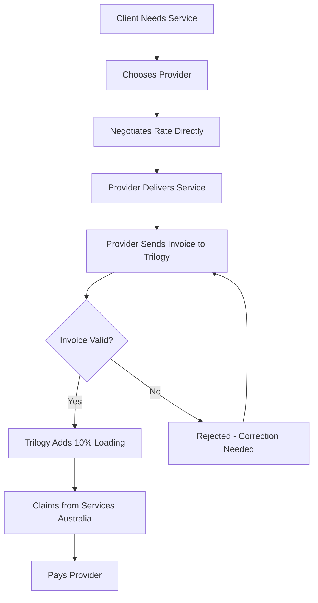
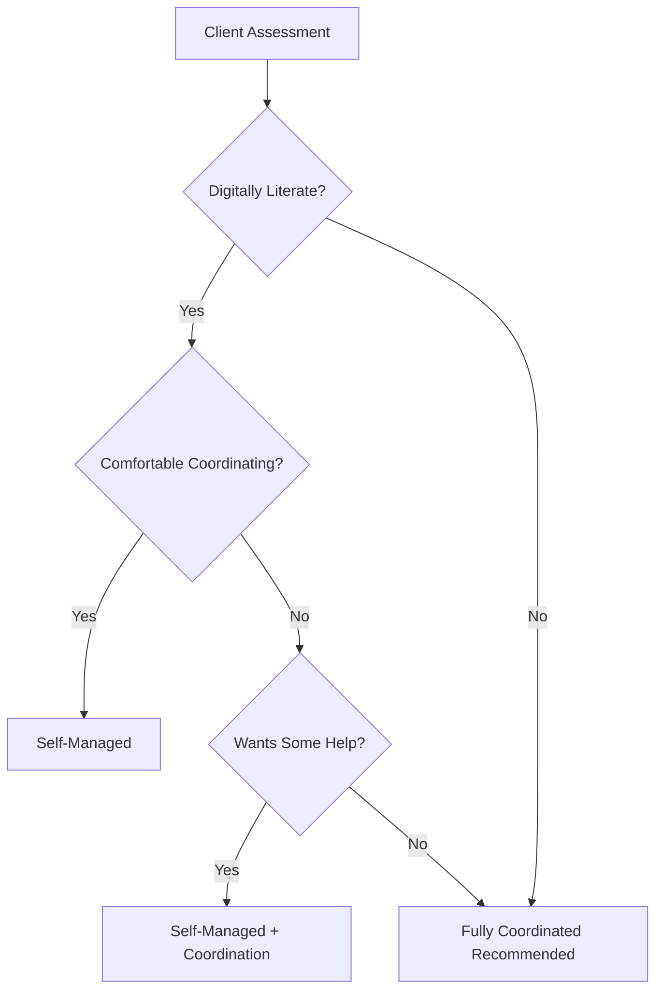
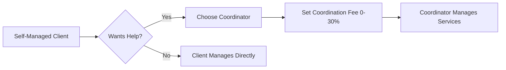
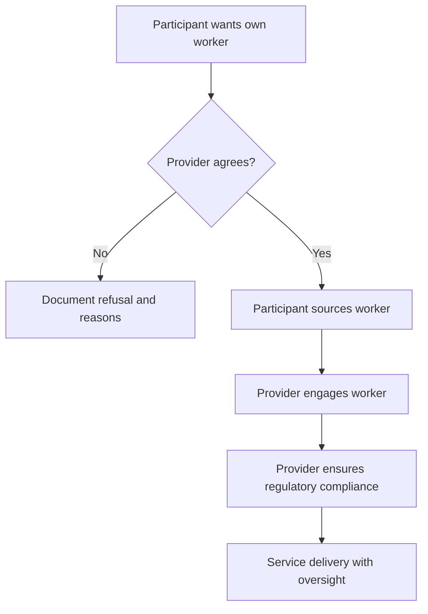
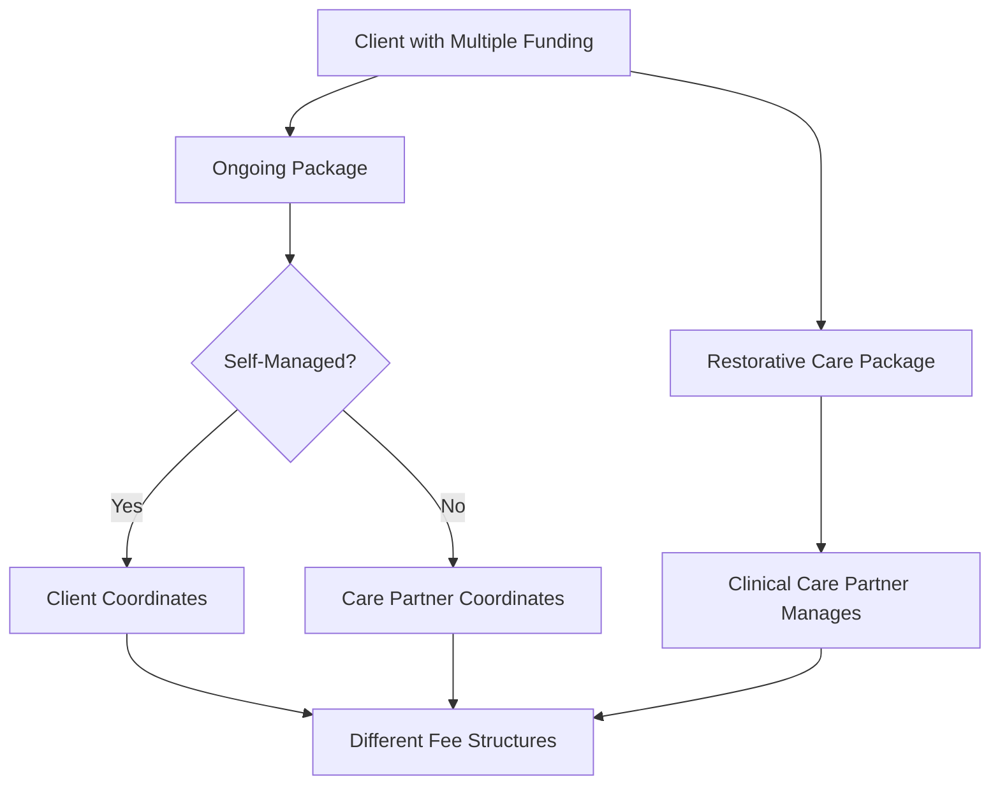

> Consumer-directed home care where clients choose their own providers and control their services

---

## Quick Links

| Resource | Link |
|----------|------|
| **Portal** | [Package Budget](https://tc-portal.test/staff/packages/{id}/budget) |
| **Support at Home Manual** | [Chapter 11 - Self-Management](https://www.health.gov.au/resources/publications/support-at-home-program-manual) |
| **Nova Admin** | [Packages](https://tc-portal.test/nova/resources/packages) |

---

## TL;DR

- **What**: Self-managed home care allows clients to independently choose their service providers, negotiate rates, and coordinate their own care services with administrative support from Trilogy
- **Who**: Self-managed clients, Care Partners, Coordinators (external), Suppliers
- **Key flow**: Client selects provider -> Negotiates rate -> Receives service -> Trilogy processes invoice and pays supplier
- **Watch out**: Self-management is not for everyone - clients need to be digitally literate and comfortable coordinating their own care. Provider must still deliver at least one direct care management activity monthly.

---

## Key Concepts

| Term | What it means |
|------|---------------|
| **Self-Managed Package** | Home care package where the client chooses their own providers and negotiates service rates directly |
| **Platform Loading** | Trilogy's 10% fee applied per service delivered to cover compliance, payments, and administration |
| **Care Management Fee** | 10% deducted from funding by Services Australia before client receives funds - covers care oversight |
| **Coordination Loading** | Optional additional fee (0-30%) if client wants help coordinating services |
| **Pooled Care Management** | Government design where 10% care management fee from all clients goes into a shared pool |
| **External Coordinator** | Independent contractor who helps coordinate services for clients who want assistance |
| **Third-Party Worker** | Aged care worker not employed by provider but engaged by provider to deliver services |

---

## Government References

### Support at Home Program Manual V4.2

**Chapter 11: Self-Management** (pp. 143-153)

| Section | Topic | Key Points |
|---------|-------|------------|
| 11.1 | Overview | Self-management maximises choice/control; participants lead decisions on care, budget, workers |
| 11.2 | Scope | Activities vary per participant - can include scheduling, budget management, choosing suppliers |
| 11.3 | Obligations | Provider/participant obligations table; mutual agreement required and documented |
| 11.4 | Care Management | 10% quarterly budget deducted for care management even for self-managing participants |
| 11.5 | Third-Party Workers | Provider must engage third-party workers; remains responsible for all regulatory requirements |

### Self-Management Activities (from manual)

Participants may undertake:
- Choosing and coordinating services in line with assessed needs and budget
- Managing their budget
- Scheduling when services will be delivered and rostering workers
- Communicating with their workers
- Choosing their own suppliers and/or workers
- Paying invoices for services and seeking reimbursement
- Navigating the aged care system

### Obligations Matrix

| Provider Obligations | Shared Obligations | Participant Obligations |
|---------------------|-------------------|------------------------|
| Monthly care management activities | Review service agreement | Only access approved services |
| Support for third-party use | Regular care plan review | Pre-approve changes with care partner |
| Program guideline information | Regular budget review | Know only approved services subsidised |
| Budget oversight | Proactive communication | Comply with provider requirements |
| Third-party worker engagement | | |
| Claiming assistance | | |
| Quality/safety oversight | | |

---

## How It Works

### Main Flow: Self-Managed Service Delivery



### Other Flows

<details>
<summary><strong>Fully Coordinated vs Self-Managed</strong> - choosing the right model</summary>

Some clients are better suited to fully coordinated care, while others thrive with self-management.



**Self-Managed Indicators:**
- Comfortable with technology (email, online systems)
- Wants to choose their own providers
- Wants to negotiate rates
- Values independence and control

**Fully Coordinated Indicators:**
- Prefers face-to-face assistance
- Less comfortable with technology
- Wants providers arranged for them
- Needs more hands-on support

</details>

<details>
<summary><strong>Adding Coordination to Self-Managed</strong> - hybrid model</summary>

Self-managed clients can opt for coordination assistance at an additional fee.



Coordination fee is charged per service on top of the 10% platform loading.

</details>

<details>
<summary><strong>Third-Party Worker Flow</strong> - engaging client-chosen workers</summary>

When a self-managed client wants to use their own preferred workers.



**Provider responsibilities:**
- Must engage third-party workers directly or through associated provider
- Remains responsible for all regulatory requirements
- Worker screening and suitability checks
- Training in procedures

</details>

<details>
<summary><strong>Dual Packages: Self-Managed + Restorative Care</strong> - complex scenario</summary>

Clients with restorative care or end-of-life funding may have two package types requiring different management.



**Key Rules:**
- Restorative care is always fully coordinated (Trilogy model)
- Cannot claim care management fee for restorative care from pool
- Must invoice clinical care management directly to the restorative care budget
- Services cannot be duplicated between ongoing and restorative care packages

</details>

---

## Fee Structure (Support at Home)

### Four Fee Components

| Component | Amount | Applied To | Purpose |
|-----------|--------|------------|---------|
| **Care Management** | 10% | Total package (deducted by Services Australia) | Planning, monitoring, oversight, clinical governance |
| **Platform Loading** | 10% | Per service delivered | Compliance, payments, subsidies, supplier verification |
| **Service Price** | Variable | Per service | Actual cost of care delivered |
| **Coordination** | 0-30% | Per service (if chosen) | Optional help coordinating services |

### Care Management (10%) Covers

| Included | Not Included |
|----------|--------------|
| Developing and reviewing care plans | Booking or scheduling services |
| Aligning services with assessed needs | Organising a roster of workers |
| Monitoring health, safety, and wellbeing | Paying service providers |
| Supporting rights and choices | Submitting claims |
| Providing support and education | Staff travel, training, HR |
| Helping request reassessments | Complaints handling |
| Clinical governance and supervision | Other regulatory compliance |

### Platform Loading (10%) Covers

- Claiming government subsidies
- Paying suppliers on client's behalf
- Worker screening and suitability checks
- Training workers in procedures
- Financial records and audit trails
- Invoice review and assurance
- Regulatory compliance activities

### Worked Example

For a client with a $10,000 quarterly budget:

| Step | Calculation | Result |
|------|-------------|--------|
| 1. Services Australia deducts care management | $10,000 - 10% | $9,000 available |
| 2. Client uses $100 service | $100 + 10% loading | $110 charged |
| 3. Effective fee rate varies by usage | Using 70% of budget | ~17% effective rate |

---

## Business Rules

| Rule | Why |
|------|-----|
| **Monthly care management required** | Provider must deliver at least one direct activity per month regardless of self-management |
| **10% care management is pooled** | Government design - all clients contribute, consumption varies by individual need |
| **Platform loading only on services used** | Clients only pay when services are delivered, unlike HCP bundled fees |
| **Average client uses ~70% of package** | This makes effective fee rate lower than 20% (10% + 10%) for most clients |
| **New clients don't get care management for 3 months** | Services Australia only pays care management quarterly in arrears |
| **No duplicate services with restorative care** | Cannot receive same service type from both ongoing and restorative care unless exception |
| **Restorative care is fully coordinated** | Cannot be self-managed - requires clinical care partner |
| **End-of-life takes over** | When activated, ongoing package becomes dormant |
| **Mutual agreement required** | If agreement cannot be reached on self-management scope, provider assumes full responsibility |
| **Services must be pre-approved** | Changes to services must be pre-approved by care partner |

---

## Fee Comparison: Trilogy vs Market

| Metric | Trilogy Self-Managed | Industry Full-Service |
|--------|---------------------|----------------------|
| **Domestic Assistance (avg)** | $66/hour | $140/hour |
| **Platform Loading** | 10% | Included in higher rates |
| **Total Fees Under HCP** | 15% bundled | 26-35% bundled |
| **Total Effective Rate (Support at Home)** | 10-20% depending on usage | Higher due to loaded hourly rates |

### The No Worse Off Principle

**What it relates to:** Client contributions only (not provider fees)

**Common misconception:** Clients assume it means their fees won't increase

**Reality:** Government restructured fees for transparency - some clients using high percentage of their package may pay more, while those using less may pay less

---

## Pricing Considerations

| Consideration | Detail |
|---------------|--------|
| **Price caps coming** | Pricing Authority expected June 2026+ (delayed from original timeline) |
| **Market average** | Most self-managed providers charge 10% platform loading |
| **KPMG verified** | Trilogy's 10% rate verified by KPMG as genuine cost recovery |
| **Promotional offers** | Some competitors offer lower temporary rates (e.g., 8%) but may have hidden costs |

---

## Feature Flags

| Flag | What it controls | Default |
|------|------------------|---------|
| `support-at-home` | New Support at Home fee structure | On |
| `coordination-services` | Allow coordination fee on packages | On |

---

## Common Issues

<details>
<summary><strong>Issue: Client says "I'm paying more fees now"</strong></summary>

**Symptom**: Client calculates 10% + 10% = 20% and believes fees increased from 15%

**Cause**: Mental math - platform loading only applies to services used, not full package

**Response**:
1. If using full funding, may signal needs have grown - help apply for package upgrade
2. Average client uses 70% of package, so effective fees similar to HCP
3. Some clients do pay more (high usage), many pay less (lower usage)
4. Use Excel calculator to show actual comparison

</details>

<details>
<summary><strong>Issue: Client hasn't signed Support at Home agreement</strong></summary>

**Symptom**: ~1,500 clients still unsigned (900 self-managed, 600 coordinator)

**Cause**: Government changed requirement from "before Nov 1" to "90 days after Services Australia letter"

**Timeline**: Must be signed by end of February 2026 or legally must terminate

**Fix**: Proactive outreach explaining deadline and benefits

</details>

<details>
<summary><strong>Issue: Voluntary Contribution loading confusion</strong></summary>

**Symptom**: Clients upset that 10% loading charged on their own VC money

**Cause**: Platform costs apply regardless of funding source

**Response**: Trilogy still pays bills, verifies workers, maintains compliance - costs don't disappear because funds come from client

</details>

<details>
<summary><strong>Issue: Home modification double-dipping concern</strong></summary>

**Symptom**: Client with unspent HCP funds says they already paid 15% fee, why pay 10% loading?

**Cause**: Legitimate concern for unspent funds accumulated under old fee structure

**Fix**: Case-by-case assessment - may waive fees for home mods from unspent funds

</details>

<details>
<summary><strong>Issue: Invoice processing delays</strong></summary>

**Symptom**: Suppliers not being paid within expected timeframe

**Cause**: Support at Home transition caused backlogs; now resolved

**Current state**: Bills processed in 1.5 days, paid within 5 days for valid invoices

**Fix**: If ongoing issues, escalate through proper channels

</details>

---

## Who Uses This

| Role | What they do |
|------|--------------|
| **Self-Managed Clients** | Choose providers, negotiate rates, direct their own care |
| **Care Partners** | Monitor wellbeing, assist with assessments, provide oversight, monthly care management activity |
| **External Coordinators** | Help clients who want assistance coordinating services |
| **Suppliers** | Provide services, send invoices, receive payment from Trilogy |
| **Compliance Team** | Verify suppliers, onboard providers, process agreements |
| **Finance Team** | Process invoices, manage payments, handle claims |
| **Growth Team** | Convert leads, explain self-management value proposition |

---

## Technical Reference

<details>
<summary><strong>Models & Database</strong></summary>

### Models

```
domain/Package/Models/
├── Package.php                # Main package model
├── PackageOption.php          # Self-managed vs coordinated
└── CoordinationFee.php        # Coordination fee settings

domain/Budget/Models/
├── BudgetPlan.php            # Budget allocations
├── ServicePlanItem.php       # Individual services
└── FundingStream.php         # ON, RC, EL, CU, HC, VC
```

### Tables

| Table | Purpose |
|-------|---------|
| `packages` | Package records with option type |
| `coordination_fees` | Per-package coordination fee settings |
| `budget_plans` | Budget allocations per period |
| `service_plan_items` | Service allocations within budget |

</details>

<details>
<summary><strong>Key Configurations</strong></summary>

### Package Options

| Option | Loading | Care Management |
|--------|---------|-----------------|
| Self-Managed | 10% | From pool |
| Fully Coordinated | 10% + coord fee | From pool |
| Restorative Care | 10% | Invoiced to budget |
| End of Life | 10% | Invoiced to budget |

### Fee Loading Rules

- Standard services: Package-level coordination fee (1-30%)
- Assistive tech: Special handling required
- Home modifications: Special handling required
- Restorative care: 0% coordination loading on RC funding

</details>

---

## Testing

### Key Test Scenarios

- [ ] Self-managed client receives service and 10% loading applied correctly
- [ ] Coordination fee applies when external coordinator assigned
- [ ] Restorative care client cannot be self-managed
- [ ] End-of-life activation makes ongoing package dormant
- [ ] Invoice rejected when supplier not verified
- [ ] Payment processed within 5 business days for valid invoices
- [ ] Care management claimed quarterly from pool
- [ ] Monthly care management activity recorded for self-managed clients

---

## Related

### Domains

- [Budget Management](/features/domains/budget) - funding allocation and utilisation
- [Bill Processing](/features/domains/bill-processing) - invoice validation and payment
- [Claims](/features/domains/claims) - Services Australia funding claims
- [Compliance](/features/domains/compliance) - supplier verification and agreements
- [Contributions](/features/domains/contributions) - voluntary contributions
- [Coordinator Portal](/features/domains/coordinator-portal) - coordinator services
- [Care Management Activities](/features/domains/care-management-activities) - care management requirements
- [Care Plan](/features/domains/care-plan) - care plan documentation

### Regulatory Context

- **Support at Home Program Manual** - Chapter 11 covers self-management
- **Aged Care Act** - Legal framework for home care packages
- **Pricing Authority** - Future price cap regulations (expected 2026+)

---

## Market Context

### Growth Trends

- 65+ demographic growing rapidly in Australia
- Self-managed care options increasing in demand
- Government reforms favour consumer-directed care
- Technology enabling more independent management
- Trilogy currently at ~5% market share, gaining 1,000 new clients monthly

### Trilogy Positioning

| Strength | Description |
|----------|-------------|
| **Lower costs** | $66/hour vs $140/hour industry average for domestic assistance |
| **Flexible workforce** | 15,000+ suppliers across Australia |
| **Tech platform** | Enables efficient self-management at scale |
| **More care hours** | Same funding = more services for clients |
| **Client choice** | Clients choose who enters their home |
| **Brisbane HQ** | Central coordination with unlimited workforce nationally |

### Self-Management Suitability

**Good fit:**
- Digitally literate
- Wants control over care
- Values independence
- Comfortable with admin
- Can negotiate with providers

**Better for full-service:**
- Prefers in-person support
- Less tech-savvy
- Wants hands-off approach
- Needs more guidance
- Technology-averse (like "stopped when ATMs came")

---

## Current Challenges

From Fireflies meetings (Oct 2025 - Jan 2026):

| Challenge | Impact | Status |
|-----------|--------|--------|
| **Dual packages (SM + RC)** | Need to support two packages per client with different care partners | Design in progress |
| **Invoice backlogs** | Transition caused delays, now resolved to 5-day payment | Resolved |
| **Fee communication** | Clients confused about new structure | Training materials created |
| **Unsigned agreements** | 1,500 clients still unsigned | Outreach in progress (Feb deadline) |
| **Supplier onboarding** | 4,000 suppliers still need new agreements | Compliance working |
| **VC loading disputes** | Clients resist paying fees on their own contributions | Case-by-case waiver assessment |
| **Home mod fee waiver** | Unspent funds from HCP may warrant fee waivers | Case-by-case assessment |
| **End of life + ongoing dormancy** | Complex funding stream management | Technical solution TBD |

---

## Status

**Maturity**: Production
**Pod**: Duck, Duck Go
**Owner**: Romy Blacklaw (Operations), Matt A (Product)

---

## Source Meetings

| Date | Meeting | Key Topics |
|------|---------|------------|
| Jan 27, 2026 | SaH: From Feedback to Practice Training | Fee structure education, client objection handling, care management pooling |
| Nov 27, 2025 | Urgent need for two packages | Dual packages for restorative care, end-of-life, clinical care partners |
| Oct 30, 2025 | Trilogy Lead Profile | Self-managed value proposition, lead generation, market positioning |
| Multiple | BRP Sessions | Portal roadmap, self-management features, supplier onboarding |
| Multiple | Board Dial In | Market growth, agreement signing risks, grant funding for self-managed clients |
