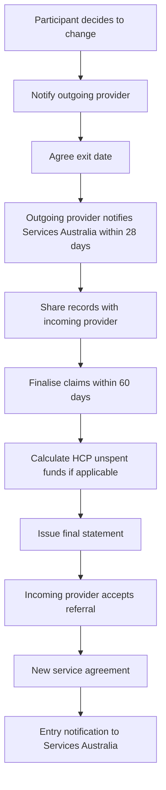
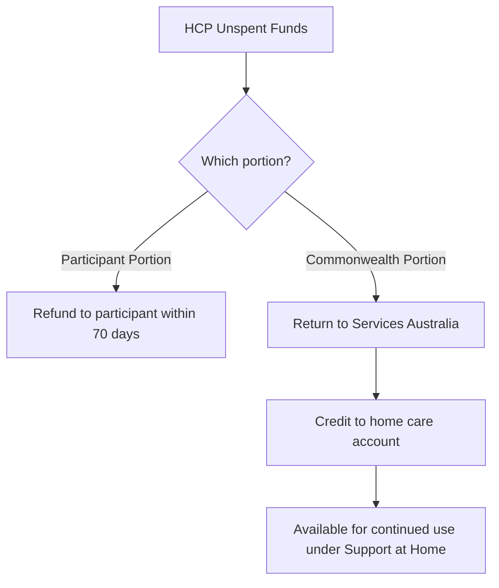

> Managing participant transitions - temporary stops, provider changes, and permanent exits

---

## Quick Links

| Resource | Link |
|----------|------|
| **Portal** | TBD |
| **Nova Admin** | TBD |

---

## TL;DR

- **What**: Handles temporary service stops, provider transfers, and permanent exits from Support at Home
- **Who**: Participants, Outgoing Providers, Incoming Providers, Services Australia
- **Key flow**: Participant notifies provider → Agree exit date → Notify Services Australia → Transfer records → Finalise claims
- **Watch out**: Funding reduced to zero after 4 consecutive quarters (1 year) without services

---

## Key Concepts

| Term | What it means |
|------|---------------|
| **Outgoing Provider** | Provider that ceases delivery of funded services to a participant |
| **Incoming Provider** | Provider that starts delivery of funded services to a participant |
| **Exit Date** | Agreed date when services cease with current provider |
| **HCP Unspent Funds** | Accumulated funds from Home Care Package that transfer with participant |
| **Entry Notification** | Notification to Services Australia when participant starts with new provider |

---

## Government References

### Support at Home Program Manual V4.2

**Chapter 12: Ceasing and Temporarily Stopping Services** (pp. 154-165)

| Section | Topic | Key Points |
|---------|-------|------------|
| 12.1 | Overview | No leave arrangements; max periods apply before funding affected |
| 12.2 | Temporarily Stopping | Flexibility to stop for hospital, respite, holidays; carryover limits apply |
| 12.3 | Changing Providers | Approval and budget move with participant; outgoing/incoming obligations |
| 12.4 | Ceasing Services | Participant-initiated (residential care, death) or provider-initiated cessation |

### Critical Timelines

| Timeline | Requirement |
|----------|-------------|
| **4 consecutive quarters** | Funding reduced to zero if no service delivered for 1 year |
| **28 days** | Outgoing provider must notify Services Australia of exit |
| **28 days** | Outgoing provider must share records with incoming provider |
| **28 days** | Outgoing provider must share financial balances with incoming provider |
| **60 days** | Finalise all claims for services delivered up to exit date |
| **70 days** | Pay participant portion HCP unspent funds after cessation |

### Temporary Stop Reasons

From the manual, participants may stop services for:
- Hospital stay (treatment/surgery)
- Transition care (following hospital)
- Residential respite care (planned/unplanned)
- Social leave, holidays, personal circumstances

**Note**: Care management should continue monthly even during temporary stops (if participant agrees).

---

## How It Works

### Main Flow: Changing Providers

### Outgoing Provider Obligations

| Step | Action | Details |
|------|--------|---------|
| 1 | Agree cessation date | With participant |
| 2 | Notify Services Australia | Within 28 calendar days of exit |
| 3 | Share information | Care planning records to incoming provider (Quality Standard 3) |
| 4 | Complete service delivery | Up until day before exit date |
| 5 | Finalise claims | Within 60 days per claiming rules |
| 6 | Calculate HCP portions | Commonwealth and participant portions |
| 7 | Issue final invoice/statement | Participant contributions and monthly statement |
| 8 | Notify financial balances | AT-HM budget and quarterly budget to incoming provider |
| 9 | Refund participant HCP funds | Balance to participant or estate |
| 10 | Transfer Commonwealth portion | To Services Australia for home care account |

### Incoming Provider Obligations

| Step | Action | Details |
|------|--------|---------|
| 1 | Accept referral | In My Aged Care Service and Support Portal |
| 2 | Service agreement | Discuss and enter into agreement; start date on/after exit date |
| 3 | Receive budget info | Remaining quarterly and AT-HM budget from outgoing provider |
| 4 | Confirm exit date | Ensure no overlapping claims |
| 5 | Create care plan/budget | Before or on day care starts |
| 6 | Notify Services Australia | Entry notification once agreement signed |
| 7 | HCP unspent funds | Commonwealth portion held by Services Australia for AT-HM or budget top-up |

---

## Business Rules

| Rule | Why |
|------|-----|
| **No overlapping services** | Exit date must be confirmed to prevent duplicate claims (exception: transition day for residential care) |
| **4 quarter funding rule** | Funding reallocated if no service for 4 consecutive quarters |
| **Single entry/exit day exception** | Services can be delivered on residential care entry/exit day for transition support |
| **Monthly reminders** | Department sends reminders if no claims for extended period |
| **No leave arrangements** | Support at Home has no formal leave - just temporary service stops |

### Participant-Initiated Cessation Triggers

- Moving into permanent residential aged care (entry date = exit date)
- Death (date of death = exit date)
- No longer wishing to receive services

### Provider Claiming Deadlines

| Scenario | Claiming Deadline |
|----------|-------------------|
| Permanent residential aged care entry | 60 days from entry date |
| Participant death | 60 days from day after death |
| Provider change | 60 days per standard claiming rules |

---

## HCP Unspent Funds (Transitioned Recipients)

For participants who transitioned from Home Care Packages:

**Note**: HCP recipients who joined after 1 September 2021 have no Commonwealth portion - all unspent funds are participant portion.

---

## Related

### Domains

- [Onboarding](./onboarding.md) - Starting with a new provider
- [Statements](./statements.md) - Monthly statements and final invoices
- [Claims](./claims.md) - Claiming processes
- [Budget](./budget.md) - Budget management and transfers

---

## Status

**Maturity**: Planned (Support at Home)
**Pod**: TBD
**Owner**: TBD
