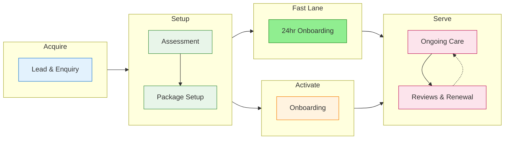
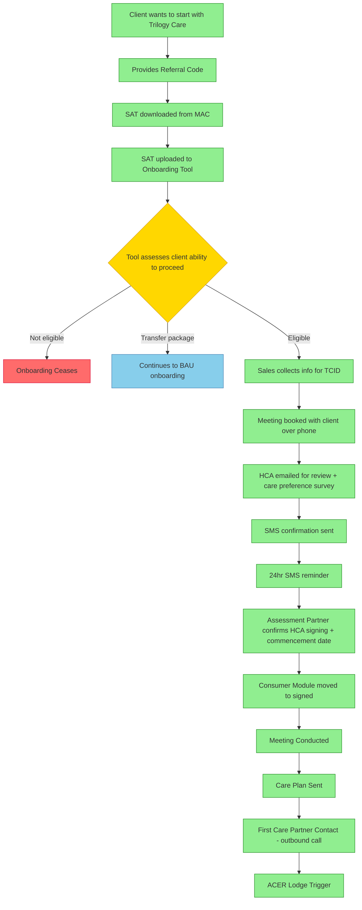

The complete journey of a customer through Trilogy Care, from initial contact to ongoing care management.

---

## Journey Overview

---

## 1. Lead & Enquiry

**First contact with Trilogy Care**

| Stage | Description | Systems |
|-------|-------------|---------|
| **Enquiry** | Customer contacts via web, phone, or referral | Zoho CRM, Aircall |
| **Qualification** | Sales team assesses fit for HCP | Lead Management |
| **Proposal** | Service proposal and pricing | Lead Management |

**Key Touchpoints:**
- Website enquiry form
- 1300 phone line (Aircall)
- Referral partners
- Marketing campaigns (Klaviyo)

---

## 2. Assessment

**Understanding customer needs**

| Stage | Description | Systems |
|-------|-------------|---------|
| **Initial Assessment** | Care needs evaluation | Assessment Tools |
| **Care Planning** | Goals, risks, and service plan | Care Plan |
| **Funding Review** | HCP level and budget planning | Budget Management |

**Key Touchpoints:**
- Assessment call/visit
- Care plan creation
- Budget explanation

---

## 3. Package Setup

**Getting the customer ready to receive care**

| Stage | Description | Systems |
|-------|-------------|---------|
| **Package Creation** | Create package in Portal | Packages |
| **Contact Setup** | Representatives, family, EPOAs | Package Contacts |
| **Budget Allocation** | Service categories and limits | Budget Management |
| **Supplier Connection** | Link to service providers | Supplier Management |

**Key Touchpoints:**
- Welcome pack
- Portal access setup
- Care coordinator introduction

---

## 4. Onboarding

**First weeks of service**

| Stage | Description | Systems |
|-------|-------------|---------|
| **Coordinator Assignment** | Dedicated care coordinator | Coordinator Portal |
| **Service Scheduling** | First services booked | Service Management |
| **Portal Training** | Customer learns to use tools | Customer Support |

**Key Touchpoints:**
- First care coordinator call
- First service delivery
- Check-in calls

### Fast Lane Onboarding

The **Fast Lane** process enables eligible clients to complete onboarding within 24 hours.

**Fast Lane Color Guide:**

| Color | Meaning |
|-------|---------|
| :green_circle: **Green** | Fast Lane (eligible for 24 hour sign up) |
| :yellow_circle: **Yellow** | Point of potential deviation from fast lane |
| :blue_circle: **Blue** | Deviates from fast lane (transfer packages cannot do 24 hour sign up) |
| :red_circle: **Red** | Not Proceeding |

**Fast Lane Eligibility:**
- New packages (not transfers)
- SAT data available from MAC
- Client able to complete HCA review within timeframe

**Systems Involved:**
- MAC (SAT download)
- Onboarding Tool (eligibility assessment)
- Portal (TCID creation, Consumer Module)
- SMS system (confirmations & reminders)
- Email (HCA delivery)

---

## 5. Ongoing Care

**Day-to-day care management**

| Stage | Description | Systems |
|-------|-------------|---------|
| **Service Delivery** | Regular care services | Supplier Management |
| **Budget Tracking** | Utilisation monitoring | Budget, Utilisation |
| **Billing** | Invoice processing | Bill Processing |
| **Claims** | Government funding claims | Claims |
| **Communication** | Notes, calls, updates | Notes, Intercom |

**Key Touchpoints:**
- Regular services
- Monthly statements
- Care plan reviews
- Budget updates

---

## 6. Care Reviews & Renewal

**Ongoing assessment and package updates**

| Stage | Description | Systems |
|-------|-------------|---------|
| **Care Review** | Regular needs reassessment | Care Plan |
| **Package Renewal** | Annual funding renewal | Claims, Budget |
| **Plan Updates** | Adjust services as needs change | Care Plan |

---

## Customer Touchpoints by Channel

| Channel | Purpose | System |
|---------|---------|--------|
| **Phone** | Enquiries, support, urgent needs | Aircall |
| **Email** | Statements, updates, marketing | Klaviyo |
| **SMS** | Reminders, confirmations | Twilio |
| **Portal** | Self-service, budget view, documents | TC Portal |
| **In-App Chat** | Support questions | Intercom |

---

## Key Metrics

| Metric | Description |
|--------|-------------|
| **Lead Conversion** | % of leads becoming customers |
| **Time to First Service** | Days from signup to first care |
| **Utilisation Rate** | % of budget being used |
| **NPS** | Customer satisfaction score |
| **Churn Rate** | % of customers leaving |

---

## Related Domains

- [Lead Management](/context/domains/lead-management) - Sales pipeline
- [Care Plan](/context/domains/care-plan) - Needs and goals
- [Budget Management](/context/domains/budget) - Funding allocation
- [Supplier Management](/context/domains/supplier) - Service providers
- [Bill Processing](/context/domains/bill-processing) - Invoice handling
- [Claims](/context/domains/claims) - Government funding
