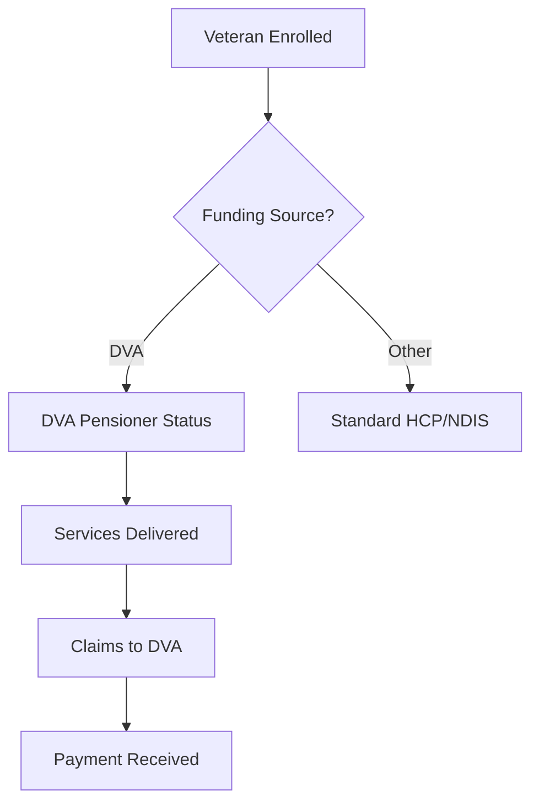
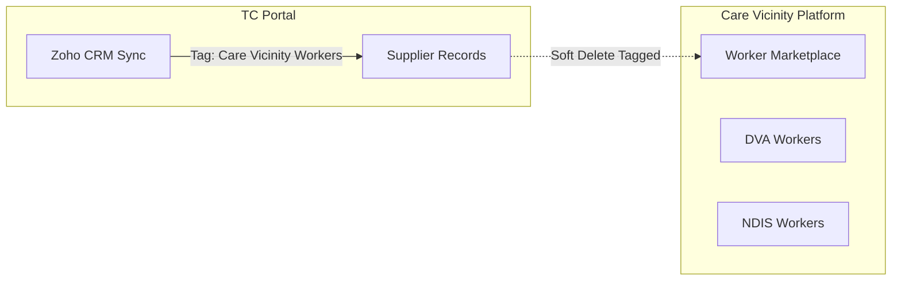

> Veterans' Affairs funding coordination and Care Vicinity platform integration

---

## Quick Links

| Resource | Link |
|----------|------|
| **External** | [DVA Official Site](https://www.dva.gov.au/) |
| **Care Vicinity** | [CareVicinity Platform](https://carevicinity.com.au/) |

---

## TL;DR

- **What**: Government funding program for Australian veterans receiving home care and disability support
- **Who**: DVA Team (Manager + Team Members), Veterans with DVA funding, Care Vicinity workers
- **Key flow**: Veteran enrolled with DVA funding -> Services delivered -> Claims submitted to DVA
- **Watch out**: Care Vicinity is a separate platform (Trilogy-owned) that handles DVA worker marketplace - not integrated into TC Portal

---

## Key Concepts

| Term | What it means |
|------|---------------|
| **DVA** | Department of Veterans' Affairs - Australian government department providing support to veterans |
| **DVA Pensioner** | Recipient with DVA pension status (distinct from age pension) |
| **Care Vicinity** | Trilogy-owned marketplace platform connecting care seekers with independent support workers for DVA, NDIS, and My Aged Care funding |
| **Provider Registration** | DVA-specific registration requirements for service providers (changed July 2024) |
| **Sustainability Payment** | $48.4 million government initiative to support DVA service provider viability |

---

## How It Works

### DVA Funding Model



### Care Vicinity Integration



The relationship between TC Portal and Care Vicinity is primarily managed through Zoho CRM tagging. Suppliers tagged as "Care Vicinity Workers" in Zoho are soft-deleted from TC Portal to maintain separation between platforms.

---

## Business Rules

| Rule | Why |
|------|-----|
| **DVA is separate funding stream** | Different claims process than HCP/Services Australia |
| **Care Vicinity workers excluded from TC Portal** | Separate platform for marketplace workers |
| **Provider registration required** | DVA-specific registration (updated July 2024) |
| **Quarterly funding releases** | DVA shifting from annual to quarterly releases like NDIS |
| **Budget limitations apply** | Funding caps must be tracked per veteran |

---

## Current State

### Platform Separation

DVA services are primarily delivered through **Care Vicinity**, a Trilogy-owned but separate platform:

| Capability | TC Portal | Care Vicinity |
|------------|-----------|---------------|
| Recipient management | HCP/NDIS focus | DVA/NDIS/MAC workers |
| Worker marketplace | No | Yes |
| Funding claims | Services Australia | DVA direct |
| Self-directed care | Limited | Core feature |

### TC Portal DVA Support

Within TC Portal, DVA is supported through:

1. **Financial Status Tracking** - `DVA_PENSIONER` enum value for package recipients
2. **Team Structure** - Dedicated DVA Team with Manager and Team Member roles
3. **Permissions** - DVA roles have access to packages, bills, documents, notes, and user management
4. **Supplier Management** - Care Vicinity workers tagged and soft-deleted from TC Portal

---

## Regulatory Context

### July 2024 Changes

- Provider registration model updated
- New requirements for DVA service providers
- Alignment with broader aged care reforms

### $48.4 Million Sustainability Initiative

Government funding to support DVA provider viability:
- Addresses financial pressures on smaller providers
- Supports workforce retention
- Enables continued service delivery for veterans

### Funding Model Transition

| Aspect | Previous | Current/Planned |
|--------|----------|-----------------|
| Release frequency | Annual | Quarterly |
| Budget visibility | End of period | Progressive |
| Tracking requirement | Manual | System-based |

---

## Who Uses This

| Role | What they do |
|------|--------------|
| **DVA Manager** | Oversee DVA recipient care, team management |
| **DVA Team Member** | Coordinate services for DVA-funded veterans |
| **Care Vicinity Workers** | Independent support workers (separate platform) |
| **Finance Team** | DVA claims and reconciliation |

---

## Technical Reference

<details>
<summary><strong>Enums & Configuration</strong></summary>

### Financial Status Enum

```php
// domain/Package/Enums/PackageFinancialStatusEnum.php
#[Label('DVA pensioner')]
case DVA_PENSIONER = 'DVA_PENSIONER';
```

### Role Configuration

```php
// config/roleList.php
'DVA Manager',
'DVA Team Member',
```

### Zoho Supplier Tags

```php
// domain/Supplier/Enums/ZohoSupplierTagEnum.php
#[Label('Care Vicinity Workers')]
case CARE_VICINITY_WORKERS = 'Care Vicinity Workers';
```

</details>

<details>
<summary><strong>Actions</strong></summary>

### Care Vicinity Worker Cleanup

```
domain/Supplier/Actions/
└── SoftDeleteSuppliersWithCareVicinityWorkersTag.php
```

Command: `php artisan supplier:soft-delete-care-vicinity-workers`

Purpose: Soft deletes suppliers tagged as "Care Vicinity Workers" in Zoho to maintain platform separation.

</details>

<details>
<summary><strong>Permissions</strong></summary>

DVA roles have standard staff permissions for:
- Package management (view, edit, create)
- Bill management (view)
- Document management (view, edit, create)
- Note management (view, edit, create)
- User account management (view, edit)

Excluded from:
- Bank details management (commented out)
- Dashboard access (commented out)
- Task management (commented out)

</details>

---

## Integration Points

### Related Government Programs

| Program | Relationship |
|---------|--------------|
| **NDIS** | Some veterans have dual DVA/NDIS funding |
| **My Aged Care** | Veterans may also access HCP funding |
| **Services Australia** | Claims API (separate from DVA) |

### Care Vicinity Platform

Care Vicinity handles:
- DVA worker marketplace
- NDIS worker marketplace
- My Aged Care worker marketplace
- Self-directed care options
- Worker rate setting and scheduling

---

## Roadmap Considerations

Based on Fireflies research and industry context:

| Area | Consideration |
|------|---------------|
| **Budget limitations** | Need Care Vicinity budget tracking aligned with quarterly releases |
| **Government API integration** | DVA API requirements differ from Services Australia |
| **Compliance requirements** | 304 aged care compliance requirements may have DVA-specific variations |
| **Provider registration** | July 2024 changes require ongoing monitoring |
| **Platform coordination** | TC Portal and Care Vicinity data flow needs clarification |

---

## Related

### Domains

- [Claims](/features/domains/claims) - Government claims (Services Australia focus)
- [Budget](/features/domains/budget) - Funding allocation and tracking
- [Supplier](/features/domains/supplier) - Provider management (excludes Care Vicinity workers)

### External

- [Care Vicinity](https://carevicinity.com.au/) - DVA/NDIS worker marketplace
- [DVA Health Care](https://www.dva.gov.au/health-and-treatment) - Official DVA health services

---

## Status

**Maturity**: In Development
**Pod**: DVA Team
**Owner**: DVA Manager

---

## Research Sources

| Source | Key Topics |
|--------|------------|
| Fireflies meetings (20+ stand-ups) | Care Vicinity development, provider registration changes |
| Policy meetings | $48.4M sustainability payment, quarterly funding transition |
| Domain index research | NDIS coordination, budget limitation requirements |
