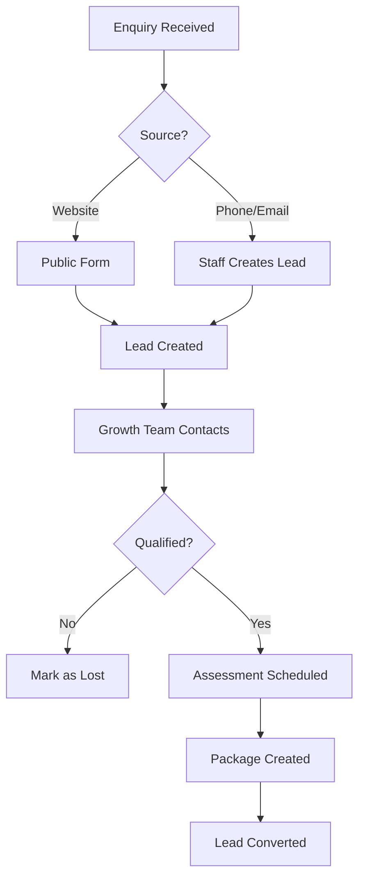
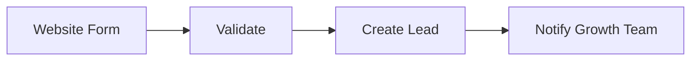
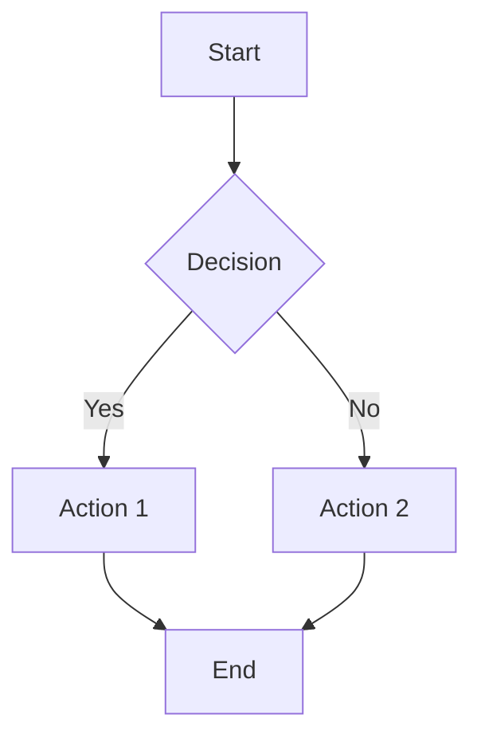
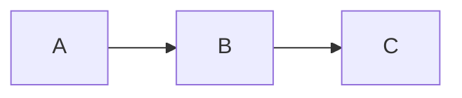

# Domain Documentation Template

> **How to use**: Copy this template when creating a new domain doc. Delete sections that don't apply.

---

## Template Structure

| Section | Required | Purpose |
|---------|----------|---------|
| Quick Links | Yes | Portal/Figma/Nova links for fast access |
| TL;DR | Yes | 30-second understanding |
| Key Concepts | Yes | Glossary of terms |
| How It Works | Yes | Flows with mermaid diagrams |
| Business Rules | If any | Constraints and gotchas |
| Feature Flags | If any | What's toggleable |
| Common Issues | If any | Troubleshooting FAQ |
| Who Uses This | Yes | Personas and their actions |
| Technical Reference | Yes | Models, Actions, Pages, API (collapsed) |
| Testing | Yes | Factories, seeders, test tips |
| Related | Yes | Connected domains and epics |
| Status | Yes | Maturity, pod, owner |

---

## Example: Leads Domain

> See how this template looks when filled in with real content.

<details>
<summary><strong>View completed example</strong></summary>

---

```markdown
---
title: "Lead Management"
description: "Capture and convert prospective consumers into active packages"
---


> Sales pipeline from first contact to package activation

---

## Quick Links

| Resource | Link |
|----------|------|
| **Portal** | [Lead List](https://tc-portal.test/staff/leads) — Sign in as: `staff@trilogycare.com.au` |
| **Figma** | [Lead Designs](https://figma.com/file/abc123) |
| **Nova Admin** | [Manage Leads](https://tc-portal.test/nova/resources/leads) |

---

## TL;DR

- **What**: Track prospective consumers from enquiry through to package activation
- **Who**: Growth team, Care Partners, public website visitors
- **Key flow**: Enquiry → Qualification → Assessment → Package Created
- **Watch out**: Leads sync to Zoho CRM - changes in either system propagate

---

## Key Concepts

| Term | What it means |
|------|---------------|
| **Lead** | A prospective consumer who has enquired about services |
| **Lead Source** | Where they came from (website, referral, hospital) |
| **Lead Status** | Current stage in the pipeline (new, contacted, qualified, converted) |
| **Conversion** | When a lead becomes an active package/recipient |

---

## How It Works

### Main Flow: Lead to Package



### Other Flows

<details>
<summary><strong>Public Website Submission</strong> — self-service enquiry</summary>

Visitors complete form on trilogycare.com.au, lead auto-created with source "website".



</details>

<details>
<summary><strong>Zoho Sync</strong> — CRM integration</summary>

Leads sync bidirectionally with Zoho CRM. Changes in Portal update Zoho, and vice versa.

</details>

---

## Business Rules

| Rule | Why |
|------|-----|
| **Email required** | Need contact method for follow-up |
| **One active lead per email** | Prevent duplicates |
| **Can't delete converted leads** | Audit trail for package history |

---

## Feature Flags

| Flag | What it controls | Default |
|------|------------------|---------|
| `zoho-lead-sync` | Bidirectional Zoho CRM sync | On |

---

## Common Issues

<details>
<summary><strong>Issue: Lead not appearing in Zoho</strong></summary>

**Symptom**: Created lead in Portal but not visible in Zoho CRM

**Cause**: Sync job may be delayed or failed

**Fix**: Check Horizon for failed `ZohoSyncLeadJob`. Re-trigger manually if needed.

</details>

---

## Who Uses This

| Role | What they do |
|------|--------------|
| **Growth Team** | Create leads, track pipeline, follow up |
| **Care Partners** | Convert qualified leads to packages |
| **Public** | Submit enquiries via website form |

---

## Technical Reference

<details>
<summary><strong>Models & Database</strong></summary>

### Models

```
app/Models/
├── Lead.php                    # Main lead model
└── LeadSource.php              # Enum for lead sources

domain/Lead/Models/
└── LeadActivity.php            # Activity log for lead
```

### Tables

| Table | Purpose |
|-------|---------|
| `leads` | Lead records |
| `lead_activities` | Timeline of lead interactions |

</details>

<details>
<summary><strong>Actions & Services</strong></summary>

```
app/Actions/Lead/
├── CreateLeadAction.php        # Create new lead
├── ConvertLeadAction.php       # Convert to package
└── SyncLeadToZohoAction.php    # CRM sync
```

</details>

<details>
<summary><strong>Frontend Pages</strong></summary>

```
resources/js/Pages/
├── Lead/
│   ├── Index.vue               # Lead list
│   ├── Show.vue                # Lead detail
│   └── Create.vue              # New lead form
└── Public/Lead/
    └── Create.vue              # Public enquiry form
```

</details>

<details>
<summary><strong>API Endpoints</strong></summary>

| Method | Endpoint | Description |
|--------|----------|-------------|
| GET | `/api/v1/leads` | List leads |
| POST | `/api/v1/leads` | Create lead |
| POST | `/api/v1/leads/{id}/convert` | Convert to package |

</details>

---

## Testing

### Factories & Seeders

```php
// Create a lead
Lead::factory()->create();

// Create qualified lead ready for conversion
Lead::factory()->qualified()->create();

// Seed sample leads
php artisan db:seed --class=LeadSeeder
```

### Key Test Scenarios

- [ ] Public form submission creates lead
- [ ] Duplicate email rejected
- [ ] Conversion creates package and updates lead status
- [ ] Zoho sync triggered on create/update

---

## Related

### Domains

- [Consumer Lifecycle](./consumer-lifecycle.md) — leads convert to consumers
- [Packages](./packages.md) — conversion creates a package

### Epics

| Epic | Status | Description |
|------|--------|-------------|
| [TP-1234](../../initiatives/Consumer-Lifecycle/Lead-Capture) | Complete | Public lead form |
| [TP-2345](../../initiatives/Infrastructure/Zoho-Integration) | Active | CRM sync improvements |

---

## Status

**Maturity**: Production
**Pod**: Growth
**Owner**: Sarah Chen
```

</details>

---

## Blank Template

Copy everything below this line:

---

```markdown
---
title: "Domain Name"
description: "One-line description of what this domain handles"
---


> Short tagline describing the domain purpose

---

## Quick Links

| Resource | Link |
|----------|------|
| **Portal** | [View in Portal](https://tc-portal.test/path) — Sign in as: `user@test.com` |
| **Figma** | [Design Files](https://figma.com/file/xxx) |
| **Nova Admin** | [Manage in Nova](https://tc-portal.test/nova/resources/model) |

---

## TL;DR

- **What**: One sentence description
- **Who**: Primary users
- **Key flow**: The main thing that happens
- **Watch out**: Most common gotcha

---

## Key Concepts

| Term | What it means |
|------|---------------|
| **Term** | Plain english definition |
| **Term** | Plain english definition |

---

## How It Works

### Main Flow: [Flow Name]



### Other Flows

<details>
<summary><strong>Flow Name</strong> — when X happens</summary>

Description and diagram.



</details>

---

## Business Rules

| Rule | Why |
|------|-----|
| **Rule name** | Brief explanation |

---

## Feature Flags

| Flag | What it controls | Default |
|------|------------------|---------|
| `flag-name` | Description | On/Off |

---

## Common Issues

<details>
<summary><strong>Issue: Something doesn't work</strong></summary>

**Symptom**: What the user sees

**Cause**: Why it happens

**Fix**: How to resolve it

</details>

---

## Who Uses This

| Role | What they do |
|------|--------------|
| **Role** | Their main actions |

---

## Technical Reference

<details>
<summary><strong>Models & Database</strong></summary>

### Models

```
app/Models/
├── Model.php              # Description
```

### Tables

| Table | Purpose |
|-------|---------|
| `table_name` | Description |

</details>

<details>
<summary><strong>Actions & Services</strong></summary>

```
app/Actions/DomainName/
├── CreateAction.php       # Description
```

</details>

<details>
<summary><strong>Frontend Pages</strong></summary>

```
resources/js/Pages/Domain/
├── Index.vue              # List view
├── Show.vue               # Detail view
```

</details>

<details>
<summary><strong>API Endpoints</strong></summary>

| Method | Endpoint | Description |
|--------|----------|-------------|
| GET | `/api/v1/domain` | List all |
| POST | `/api/v1/domain` | Create new |

</details>

---

## Testing

### Factories & Seeders

```php
// Create a record
Model::factory()->create();

// Seed sample data
php artisan db:seed --class=ModelSeeder
```

### Key Test Scenarios

- [ ] Scenario 1
- [ ] Scenario 2

---

## Related

### Domains

- [Domain Name](./domain.md) — how they connect

### Epics

| Epic | Status | Description |
|------|--------|-------------|
| [TP-XXX](../../initiatives/path) | Status | What it does |

---

## Status

**Maturity**: Production / In Development / Planned
**Pod**: Pod Name
**Owner**: Name
```
