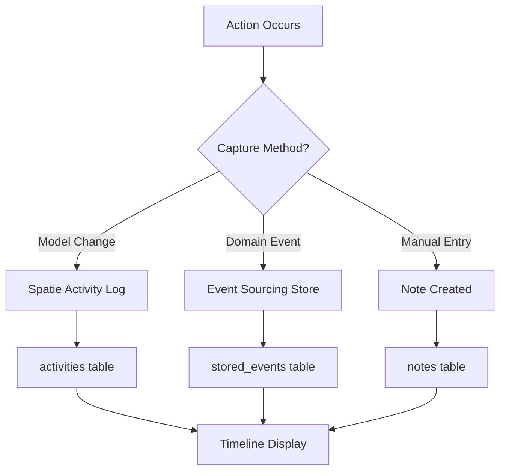
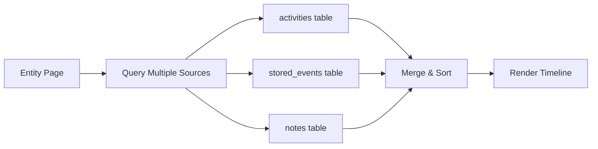

> Capturing and displaying what happened, when, and by whom

---

## Quick Links

| Resource | Link |
|----------|------|
| **Portal** | Package Timeline (planned) |
| **Nova Admin** | [Activity Log](https://tc-portal.test/nova/resources/activities) |
| **Linear** | [DUC-5 - Timelines & Activity Log Infrastructure](https://linear.app/trilogycare/issue/DUC-5) |

---

## TL;DR

- **What**: Unified system for capturing and displaying activity events across the platform
- **Who**: All staff - view history on packages, bills, suppliers, contacts
- **Key flow**: Event Occurs → Activity Logged → Displayed in Timeline → Searchable History
- **Watch out**: Currently fragmented - events captured in multiple places (Spatie Activity, Event Sourcing, Notes)

---

## Research Context: Timeline Uplift

This domain was documented as part of research into Luke Traini's **Timeline Uplift** idea (Feb 2026):

> "Would be great to create something that creates a visual timeline so staff can see all comms across clients/suppliers with links to the materials and any briefing documents. That will help the teams deal better with answering and resolving calls quickly and disseminating training, education and scripting training across the org."
>
> **Goal**: Improve handle time and first touch resolution

### Why Activity Log Matters

The Timeline Uplift requires a **unified activity/timeline infrastructure** to:

1. Show all communications (calls, emails, SMS, notes) in one timeline
2. Link communications to training materials and scripts
3. Give staff instant context when handling inbound enquiries
4. Track what was sent, when, and to whom

**Current challenge**: Activity data is fragmented across 3 systems (Spatie Activity, Event Sourcing, Notes). A unified approach is needed.

See: [Timeline Uplift Initiative](/initiatives/Work-Management/Timeline-Uplift/)

---

## Key Concepts

| Term | What it means |
|------|---------------|
| **Activity** | A recorded event that occurred (created, updated, sent, viewed) |
| **Subject** | The entity the activity is about (Package, Bill, Contact) |
| **Causer** | Who/what triggered the activity (User, System, Job) |
| **Properties** | Before/after data captured with the activity |
| **Timeline** | Chronological display of activities for an entity |

---

## Current State

### Fragmented Activity Tracking

The codebase has **three separate mechanisms** for activity tracking:

| Mechanism | Location | Used For |
|-----------|----------|----------|
| **Spatie Activity Log** | `spatie/laravel-activitylog` | Model changes on selected models |
| **Event Sourcing** | `domain/*/EventSourcing/` | PackageContact, Fee, Budget events |
| **Notes** | `domain/Note/` | Manual communication logging |

### Models Using Spatie Activity Log

```
app/Models/AdminModels/
├── PackageRepresentative.php    # Contact changes
├── Bill.php                     # Invoice lifecycle
├── BillItem.php                 # Line item changes
├── PackageClassification.php    # Category changes
├── StageHistory.php             # Stage transitions
└── EquipmentTag.php             # Equipment tagging
```

### Event Sourced Entities

```
domain/
├── PackageContact/EventSourcing/Events/
│   ├── PackageContactCreated
│   ├── PackageContactUpdated
│   ├── PackageContactInvited
│   ├── PackageContactInvitationAccepted
│   └── ... (8 events total)
├── Fee/EventSourcing/Events/
├── Budget/EventSourcing/Events/
└── ... (multiple domains)
```

---

## How It Works

### Main Flow: Activity Capture



### Activity Display (Current)



---

## Business Rules

| Rule | Why |
|------|-----|
| **Activities are immutable** | Audit trail integrity |
| **Causer always recorded** | Accountability |
| **Timestamps in UTC** | Consistency across timezones |
| **Soft deletes preserved** | Activities persist after entity deletion |

---

## Planned Infrastructure (DUC-5)

### Problem Statement

> Currently we don't capture email send events (and other activity events) in a way that allows us to display them efficiently in specific contexts. This limits our ability to show users a complete picture of what's happened on a record.

### Proposed Unified Approach

| Component | Purpose |
|-----------|---------|
| **activities table** | Single source for all timeline events |
| **Activity Types** | Enum of event types (created, updated, sent, viewed) |
| **Context Scoping** | Filter activities by context (Package, Bill, etc.) |
| **Efficient Queries** | Indexed for fast retrieval by subject |

### Key Use Cases

1. **Email Templates in Event Logs** - See when emails were sent, to whom, what template
2. **Communication History** - All calls, emails, SMS in one timeline
3. **Audit Trail** - Complete history of changes and actions
4. **Training Context** - Link activities to relevant training materials

---

## Common Issues

<details>
<summary><strong>Issue: Activity not appearing in timeline</strong></summary>

**Symptom**: Action occurred but not showing in activity feed

**Cause**: Model may not have `LogsActivity` trait, or event not captured

**Fix**: Check if model uses activity logging, or add event capture

</details>

<details>
<summary><strong>Issue: Duplicate activities</strong></summary>

**Symptom**: Same event appears multiple times

**Cause**: Multiple capture mechanisms triggered (Activity + Event Sourcing)

**Fix**: Unify capture to single mechanism per entity type

</details>

---

## Who Uses This

| Role | What they do |
|------|--------------|
| **Care Coordinators** | View package history, recent communications |
| **Care Partners** | Audit contact changes, review activity |
| **Bill Processors** | Track invoice lifecycle events |
| **Managers** | Review team activity and audit trails |

---

## Technical Reference

<details>
<summary><strong>Spatie Activity Log</strong></summary>

### Configuration

```php
// Model using activity logging
use Spatie\Activitylog\Traits\LogsActivity;
use Spatie\Activitylog\LogOptions;

class MyModel extends Model
{
    use LogsActivity;

    public function getActivitylogOptions(): LogOptions
    {
        return LogOptions::defaults()
            ->logOnly(['name', 'status'])
            ->logOnlyDirty();
    }
}
```

### Querying Activities

```php
// Get activities for a model
$activities = Activity::forSubject($package)->get();

// Get activities by causer
$activities = Activity::causedBy($user)->get();
```

</details>

<details>
<summary><strong>Event Sourcing</strong></summary>

### Aggregate Pattern

```php
// Recording events
PackageContactAggregate::retrieve($uuid)
    ->createContact($packageId, $data)
    ->persist();

// Querying events
$events = StoredEvent::query()
    ->whereAggregateRoot($uuid)
    ->get();
```

</details>

<details>
<summary><strong>Database Tables</strong></summary>

### activities (Spatie)

| Column | Purpose |
|--------|---------|
| `log_name` | Category of activity |
| `description` | Human-readable description |
| `subject_type` | Polymorphic type |
| `subject_id` | Polymorphic ID |
| `causer_type` | Who triggered |
| `causer_id` | Who triggered ID |
| `properties` | JSON with old/new values |

### stored_events (Event Sourcing)

| Column | Purpose |
|--------|---------|
| `aggregate_uuid` | Entity identifier |
| `event_class` | Event type |
| `event_properties` | Serialized event data |
| `meta_data` | Context information |

</details>

---

## Testing

### Factories & Seeders

```php
// Create an activity
activity()
    ->causedBy($user)
    ->performedOn($package)
    ->withProperties(['old' => 'value', 'new' => 'updated'])
    ->log('updated');

// Query in tests
$this->assertDatabaseHas('activity_log', [
    'subject_type' => Package::class,
    'subject_id' => $package->id,
]);
```

### Key Test Scenarios

- [ ] Model changes logged automatically
- [ ] Causer correctly identified
- [ ] Properties capture before/after state
- [ ] Timeline query returns sorted results

---

## Related

### Domains

- [Notes](/features/domains/notes) - Manual activity logging
- [Telephony](/features/domains/calls) - Call activity events
- [Emails](/features/domains/emails) - Email send events
- [Notifications](/features/domains/notifications) - Notification events

### Initiatives

| Initiative | Status | Description |
|------------|--------|-------------|
| [DUC-5](https://linear.app/trilogycare/issue/DUC-5) | Backlog | Timelines & Activity Log Infrastructure |
| [Communications Canvas](/initiatives/Work-Management/Communications-Canvas) | Idea | Visual timeline for all comms |
| [Calls Uplift](/initiatives/Work-Management/Calls-Uplift) | In Progress | Call tracking and review |

---

## Roadmap

| Phase | Feature | Status |
|-------|---------|--------|
| 1 | Spatie Activity on key models | Complete |
| 2 | Event Sourcing for domain events | Complete |
| 3 | Unified activity infrastructure | Planned |
| 4 | Timeline UI components | Planned |
| 5 | Communications Canvas | Idea |

---

## Open Questions

| Question | Context |
|----------|---------|
| **Unify Spatie + Event Sourcing?** | Should we consolidate into single mechanism? |
| **Email send capture** | How to reliably log email sends to timeline? |
| **Performance at scale** | Indexing strategy for large activity volumes |
| **Real-time updates** | WebSocket/Polling for live timeline updates |

---

## Status

**Maturity**: In Development (infrastructure exists, unification planned)
**Pod**: TBD
**Owner**: TBD

---

## Source Context

| Source | Key Topics |
|--------|------------|
| DUC-5 Linear Issue | Activity log infrastructure requirements |
| Codebase Analysis | Spatie Activity Log, Event Sourcing patterns |
| Communications Canvas Research | Timeline UI needs |
