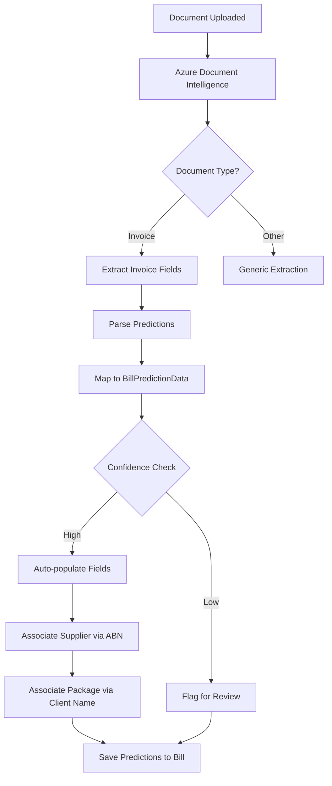
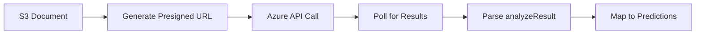
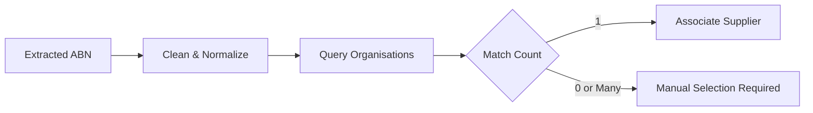
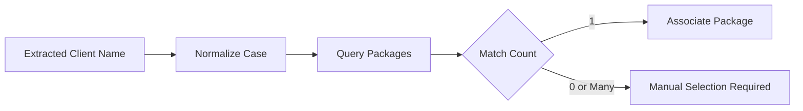

> AI-driven extraction, classification, and automation for operational efficiency

---

## Quick Links

| Resource | Link |
|----------|------|
| **Document Intelligence Config** | `config/document-intelligence.php` |
| **OpenAI Config** | `config/openai.php` |
| **Document Extractor API** | `https://graph.trilogycare.com.au/services/document-extractor/v1.0/` |

---

## TL;DR

- **What**: AI services for document extraction, invoice classification, and data enrichment
- **Who**: Bill Processing Officers, Care Partners, Finance Team
- **Key flow**: Document Upload → AI Extraction → Confidence-Scored Predictions → Human Review
- **Watch out**: AI predictions require human verification; confidence scores indicate reliability

---

## Key Concepts

| Term | What it means |
|------|---------------|
| **Document Intelligence** | Azure Cognitive Services for extracting structured data from invoices |
| **Prediction** | AI-extracted field with value and confidence score (0-1) |
| **Confidence Score** | Reliability indicator for extracted data (higher = more reliable) |
| **Document Extractor** | Trilogy Care's internal API for multi-format document processing |
| **Fuzzy Matching** | Approximate string matching for supplier/client identification |
| **OCR** | Optical Character Recognition for handwritten or image-based documents |

---

## How It Works

### Main Flow: Invoice AI Extraction



### Document Intelligence Pipeline



### Other Flows

<details>
<summary><strong>Supplier Association</strong> - automatic matching from extracted ABN</summary>

When AI extracts an ABN from an invoice:
1. Strip whitespace from extracted ABN
2. Query organisations table for exact match
3. Find linked supplier via business relationship
4. Auto-populate supplier_id if single match found



</details>

<details>
<summary><strong>Package Association</strong> - client name matching</summary>

When AI extracts a client name:
1. Convert to lowercase for comparison
2. Search packages by recipient full name (prefix match)
3. Auto-populate package_id if single match found



</details>

<details>
<summary><strong>ChatGPT Extraction</strong> - alternative extraction method (experimental)</summary>

PDF documents can be processed via OpenAI GPT-4o:
1. Convert PDF pages to images
2. Upload images to S3 with temporary URLs
3. Send to GPT-4o with structured JSON schema
4. Parse response into bill prediction format

Note: This is an experimental alternative to Azure Document Intelligence.

</details>

---

## AI Services Architecture

### Current Services

| Service | Provider | Purpose |
|---------|----------|---------|
| **Document Intelligence** | Azure Cognitive Services | Invoice field extraction |
| **Document Extractor** | Trilogy Care Graph API | Multi-format document processing |
| **OpenAI GPT-4o** | OpenAI | Alternative extraction, structured output |

### Extracted Invoice Fields

| Field | Azure Key | Description |
|-------|-----------|-------------|
| `client_name` | CustomerName | Invoice recipient name |
| `client_address` | ServiceAddress | Service delivery address |
| `due_date` | DueDate | Payment due date |
| `invoice_date` | InvoiceDate | Invoice issue date |
| `invoice_ref` | InvoiceId | Invoice reference number |
| `supplier_name` | VendorName | Supplier business name |
| `abn` | VendorTaxId | Australian Business Number |
| `supplier_address` | VendorAddress | Supplier address |
| `sub_total` | SubTotal | Amount before tax |
| `total_tax` | TotalTax | Tax amount |
| `total_amount` | InvoiceTotal | Total invoice amount |

### Line Item Extraction

| Field | Azure Key | Description |
|-------|-----------|-------------|
| `description` | Description | Service description |
| `service_date` | Date | Date service was provided |
| `service_hours` | Quantity | Units/hours of service |
| `service_unit_amount` | UnitPrice | Per-unit cost |
| `service_tax_rate` | TaxRate | Tax percentage |
| `service_tax_amount` | Tax | Tax for line item |
| `service_total_amount` | Amount | Line item total |

---

## Business Rules

| Rule | Why |
|------|-----|
| **RCTI filtering** | Skip extraction for Trilogy Care RCTI documents (starts with "Recipient Generated Invoice") |
| **Single supplier match** | Only auto-associate if exactly one supplier matches ABN |
| **Single package match** | Only auto-associate if exactly one package matches client name |
| **Confidence thresholds** | Low confidence predictions flagged for human review |
| **Polling limits** | Max 10 attempts with 1-second delays for Azure result polling |
| **Timeout handling** | 120-second timeout for Azure API requests |

---

## Accuracy Targets

| Phase | Classification | Extraction | Status |
|-------|---------------|------------|--------|
| **Initial** | 70% | 80% | Target |
| **Goal** | 80-99% | 99% | Future |

### Improvement Strategies

- Layout LLM3 for improved template adaptability
- Fuzzy matching for data enrichment
- Supplier data lookup for classification accuracy
- Historical pattern learning

---

## Feature Flags

| Flag | What it controls | Default |
|------|------------------|---------|
| TBD | AI extraction features are being developed | - |

---

## Common Issues

<details>
<summary><strong>Issue: Extraction returns empty results</strong></summary>

**Symptom**: `BillPredictionData` is null despite document upload

**Causes**:
- Document is a Trilogy Care RCTI (filtered out)
- Azure API connection timeout
- Presigned URL not yet available (timing issue)

**Fix**:
1. Check document content - RCTI documents are intentionally skipped
2. Verify Azure API connectivity and credentials
3. The 2-second sleep before extraction helps with S3 URL propagation

</details>

<details>
<summary><strong>Issue: Supplier not auto-associated</strong></summary>

**Symptom**: `supplier_id` remains null despite ABN extraction

**Causes**:
- ABN not found in organisations table
- Multiple suppliers match the same ABN
- ABN format mismatch (spaces, formatting)

**Fix**:
1. Verify extracted ABN matches organisation record
2. Check for duplicate organisations with same ABN
3. ABN whitespace is stripped before matching

</details>

<details>
<summary><strong>Issue: Low confidence scores</strong></summary>

**Symptom**: Extracted values have confidence below threshold

**Causes**:
- Poor document quality (scan, handwritten)
- Non-standard invoice format
- Overlapping or unclear fields

**Fix**:
1. Request clearer document from supplier
2. Flag for manual review
3. Consider alternative extraction methods

</details>

---

## Who Uses This

| Role | What they do |
|------|--------------|
| **Bill Processing Officers** | Review AI predictions, verify accuracy, process bills |
| **Care Partners** | Approve bills with AI-flagged discrepancies |
| **Finance Team** | Monitor extraction accuracy and processing efficiency |
| **Developers** | Maintain AI integrations, improve accuracy |

---

## Technical Reference

<details>
<summary><strong>Actions & Services</strong></summary>

### Prediction Actions

```
app/Actions/Bill/Predictions/
├── ExtractPredictionsViaDocumentIntelligence.php  # Azure extraction
├── ExtractPredictionsViaChatGPT.php               # OpenAI alternative
├── GetBillPredictions.php                         # Orchestrator
├── AssociateSupplierFromPrediction.php            # ABN matching
├── AssociatePackageFromPrediction.php             # Client name matching
└── AssociateBudgetFromPrediction.php              # Budget linking
```

### Third-Party Services

```
app/ThirdPartyServices/
└── OpenAIService.php                              # OpenAI wrapper

app/Providers/
└── OpenAIServiceProvider.php                      # Service registration
```

### Document Extractor Integration

```
app/Integration/DocumentExtractor/
├── DocumentExtractor.php                          # Saloon connector
├── Resource/DocumentExtractionResource.php        # API endpoints
├── Dto/
│   ├── ExtractionRequest.php                      # Request payload
│   ├── ExtractionResponse.php                     # Response data
│   ├── ProcessingOptions.php                      # Extraction options
│   └── ProcessingMetadata.php                     # Processing info
├── Requests/Misc/
│   ├── ExtractDocument.php                        # Extract endpoint
│   └── GetSpecification.php                       # OpenAPI spec
├── OpenAPI.json                                   # API specification
└── README.md                                      # Integration docs
```

</details>

<details>
<summary><strong>Data Classes</strong></summary>

### Prediction Data

```
app/Data/
├── PredictionData.php                             # Value + confidence
└── Bill/
    ├── BillPredictionData.php                     # Full bill prediction
    └── BillItemPredictionData.php                 # Line item prediction
```

### PredictionData Structure

```php
class PredictionData extends Data
{
    public function __construct(
        public mixed $value,
        public ?float $confidence
    ) {}
}
```

### BillPredictionData Structure

```php
class BillPredictionData extends Data
{
    public function __construct(
        public ?PredictionData $client_name,
        public ?PredictionData $client_address,
        public ?PredictionData $due_date,
        public ?PredictionData $invoice_date,
        public ?PredictionData $invoice_ref,
        public ?PredictionData $supplier_name,
        public ?PredictionData $abn,
        public ?PredictionData $supplier_address,
        public ?PredictionData $sub_total,
        public ?PredictionData $total_tax,
        public ?PredictionData $total_amount,
        /** @var BillItemPredictionData[] */
        public array $items
    ) {}
}
```

</details>

<details>
<summary><strong>Configuration</strong></summary>

### Azure Document Intelligence

```php
// config/document-intelligence.php
return [
    'secret_key' => env('DOCUMENT_INTELLIGENCE_SECRET_KEY'),
    'api_endpoint' => env('DOCUMENT_INTELLIGENCE_API_ENDPOINT'),
];
```

### OpenAI

```php
// config/openai.php
return [
    'api_key' => env('OPENAI_API_KEY'),
    'organization' => env('OPENAI_ORGANIZATION'),
    'request_timeout' => env('OPENAI_REQUEST_TIMEOUT', 30),
];
```

### Document Extractor

```php
// Uses config/services.php
'tc_graph' => [
    'api_token' => env('TC_GRAPH_API_TOKEN'),
],
```

</details>

<details>
<summary><strong>API Endpoints</strong></summary>

### Azure Document Intelligence

| Method | Endpoint | Description |
|--------|----------|-------------|
| POST | `/documentModels/prebuilt-invoice:analyze` | Submit document for extraction |
| GET | `{Operation-Location}` | Poll for extraction results |

### Document Extractor (TC Graph)

| Method | Endpoint | Description |
|--------|----------|-------------|
| POST | `/services/document-extractor/v1.0/` | Extract from document |
| GET | `/services/document-extractor/v1.0/specification` | Get OpenAPI spec |

</details>

---

## Testing

### Factories & Seeders

```php
// Create a bill with predictions
$bill = Bill::factory()->create([
    'predictions' => [
        'bill' => BillPredictionData::from([...])
    ]
]);
```

### Key Test Scenarios

- [ ] Document extraction returns valid predictions
- [ ] RCTI documents are filtered correctly
- [ ] Supplier association works for single ABN match
- [ ] Package association works for single client match
- [ ] Timeout handling for slow Azure responses
- [ ] Empty extraction handled gracefully

### Test Files

```
tests/Action/Bill/Predictions/
├── ExtractPredictionsViaDocumentIntelligenceTest.php
├── GetBillPredictionsTest.php
├── AssociateSupplierFromPredictionTest.php
├── AssociatePackageFromPredictionTest.php
└── AssociateBudgetFromPredictionTest.php
```

---

## Future Enhancements

### Planned AI Capabilities

| Feature | Description | Status |
|---------|-------------|--------|
| **AI Conversational UI** | Voice-friendly interface for older users (High Violet Ventures partnership) | Planned |
| **Lead Scoring** | AI-driven lead qualification and prioritization | Planned |
| **Aircall AI** | Call transcription and sentiment analysis | Integration pending |
| **Tier 5 ISO Mapping** | Automated billing code mapping | In Development |
| **Fuzzy Supplier Matching** | Improved name-based matching when ABN unavailable | Planned |

### Architecture Improvements

| Enhancement | Description |
|-------------|-------------|
| **Modular Components** | Separate document extraction from lifecycle management |
| **Confidence Thresholds** | Configurable auto-approval thresholds |
| **Learning Pipeline** | Feedback loop to improve accuracy over time |
| **Multi-Model Support** | Switch between extraction providers based on document type |

---

## Related

### Domains

- [Bill Processing](/features/domains/bill-processing) - primary consumer of AI predictions
- [Documents](/features/domains/documents) - document storage and management
- [Assessments](/features/domains/assessments) - future AI-assisted assessment scoring
- [Lead Management](/features/domains/lead-management) - future AI lead scoring
- [Telephony](/features/domains/telephony) - Aircall AI integration

### Integrations

- [Azure Cognitive Services](https://azure.microsoft.com/en-au/products/ai-services/document-intelligence) - Document Intelligence
- [OpenAI](https://openai.com) - GPT models for extraction
- [TC Graph API](https://graph.trilogycare.com.au) - Document Extractor service

---

## Open Questions

| Question | Context |
|----------|---------|
| **ChatGPT extraction incomplete?** | `ExtractPredictionsViaChatGPT.php` has TODO comments about multi-page handling |
| **DocumentExtractor vs Azure?** | TC Graph DocumentExtractor scaffolded but Azure Document Intelligence is the active pipeline |

---

## Status

**Maturity**: In Development (documentation accurate)
**Pod**: Bills / Infrastructure
**Owner**: Mateo (Document Extraction)

---

## Source Meetings

| Date | Meeting | Key Topics |
|------|---------|------------|
| Multiple | TC Bill Processor Overview | Azure Document Intelligence, 80-99% accuracy target |
| Dec 2025 | Invoice Classification | AI training, 70% accuracy with keyword matching |
| - | AI Initiatives | Layout LLM3, fuzzy matching, modular architecture |
| - | High Violet Partnership | AI conversational UI for elderly users |

---

## Revision History

| Date | Version | Changes | Author |
|------|---------|---------|--------|
| 2026-01-31 | 1.0 | Initial documentation | Claude |
