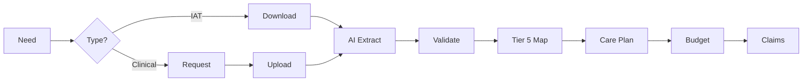
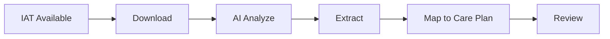
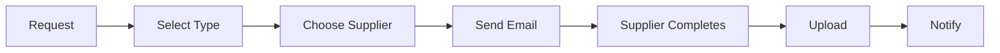

> IAT, OT, physio, and clinical assessments driving care decisions

---

## Quick Links

| Resource | Link |
|----------|------|
| **Portal** | [Package Assessments](https://tc-portal.test/staff/packages/{id}/assessments) |
| **Nova Admin** | [Assessments](https://tc-portal.test/nova/resources/assessments) |
| **SimplyBook** | Assessment scheduling |

---

## TL;DR

- **What**: Manage clinical assessments from IAT data, OT reports, physio letters, and validated tools
- **Who**: Assessment Team, Clinical Team, Care Partners, External Suppliers (OTs, Physios, GPs)
- **Key flow**: IAT Data → Clinical Assessment → Recommendations → Care Plan Integration
- **Watch out**: Tier 5 ISO codes required for billing; AI extraction needs manual review for low-confidence items

---

## Key Concepts

| Term | What it means |
|------|---------------|
| **IAT** | Integrated Assessment Tool - government aged care assessment |
| **ACAT/RAS** | Aged Care Assessment Team / Regional Assessment Service |
| **OT Assessment** | Occupational Therapy evaluation for equipment/modifications |
| **Physio Letter** | Physiotherapist recommendation for mobility/exercise |
| **Validated Tool** | Standardized clinical assessment instrument |
| **Tier 5 ISO Code** | Classification code for billing and claims |

---

## Assessment Types

### Government Assessments

| Type | Source | Purpose |
|------|--------|---------|
| **IAT/Support Plan** | My Aged Care | Determines package level and funding |
| **ACAT Assessment** | Aged Care Assessment Team | Comprehensive needs evaluation |
| **RAS Assessment** | Regional Assessment Service | Entry-level package assessment |
| **Reassessment** | My Aged Care | Package level changes, additional needs |

### Clinical Assessments

| Type | Provider | Common Uses |
|------|----------|-------------|
| **OT Assessment** | Occupational Therapist | Equipment, home modifications, functional capacity |
| **Physio Assessment** | Physiotherapist | Mobility, exercise programs, falls prevention |
| **GP Letter** | General Practitioner | Medication reviews, referrals, medical clearance |
| **Nursing Assessment** | Registered Nurse | Wound care, medication management, clinical needs |
| **Podiatry Assessment** | Podiatrist | Foot care, orthotics |
| **Dietitian Assessment** | Dietitian | Nutrition, supplements, meal services |
| **Speech Pathology** | Speech Pathologist | Swallowing, communication |

### Validated Assessment Tools

| Tool | Measures | Used For |
|------|----------|----------|
| **Katz ADL** | Activities of Daily Living | Functional independence |
| **Lawton IADL** | Instrumental ADLs | Complex task capability |
| **Mini-Mental State (MMSE)** | Cognitive function | Dementia screening |
| **Geriatric Depression Scale (GDS)** | Depression | Mental health screening |
| **Falls Risk Assessment** | Falls likelihood | Falls prevention planning |
| **Braden Scale** | Pressure injury risk | Skin integrity |
| **Malnutrition Screening Tool (MST)** | Nutrition risk | Dietitian referral |
| **PainAD** | Pain in dementia | Pain management |

---

## How It Works

### Main Flow: Assessment to Care Plan



### Other Flows

<details>
<summary><strong>IAT Data Extraction</strong> — government assessment processing</summary>



</details>

<details>
<summary><strong>Supplier Assessment Request</strong> — external professional engagement</summary>



</details>

---

## Business Rules

| Rule | Why |
|------|-----|
| **IAT required for package** | Government funding mandates assessment |
| **Clinical assessments for equipment** | ATHM requires professional recommendation |
| **Tier 5 mapping for billing** | ISO codes enable claims submission |
| **Reassessment triggers review** | Package changes need care plan updates |
| **Supplier registration required** | Compliance and quality assurance |
| **AI extraction needs validation** | Low-confidence items flagged for review |

---

## IAT Integration

### Data Extracted from IAT

| Field | Maps To |
|-------|---------|
| **Functional needs** | Care plan needs section |
| **Support goals** | Package goals |
| **Identified risks** | Risk profile |
| **Recommended services** | Service plan |
| **Funding level** | Budget allocation |
| **Review date** | Care plan review schedule |

### IAT Age Considerations

- **All IAT ages accepted** for Fast Lane (no 12-month cutoff)
- AI extraction works on IATs of any age
- Older IATs may have outdated information - clinical review recommended
- Changes since assessment captured in screening questions

---

## AI-Powered Features

### Document Analysis

The system uses Trilogy AI to:

- **Parse IAT/ACAT documents** for structured data
- **Extract assessor details** (name, registration, profession)
- **Identify recommendations** from free-text reports
- **Map to Tier 5 codes** automatically
- **Flag low-confidence** extractions

### Confidence Indicators

| Confidence | Display | Action |
|------------|---------|--------|
| **High (>90%)** | Green checkmark | Auto-populated |
| **Medium (70-90%)** | Yellow warning | Review recommended |
| **Low (<70%)** | Red flag | Manual entry required |

---

## Common Issues

<details>
<summary><strong>Issue: IAT data not loading</strong></summary>

**Symptom**: Assessment fields empty despite IAT available

**Cause**: My Aged Care API timeout or document format issue

**Fix**: Manual download and upload; AI will process uploaded document

</details>

<details>
<summary><strong>Issue: OT recommendation not linking to budget</strong></summary>

**Symptom**: Equipment approved but can't add to budget

**Cause**: Missing Tier 5 code mapping

**Fix**: Map recommendation to appropriate ISO code before budget entry

</details>

<details>
<summary><strong>Issue: Supplier not in system</strong></summary>

**Symptom**: Can't select preferred OT/physio

**Cause**: Supplier not registered in Portal

**Fix**: Use supplier onboarding invite to register new suppliers

</details>

---

## Who Uses This

| Role | What they do |
|------|--------------|
| **Assessment Team** | Initial assessments, IAT processing, booking scheduling |
| **Care Partners** | Request clinical assessments, review recommendations |
| **Clinical Team** | Validate complex assessments, provide clinical input |
| **Suppliers (OT/Physio)** | Complete assessments, upload documents |
| **POD Leaders** | Oversee assessment completion and follow-up |

---

## Technical Reference

<details>
<summary><strong>Models & Database</strong></summary>

### Models

```
domain/Assessment/Models/
├── Assessment.php              # Main assessment record
├── AssessmentType.php          # Assessment categories
├── AssessmentRequest.php       # Requests to suppliers
├── IATData.php                 # Extracted IAT information
└── ValidatedTool.php           # Standardized assessment tools

domain/Package/Models/
├── PackageAssessment.php       # Package-linked assessments
└── AssessmentRecommendation.php # Extracted recommendations
```

### Tables

| Table | Purpose |
|-------|---------|
| `assessments` | Assessment document records |
| `assessment_types` | Type definitions |
| `assessment_requests` | Supplier requests |
| `iat_data` | Extracted IAT fields |
| `assessment_recommendations` | Parsed recommendations |
| `validated_tool_results` | Standardized tool scores |

</details>

<details>
<summary><strong>Actions & Services</strong></summary>

```
domain/Assessment/Actions/
├── DownloadIATAction.php           # My Aged Care integration
├── ProcessAssessmentAction.php     # AI extraction
├── RequestSupplierAssessmentAction.php
├── ExtractRecommendationsAction.php
└── MapToTierFiveAction.php
```

</details>

<details>
<summary><strong>External Integrations</strong></summary>

| System | Integration | Purpose |
|--------|-------------|---------|
| **My Aged Care** | API | IAT/Support plan download |
| **SimplyBook** | Booking links | Assessment scheduling |
| **Zoho CRM** | Sync | Assessment tracking |
| **Trilogy AI** | Processing | Document extraction |

</details>

---

## Supplier Management

### Supplier Selection Criteria

1. **Assessment type match** - Supplier qualified for requested assessment
2. **Existing relationship** - Previously used suppliers prioritized
3. **Location proximity** - Nearest to client
4. **Fee comparison** - Cost-effective options surfaced

### Supplier Onboarding

- New suppliers invited via email
- Registration includes qualifications and insurance
- Compliance checks before activation
- Fee schedule captured for budgeting

---

## Testing

### Factories & Seeders

```php
// Create package with IAT data
$package = Package::factory()
    ->hasIATData()
    ->create();

// Create OT assessment with recommendations
Assessment::factory()
    ->type('occupational_therapy')
    ->hasRecommendations(3)
    ->create();

// Create assessment request
AssessmentRequest::factory()
    ->pending()
    ->forSupplier($otSupplier)
    ->create();
```

### Key Test Scenarios

- [ ] IAT data downloads from My Aged Care
- [ ] AI extracts recommendations from OT report
- [ ] Low-confidence items flagged for review
- [ ] Supplier receives assessment request email
- [ ] Uploaded assessment triggers notification
- [ ] Recommendations map to Tier 5 codes
- [ ] Assessment links to care plan

---

## Open Questions

| Question | Context |
|----------|---------|
| **Why is there no domain/Assessment/ folder?** | Docs describe full Assessment domain but it does not exist - functionality is scattered across Package, Need, and Risk domains |
| **What happened to planned models?** | Assessment.php, AssessmentRequest.php, IATData.php, ValidatedTool.php, PackageAssessment.php, AssessmentRecommendation.php - none exist |
| **Will a dedicated Assessment domain be created?** | Current architecture embeds assessment logic into Need/Risk extraction |

---

## Technical Reference

<details>
<summary><strong>Implementation Status</strong></summary>

**IMPORTANT**: The Assessment domain structure described above **DOES NOT EXIST**. Assessment functionality is distributed across other domains.

### What Actually Exists

**NO dedicated domain** - The `domain/Assessment/` folder does not exist.

#### Assessment Processing (Package Domain)
```
domain/Package/Actions/
└── ParseAssessmentDocument.php   # ONLY assessment action - handles document extraction
```

This action:
- Receives uploaded assessment PDFs
- Dispatches to DocumentExtractor API
- Triggers `ExtractAndCreatePackageNeeds` and `ExtractAndCreatePackageRisks` jobs
- Route: `POST /assessment-document-extraction` (requires `manage-need` permission)

#### Assessment Type Enums (Need Domain)
```
domain/Need/Enums/AssessmentType/
├── AssessmentTypeOptionsEnum.php     # 6 cases: INITIAL_ASSESSMENT, CHANGE_IN_CIRCUMSTANCES, REVIEW, ATHM_PATHWAY, RESTORATIVE_CARE_PATHWAY, END_OF_LIFE_PATHWAY
├── AchievementStatusOptionsEnum.php
├── AdvanceCarePlanOptionsEnum.php
├── AssessedByOptionsEnum.php
└── [16 more assessment-related enums]
```

#### Admin Models (NOT domain models)
```
app/Models/AdminModels/
├── AssessmentType.php     # Simple Nova admin model with `name` field
└── AssessmentStages.php   # Admin model with label, color_name, order
```

### What Does NOT Exist

| Claimed | Status |
|---------|--------|
| `domain/Assessment/Models/Assessment.php` | NOT FOUND |
| `domain/Assessment/Models/AssessmentType.php` | NOT FOUND (only admin model) |
| `domain/Assessment/Models/AssessmentRequest.php` | NOT FOUND |
| `domain/Assessment/Models/IATData.php` | NOT FOUND |
| `domain/Assessment/Models/ValidatedTool.php` | NOT FOUND |
| `domain/Package/Models/PackageAssessment.php` | NOT FOUND |
| `domain/Package/Models/AssessmentRecommendation.php` | NOT FOUND |
| `domain/Assessment/Actions/DownloadIATAction.php` | NOT FOUND |
| `domain/Assessment/Actions/ProcessAssessmentAction.php` | Exists as `ParseAssessmentDocument` in Package domain |
| `domain/Assessment/Actions/RequestSupplierAssessmentAction.php` | NOT FOUND |
| `domain/Assessment/Actions/ExtractRecommendationsAction.php` | NOT FOUND |
| `domain/Assessment/Actions/MapToTierFiveAction.php` | NOT FOUND |

### Database

No dedicated assessment tables. Assessment data stored via:
- `iat_document_extraction` column on `package_needs` table
- `iat_document_extraction` column on `risks` table

</details>

---

## Future Direction

Based on Feb 2026 discussions with Marianne (Clinical Governance):

### IAT as Core Clinical Document
- IAT treated as the foundational assessment document from which needs, risks, and prescribed items flow
- AI parses assessment → recommends needs and risks against the framework
- AI provides description for why each is a need/risk
- "Copy to needs/risks" button: assessment-level data → package-level registers (user chooses what to copy)

### Clinical Document Category
- Distinct from regular documents — clinical documents are backed by a healthcare professional
- Includes: OT reports, physio letters, GP prescriptions, nursing assessments, allied health documents
- Upload triggers: document stored + needs/risks/prescribed items extracted
- Future: FRAT (Falls Risk Assessment Tool) and other validated tools

### In-Text Citations
- Needs and risks trace back to source assessment document and paragraph
- Academic-style referencing: click citation → view original document section
- Supports audit: "where did this need come from?" → evidence trail
- Commission compliance: shows evidence-based practice

### Assessment → Prescription Flow
- Assessment identifies prescribed items (e.g., wheelchair from OT report)
- Maps to needs (what the person requires) and risks (what could go wrong)
- Links to budget items for funding and service delivery

---

## Related

### Domains

- [Care Plan](/features/domains/care-plan) — assessments feed into care plans
- [Management Plans](/features/domains/management-plans) — clinical recommendations from assessments
- [Risk Management](/features/domains/risk-management) — assessments identify risks
- [Budget](/features/domains/budget) — approved items added to budgets
- [Booking System](/features/domains/booking-system) — assessment scheduling
- [Supplier](/features/domains/supplier) — external assessment providers

### Initiatives

| Epic | Status | Description |
|------|--------|-------------|
| Assessments Module | In Development | AI-powered assessment processing |
| Fast Lane | Live | IAT screening for onboarding |

---

## Status

**Maturity**: In Development (V1)
**Pod**: Clinical & Care Plan
**Owner**: Romy B / Assessment Team

---

## Source Meetings

| Date | Meeting | Key Topics |
|------|---------|------------|
| Nov 17, 2025 | Assessments/prescriptions module | AI extraction, tier 5 mapping, supplier onboarding |
| Sep 19, 2025 | Budgets SaH Training - Assessment Team | Budget versioning, assessment workflow |
| Sep 3, 2025 | Care/Clinical/Assessment Teams | Assessment journey, inclusion requests |
| Sep 15, 2025 | Project Fast Track | IAT-powered AI assessment tool |
| Feb 11, 2026 | Clinical Product Requirements (Marianne) | IAT as core clinical document; AI-assisted need/risk extraction; in-text citations; clinical document category; "copy to needs/risks" workflow |
