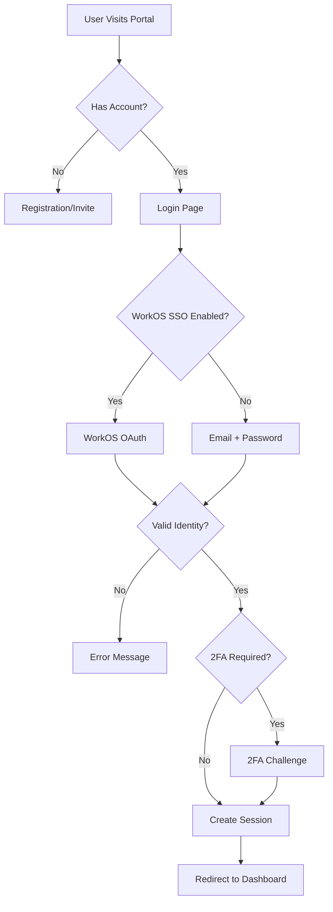
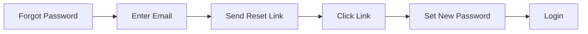
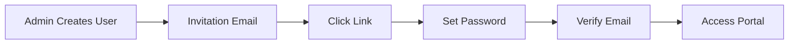
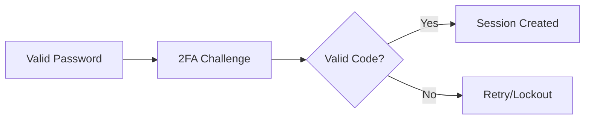
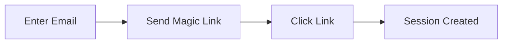

> Verify user identity and manage secure access to the portal

---

## Quick Links

| Resource | Link |
|----------|------|
| **Portal** | [Login Page](https://tc-portal.test/login) |
| **Nova Admin** | [Users](https://tc-portal.test/nova/resources/users) |
| **WorkOS Dashboard** | [WorkOS Admin](https://dashboard.workos.com) (pending) |

---

## TL;DR

- **What**: Verify user identity before granting portal access
- **Who**: All portal users (staff, coordinators, consumers, suppliers)
- **Key flow**: Email/Password or SSO via WorkOS -> Session Created -> Access Granted
- **Watch out**: Authentication (who you are) is distinct from Authorization (what you can do) - see [Teams & Roles](/features/domains/teams-roles)

---

## Key Concepts

| Term | What it means |
|------|---------------|
| **Authentication** | Verifying a user's identity (proving who you are) |
| **Authorization** | Determining what an authenticated user can access (separate domain) |
| **SSO** | Single Sign-On - login once to access multiple systems |
| **2FA** | Two-Factor Authentication - additional verification step |
| **Session** | Server-side record of an authenticated user's login state |
| **Magic Link** | Passwordless email login link (used in HCA onboarding) |
| **WorkOS** | External identity provider for enterprise SSO |

---

## How It Works

### Main Flow: Standard Login



### User Types

| User Type | Primary Auth Method | Notes |
|-----------|---------------------|-------|
| **Staff** | Email/Password, WorkOS SSO (planned) | Internal Trilogy employees |
| **Care Coordinators** | Email/Password | External coordinators |
| **Consumers/Recipients** | Magic Link, Password | Package recipients and representatives |
| **Suppliers** | Email/Password | External service providers |

### Other Flows

<details>
<summary><strong>Password Reset</strong> - forgot password recovery</summary>

User requests password reset via email, receives secure token link.



</details>

<details>
<summary><strong>Account Invitation</strong> - new user setup</summary>

Admin creates user, system sends invitation email with set-password link.



</details>

<details>
<summary><strong>Two-Factor Authentication</strong> - additional security</summary>

After password validation, user must enter code from authenticator app.



</details>

<details>
<summary><strong>Magic Link Login</strong> - passwordless access</summary>

Used primarily for HCA onboarding and recipient access.



</details>

---

## Business Rules

| Rule | Why |
|------|-----|
| **Email verification required** | Ensures valid contact method for notifications |
| **Rate limiting on login** | 5 attempts per 5 minutes in production to prevent brute force |
| **Session timeout** | Inactive sessions expire for security |
| **2FA remember device** | 14-day remember period to reduce friction |
| **One active session per device** | Prevents session hijacking |

---

## Feature Flags

| Flag | What it controls | Default |
|------|------------------|---------|
| `workos-auth` | WorkOS SSO integration on login page | Off |

---

## Common Issues

<details>
<summary><strong>Issue: User cannot login after password reset</strong></summary>

**Symptom**: User receives "Invalid credentials" after setting new password

**Cause**: Browser caching old credentials or email not verified

**Fix**: Clear browser cache, ensure email is verified in Nova

</details>

<details>
<summary><strong>Issue: 2FA not prompting</strong></summary>

**Symptom**: User set up 2FA but not being challenged

**Cause**: 2FA feature disabled in Fortify config or device remembered

**Fix**: Check `config/fortify.php` features array, or wait for 14-day remember period to expire

</details>

<details>
<summary><strong>Issue: "Too many login attempts"</strong></summary>

**Symptom**: User locked out of login

**Cause**: Rate limiter triggered (5 attempts in 5 minutes)

**Fix**: Wait for lockout period or clear rate limiter cache

</details>

---

## Who Uses This

| Role | What they do |
|------|--------------|
| **All Users** | Log in to access the portal |
| **Admins** | Manage user accounts, reset passwords, enable 2FA |
| **Recipients** | Access via magic links or set passwords |
| **System** | Validates credentials, manages sessions |

---

## Technical Reference

<details>
<summary><strong>Models & Database</strong></summary>

### Models

```
domain/User/Models/
├── User.php                    # Main user model with TwoFactorAuthenticatable

app/Actions/
├── AttemptToAuthenticate.php   # Custom authentication logic

app/Actions/Fortify/
├── CreateNewUser.php           # User registration
├── ResetUserPassword.php       # Password reset
├── UpdateUserPassword.php      # Password update
└── RedirectIfTwoFactorAuthenticatable.php  # 2FA redirect
```

### Tables

| Table | Purpose |
|-------|---------|
| `users` | User accounts with auth fields |
| `password_reset_tokens` | Password reset tokens |
| `sessions` | Active user sessions |

### Key User Columns

| Column | Purpose |
|--------|---------|
| `email` | Login identifier |
| `password` | Hashed password |
| `email_verified_at` | Verification timestamp |
| `two_factor_secret` | 2FA TOTP secret |
| `two_factor_confirmed_at` | 2FA setup confirmation |
| `last_logged_in_at` | Last login tracking |
| `has_login` | Whether user can log in |

</details>

<details>
<summary><strong>Controllers & Middleware</strong></summary>

```
app/Http/Controllers/Auth/
├── PasswordController.php      # Password reset/set
├── TwoFactorController.php     # 2FA setup and challenge
└── VerifyEmailController.php   # Email verification

app/Http/Middleware/
├── CheckHasLogin.php           # Verify user can login
└── Authenticate.php            # Laravel auth middleware
```

</details>

<details>
<summary><strong>Frontend Pages</strong></summary>

```
resources/js/Pages/Auth/
├── Login.vue                   # Main login page
├── Register.vue                # User registration
├── ForgotPassword.vue          # Password reset request
├── ResetPassword.vue           # Password reset form
├── SetPassword.vue             # Initial password set
├── VerifyEmail.vue             # Email verification
├── TwoFactorChallenge.vue      # 2FA code entry
├── TwoFactorSetup.vue          # 2FA configuration
├── ConfirmPassword.vue         # Password confirmation
└── TermsAndConditions.vue      # Terms acceptance
```

</details>

<details>
<summary><strong>Configuration</strong></summary>

Key config files:
- `config/fortify.php` - Authentication features and settings
- `config/auth.php` - Guards and providers
- `config/session.php` - Session configuration
- `config/workos.php` - WorkOS SSO settings

</details>

<details>
<summary><strong>Routes</strong></summary>

| Route | Purpose |
|-------|---------|
| `GET /login` | Login page |
| `POST /login` | Process login |
| `POST /logout` | End session |
| `GET /forgot-password` | Password reset form |
| `POST /forgot-password` | Send reset email |
| `GET /set-password/{token}` | Set password page |
| `GET /two-factor-login` | 2FA challenge |
| `GET /email/verify/{id}/{hash}` | Verify email |
| `GET /authenticate` | WorkOS callback |

</details>

---

## Testing

### Factories & Seeders

```php
// Create a user with login capability
User::factory()->create(['has_login' => User::HAS_LOGIN]);

// Create a verified user
User::factory()->verified()->create();

// User with 2FA enabled
User::factory()->withTwoFactor()->create();
```

### Key Test Scenarios

- [ ] Valid credentials grant access
- [ ] Invalid credentials show error
- [ ] Rate limiting blocks after 5 attempts
- [ ] Password reset email sends
- [ ] Reset token expires after use
- [ ] 2FA challenge appears when enabled
- [ ] Session expires after inactivity
- [ ] Email verification required before access

---

## Related

### Domains

- [Teams & Roles](/features/domains/teams-roles) - authorization after authentication
- [Onboarding](/features/domains/onboarding) - magic link account creation
- [Coordinator Portal](/features/domains/coordinator-portal) - coordinator-specific access

### Integrations

- [WorkOS](/features/integrations/workos) - enterprise SSO provider (planned)

---

## Open Questions

| Question | Context |
|----------|---------|
| **WorkOS pipeline TODO?** | `config/fortify.php` has TODO: "add WorkOS pipeline that runs on login" - what's the plan? |
| **2FA disabled in config?** | `twoFactorAuthentication` feature is disabled in fortify.php but code handles 2FA - clarify status |

---

## Status

**Maturity**: Production (Fortify-based) with WorkOS integration partially implemented
**Pod**: Platform
**Roadmap**: Complete WorkOS pipeline, consolidate user types

---

## Planned Changes

### WorkOS Migration

The authentication system is transitioning from Fortify-based email/password to WorkOS for:

- **Enterprise SSO**: Microsoft Entra, Google Workspace, Okta integration
- **Directory Sync**: Automatic user provisioning from identity providers
- **Unified Identity**: Single identity across Trilogy systems
- **Magic Links**: Native passwordless authentication

### Role Consolidation

Currently 37 overlapping internal roles, consolidating to:
- **6 core roles** (Admin, Care Partner, Coordinator, Finance, Supplier, Recipient)
- **15-20 hierarchical teams** for organizational structure

See [Teams & Roles](/features/domains/teams-roles) for authorization details.
