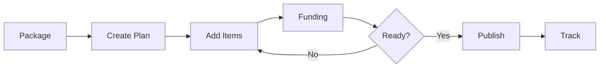

> Budget planning, service plans, and funding allocation

---

## Quick Links

| Resource | Link |
|----------|------|
| **Portal** | [Package Budget](https://tc-portal.test/staff/packages/{id}/budget) |
| **Nova Admin** | [Service Plan Items](https://tc-portal.test/nova/resources/service-plan-items) |

---

## TL;DR

- **What**: Allocate recipient funding across services, track spend against budget
- **Who**: Care Partners, Finance Team, Bill Processors
- **Key flow**: Create Budget Plan → Add Service Items → Publish → Track Utilisation
- **Watch out**: Draft vs Published budgets - only published budgets are active

---

## Key Concepts

| Term | What it means |
|------|---------------|
| **Budget Plan** | Allocation of funds across service categories for a period |
| **Service Plan Item** | Specific service with supplier, rate, frequency, and dates |
| **Funding Stream** | Source of funds (ON, RC, EL, CU, HC, VC) |
| **Budget Version** | Draft vs Published state of a budget |
| **Utilisation** | Actual spend vs planned allocation percentage |

---

## How It Works

### Main Flow: Budget Creation



---

## Funding Streams

| Code | Name | Description |
|------|------|-------------|
| **ON** | Ongoing | Primary quarterly funding |
| **RC** | Restorative Care | Short-term restorative services |
| **EL** | End of Life | Palliative and end-of-life care |
| **CU** | Commonwealth Unspent | Rolled over unspent funds |
| **HC** | Home Care Account | Accumulated surplus |
| **VC** | Voluntary Contribution | Client top-ups |

---

## Business Rules

| Rule | Why |
|------|-----|
| **Only published budgets active** | Draft budgets don't affect bill processing |
| **Funding stream matching** | Bills must match service plan item's funding stream |
| **Budget period alignment** | Service items must fall within budget period dates |

---

## Who Uses This

| Role | What they do |
|------|--------------|
| **Care Partners** | Create and manage budgets, add service items |
| **Finance Team** | Monitor utilisation, funding allocation |
| **Bill Processors** | Match bills to service plan items |

---

## Open Questions

| Question | Context |
|----------|---------|
| **Acceptable variance thresholds?** | Patrick Hawker tasked to define; not yet resolved |
| **Services Australia "wraparound" definition?** | Needed for API integration |
| **wraparoundDescriptionCode values?** | Reference data values unknown |
| **VC display in funding summary?** | Erin H to clarify; outcome not documented |
| **Care management fee in funding summary?** | Beth P to provide feedback; status unclear |

---

## Technical Reference

<details>
<summary><strong>Models & Database</strong></summary>

### Models

```
domain/Budget/Models/
├── BudgetPlan.php                      # Main budget plan
├── BudgetPlanItem.php                  # Service items (NOT ServicePlanItem)
├── BudgetPlanItemQuarter.php           # Quarterly breakdown
├── BudgetPlanItemRateCard.php          # Rate card data
├── BudgetPlanFundingStream.php         # Draft funding streams
├── BudgetPlanFundingAllocation.php     # Funding allocations
├── BudgetPlanFundingStreamArchive.php  # Historical snapshots
├── UnplannedService.php                # Services outside budget
└── ServicePlanBulkSubmission.php       # Bulk submission tracking

domain/Funding/Models/
├── Funding.php                         # Services Australia allocation
├── FundingStream.php                   # Funding stream reference
└── PackageUtilisation.php              # Utilisation tracking
```

### Tables

| Table | Purpose |
|-------|---------|
| `budget_plans` | Budget plan records |
| `budget_plan_items` | Individual service allocations (NOT service_plan_items) |
| `budget_plan_item_quarters` | Quarterly breakdown |
| `fundings` | Services Australia funding |
| `funding_streams` | Available funding sources |

### Event Sourcing

Budget plans use event sourcing:
- **Aggregate**: `BudgetPlanAggregateRoot`
- **Events**: `BudgetPlanCreated`, `BudgetPlanDraftedEvent`, `FundingAllocatedEvent`
- **Projectors**: `BudgetPlanProjector`, `BudgetPlanItemQuarterProjector`

</details>

---

## Related

### Domains

- [Bill Processing](/features/domains/bill-processing) — bills matched to service items
- [Utilisation](/features/domains/utilisation) — spend tracking against budget
- [Claims](/features/domains/claims) — funding received from Services Australia

---

## Current Challenges

From Fireflies meetings (Jun 2025 - Jan 2026):

| Challenge | Impact |
|-----------|--------|
| **VC complexity** | VC funding streams can inflate projected funding amounts |
| **Unconfirmed funds** | Causing payment holds when VC not yet collected |
| **Fee loading miscalculations** | Incorrect percentages on budgets |
| **Utilization targets** | Current 70%, ambitious goal 90% |
| **First quarter delays** | Typically 30% utilization due to time-to-service |
| **Accrued funds** | 72% of clients with 10k+ unspent funds >1 year |

---

## Budget Reloaded Initiative

Major redesign in progress:

| Feature | Description |
|---------|-------------|
| **Complete UI redesign** | New budget builder interface |
| **Versioned budgets** | Complex funding stream version control |
| **Draft mode** | Front-end budget manipulation before publish |
| **Quarterly balancing** | Funding stream validation per quarter |
| **Rate card functionality** | Replicating Aaron's Excel sheets in-app |
| **Inline creation** | Real-time calculations during entry |
| **AI budgets** | Future consideration for AI-generated budgets |

### User Research Findings

From four user interviews on new budget UI:
- Generally positive ratings
- Clearer labeling needed
- Request for simpler, mobile-friendly client view with card designs

---

## Fee Loading Rules

| Service Type | Coordination Fee | Notes |
|--------------|------------------|-------|
| **Standard services** | 1-30% (package level) | Default 10% Trilogy loading |
| **Assistive tech** | Special handling | Coordination fee issues identified |
| **Home modifications** | Special handling | Fee calculation bugs reported |
| **Restorative care** | 0% | Zero coordination loading on RC funding |

---

## VC Funding Integration

| Issue | Solution |
|-------|----------|
| **Unconfirmed funds** | Manual confirmation feature for finance approval |
| **AR invoice linkage** | Need to link VC transactions to AR invoices |
| **Debit/credit anomalies** | Reconciliation improvements required |

---

## Utilisation Targets

| Quarter | Expected | Challenge |
|---------|----------|-----------|
| **Q1** | 30% | Time-to-service delays |
| **Q2-Q4** | 70% | Current target |
| **Optimal** | 90% | Ambitious goal |

---

## Wraparound Services

Workflow for identifying, flagging, and linking wraparound services (installation, delivery, setup, training) to their related equipment items in bill processing.

### Why Wraparound Matters

- Reduces cognitive load for Philippines bill processing team
- Ensures correct classification to Services Australia API (`itemOrWraparound` field)
- Supports cross-invoice scenarios where wraparound arrives on separate invoice from equipment
- Improves financial tracking of total equipment cost (equipment + all wraparound services)

### Problem Scenarios

**Same Invoice (Common)**:
```
Invoice #INV-123:
  Line 1: Walker ($800) → ITEM type
  Line 2: Walker Installation ($100) → WRAPAROUND type, linked to Line 1
```

**Different Invoices (Edge Case)**:
```
Invoice #INV-123 (Oct 15): Walker ($800) → ITEM
Invoice #INV-456 (Oct 22): Walker Delivery ($150) → WRAPAROUND, links back to INV-123
```

### Solution Approach

**New Fields on BillItem Model**:
- `is_wraparound: boolean` - Is this item a wraparound service?
- `wraparound_type: enum` - Installation, Delivery, Setup, Training, Other
- `related_bill_item_id: foreign_key` - Links to the equipment bill item
- `wrapped_equipment_description: text` - What equipment does this wrap?

**Linking Mechanism**:
1. User selects "Flag as Wraparound" on bill item
2. System shows recent equipment items from same package (last 90 days)
3. User selects which equipment item this wraps
4. Wraparound automatically inherits funding allocation from equipment

### Services Australia API Integration

| Field | Value |
|-------|-------|
| `itemOrWraparound` | "ITEM" or "WRAPAROUND" |
| `wraparoundDescriptionCode` | From reference data |
| `wraparoundDescriptionText` | Free text description |

### Edge Cases

| Scenario | Solution |
|----------|----------|
| Wraparound arrives before equipment | Allow "pending link" state, resolve when equipment invoice arrives |
| Multiple wraparounds for one equipment | Support 1:many relationship |
| Different supplier invoice | Cross-invoice linking handles this |

### Open Questions

1. What is the official Services Australia definition of a "wraparound service"?
2. What are the specific `wraparoundDescriptionCode` reference data values?
3. Should there be budget allocation separate from equipment?

---

## Status

**Maturity**: Production
**Pod**: Duck, Duck Go
**Owner**: Matt A

---

## Source Meetings

| Date | Meeting | Key Topics |
|------|---------|------------|
| Jan 29, 2026 | Planning Session | Budget Reloaded iterations, collections development |
| Jan 20, 2026 | VCF Meeting | VC funding verification, AR invoice linkage |
| Jun 9, 2025 | Budget V2 Kick Off | Versioned budgets, quarterly balancing |
| Multiple | User Interviews | UI feedback, mobile-friendly requests |
