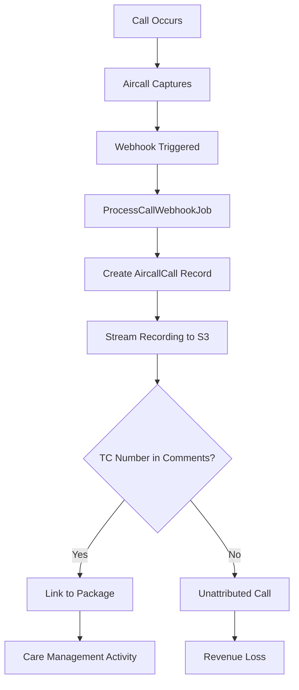
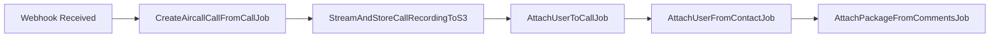
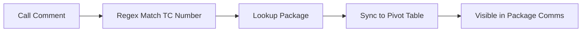
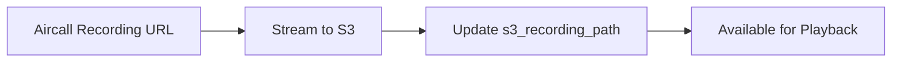

> Call bridge UI and automated activity capture from phone communications

---

## Quick Links

| Resource | Link |
|----------|------|
| **Portal** | [Package Communications](https://tc-portal.test/staff/packages/{id}/comms) |
| **Nova Admin** | [Aircall Calls](https://tc-portal.test/nova/resources/aircall-calls) |

---

## TL;DR

- **What**: Track phone calls via Aircall integration, capture call time for care management activities
- **Who**: Care Coordinators, Care Partners (250+ coordinators making daily calls)
- **Key flow**: Outbound/Inbound Call -> Aircall Captures -> Webhook Syncs -> Portal Links to Package
- **Watch out**: 66% of calls currently untagged - revenue loss from unattributed care management time

---

## Key Concepts

| Term | What it means |
|------|---------------|
| **Call Bridge** | UI connecting phone calls to work management and package context |
| **Aircall** | Third-party phone system providing call tracking and recording |
| **Call Tagging** | Linking calls to specific packages via TC customer number in comments |
| **Call Recording** | Audio stored in S3 for compliance and training purposes |
| **Activity Capture** | Automatic logging of call duration as care management time |

---

## How It Works

### Main Flow: Call to Activity



### Webhook Processing Chain



### Other Flows

<details>
<summary><strong>Package Linking</strong> - matching calls to recipients</summary>

Calls are linked to packages by scanning comments for TC customer numbers (format: `XX-123456`).



</details>

<details>
<summary><strong>Recording Storage</strong> - compliance and playback</summary>

Call recordings are streamed from Aircall and stored in S3 for compliance, training, and dispute resolution.



</details>

---

## Business Rules

| Rule | Why |
|------|-----|
| **Calls must have TC number to attribute** | Links call to package for activity tracking |
| **Recordings stored 7 years** | Compliance requirement for aged care |
| **Missed calls tracked separately** | Follow-up required, visible in separate tab |
| **Call duration logged** | Contributes to 15 min/month care management minimum |

---

## Current Challenges

| Challenge | Impact | Status |
|-----------|--------|--------|
| **66% untagged calls** | Revenue loss - care management time not attributed | Active |
| **Manual tagging** | Coordinators must add TC number to Aircall comments | UX improvement needed |
| **No auto-matching** | System cannot auto-link based on phone number | Future enhancement |
| **Call bridge UI** | Enhanced UI needed for work management context | In development |

---

## Common Issues

<details>
<summary><strong>Issue: Call not appearing on package</strong></summary>

**Symptom**: Made a call but it doesn't show in package communications

**Cause**: TC customer number not added to Aircall comments, or incorrect format

**Fix**: Add comment to call in Aircall with format `XX-123456` (e.g., `QL-001234`)

</details>

<details>
<summary><strong>Issue: Recording not available</strong></summary>

**Symptom**: Call shows but recording cannot be played

**Cause**: S3 streaming job may have failed, or recording not yet processed

**Fix**: Check Horizon for failed `StreamAndStoreCallRecordingToS3` jobs. Recording may still be processing if call just ended.

</details>

---

## Who Uses This

| Role | What they do |
|------|--------------|
| **Care Coordinators** | Make/receive calls, tag with TC numbers, review call history |
| **Care Partners** | Monitor call activity, ensure compliance |
| **Team Leaders** | Review call metrics, identify training needs |
| **Compliance Team** | Access recordings for audits and disputes |

---

## Technical Reference

<details>
<summary><strong>Models & Database</strong></summary>

### Models

```
app-modules/aircall/src/Models/
├── AircallCall.php            # Call record with timing, status, recording
└── AircallWebhook.php         # Webhook event storage

app-modules/aircall/src/Http/Data/
├── Call.php                   # Call DTO from Aircall API
├── Contact.php                # Contact information
├── Comment.php                # Call comments (for TC number matching)
└── Enums/
    ├── CallDirection.php      # inbound/outbound
    ├── CallStatus.php         # initial/answered/done
    └── MissedCallReason.php   # Why call was missed
```

### Tables

| Table | Purpose |
|-------|---------|
| `aircall_calls` | Call records (id, duration, status, direction, recording) |
| `aircall_webhooks` | Webhook event log |
| `aircall_aircallables` | Polymorphic pivot (calls to users/packages) |

### Key Fields

| Field | Type | Purpose |
|-------|------|---------|
| `direction` | enum | inbound/outbound |
| `status` | enum | initial/answered/done |
| `duration` | int | Call length in seconds |
| `recording` | string | Aircall recording URL |
| `s3_recording_path` | string | Local S3 storage path |
| `missed_call_reason` | enum | Why call was missed |

</details>

<details>
<summary><strong>Actions & Jobs</strong></summary>

```
app/Jobs/Aircall/Webhooks/
├── ProcessCallWebhookJob.php              # Main webhook dispatcher
└── Call/
    ├── CreateAircallCallFromCallJob.php   # Create/update call record
    ├── StreamAndStoreCallRecordingToS3.php # Store recording
    ├── AttachUserToCallJob.php            # Link Aircall user
    ├── AttachUserFromContactJob.php       # Link contact as user
    └── AttachPackageFromCommentsJob.php   # TC number matching
```

</details>

<details>
<summary><strong>Frontend Pages</strong></summary>

```
resources/js/Pages/Packages/tabs/
└── PackageComms.vue           # Call list with All/Missed tabs

resources/js/Components/Package/
└── AircallCallsTable.vue      # Call data table component
```

</details>

<details>
<summary><strong>API & Webhooks</strong></summary>

| Endpoint | Purpose |
|----------|---------|
| `POST /api/aircall/webhooks` | Receive Aircall webhook events |

### Webhook Events

| Event | Trigger |
|-------|---------|
| `call.created` | Call initiated |
| `call.answered` | Call picked up |
| `call.ended` | Call completed |
| `call.commented` | Comment added (triggers re-linking) |

</details>

<details>
<summary><strong>Configuration</strong></summary>

```php
// config/aircall.php
return [
    'api_id' => env('AIRCALL_API_ID'),
    'api_token' => env('AIRCALL_API_TOKEN'),
    'webhook_secret' => env('AIRCALL_WEBHOOK_SECRET'),
];
```

</details>

---

## Testing

### Factories & Seeders

```php
// Create an Aircall call
AircallCall::factory()->create([
    'direction' => CallDirection::OUTBOUND,
    'status' => CallStatus::DONE,
    'duration' => 180, // 3 minutes
]);

// Link to package
$package->calls()->attach($aircallCall->id);
```

### Key Test Scenarios

- [ ] Webhook creates call record on `call.ended`
- [ ] TC number in comments links call to package
- [ ] Recording streams to S3 successfully
- [ ] Missed calls appear in separate tab
- [ ] Call duration contributes to care management activity

---

## Related

### Domains

- [Care Management Activities](/features/domains/care-management-activities) - call time contributes to activity tracking
- [Notes](/features/domains/notes) - call summaries documented as notes
- [Coordinator Portal](/features/domains/coordinator-portal) - call bridge UI integration
- [Databricks](/features/integrations/databricks) - call metrics dashboards

### Integration Points

| System | Data Flow |
|--------|-----------|
| **Aircall** | Call events via webhooks |
| **S3** | Recording storage |
| **Databricks** | Call metrics and analytics |

---

## Roadmap

| Phase | Feature | Status |
|-------|---------|--------|
| 1 | Aircall webhook integration | Complete |
| 2 | Package communications tab | Complete |
| 3 | Call bridge UI enhancements | In Development |
| 4 | Auto-matching by phone number | Planned |
| 5 | AI transcription and sentiment | Planned |
| 6 | Automatic activity capture | Planned |

---

## Open Questions

| Question | Context |
|----------|---------|
| **None identified** | All documented components exist and match implementation |

---

## Status

**Maturity**: In Development (documentation accurate)
**Pod**: Duck, Duck Go (Care Coordination)
**Owner**: Beth P

---

## Source Context

| Source | Key Topics |
|--------|------------|
| BRP January 2026 | Telephony call bridge UI, work management integration |
| Fireflies Research | 66% untagged calls, revenue loss, AI features planned |
| Codebase Analysis | Aircall module, webhook processing, package linking |
