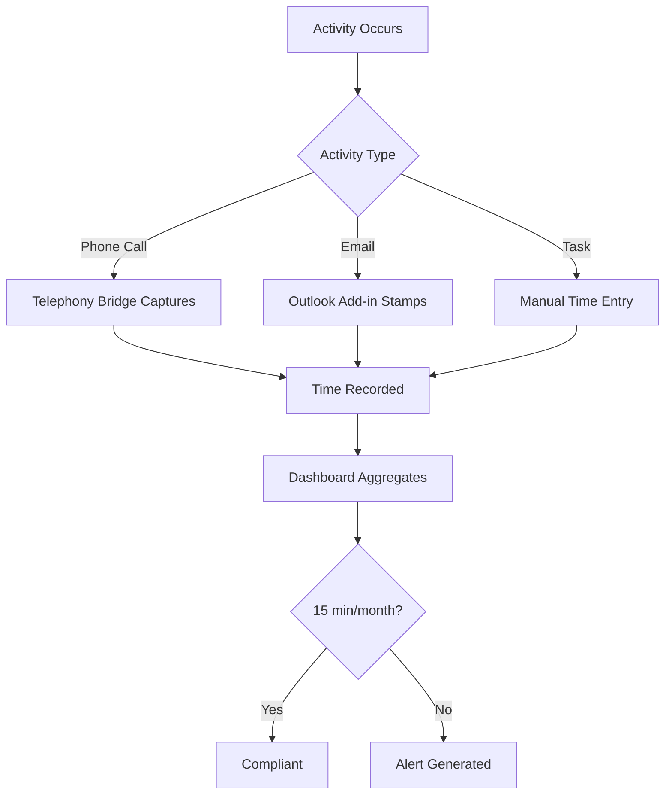
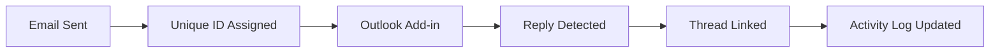
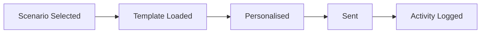
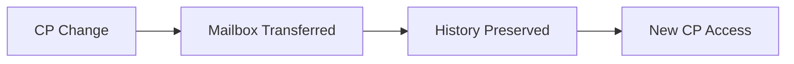

> Regulatory-compliant activity tracking for direct and indirect care

---

## Quick Links

| Resource | Link |
|----------|------|
| **Portal** | [Care Management Dashboard](https://tc-portal.test/staff/care-management) |
| **Figma** | TBD - designs in progress |

---

## TL;DR

- **What**: Track direct and indirect care activities per client to meet regulatory minimums
- **Who**: Care Coordinators, Care Partners (350+ staff, 250+ coordinators)
- **Key flow**: Activity Occurs (call/email/task) → Time Captured → Aggregated → Compliance Checked
- **Watch out**: Minimum 15 minutes direct care per client per month required for compliance

---

## Key Concepts

| Term | What it means |
|------|---------------|
| **Direct Care Activity** | Time spent directly with or for a client (calls, emails, care coordination) |
| **Indirect Care Activity** | Administrative work supporting care (documentation, planning) |
| **Care Management Fee** | 10% pooled fee covering oversight (not coordination activities) |
| **Email Thread Tracking** | Unique identifiers linking email chains to client activities |
| **Activity Dashboard** | Aggregated view of all care partner tasks and communications |

---

## How It Works

### Main Flow: Activity Capture



### Email Thread Tracking



### Other Flows

<details>
<summary><strong>Email Template System</strong> - standardised communications</summary>

Email templates provide consistent messaging for common care scenarios. Currently 4 templates, expanding to 50.



</details>

<details>
<summary><strong>Shared Mailbox Handover</strong> - care partner transitions</summary>

When care partners change, shared mailboxes ensure continuity of client communications.



</details>

---

## Business Rules

| Rule | Why |
|------|-----|
| **15 min minimum direct care/month** | Regulatory requirement for home care packages |
| **2.5 hours average monthly** | Expected care management (6 hours per quarter) |
| **Unique email identifiers required** | Thread tracking and reply classification |
| **Activity must link to client** | Compliance reporting per package |
| **10% fee is pooled** | Covers oversight, not individual coordination |

---

## Compliance Requirements

| Metric | Target | Measurement |
|--------|--------|-------------|
| **Monthly Direct Care** | 15 minutes minimum | Per client |
| **Quarterly Average** | 6 hours | Per client |
| **Monthly Average** | 2.5 hours | Per client |

---

## Feature Scope

### Phase 1 (Target: Mid-Late February 2026)

| Feature | Description |
|---------|-------------|
| **Activity Time Capture** | Direct and indirect care time logging |
| **Email Templates** | Expand from 4 to 50 templates |
| **Thread Tracking** | Email chain linking via unique IDs |
| **Outlook Add-in** | Message stamping integration |
| **Activity Dashboard** | Aggregated view of all care partner activities |

### Future Phases

| Feature | Description |
|---------|-------------|
| **Reply Classification** | Automated categorisation of email responses |
| **Shared Mailboxes** | Transition support when care partners change |
| **Telephony Integration** | Call bridge UI for time capture |

---

## Common Issues

<details>
<summary><strong>Issue: Reply classification challenges</strong></summary>

**Symptom**: Incoming emails not correctly linked to original thread

**Cause**: Missing or modified unique identifier in reply

**Fix**: Manual linking required; future automation planned

</details>

<details>
<summary><strong>Issue: Activity not appearing in compliance report</strong></summary>

**Symptom**: Logged activity missing from client's monthly total

**Cause**: Activity may not be linked to correct package

**Fix**: Verify package association when logging activity

</details>

---

## Who Uses This

| Role | What they do |
|------|--------------|
| **Care Coordinators** | Log daily activities, use email templates, track time |
| **Care Partners** | Oversee activity compliance, manage caseloads |
| **Team Leaders** | Monitor team compliance metrics |
| **Compliance Team** | Review regulatory adherence reports |

---

## Technical Reference

<details>
<summary><strong>Models & Database</strong></summary>

### Models

```
domain/CareManagement/Models/
├── CareManagementActivity.php    # Activity records
├── ActivityType.php              # Direct/indirect classification
└── EmailThread.php               # Thread tracking

app/Models/
└── EmailTemplate.php             # Template definitions
```

### Tables (Planned)

| Table | Purpose |
|-------|---------|
| `care_management_activities` | Activity time records |
| `activity_types` | Activity classification |
| `email_threads` | Thread tracking with unique IDs |
| `email_templates` | Templated communications |

</details>

<details>
<summary><strong>Integrations</strong></summary>

| System | Purpose |
|--------|---------|
| **Outlook Add-in** | Email stamping and thread tracking |
| **Telephony Bridge** | Call time capture |
| **Notes System** | Activity documentation |

</details>

---

## Open Questions

| Question | Context |
|----------|---------|
| **When will domain/CareManagement/ be created?** | Documentation complete but no code exists - target mid-late Feb 2026 |
| **Will this use Spatie ActivityLog?** | `CreateEmailActivityLog.php` and `EmailActivityLogListener.php` exist using Spatie ActivityLog - will CMA build on this? |
| **Email template storage?** | No EmailTemplate model exists - where will 50 templates be stored? |

---

## Technical Reference

<details>
<summary><strong>Implementation Status</strong></summary>

**IMPORTANT**: This domain is **fully documented but NOT YET IMPLEMENTED**.

### What Does NOT Exist

| Claimed | Status |
|---------|--------|
| `domain/CareManagement/` folder | NOT CREATED |
| `CareManagementActivity.php` model | NOT CREATED |
| `ActivityType.php` model | NOT CREATED |
| `EmailThread.php` model | NOT CREATED |
| `EmailTemplate.php` model | NOT CREATED |
| `care_management_activities` table | NOT CREATED |
| `activity_types` table | NOT CREATED |
| `email_threads` table | NOT CREATED |
| `email_templates` table | NOT CREATED |

### What DOES Exist (Related)

```
app/Actions/
├── CreateEmailActivityLog.php      # Logs emails via Spatie ActivityLog

app/Listeners/
└── EmailActivityLogListener.php    # Listens to email notifications

app/Http/Resources/
└── ActivityResource.php            # Transforms activity logs for API
```

These use Spatie's `laravel-activitylog` package for general model auditing - NOT specific CMA tracking.

### Timeline

- **Target Launch**: Mid-Late February 2026
- **Owner**: Matt A
- **Pod**: Duck, Duck Go (Care Coordination)

</details>

---

## Related

### Domains

- [Coordinator Portal](/features/domains/coordinator-portal) - dashboard integration
- [Notes](/features/domains/notes) - activity documentation
- [Emails](/features/domains/emails) - email templates and notifications
- [Care Plan](/features/domains/care-plan) - care activities inform care planning
- [Task Management](/features/domains/task-management) - task-based activity tracking

### Context

- 10% care management fee (pooled, covers oversight)
- Separate from 10% platform loading fee
- Zero coordination loading on restorative care funding

---

## Status

**Maturity**: In Development
**Pod**: Duck, Duck Go (Care Coordination)
**Owner**: Matt A
**Target Launch**: Mid-Late February 2026

---

## Source Context

| Source | Key Topics |
|--------|------------|
| BRP January 2026 | 350+ staff, 250+ coordinators, unified care management |
| Fireflies Research | Regulatory requirements, email templates, compliance metrics |
| Stakeholder Discussions | Activity capture, Outlook integration, dashboard needs |
