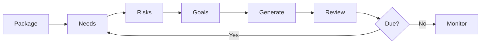

> Needs, risks, goals, and assessments

---

## Quick Links

| Resource   | Link                                                                      |
| ---------- | ------------------------------------------------------------------------- |
| **Portal** | [Package Care Plan](https://tc-portal.test/staff/packages/{id}/care-plan) |

---

## TL;DR

- **What**: Capture clinical care needs, identify risks, set goals, and generate care plan documents
- **Who**: Care Partners, Clinical Team, Assessment Team
- **Key flow**: Needs Assessment → Risk Identification → Goal Setting → Care Plan Generated
- **Watch out**: Care plans must be reviewed periodically - check review dates

---

## Key Concepts

| Term | What it means |
|------|---------------|
| **Need** | Identified care requirement for the recipient |
| **Risk** | Potential hazard or concern (falls, medication, cognitive, etc.) |
| **Goal** | Desired outcome for the recipient's care |
| **Assessment** | Formal evaluation (ACAT, clinical, etc.) |
| **Clinical Pathway / Case** | Prescribed care pathway triggered by an incident or risk — distinct from incident response, focuses on ongoing management |
| **Maslow Framework** | Proposed needs assessment framework based on Maslow's hierarchy adapted for home care |
| **Risk Score** | Quantified aggregation of multiple risk factors (falls, dementia, medications, mobility) replacing subjective high/medium/low ratings |

---

## How It Works

### Main Flow: Care Plan Creation



---

## Business Rules

| Rule | Why |
|------|-----|
| **Review period required** | Care plans must have a scheduled review date for compliance |
| **Risk categories standardised** | Consistent risk classification across all packages |

---

## Common Issues

<details>
<summary><strong>Issue: Care plan not generating</strong></summary>

**Symptom**: Care plan document won't generate

**Cause**: Missing required fields (needs, goals, or risks)

**Fix**: Ensure all required sections are completed before generating

</details>

---

## Who Uses This

| Role | What they do |
|------|--------------|
| **Care Partners** | Create and manage care plans, set goals |
| **Clinical Team** | Risk assessment and clinical oversight |
| **Assessment Team** | Initial needs assessment |

---

## Open Questions

| Question                               | Context                                                                                                        |
| -------------------------------------- | -------------------------------------------------------------------------------------------------------------- |
| **Package Goal model location?**       | Documentation references PackageGoal.php but no separate model found - goals appear to be text fields on needs |
| **AI extraction accuracy thresholds?** | ParseAssessmentDocument pipeline extracts needs/risks from ACAT documents but quality thresholds undefined     |
| **Care plan PDF generation logic?**    | Document generation action location and template structure unclear                                             |

---

## Technical Reference

<details>
<summary><strong>Models & Database</strong></summary>

### Models

```
domain/Package/Models/
├── PackageNeed.php              # Care needs with optional goal text field
├── PackageRisk.php              # Identified risks linked to categories

app/Nova/
├── Risk.php                     # Nova resource for risk admin
├── RiskCategory.php             # Risk category resource
└── Riskable.php                 # Polymorphic risk trait

app/Models/
└── RiskCategory.php             # Risk category reference data
```

**Note**: Goals are stored as a text field on PackageNeed, not as a separate PackageGoal model.

### Tables

| Table | Purpose |
|-------|---------|
| `package_needs` | Recipient care needs (includes goal text field) |
| `package_risks` | Identified risks |
| `risk_categories` | Standardised risk types |

</details>

<details>
<summary><strong>AI Extraction Pipeline</strong></summary>

Care plans can be auto-populated from ACAT assessment documents:

```
domain/Package/Actions/
├── ParseAssessmentDocument.php           # Main document parser
├── ExtractAndCreatePackageNeeds.php      # AI extraction for needs
└── ExtractAndCreatePackageRisks.php      # AI extraction for risks
```

**Flow**: ACAT PDF uploaded → ParseAssessmentDocument → AI extraction → Needs/Risks created

</details>

<details>
<summary><strong>Actions & Services</strong></summary>

```
domain/Package/Actions/
├── CreatePackageNeedAction.php
├── CreatePackageRiskAction.php
└── GenerateCarePlanAction.php            # Care plan PDF generation
```

</details>

---

## Testing

### Factories & Seeders

```php
// Create package with care plan data
$package = Package::factory()
    ->hasNeeds(3)  // Includes goal text on each need
    ->hasRisks(2)
    ->create();
```

### Key Test Scenarios

- [ ] Needs can be added to package
- [ ] Risks are categorised correctly
- [ ] Care plan document generates with all sections
- [ ] Review date scheduling works

---

## Future Direction

Based on Feb 2026 clinical product requirements discussions with Marianne (Clinical Governance):

### Needs Module Redesign (Maslow Framework)
- Restructure needs around Maslow's hierarchy of needs adapted for home care
- Physiological needs (water, food, shelter) → safety/security → belonging → esteem → self-actualisation
- Each need describes: what the need is, how it will be met, and funding source (HCP, informal support, PHN, PBS, private health insurance)
- Needs linked to budgets and risks — surfacing gaps and resource allocation
- Goal: reach person's full potential within finite resources

### Risk Register Redesign (Evidence-Based Scoring)
- Replace subjective high/medium/low with quantified risk scores
- Aggregate multiple risk factors: falls (prevalence + medications + mobility), dementia, weight management, etc.
- Scoring based on impact × likelihood from structured questions (e.g., "falls in last 2/6 months?", "hospitalisations?", "number of medications?")
- Marianne has built the methodology document — ready for pickup
- Clinical risk badge on client profile (alongside existing HCP/package badges) showing overall score

### Needs-Risk-Budget Integration
- Associate needs to budget items and service providers
- Surface risk warnings when logging shifts for relevant services
- Scoped information sharing: gardening care partner doesn't see anaphylaxis risk, showering care partner sees pressure injury risk
- In-text citation style linking: each need/risk traces back to source assessment document and paragraph

### Clinical Pathways / Cases
- Incident triggers a case (distinct from incident — incident = response, case = prescribed care pathway)
- Cases have circular review loop: create → prescribe review schedule → review → close
- Some cases are mandatory (duty of care — elder abuse, high risk of death)
- Alternative to cases: self-service resource articles for lower-risk situations
- Previously called "clinical pathways" or "management plans" — terminology TBD

---

## Related

### Domains

- [Package Contacts](/features/domains/package-contacts) — contacts receive care plan copies
- [Documents](/features/domains/documents) — care plan documents stored here

---

## Source Meetings

| Date | Meeting | Key Topics |
|------|---------|------------|
| Feb 11, 2026 | Clinical Product Requirements (Marianne) | Maslow-based needs framework, evidence-based risk scoring, needs-to-budget linking, clinical pathways/cases concept |

---

## Status

**Maturity**: Production
**Pod**: Duck, Duck Go (Care Coordination)
