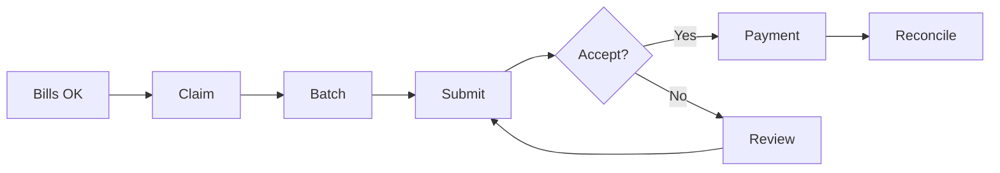

> Services Australia claims and IPA reconciliation

---

## Quick Links

| Resource | Link |
|----------|------|
| **Portal** | [Claims Dashboard](https://tc-portal.test/staff/claims) |
| **Nova Admin** | [Claims](https://tc-portal.test/nova/resources/claims) |

---

## TL;DR

- **What**: Submit claims to Services Australia, receive payments, reconcile IPAs
- **Who**: Finance Team, System (automated jobs)
- **Key flow**: Bills Approved → Claim Created → Submitted to SA → Payment Received → Reconciled
- **Watch out**: PRODA authentication required for API access

---

## Key Concepts

| Term | What it means |
|------|---------------|
| **Claim** | Request to Services Australia for package funding reimbursement |
| **IPA** | Individual Payment Agreement - funding entitlement for a recipient |
| **Claim Recipient** | Package recipient linked to a claim |
| **Reconciliation** | Matching payments received to claims submitted |
| **PRODA** | Provider Digital Access - authentication for Services Australia APIs |

---

## How It Works

### Main Flow: Claim Submission



---

## Business Rules

| Rule | Why |
|------|-----|
| **IPA must be active** | Can't claim for recipients without valid IPA |
| **Within funding period** | Claims must be within IPA effective dates |
| **Claim limits apply** | Can't exceed IPA funding amount |

---

## Who Uses This

| Role | What they do |
|------|--------------|
| **Finance Team** | Monitor claim status, handle rejections |
| **System** | Automated claim submission and reconciliation |

---

## Open Questions

| Question | Context |
|----------|---------|
| **L2 leave days field?** | ClaimRecipient has L1, L3, L4 but code references L2 - is it missing? |
| **Two claim systems architecture?** | Legacy XML upload + new EventSourced API sync - both active? |
| **PRODA authentication location?** | Referenced in docs but not in Claims domain - shared auth layer? |
| **Claim submission flow?** | Flowchart shows batch → submit but code shows file upload → parse |

---

## Technical Reference

<details>
<summary><strong>Models & Database</strong></summary>

### Two Claim Systems

**Note**: TC Portal has TWO separate claim systems:

#### 1. Legacy Claims System (File Upload)

```
app/Models/AdminModels/
├── Claim.php                    # Processes XML claim files from SA

app/Models/
├── ClaimRecipient.php           # Links recipients to claims
├── ClaimRecipientIpa.php        # IPA data (NOT IndividualPaymentAgreement)
└── ClaimRecipientPayment.php    # Payment breakdowns per recipient
```

#### 2. New Services Australia API System (Event Sourced)

```
domain/ServicesAustralia/Claim/Models/
└── ServicesAustraliaClaim.php   # Synced from SA API (table: sa_claims)

domain/ServicesAustralia/Claim/Actions/
├── ListClaims.php               # Search claims with filters
├── GetClaim.php                 # Fetch single claim
└── SyncClaimsFromServicesAustralia.php  # Artisan command sync:sa:claims
```

### Tables

| Table | Purpose |
|-------|---------|
| `claims` | Legacy claim file records |
| `claim_recipients` | Recipients on each claim (has L1, L3, L4 leave days) |
| `claim_recipient_ipas` | IPA financial data |
| `claim_recipient_payments` | Payment breakdowns |
| `sa_claims` | New API synced claims (event sourced) |

</details>

<details>
<summary><strong>Jobs</strong></summary>

```
app/Jobs/Claim/
├── ProcessClaimFileJob.php          # Orchestrates XML file processing
├── ProcessClaimRecipientJob.php     # Parses individual recipient data
└── ProcessClaimRecipientIpaJob.php  # Processes IPA-specific data
```

</details>

<details>
<summary><strong>Integrations</strong></summary>

- **Services Australia Aged Care API** - Claim submission and sync
- **PRODA** - Authentication for API access (location TBD)

See: [PRODA Integration](/features/integrations/proda)

</details>

---

## Related

### Domains

- [Bill Processing](/features/domains/bill-processing) — approved bills generate claims
- [Budget](/features/domains/budget) — funding allocation from claims

---

## Current Challenges

From Fireflies meetings (Aug 2025 - Jan 2026):

| Challenge | Impact |
|-----------|--------|
| **API integration progress** | Currently at 17% integration |
| **Compliance complexity** | 304 compliance requirements identified |
| **61-day reconciliation wait** | Final budget figures only disclosed after 61 days |
| **Pricing discrepancies** | Between internal systems and Services Australia |
| **Equipment claims** | OT reports required as medical certificates |
| **Zero-value claims** | Must submit even after funds exhausted |

---

## Services Australia API Integration

### Current Status

| Metric | Value |
|--------|-------|
| **Integration progress** | 17% |
| **Target deadline** | December 2025 (ongoing) |
| **Soft launch** | Reported successful |

### API Requirements

- Claims must include care recipient IDs
- File upload and attachment support needed
- Recipient data availability from Services Australia pending

---

## Care Management Funding Rules

| Rule | Details |
|------|---------|
| **No pro-rating** | Care management funding not pro-rated |
| **No backdating** | Cannot backdate care management claims |
| **Quarterly allocation** | Funds allocated per service delivery branch |
| **10% care management fee** | Pooled, covers oversight not coordination |
| **10% platform loading** | Operational costs coverage |

---

## Claims Automation

### Current State

- Automated insurance claims processing through Andrew Nunn
- AI-enabled 24/7 automated claim processing (goal)
- Manual uploads still needed for certain claims due to technical constraints

### Wraparound Services

- Professional type specification required
- Compliance validation for service types
- Equipment claims need OT documentation

---

## Reconciliation Complexity

| Issue | Impact |
|-------|--------|
| **61-day waiting period** | Final figures delayed |
| **Administrative burden** | Heavy load on finance teams |
| **Pricing discrepancies** | Manual verification needed |

---

## Status

**Maturity**: Production
**Pod**: Finance
**Owner**: Tim M

---

## Source Meetings

| Date | Meeting | Key Topics |
|------|---------|------------|
| Jan 27, 2026 | GST Training | Claims API, care management fees |
| Jan 2026 | Multiple SaH Training | Compliance requirements, API integration |
| Dec 2025 | API Progress Updates | 17% integration, technical constraints |
| Aug 2025 | Collections Project | Reconciliation automation needs |
