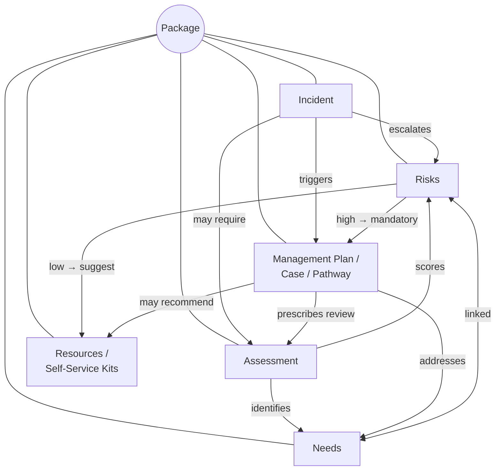

> How clinical governance domains connect — one diagram, one page

---

## Domain Relationships

Everything belongs to a **Package** (a person's care arrangement). The six clinical domains trigger, inform, and feed back into each other:

---

## How Each Domain Connects

| Domain | Feeds into | Fed by | Key link |
|---|---|---|---|
| **Incident** | Risks, Assessments, Management Plans | — (reactive trigger) | Resolution = `MANAGEMENT_PLAN` creates a case |
| **Assessment** | Needs, Risks | Incidents, Management Plan reviews | AI extraction from IAT / OT / GP docs |
| **Needs** | Budget, Care Plan | Assessments, Management Plans | `riskables` pivot ↔ Risks |
| **Risks** | Management Plans, Resources | Incidents, Assessments, Needs | High risk = mandatory case, Low = self-service |
| **Management Plan** | Assessments (reviews), Needs, Resources | Incidents, Risks, Assessments | Lifecycle: create → review → close/escalate |
| **Resources** | Needs (supports self-management) | Risks (low), Management Plans | Low-touch alternative to formal cases |

---

## Implementation Status

| Domain | Status | Notes |
|---|---|---|
| Incidents | ✅ Built | Full domain, Zoho sync, outcomes |
| Needs V2 | ✅ Built | Event-sourced, linked to risks + budget |
| Risks | ✅ Built | Polymorphic `riskables` pivot |
| Budget | ✅ Built | Needs → budget items → bills |
| Assessments | ⚠️ Partial | PDF upload + AI extraction only, no FRAT/VAT tools |
| Management Plans | ❌ Planned | No domain entity yet |
| Resources | ❌ Planned | No package-level resource system yet |

---

## Related Domains

[Incident Management](./incident-management.md) · [Risk Management](./risk-management.md) · [Assessments](./assessments.md) · [Management Plans](./management-plans.md) · [Budget](./budget.md) · [Care Plan](./care-plan.md)
