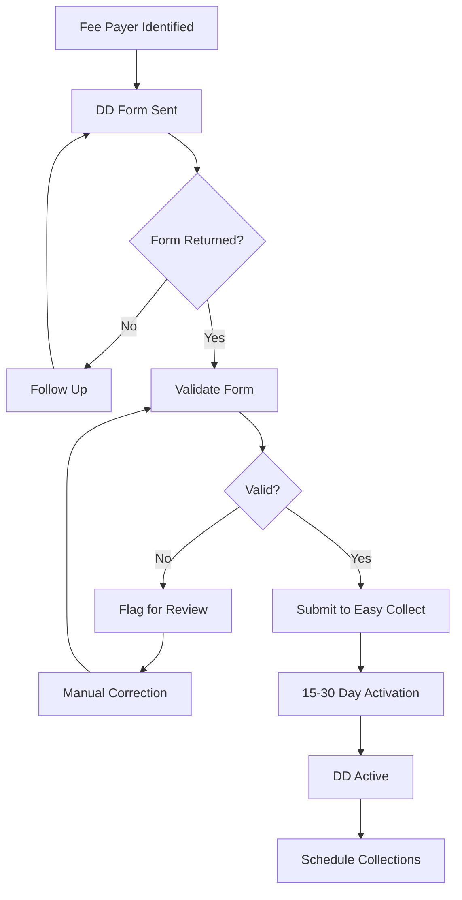
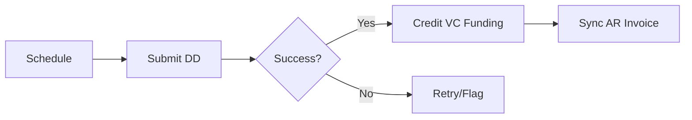
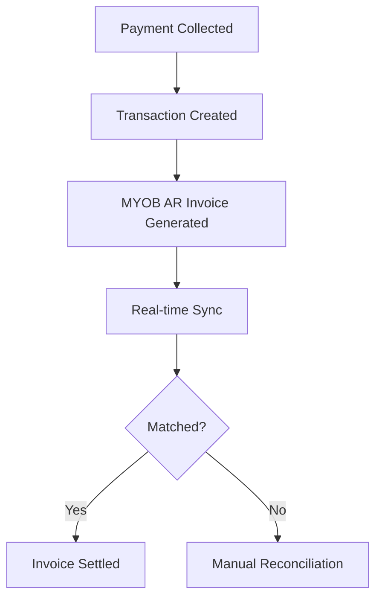

> Direct debit processing, fee payer management, and AR invoice integration

---

## Quick Links

| Resource | Link |
|----------|------|
| **Portal** | [Package Funding](https://tc-portal.test/staff/packages/{id}/funding) |
| **Nova Admin** | [Collections Dashboard](https://tc-portal.test/nova) |

---

## TL;DR

- **What**: Collect voluntary contributions and client payments via direct debit, manage fee payers, and sync AR invoices with MYOB
- **Who**: Finance Team, Collections Team, Care Partners
- **Key flow**: Fee Payer Setup -> DD Authority -> Collection Scheduled -> Payment Processed -> AR Invoice Synced
- **Watch out**: 70% of DD forms are refused due to validation issues; 15-30 day activation delays are common

---

## Key Concepts

| Term | What it means |
|------|---------------|
| **Collection** | Scheduled retrieval of funds from a fee payer's bank account |
| **Fee Payer** | Person or entity responsible for making voluntary contribution payments |
| **Direct Debit (DD)** | Automated bank withdrawal authorised by the fee payer |
| **DD Authority** | Legal authorisation document allowing direct debit from an account |
| **Easy Collect** | Current third-party platform handling DD processing |
| **AR Invoice** | Accounts Receivable invoice in MYOB for tracking outstanding payments |
| **ITF Payment** | Incoming Trust Fund payment from fee payers |
| **Validation Flag** | Error or warning requiring manual review before DD activation |

---

## How It Works

### Main Flow: Fee Payer Collection Setup



### Collection Processing Flow



### AR Invoice Integration (Collections V2)



---

## Business Rules

| Rule | Why |
|------|-----|
| **Valid DD authority required** | Legal requirement - cannot collect without signed authorisation |
| **152 validation checks** | DD forms must pass all validation flags before activation |
| **15-30 day activation period** | Bank processing time for new DD setups |
| **Fee payer verification** | Must confirm fee payer details match bank account holder |
| **ITF payments require active DD** | Cannot process trust fund payments without valid authority |
| **Three-minute sync interval** | Planned real-time AR invoice data sync frequency |

---

## Current Challenges

From Fireflies research (Aug 2025 - Jan 2026):

| Challenge | Impact | Metric |
|-----------|--------|--------|
| **High DD form refusal rate** | Cash flow delays | 70% refusal rate |
| **Incorrect DD status data** | Collection failures and confusion | 600+ fee payers incorrectly marked active |
| **Long activation delays** | Delayed revenue collection | 15-30 days typical |
| **Manual validation overhead** | Staff time burden | 30 days annual work on DD validation |
| **Payment preference shift** | Lower DD adoption | 70% credit card vs 30% DD ratio |
| **ITF payment confusion** | Barrier to collections | Fee payers unclear on process |
| **Validation flag volume** | Processing bottleneck | 152 flags per form |

---

## Platform Strategy

### Current: Easy Collect

| Attribute | Value |
|-----------|-------|
| **Primary function** | Direct debit processing |
| **Transaction rate** | 1.55% per transaction |
| **DD users** | 486 |
| **Credit card users** | 577 |

### Future: Collections V2

| Feature | Description |
|---------|-------------|
| **Integrated DD** | Direct debit management within TC Portal |
| **MYOB AR sync** | Real-time AR invoice integration |
| **Automated validation** | Reduced manual flag processing |
| **Fee payer dashboard** | Centralised fee payer management |

### Potential: NAB Evaluation

| Attribute | Value |
|-----------|-------|
| **Proposed rate** | 1.1-1.2% |
| **Gaps identified** | Payment plans, recurring payments |
| **Contract clause** | Platform migration permitted |

---

## Scale Planning

| Metric | Current | Projected (June) |
|--------|---------|------------------|
| **Customers** | ~1,350 | 15,000 |
| **Debt exposure** | $600K | $2.6M |
| **Customer debt %** | 5% | 40% |
| **New collections/month** | - | 600 |

---

## Who Uses This

| Role | What they do |
|------|--------------|
| **Collections Team** | Process DD forms, manage validation flags, follow up on failed payments |
| **Finance Team** | Reconcile AR invoices, monitor debt levels, handle escalations |
| **Care Partners** | Initiate fee payer setup, explain DD process to clients |
| **Recipients/Fee Payers** | Complete DD authority forms, make payments |

---

## Open Questions

| Question | Context |
|----------|---------|
| **When will Collections V2 models be created?** | VcFundingStream, ArInvoice, ArInvoicePayment are planned but don't exist in codebase yet |
| **Where is Easy Collect integration code?** | Documentation mentions Easy Collect as current system, but no API integration exists in codebase |
| **Where is Direct Debit Authority model?** | No DD authority or fee payer models found despite detailed documentation |
| **ContributionSchedule location?** | Docs reference domain/Funding/ but model doesn't exist |
| **What triggers 152 validation flags?** | Validation system mentioned but implementation not found |

---

## Technical Reference

<details>
<summary><strong>Implementation Status</strong></summary>

**NOTE**: Collections V2 is in planning phase. Most documented models **do not exist yet**.

### What Actually Exists

```
domain/Contribution/Models/        # NOT domain/Funding/ as documented
├── Contribution.php               # Support at Home contributions
├── ContributionInvoice.php        # MYOB AR invoice sync
└── ContributionCategory.php       # Contribution categories

domain/Contribution/Actions/
└── SyncContributionInvoiceAction.php   # Handles MYOB invoice sync

domain/Contribution/EventSourcing/
├── Events/
│   ├── ContributionInvoiceCreatedEvent.php
│   ├── ContributionInvoiceUpdatedEvent.php
│   └── ContributionInvoiceDeletedEvent.php
└── Projectors/
    └── ContributionInvoiceProjector.php
```

### What Is Planned (Collections V2) - NOT YET IMPLEMENTED

```
Planned tables (from initiative docs):
├── vc_funding_streams
├── ar_invoices
├── ar_invoice_payments
├── bill_invoice_associations
└── vc_approval_logs
```

</details>

<details>
<summary><strong>Integration Points</strong></summary>

### External Systems

| System | Integration | Purpose | Status |
|--------|-------------|---------|--------|
| **Easy Collect** | API | DD processing and payment collection | External only - no code integration |
| **MYOB** | API | AR invoice creation and sync | ✅ Via ContributionInvoiceSync |
| **NAB** | TBD | Potential future DD platform | Planning |

### Internal Dependencies

```
domain/Contribution/               # Correct location (not domain/Funding/)
├── Models/
│   ├── Contribution.php           # VC contribution records
│   └── ContributionInvoice.php    # MYOB AR invoice sync
├── Actions/
│   └── SyncContributionInvoiceAction.php

domain/Transaction/Models/
└── Transaction.php                # Tracks VC transactions (account 2480)
```

**Note**: `ContributionSchedule.php` and `SyncArInvoiceAction.php` referenced in old docs do NOT exist.

</details>

<details>
<summary><strong>Data Flows</strong></summary>

### Outbound
- DD submission to Easy Collect
- AR invoice data to MYOB

### Inbound
- Payment confirmation from Easy Collect
- Bank response codes
- AR invoice status from MYOB

### Sync Frequency
- **Current**: Batch processing
- **Planned**: 3-minute real-time sync for AR invoices

</details>

---

## Testing

### Key Test Scenarios

- [ ] DD form validation catches all 152 flag types
- [ ] Successful DD creates VC funding allocation
- [ ] Failed DD triggers retry mechanism
- [ ] Fee payer status correctly reflects DD authority state
- [ ] AR invoice syncs within 3-minute window (V2)
- [ ] ITF payments only process with active DD authority

---

## Related

### Domains

- [Contributions](/features/domains/contributions) - VC funding created from collections
- [Budget](/features/domains/budget) - VC funding stream allocations
- [MYOB](/features/domains/myob) - AR invoice integration
- [Statements](/features/domains/statements) - Collection transactions on statements

### Integrations

- Easy Collect - Current DD processing platform
- MYOB Acumatica - AR invoice sync (planned)
- NAB Connect - Potential future platform

---

## Collections V2 Roadmap

| Phase | Focus | Key Features |
|-------|-------|--------------|
| **Phase 1** | Fee Payer Management | Centralised fee payer records, status tracking |
| **Phase 2** | DD Integration | In-app DD form processing, reduced activation time |
| **Phase 3** | MYOB AR Sync | Real-time invoice creation and reconciliation |
| **Phase 4** | Automation | Reduced validation flags, automated follow-ups |

---

## Status

**Maturity**: In Development
**Pod**: Finance / Collections
**Owner**: TBD

---

## Source Meetings

| Date | Meeting | Key Topics |
|------|---------|------------|
| Jan 28, 2026 | Direct Debit Review | 600+ incorrect DD statuses, Databricks dashboards |
| Jan 22, 2026 | Contribution Payer Status | Manual processing delays, automation needs |
| Sep 10, 2025 | DD Integration in Onboarding | Three client cohorts, CRM integration |
| Aug 22, 2025 | DD Collections Update | Easy Collect vs NAB, 12K contracts |
| Aug 6, 2025 | Collections Project Regroup | Scale planning, delta tables, hardship tracking |
