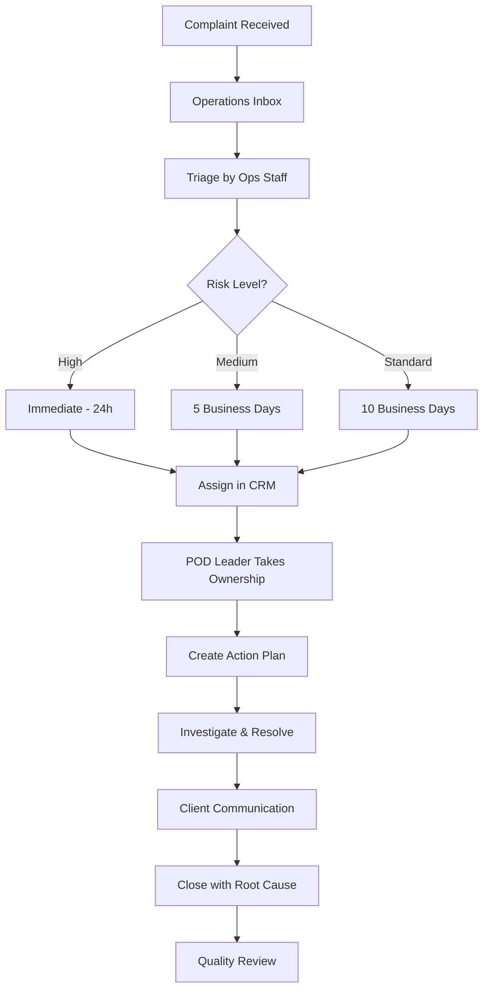
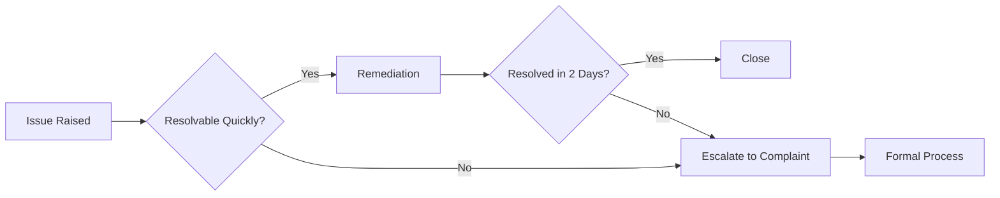
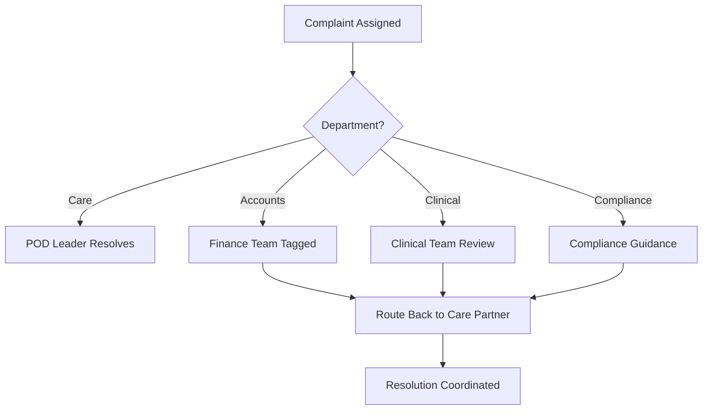

> Receive, triage, track, and resolve client complaints within regulatory timeframes

---

## Quick Links

| Resource | Link |
|----------|------|
| **CRM** | Zoho Complaints Module |
| **Initiative** | [Complaints Management Epic](/initiatives/Work-Management/Complaints-Management/) |

---

## TL;DR

- **What**: End-to-end process for handling client complaints with triage, tracking, and resolution
- **Who**: Operations (triage), POD Leaders (resolution), Care Partners (remediations), Compliance
- **Key flow**: Received → Triaged → Assigned → Investigated → Resolved (within 28 days)
- **Watch out**: Many complaints exceed 28-day target due to manual tracking, unclear ownership, and inactive automation

---

## Key Concepts

| Term | What it means |
|------|---------------|
| **Complaint** | Formal client grievance requiring documented resolution |
| **Remediation** | Quick, low-level care partner escalation resolved within 2 days |
| **Triage** | Risk-based categorization determining response timeframe |
| **28-Day Target** | Regulatory SLA for formal complaint resolution |
| **POD Leader** | Primary accountable person for complaint resolution |
| **Root Cause** | Underlying process gap identified at complaint closure |

---

## How It Works

### Main Flow: Complaint Lifecycle

### Other Flows

<strong>Remediation vs Complaint</strong> - escalation pathway

Quick issues handled at care partner level may escalate to formal complaints.

<strong>Cross-Department Escalation</strong> - multi-team resolution

Complaints involving accounts, compliance, or clinical require coordination.

---

## Triage Criteria

| Risk Level | Description | Response Time | Examples |
|------------|-------------|---------------|----------|
| **High** | Serious safety, clinical, or regulatory concerns | Within 24 hours | Abuse allegations, medication errors, serious injury |
| **Medium** | Service quality or significant process issues | Within 5 business days | Missed services, billing disputes, staff conduct |
| **Standard** | General feedback or minor concerns | Within 10 business days | Scheduling preferences, minor communication issues |

---

## Remediations vs Formal Complaints

| Type | Description | Resolution Time | Escalation Trigger |
|------|-------------|-----------------|-------------------|
| **Remediation** | Quick, low-level care partner escalations | Same shift to 2 days | Cannot resolve, exceeds 2 days, client requests formal process |
| **Formal Complaint** | Documented issue requiring investigation | Up to 28 days | N/A - already formal |

---

## Business Rules

| Rule | Why |
|------|-----|
| **28-day resolution target** | Regulatory compliance requirement |
| **Triage within 24 hours** | Ensure appropriate urgency and routing |
| **Client acknowledgement required** | Regulatory requirement, reduces anxiety |
| **Root cause documented at closure** | Feeds quality improvement and training |
| **POD leader accountability** | Clear ownership prevents delays |
| **Progress updates every 5-7 days** | Keeps client informed, regulatory requirement |

---

## Client Communication Standards

| Touchpoint | Timing | Content |
|------------|--------|---------|
| **Acknowledgement** | Within 24 hours | Complaint received, reference number, next steps |
| **Progress Update** | Every 5-7 business days | Current status, expected resolution timeline |
| **Delay Notice** | When 28-day target at risk | Explanation, revised timeline, contact details |
| **Resolution** | At closure | Outcome, actions taken, feedback invitation |

---

## Common Issues

<strong>Issue: Complaints exceeding 28 days</strong>

**Symptom**: Significant portion of complaints unresolved past SLA

**Cause**: POD leaders not updating stages, unclear closure criteria, cross-department delays

**Fix**: Weekly escalation meetings, automated notifications (planned), competency framework for POD leaders

<strong>Issue: POD leaders not updating CRM</strong>

**Symptom**: Complaint stages stale, tracking relies on spreadsheet

**Cause**: CRM lacks task notifications, dashboard visibility poor, time pressure

**Fix**: Automation improvements in progress, simplified stages, performance framework

<strong>Issue: Automated emails not working</strong>

**Symptom**: Client updates inconsistent, manual communication only

**Cause**: Automated email functionality turned off or broken in CRM

**Fix**: Re-enable automation with standardized email templates

<strong>Issue: Care partners lack visibility</strong>

**Symptom**: Complaints arrive informally, outside the system

**Cause**: CRM lacks task assignment at care partner level

**Fix**: Dashboard visibility improvements, task notifications (planned)

---

## Who Uses This

| Role | What they do |
|------|--------------|
| **Operations Team** | Receive complaints, triage, assign, monitor overdue |
| **POD Leaders** | Own resolution, create action plans, update stages, close with root cause |
| **Care Partners** | Handle remediations, escalate when needed, support investigations |
| **Clinical Team** | Review clinically-related complaints, provide guidance |
| **Compliance Team** | Regulatory guidance, audit trail, external reporting |
| **Accounts Team** | Support finance-related complaint resolution |

---

## Technical Reference

<strong>Current Systems</strong>

| System | Role | Limitations |
|--------|------|-------------|
| **CRM (Zoho)** | Complaint records, stages, assignments | No task notifications, poor care partner visibility |
| **Spreadsheet** | Tracking overdue complaints | Manual, prone to errors |
| **Teams** | Cross-team communication | Relies on tagging, creates clutter |
| **Operations Inbox** | Complaint intake | Manual triage required |

<strong>Data & Reporting</strong>

| Report | Frequency | Purpose |
|--------|-----------|---------|
| **Volume Report** | Monthly | Track complaint counts and trends |
| **Resolution Compliance** | Monthly | % resolved within 28 days |
| **Trend Analysis** | Quarterly | Identify recurring themes |
| **Quality Metrics** | Quarterly | Closure quality and root cause patterns |

---

## Quality Assurance

### Root Cause Categories

Each complaint closure must identify the underlying process gap:

| Category | Description |
|----------|-------------|
| **Process Failure** | System or procedure didn't work as intended |
| **Communication Breakdown** | Information not shared appropriately |
| **Training Gap** | Staff needed additional skills/knowledge |
| **System Limitation** | Technology couldn't support the need |
| **External Factor** | Outside of organizational control |

### POD Leader Competency

Complaint handling effectiveness is linked to performance development:

- Understanding complaint handling processes
- Cross-departmental knowledge
- Client communication skills
- Documentation and CRM proficiency
- Escalation judgment

---

## Planned Improvements

| Improvement | Status | Impact |
|-------------|--------|--------|
| **Dashboard visibility** | Planned | Care partners see their complaints |
| **Automated notifications** | In Progress | Stage changes trigger alerts |
| **Task assignment at care partner level** | Planned | Clear ownership in system |
| **Simplified complaint stages** | Planned | Reduce granularity and confusion |
| **Action plan surfacing** | Planned | Dashboard shows pending actions |
| **Standardized email templates** | Planned | Consistent client communications |

---

## Key Metrics

| Metric | Target | Current Challenge |
|--------|--------|-------------------|
| **28-day resolution rate** | >90% | Many exceed target |
| **First response time** | <24 hours | Inconsistent |
| **Client communication compliance** | 100% | Manual, often missed |
| **Root cause documentation** | 100% | Not consistently captured |
| **Monthly volume** | 200-250 | Creates resourcing strain |

---

## Open Questions

| Question | Context |
|----------|---------|
| **Why is there no Complaints domain in Portal?** | Complaints are entirely managed in Zoho CRM - no models, controllers, or APIs exist in the Portal codebase |
| **What is the Portal integration plan?** | Meetings discuss CRM improvements but no Portal implementation roadmap exists |
| **Will Task domain support complaints?** | Task model exists with Taskable interface - could complaints become taskable entities? |

---

## Technical Reference

<strong>Implementation Status</strong>

**IMPORTANT**: Complaints management has **NO implementation in TC Portal**. The entire system runs in Zoho CRM.

### What Exists in Portal

**Nothing** - No Complaint model, controller, routes, or Vue components exist in the codebase.

Searched locations with no results:
- `domain/Complaint/` - Does not exist
- `app/Models/Complaint.php` - Does not exist
- `app/Http/Controllers/*Complaint*` - No matches
- `resources/js/Pages/*Complaint*` - No matches

### CRM-Only System

All functionality described in this document exists only in:
- **Zoho CRM**: Complaint records, stages, assignments
- **Spreadsheets**: Manual tracking for overdue complaints
- **Teams**: Cross-team communication
- **Operations Inbox**: Complaint intake

### Potential Future Integration

The Task domain (`domain/Task/`) could potentially support complaints if Portal integration is planned:
- Task model uses `Taskable` polymorphic interface
- Could create `Complaint` as taskable entity
- Would enable dashboard visibility for care partners

---

## Related

### Domains

- [Task Management](/features/domains/task-management) - task assignment and tracking infrastructure
- [Notes](/features/domains/notes) - complaint interactions documented
- [Coordinator Portal](/features/domains/coordinator-portal) - dashboard visibility
- [Risk Management](/features/domains/risk-management) - complaints may identify new risks

### Initiatives

| Epic | Status | Description |
|------|--------|-------------|
| [Complaints Management](/initiatives/Work-Management/Complaints-Management/) | Active | End-to-end process improvement |
| [Work Management](/initiatives/Work-Management/) | Active | Parent initiative |

---

## Status

**Maturity**: In Development
**Initiative**: Work Management
**Owner**: Sian H
**Teams**: Care, Operations, Compliance, Clinical
