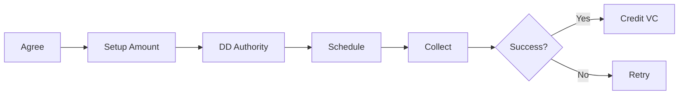

> Voluntary contributions and top-ups

---

## Quick Links

| Resource | Link |
|----------|------|
| **Portal** | [Package Funding](https://tc-portal.test/staff/packages/{id}/funding) |
| **Nova Admin** | [Contributions](https://tc-portal.test/nova/resources/contributions) |

---

## TL;DR

- **What**: Collect voluntary top-ups from recipients/families to supplement HCP funding
- **Who**: Care Partners, Finance Team, Recipients/Family
- **Key flow**: Setup Contribution → Direct Debit Collection → VC Funding Stream Available
- **Watch out**: ITF collections require valid direct debit authority

---

## Key Concepts

| Term | What it means |
|------|---------------|
| **Voluntary Contribution (VC)** | Optional top-up payment from recipient or family |
| **ITF Collection** | Incoming Trust Fund collection via direct debit |
| **Contribution Schedule** | Recurring contribution arrangement (weekly, fortnightly, monthly) |
| **Direct Debit Authority** | Bank authorisation for automatic payments |

---

## How It Works

### Main Flow: Contribution Setup



---

## Business Rules

| Rule | Why |
|------|-----|
| **Valid DD authority required** | Can't collect without bank authorisation |
| **VC is voluntary** | Must be clearly optional, not mandatory |
| **Contribution limits** | May have caps based on package rules |

---

## Who Uses This

| Role | What they do |
|------|--------------|
| **Care Partners** | Set up contribution arrangements |
| **Finance Team** | Process payments, handle failed collections |
| **Recipients/Family** | Make voluntary payments |

---

## Open Questions

| Question | Context |
|----------|---------|
| **ContributionSchedule & DirectDebitAuthority models?** | Docs list these but they don't exist - in Collections domain? |
| **DefaultContributionRate vs Contribution?** | When do defaults become actuals? |
| **MYOB invoice creation flow?** | ContributionInvoice only syncs from MYOB - how are invoices created? |
| **Support at Home category percentages?** | Where are Clinical 0%, Independence 5-50%, Everyday Living 17.5-80% configured? |

---

## Technical Reference

<details>
<summary><strong>Models & Database</strong></summary>

### Models

**Note**: Models are in `domain/Contribution/` NOT `domain/Funding/`:

```
domain/Contribution/Models/
├── Contribution.php                 # SaH contribution amounts per package/category
├── ContributionInvoice.php          # Invoices synced from MYOB
├── ContributionCategory.php         # Clinical, Independence, Everyday Living
└── DefaultContributionRate.php      # Default percentages per package-category
```

**ContributionSchedule and DirectDebitAuthority do NOT exist** in this domain. Direct debit functionality is in the Collections domain.

### Tables

| Table | Purpose |
|-------|---------|
| `contributions` | Contribution records with percentages |
| `contribution_invoices` | MYOB-synced invoices (soft deletes) |
| `contribution_categories` | Category reference data |
| `default_contribution_rates` | Package-category default percentages |

</details>

<details>
<summary><strong>Event Sourcing</strong></summary>

Contributions use event sourcing pattern:

```
domain/Contribution/Events/
├── ContributionInvoiceCreatedEvent.php
├── ContributionInvoiceUpdatedEvent.php
├── ContributionInvoiceDeletedEvent.php
└── DefaultContributionRateUpsertedEvent.php

domain/Contribution/Projectors/
├── ContributionInvoiceProjector.php
└── DefaultContributionRateProjector.php
```

</details>

<details>
<summary><strong>Actions & API</strong></summary>

```
domain/Contribution/Actions/
├── UpsertDefaultContributionRateAction.php  # Upsert default rates
└── SyncContributionInvoiceAction.php        # Syncs from MYOB webhooks
```

REST API endpoint exists with index, upsert, destroy operations.

</details>

---

## Related

### Domains

- [Budget](/features/domains/budget) — VC funding stream for allocations
- [Statements](/features/domains/statements) — contributions shown on statements

### Integrations

- [NAB Connect](/features/integrations/nab-connect) — direct debit processing

---

## Current Challenges

From Fireflies meetings (Aug 2025 - Jan 2026):

| Challenge | Impact |
|-----------|--------|
| **Manual DD processing** | 15-30 days for activation |
| **Data accuracy** | 600+ fee payers incorrectly marked as active DD |
| **Payment preference shift** | 70% credit card vs 30% direct debit |
| **Validation gaps** | 152 validation flags on DD forms |
| **Collections overload** | Team handling duplicate contacts manually |

---

## Platform Strategy

### Current: EasyCollect
- Primary platform for direct debit
- Rate: 1.55% per transaction
- 486 DD users, 577 credit card users

### Future: NAB Evaluation
- Potential rate: 1.1-1.2%
- Gaps in payment plans and recurring payments
- Platform migration clause in contracts

---

## Scale Planning

| Metric | Current | Projected (June) |
|--------|---------|------------------|
| Customers | ~1,350 | 15,000 |
| Debt exposure | $600K | $2.6M |
| Customer debt % | 5% | 40% |
| New collections/month | - | 600 |

---

## Status

**Maturity**: Production
**Pod**: Finance
**Owner**: Marleze S

---

## Source Meetings

| Date | Meeting | Key Topics |
|------|---------|------------|
| Jan 28, 2026 | Direct Debit Review | 600+ incorrect DD statuses, Databricks dashboards |
| Jan 22, 2026 | Contribution Payer Status | Manual processing delays, automation needs |
| Sep 10, 2025 | DD Integration in Onboarding | Three client cohorts, CRM integration |
| Aug 22, 2025 | DD Collections Update | EasyCollect vs NAB, 12K contracts |
| Aug 6, 2025 | Collections Project Regroup | Scale planning, delta tables, hardship tracking |
