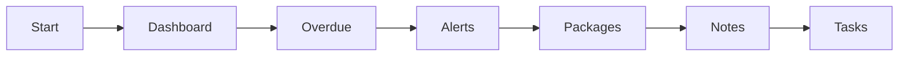

> Care coordinator dashboards and workload management

---

## Quick Links

| Resource | Link |
|----------|------|
| **Portal** | [Coordinator Dashboard](https://tc-portal.test/staff/dashboard) |
| **Portal** | [My Packages](https://tc-portal.test/staff/packages) |

---

## TL;DR

- **What**: Daily dashboard and tools for care coordinators to manage their caseload
- **Who**: Care Coordinators, Care Partners, Team Leaders
- **Key flow**: View Dashboard → Check Tasks → Work Packages → Log Notes
- **Watch out**: Dashboard shows assigned packages only - check team view for all

---

## Key Concepts

| Term | What it means |
|------|---------------|
| **Caseload** | Packages assigned to a coordinator |
| **Dashboard** | Overview of tasks, alerts, and key metrics |
| **Team Pod** | Group of coordinators working together |

---

## How It Works

### Main Flow: Daily Workflow



---

## Who Uses This

| Role | What they do |
|------|--------------|
| **Care Coordinators** | Day-to-day client coordination, calls, notes |
| **Care Partners** | Case management, oversight, approvals |
| **Team Leaders** | Workload distribution, monitoring |

---

## Open Questions

| Question | Context |
|----------|---------|
| **Care Management Activities domain?** | Is this planned as separate domain module? No dedicated structure in code |
| **Contact list management?** | "Centralized care contact list" - where is this implemented? |
| **Team-based structure?** | CV Permissions discussed team-based client assignments - status? |
| **Direct care activity logging?** | 15-min minimum compliance tracking - implementation status? |

---

## Technical Reference

<details>
<summary><strong>Models & Database</strong></summary>

### Models

```
app/Models/Organisation/CareCoordinator.php   # Main model with many relationships

domain/CareCoordinatorFee/Models/
└── CareCoordinatorFeeProposal.php            # Fee change proposals (event sourced)

domain/CareCoordinatorFee/Enums/
├── FeeProposalStatusEnum.php                 # PENDING, APPROVED_BY_ADMIN, etc.
├── FeeProposalTypeEnum.php                   # NEW_AND_EXISTING_CLIENTS, CUSTOM_FEE_PACKAGES
└── LoadingFeesEnum.php
```

### Fee Proposal Status Values

- `PENDING` → `APPROVED_BY_ADMIN` / `REJECTED_BY_ADMIN`
- `APPROVED_BY_ADMIN` → `AWAITING_CLIENT_APPROVAL` → `APPROVED_BY_CLIENT` / `REJECTED_BY_CLIENT`

</details>

<details>
<summary><strong>Frontend Pages</strong></summary>

```
resources/js/Pages/
├── Dashboard/
│   ├── Index.vue              # Main dashboard
│   └── Components/
├── CareCoordinators/
│   └── ...
```

</details>

<details>
<summary><strong>Event Sourcing</strong></summary>

Fee changes use event sourcing for audit trail:

```
domain/CareCoordinatorFee/EventSourcing/
├── Events/
└── Projectors/

domain/CareCoordinatorFee/Notifications/
├── FeeApprovedByAdminNotification.php
├── RecipientFeeApprovalRequestNotification.php
└── [2 more notification types]
```

</details>

---

## Related

### Domains

- [Task Management](/features/domains/task-management) — composable workday, task queues
- [Notes](/features/domains/notes) — communication logging
- [Teams & Roles](/features/domains/teams-roles) — team pods and assignments

---

## Current Challenges

From Fireflies meetings (Aug 2025 - Jan 2026):

| Challenge | Impact |
|-----------|--------|
| **Role confusion** | Unclear distinction between care management and coordination activities |
| **Training gaps** | POD leaders lack competencies for complaint handling |
| **Tracking issues** | Coordinators not updating complaint/task stages properly |
| **Client communication** | Inconsistent communication patterns with clients |
| **Fee explanations** | Difficulty explaining new fee structures to clients |
| **1,500 unsigned agreements** | Compliance risk from clients yet to sign new agreements |

---

## Scale

| Metric | Value |
|--------|-------|
| **Staff** | 350+ |
| **Coordinators** | 250+ |
| **Recipients** | 314,000 |

---

## Coordinator Pricing System

### Fee Proposal Workflow

| Stage | Description |
|-------|-------------|
| **Awaiting approval** | New section in coordinator dashboard |
| **Package-level fees** | Coordinators can propose 1-30% fees |
| **Global rate changes** | 1% increments (changed from 5%) |
| **Custom fees** | Affect <10% of coordination activities |

### Approval Requirements

- Two-tier approval: company-to-coordinator + active client consent
- BD and compliance team involvement required
- Strict deadlines based on existing contracts (15th of month)
- Audit logging for all fee changes

---

## Care Management Activities

Unified care management activities being developed to support:
- Regulatory compliance requirements
- Notes and telephony call bridge UI
- Work management enhancements

### 10% Care Management Fee

- Pooled funding, covers oversight not coordination
- Separate from 10% platform loading fee
- Zero coordination loading on restorative care funding

---

## POD Leader Competencies

### Identified Needs

| Area | Issue |
|------|-------|
| **Complaints handling** | Need competency framework |
| **Stage updates** | Fail to update complaint stages |
| **Coaching integration** | Link competencies to performance development |

---

## Status

**Maturity**: Production
**Pod**: Duck, Duck Go (Care Coordination)
**Owner**: Beth P

---

## Source Meetings

| Date | Meeting | Key Topics |
|------|---------|------------|
| Jan 30, 2026 | BRP January 26 | 250+ coordinators, unified care management activities |
| Jan 28, 2026 | Complaints Review | POD leader competencies, tracking problems |
| Jan 27, 2026 | SaH Training | 10% care management fee, fee explanations |
| Jun 10, 2025 | Coordinator Pricing | Fee proposal workflow, awaiting approval section |
