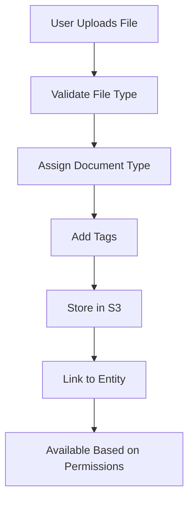

> Document management, storage, and compliance

---

## Quick Links

| Resource | Link |
|----------|------|
| **Portal** | [Package Documents](https://tc-portal.test/staff/packages/{id}/documents) |
| **Nova Admin** | [Documents](https://tc-portal.test/nova/resources/documents) |

---

## TL;DR

- **What**: Store, tag, and manage documents attached to packages, bills, and suppliers
- **Who**: All users based on permissions
- **Key flow**: Upload → Tag/Categorise → Store in S3 → Access Based on Role
- **Watch out**: Document visibility depends on user role and document type

---

## Key Concepts

| Term | What it means |
|------|---------------|
| **Document** | File stored in the system (PDF, image, etc.) |
| **Document Type** | Category (Care Plan, Invoice, Assessment, Agreement) |
| **Tag** | Additional metadata for filtering and search |
| **Attached To** | The entity the document belongs to (package, bill, supplier) |

---

## How It Works

### Main Flow: Document Upload



---

## Document Types

| Type | Description | Attached To |
|------|-------------|-------------|
| **Care Plan** | Official care plan documents | Package |
| **Invoice** | Supplier invoices and receipts | Bill |
| **Assessment** | ACAT/IAT assessments | Package |
| **Agreement** | Supplier agreements, HCP agreements | Supplier, Package |
| **Correspondence** | Letters and communications | Package |
| **Medical** | Health summaries and reports | Package |

---

## Business Rules

| Rule | Why |
|------|-----|
| **Role-based visibility** | Suppliers can't see internal documents |
| **File type restrictions** | Only allowed file types can be uploaded |
| **Version tracking** | Document updates create new versions |

---

## Who Uses This

| Role | What they do |
|------|--------------|
| **Care Partners** | Upload and manage package documents |
| **Suppliers** | Upload invoices, view agreements |
| **Compliance** | Audit and review documents |
| **All Users** | View documents based on permissions |

---

## Open Questions

| Question | Context |
|----------|---------|
| **Why does DocumentType model not exist?** | Docs reference DocumentType.php but actual implementation uses DocumentTag + DocumentTagGroup |
| **Why isn't Documentable a model?** | Documentable is a trait (HasDocuments), not a model as documented |
| **What triggers document expiry notifications?** | Sophisticated 630-line artisan command exists but not documented |
| **Which document tags trigger which rejection reasons?** | 37 rejection reasons categorised by document type but mapping unclear |
| **How does Zoho document sync work?** | Virtual documents created from Zoho expiry dates - not documented |

---

## Technical Reference

<details>
<summary><strong>Models & Database</strong></summary>

### Models (Actual - differs from docs)

**Note**: `DocumentType.php` and `Documentable.php` do NOT exist.

```
domain/Document/Models/
├── Document.php                    # Main document model
├── DocumentTag.php                 # Document categorisation (replaces DocumentType)
├── DocumentTagGroup.php            # Groups related document tags
├── DocumentTagServiceType.php      # Links tags to service types
├── DocumentApproval.php            # Approval tracking
├── DocumentRejection.php           # Rejection tracking with reasons
└── DocumentStage.php               # Stage transitions

app/Models/
└── TemporaryDocument.php           # Temporary storage
```

### Traits (Not a Model)

```
domain/Document/Traits/
└── HasDocuments.php               # Polymorphic relationship trait
```

### Enums (NOT DOCUMENTED)

| Enum | Cases | Purpose |
|------|-------|---------|
| `DocumentStageEnum` | 9 | NEW, SUBMITTED, IN_REVIEW, APPROVED, EXPIRED, etc. |
| `DocumentTagEnum` | 50+ | Insurance, Legal, Permits, Certificates, Care docs |
| `DocumentRejectionReasonEnum` | 37 | Categorised rejection reasons with icons/colours |
| `DocumentRejectionReasonCategoryEnum` | 5 | INSURANCE, POLICE_NDIS, REGISTRATIONS, etc. |

### Tables

| Table | Purpose |
|-------|---------|
| `documents` | Document records |
| `document_tags` | Document categorisation (NOT document_types) |
| `document_tag_groups` | Tag groupings |
| `document_approvals` | Approval records |
| `document_rejections` | Rejection records with reasons |

</details>

<details>
<summary><strong>Event Sourcing (UNDOCUMENTED)</strong></summary>

Documents use Spatie event sourcing for full audit trail:

```
domain/Document/EventSourcing/
├── DocumentAggregateRoot.php
├── DocumentEventRepository.php
├── DocumentStoredEvent.php
├── Events/
│   ├── DocumentUploadedEvent.php
│   ├── DocumentApprovedEvent.php
│   ├── DocumentRejectedEvent.php
│   ├── DocumentReplacedEvent.php
│   ├── DocumentExpiryDateUpdatedEvent.php
│   ├── DocumentSoftDeletedEvent.php
│   ├── DocumentExpiringSoonEvent.php
│   └── DocumentExpiredEvent.php
└── Projectors/
    └── DocumentVerificationProjector.php
```

</details>

<details>
<summary><strong>Malware Scanning (UNDOCUMENTED)</strong></summary>

AWS GuardDuty integration automatically scans uploaded documents:

- `ProcessDocumentScanResultAction` handles GuardDuty results
- Documents flagged as `THREATS_FOUND` are hidden via global scope
- `malware_status` column: null (unscanned), "CLEAN", "THREATS_FOUND"

</details>

<details>
<summary><strong>Storage</strong></summary>

Documents stored in S3 bucket with structure:
```
s3://tc-portal-documents/
├── documents/{path_prefix}/{uuid}.{extension}
├── packages/{package_id}/
├── bills/{bill_id}/
├── suppliers/{supplier_id}/
├── notes/{uuid}.{extension}
└── zips/{uuid}.zip
```

Features:
- Temporary URLs (5-10 min expiry)
- PDF conversion for images
- ZIP archive generation
- Content hashing for duplicate detection

</details>

---

## Future Direction

Based on Feb 2026 discussions with Marianne (Clinical Governance):

### Document Storage Rules
| Document Type | Stored Against | Example |
|---------------|----------------|---------|
| **Advanced Care Directive** | Package | Legal document for care decisions |
| **Power of Attorney / EPO** | Person (care user) | Legal authority document |
| **Clinical Assessment** | Package (as clinical document) | OT report, physio letter, IAT |
| **General Document** | Package or Person | Correspondence, agreements |

### Clinical Document Subtype
- Clinical documents are a distinct category — backed by a healthcare professional
- Uploading a clinical document triggers AI extraction of needs, risks, prescribed items
- Links back to the source document for audit trail (in-text citations)

---

## Related

### Domains

- [Care Plan](/features/domains/care-plan) — care plan documents
- [Bill Processing](/features/domains/bill-processing) — invoice documents
- [Supplier](/features/domains/supplier) — agreement documents

---

## Source Meetings

| Date | Meeting | Key Topics |
|------|---------|------------|
| Feb 11, 2026 | Clinical Product Requirements (Marianne) | ACD storage on package, EPO on person, clinical document category, assessment-backed documents |

---

## Status

**Maturity**: Production
**Pod**: Platform
