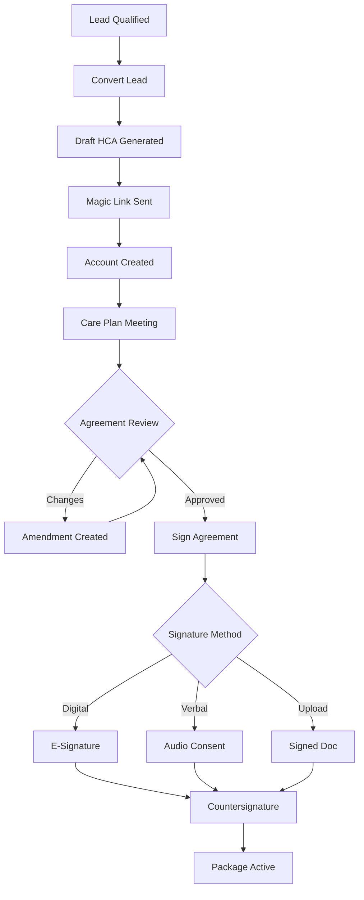
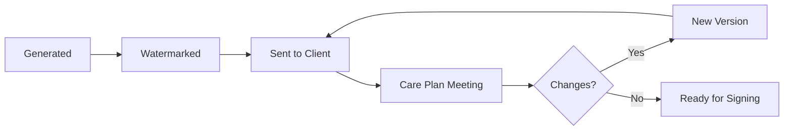
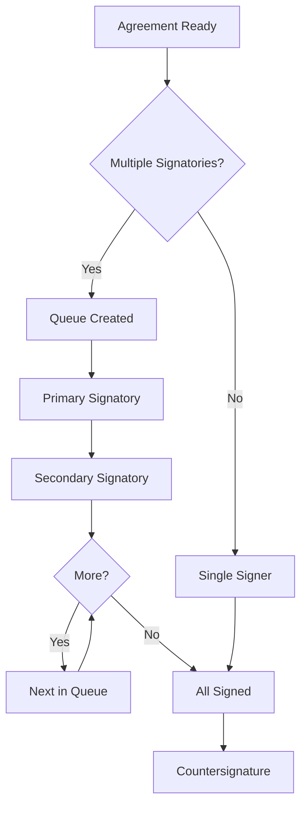

> The contractual gateway to all packages - signing, versioning, and amendments

---

## Quick Links

| Resource | Link |
|----------|------|
| **Portal** | [Package Documents](https://tc-portal.test/staff/packages/{id}/documents) |
| **Nova Admin** | [Agreements](https://tc-portal.test/nova/resources/agreements) |

---

## TL;DR

- **What**: Home Care Agreements are the binding contracts between Trilogy Care and clients for home care services
- **Who**: Recipients, family members, Care Partners, Assessment Team
- **Key flow**: Lead Conversion -> Draft Agreement -> Care Plan Meeting -> Signing -> Active Package
- **Watch out**: Draft agreements are non-binding until signed; ~1,500 clients have legacy unsigned agreements (compliance risk)

---

## Key Concepts

| Term | What it means |
|------|---------------|
| **HCA** | Home Care Agreement - the formal contract for services |
| **Draft Agreement** | Non-binding agreement generated at lead conversion, includes watermark |
| **Signatory** | Person authorised to sign the agreement (recipient or representative) |
| **Magic Link** | Secure email link for account creation and agreement signing |
| **Amendment** | Formal change to an existing signed agreement |
| **Countersignature** | Trilogy Care's authorised signature completing the agreement |
| **Agreement Version** | Tracked version number for compliance and audit |

---

## How It Works

### Main Flow: Lead to Signed Agreement



### Draft Agreement Lifecycle



### Signature Queue Flow



---

## Business Rules

| Rule | Why |
|------|-----|
| **Draft until signed** | Agreements non-binding until post-care-plan signing |
| **Watermark on drafts** | Visual indicator that document is not final |
| **Disclaimer required** | Draft agreements include legal disclaimer text |
| **Version tracking** | Every change creates new version for audit trail |
| **Signature verification** | All signatures must be verified before countersignature |
| **Magic link expiry** | Security measure - links expire after set period |
| **Multiple signatories** | Some packages require more than one authorised signer |

---

## Signature Methods

| Method | Description | Use Case |
|--------|-------------|----------|
| **Digital** | E-signature captured in portal | Standard flow, tech-comfortable clients |
| **Verbal Consent** | Audio recording of verbal agreement | Clients unable to use digital signature |
| **Uploaded Document** | Scanned/photographed signed PDF | Offline signing, legal requirements |

---

## Common Issues

<details>
<summary><strong>Issue: Client cannot access magic link</strong></summary>

**Symptom**: Client clicks link but cannot access agreement

**Cause**: Link expired or email marked as spam

**Fix**: Resend magic link from package documents; check email delivery status

</details>

<details>
<summary><strong>Issue: Agreement shows wrong version</strong></summary>

**Symptom**: Client sees outdated agreement details

**Cause**: Amendment not properly versioned or cached data

**Fix**: Check agreement version history; regenerate if needed

</details>

<details>
<summary><strong>Issue: Unsigned legacy agreements</strong></summary>

**Symptom**: Active packages without signed HCA

**Cause**: Historical packages created before current signing process

**Fix**: HCA portal deployment to facilitate bulk signing; compliance tracking

</details>

---

## Who Uses This

| Role | What they do |
|------|--------------|
| **Recipients** | Review and sign their home care agreement |
| **Family/Representatives** | Sign on behalf of recipient when authorised |
| **Assessment Team** | Conduct care plan meeting, explain agreement |
| **Care Partners** | Monitor agreement status, facilitate signing |
| **Growth Team** | Generate draft agreements at lead conversion |

---

## Technical Reference

<details>
<summary><strong>Models & Database</strong></summary>

### Models

```
app/Models/
├── Agreement.php              # Main agreement model (polymorphic)

app/Data/
├── AgreementData.php          # Agreement data transfer object

domain/Organisation/Http/Resources/
├── AgreementResource.php      # API resource
```

### Key Properties

| Property | Purpose |
|----------|---------|
| `agreementable_type` | Polymorphic type (CareCoordinator, Supplier, Package) |
| `agreementable_id` | Related entity ID |
| `agreement_version` | Version string for tracking |
| `signing_details` | JSON array of signature metadata |
| `signature` | Signature data (hidden from API) |
| `signed_at` | When agreement was signed |
| `amended_at` | When last amended |
| `expired_at` | Expiration date if applicable |

### Tables

| Table | Purpose |
|-------|---------|
| `agreements` | Agreement records |
| `documents` | Linked agreement PDFs |

</details>

<details>
<summary><strong>PDF Generation</strong></summary>

Agreement PDFs generated from Blade templates:

```
resources/views/pdf/agreements/v1/
├── provider-terms.blade.php
├── footer.blade.php
├── partials/
│   ├── cover-page.blade.php
│   ├── agreement-details.blade.php
│   ├── agreement-details-cont.blade.php
│   ├── execution-page.blade.php
│   ├── service-standards.blade.php
│   ├── kpis-measures.blade.php
│   ├── service-fee-schedule.blade.php
│   ├── statutory-declaration.blade.php
│   └── terms-conditions/
│       ├── business-terms.blade.php
│       ├── compliance-reporting.blade.php
│       ├── contract-management.blade.php
│       ├── financial-terms.blade.php
│       ├── operational-requirements.blade.php
│       ├── performance-monitoring.blade.php
│       ├── personnel-management.blade.php
│       └── service-provision.blade.php
```

### Agreement Structure

| Part | Contents |
|------|----------|
| Agreement Details | Package-specific terms |
| Part A | Terms and Conditions |
| Part B | Service Standards |
| Part C | Key Performance Indicators |
| Part D | Service Fee Schedule |
| Part E | Statutory Declaration |

</details>

---

## Testing

### Key Test Scenarios

- [ ] Draft agreement generated at lead conversion
- [ ] Watermark appears on draft documents
- [ ] Magic link creates valid account access
- [ ] Digital signature captured and stored
- [ ] Verbal consent audio recorded
- [ ] Uploaded document attached correctly
- [ ] Amendment creates new version
- [ ] Multiple signatories queued correctly
- [ ] Countersignature completes agreement
- [ ] Agreement status updates package status

---

## Related

### Domains

- [Onboarding](/features/domains/onboarding) - HCA is part of Fast Lane onboarding
- [Lead Management](/features/domains/lead-management) - draft generated at conversion
- [Care Plan](/features/domains/care-plan) - agreement signed after care plan meeting
- [Documents](/features/domains/documents) - agreement PDFs stored as documents
- [Package Contacts](/features/domains/package-contacts) - signatories are contacts

---

## HCA Portal Initiative

Tim M is leading the HCA portal initiative to address:

| Challenge | Solution |
|-----------|----------|
| Legacy unsigned agreements | Dedicated signing portal |
| Compliance tracking | Dashboard for unsigned status |
| Bulk signing facilitation | Streamlined workflow |
| Self-service signing | Client-facing portal |

---

## Compliance Notes

| Metric | Status |
|--------|--------|
| **Unsigned legacy agreements** | ~1,500 clients |
| **Risk level** | Compliance risk for unsigned packages |
| **Priority** | High - portal deployment in progress |

---

## Open Questions

| Question | Context |
|----------|---------|
| **AgreementResource broken?** | Uses old `principalable_type`/`agentable_type` fields but model uses `agreementable_type` |
| **Care Coordinator agreements UI?** | Model supports CC agreements but no controller/routes implemented |
| **Magic link for HCA?** | Docs mention magic links but only found in CareCoordinatorFeeProposal, not agreements |

---

## Technical Reference (Corrected)

<details>
<summary><strong>Implementation Status</strong></summary>

### Model Location

**Actual**: `/Users/williamwhitelaw/Herd/tc-portal/app/Models/Agreement.php` (NOT in domain folder)

- Uses `agreementable` morphs (NOT `principalable`/`agentable`)
- Supports `CareCoordinator` and `Supplier` via `HasAgreements` trait
- Fields: agreementable_type/id, agreement_version, signing_details (JSON), signature (longText), signed_at, amended_at, expired_at

### What's Implemented

| Feature | Status |
|---------|--------|
| Supplier agreements | ✅ Full flow - controller, routes, PDF generation |
| Care Coordinator agreements | ⚠️ Model only - no UI/routes |
| Canvas signature | ✅ VueSignaturePad in form |
| Magic link signing | ❌ Not implemented - uses direct form submission |
| PDF templates | ✅ `resources/views/pdf/agreements/v1/` |

### Critical Issues

1. **AgreementResource broken** - references `principalable_type`/`agentable_type` which don't exist
2. **Typo in AgreementResource** - Line 29: `pagentable_type` (missing 'a')
3. **Logic error** - Lines 31-32 use `principalable_type` for both matches

### Actual Signing Flow

```
Supplier Dashboard → Agreement Form → VueSignaturePad →
CreateServiceAgreement Action → PDF Generated → S3 Storage
```

</details>

---

## Status

**Maturity**: Partial Implementation (Supplier only)
**Pod**: Care Coordination
**Owner**: Tim M (HCA Portal Initiative)

---

## Source Context

Information compiled from Fireflies research (Jan 2026):
- HCA portal integration deployment
- Draft agreements with watermarks and disclaimers
- Magic link email system for account creation
- Three signature methods supported
- Agreement versioning and amendment tracking
- ~1,500 clients with unsigned agreements
