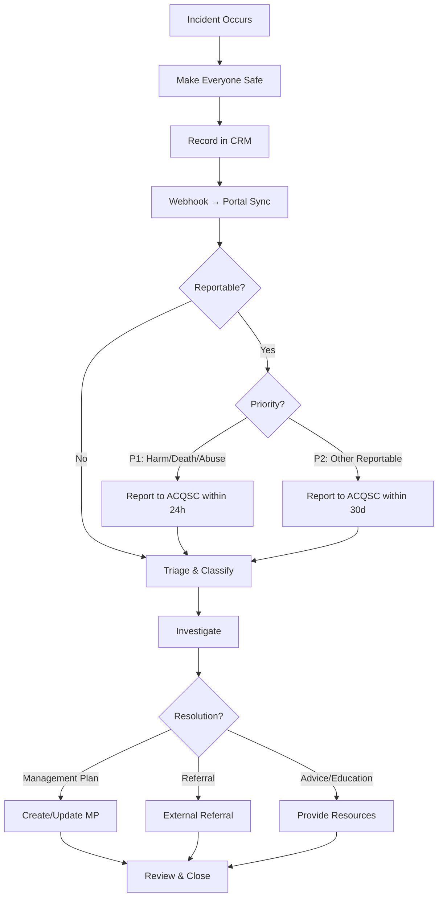
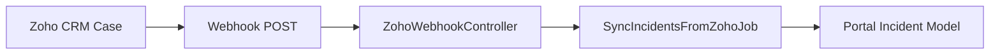
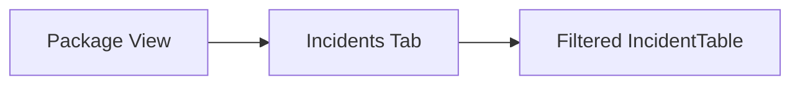
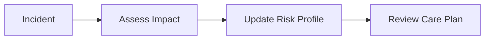

> Track, triage, and report clinical incidents for regulatory compliance and quality improvement

---

## Quick Links

| Resource | Link |
|----------|------|
| **Portal** | [Incidents List](https://tc-portal.test/staff/incidents) |
| **Portal** | [Package Incidents](https://tc-portal.test/staff/packages/{id}/incidents) |
| **Nova Admin** | [Incidents](https://tc-portal.test/nova/resources/incidents) |
| **CRM** | Zoho Cases Module |
| **Initiative** | [Incident Management Epic](/initiatives/Clinical-And-Care-Plan/Incident-Management/) |

---

## TL;DR

- **What**: Record, classify, triage, and resolve clinical incidents that occur during care delivery
- **Who**: Clinical Team, Care Partners, POD Leaders, Operations
- **Key flow**: Incident Occurs → Recorded in CRM → Synced to Portal → Triaged → Investigated → Resolved
- **Watch out**: Incidents currently live in Zoho CRM and sync one-way to Portal via webhook; SIRS reportable incidents have strict 24h/30d timeframes

---

## Key Concepts

| Term | What it means |
|------|---------------|
| **Incident** | An event during care delivery that caused or could cause harm (accident, clinical event, deterioration) |
| **SIRS** | Serious Incident Response Scheme — mandatory reporting framework under the Aged Care Act 2024 |
| **Reportable Incident** | An incident that must be reported to the ACQSC (unreasonable force, sexual contact, abuse, death, neglect, restrictive practices, unexplained absence) |
| **Priority 1** | Reportable incident that has/could cause harm requiring treatment — report within 24 hours |
| **Priority 2** | All other reportable incidents — report within 30 days |
| **Triage Category** | Internal severity classification (CAT 1–5), separate from SIRS Priority |
| **Classification** | Whether the incident is Clinical, Non-clinical, or SIRS-reportable |
| **Origin** | How the event arose — Incident, Accident, or Change/Deterioration |
| **IMS** | Incident Management System — mandatory condition of registration under the Aged Care Act 2024 |
| **Management Plan** | A resolution pathway linking incident outcomes to clinical recommendations |

---

## How It Works

### Main Flow: Incident Lifecycle



### Other Flows

<details>
<summary><strong>Zoho CRM Sync</strong> — webhook integration</summary>

Incidents are created and managed in Zoho CRM (Cases module). A webhook fires on CRM changes, dispatching `SyncIncidentsFromZohoJob` to update the Portal.



The sync is one-directional (CRM → Portal). The Portal provides read-only views.

</details>

<details>
<summary><strong>Package Incidents Tab</strong> — per-recipient view</summary>

Each care package has an Incidents tab showing only that recipient's incidents.



</details>

<details>
<summary><strong>Incident → Risk Update</strong> — risk profile linkage</summary>

When an incident reveals new risks, the risk profile should be updated and care plan reviewed (mandatory under Section 8.6.2 of the Support at Home Program Manual).



</details>

---

## Reportable Incidents (SIRS)

Under the Aged Care Act 2024 (Sections 164 and 166), the following are reportable:

| Type | Description |
|------|-------------|
| **Unreasonable use of force** | Physical force beyond what is reasonably necessary |
| **Unlawful sexual contact** | Or inappropriate sexual conduct |
| **Psychological or emotional abuse** | Including intimidation, threats, humiliation |
| **Unexpected death** | Death that is not expected or explained |
| **Stealing or financial coercion** | Financial abuse of any kind |
| **Neglect** | Failure to provide adequate care or supervision |
| **Inappropriate use of restrictive practice** | Chemical, physical, mechanical, environmental restraint |
| **Unexplained absence from care** | Consumer missing from service |

### Priority Decision Tree

| Question | If YES |
|----------|--------|
| Has/could the incident cause physical or psychological harm requiring treatment? | **Priority 1** (24h) |
| Did it involve unlawful sexual contact, unexpected death, or unexplained absence? | **Priority 1** (24h) |
| Are there reasonable grounds to report to police? | **Priority 1** (24h) |
| None of the above, but still reportable? | **Priority 2** (30d) |

Reportable incidents are submitted via the **My Aged Care Provider Portal** (not TC Portal).

---

## Harm Classification (Revised Form — V2)

The revised incident form (draft V2, Sep 2025) replaces the internal-only CAT 1–5 system with a 4-tier harm classification designed for use by all reporters (care recipients, family, support workers, clinicians):

| Tier | Category | Timeframes for Action | Examples |
|------|----------|----------------------|----------|
| 🔴 | **1. Severe Harm** | Call 000 & notify provider immediately; act within 24h | Heart attack, stroke, fall with head injury, ICU |
| 🟠 | **2. Moderate Harm** | Notify within 1 business day; act within 2 days | Ambulance/emergency hospital, police involvement |
| 🟡 | **3. Low Harm** | Notify within 2 business days; review within 5 days | Minor injury, first aid, GP follow-up |
| ⚪ | **4. Clinical Notification Only** | Notify within 5 business days; record in care plan | No harm, new diagnosis, planned hospital admission |

### Legacy Triage Categories (Internal)

The internal CAT 1–5 system is still used within the IMS for operational triage:

| Category | Description | Response |
|----------|-------------|----------|
| **CAT 1** | Critical — immediate risk to life | Same-day clinical escalation |
| **CAT 2** | High — serious harm potential | Within 24 hours |
| **CAT 3** | Medium — moderate harm | Within 48 hours |
| **CAT 4** | Low — minor impact | Within 5 days |
| **CAT 5** | Minimal — observation only | Routine review |

---

## Business Rules

| Rule | Why |
|------|-----|
| **All incidents recorded in CRM** | Single source of truth during transition (Portal migration planned) |
| **SIRS incidents reported within 24h/30d** | Regulatory compliance (Aged Care Act 2024 s164, s166) |
| **Incident triggers care plan review** | Mandatory under Support at Home Program Manual s8.6.2 |
| **Clinical nurse review tracked** | `is_reviewed` flag for governance |
| **Hospitalisation tracked** | `is_hospitalised` flag for severity monitoring |
| **Resolution must be documented** | Management plan, referral, advice, education, or other |
| **SIRS reporting is not billable** | Excluded from claimable care management activities |
| **Incident reviewer checks SIRS alignment** | All forms must be double-checked for SIRS before closure |
| **Priority assigned within 24h of receipt** | Line manager/clinical lead must classify P1/P2 within 24h |
| **Police notification mandatory for criminal incidents** | Assault, sexual misconduct, theft, unlawful restraint — documented in IMS |
| **Trend analysis required** | Revised form captures "Has this happened before?" and "Part of a trend?" |
| **Open disclosure required** | Client/representative must be informed of incident and actions taken |
| **Incident can trigger clinical pathway/case** | Incidents may create mandatory or recommended cases (future state) |

---

## Regulatory Context

### Aged Care Act 2024
- **Section 16(1)**: Providers must notify the Commission when a reportable incident occurs
- **Sections 164 & 166**: Primary incident management and reporting requirements
- **Effective Nov 1, 2025**: Expanded definitions of reportable incidents to all funded aged care (including home care)

### Draft Aged Care Rules 2025
- Providers must maintain a documented incident management system
- Reporting form must align with the rules for compliance

### Strengthened Quality Standards
- **Standard 2 (The Organisation)**: Organisational governance including incident management systems
- **Standard 5 (Clinical Care), Outcome 5.1**: Clinical governance framework must include incident management
- **All providers** must meet Outcome 5.1, even non-clinical providers

### Support at Home Program Manual (V4.2)
- **Section 3.4**: SIRS obligations overview
- **Section 8.6.2**: Incident-triggered care plan review
- **Section 8.7**: Incidents must be recorded in care notes or dedicated IMS
- **Section 10.10**: Elder abuse reporting obligations
- **Section 11.5.1**: Third-party workers must be trained in incident management procedures

### Guiding Principles (from Best Practice Guide)

The Trilogy Care Client Incident & Deterioration Guide (Oct 2025) establishes 8 principles:

1. **Consumer-Centred and Rights-Based** — dignity, autonomy, culturally safe communication
2. **Timely Identification and Responsive Action** — proportionate to risk level
3. **Shared Accountability in Self-Managed Models** — Trilogy remains legally responsible as registered provider
4. **Transparency and Open Disclosure** — inform consumers of events, actions, and care plan changes
5. **Integration of Clinical Oversight** — RNs/care partners assess whether changes require care plan amendment, specialist referral, or escalation
6. **Consistency in Recording and Classification** — IMS for all incidents, deterioration, outcomes, follow-up
7. **Preventative Learning and Continuous Improvement** — analyse data, identify systemic risks, drive training
8. **Safe, Inclusive Environments** — protect from harm/abuse/neglect including anonymous reporting option

---

## Revised Incident Form (V2 — Sep 2025)

Marianne (Clinical Governance) has completed a full redesign of the incident reporting form following stakeholder consultation across care partners, clinicians, pod leaders, and operations. The revised form is designed for **all reporters** (care recipients, family, support workers, clinicians) using plain language and low health literacy.

### Form Sections
1. **Client Identification** — name, DOB, Support at Home ID/address
2. **Incident Details** — date, time, location, care context, recurrence/trend tracking
3. **Reporter Details** — name, contact, relationship to care recipient
4. **What Happened** — free text in plain language
5. **Harm Classification** — 4-tier severity scale with built-in timeframes (see Harm Classification above)
6. **Client Outcomes** — tick-all-that-apply checklist (mental health crisis, hospital admission, ambulance, police, first aid, GP follow-up, new diagnosis, behaviour change, no harm)
7. **Actions Taken** — structured checklist (first aid, called 000, contacted supporter, removed hazard, etc.)
8. **Escalation Details** — who contacted, when, outcome
9. **Follow-up Plan** — GP appointment, care plan update, monitoring requirements
10. **Client Notification** — was client/rep informed, date/method, feedback

### Client Outcome Categories (Revised)

| Outcome | Examples |
|---------|----------|
| Mental health crisis or serious psychological distress | Suicidal thoughts, panic attack, aggressive behaviour |
| Hospital admission (unplanned) | Sudden illness, emergency presentation |
| Hospital admission (planned or elective) | Booked surgery, cancer treatment |
| Ambulance called but not transported | Assessed on site |
| Police involvement | Welfare check, investigation |
| First aid only | Cleaned wound, bandage |
| GP, specialist or allied health follow-up | Doctor or physio later |
| New diagnosis | Cancer, diabetes, dementia |
| Behaviour change noted | Confusion, agitation, distress |
| No injury or harm occurred | Near-miss, observation |

### What's Handled Outside the Form (in IMS)
- Root cause analysis and closure sign-off
- SIRS category identification and Priority 1/2 classification
- Police notification tracking (mandatory for criminal incidents)
- Clinical governance committee review
- Corrective and preventive actions

### Documentation
- [Documentation Review](/initiatives/Clinical-And-Care-Plan/Incident-Management/context/rich_context/Incident%20Reporting%20Documentation%20Review%20September%202025) — full gap analysis of current vs revised form
- [New Form Draft V2](/initiatives/Clinical-And-Care-Plan/Incident-Management/context/rich_context/New%20Incident%20Form%20Draft%20V2) — complete form specification
- [Best Practice Guide](/initiatives/Clinical-And-Care-Plan/Incident-Management/context/rich_context/Trilogy%20Care%20Best%20Practice%20Guide%20Incident%20Management) — guiding principles

---

## Clinical Governance Framework

### Monthly Governance Review
- All SIRS incidents, priority classifications, and police-notifiable matters reviewed
- Trend analysis for systemic risks (frequent falls, repeated mental health crises, theft patterns)
- Corrective actions assigned (policy updates, staff retraining, environmental modifications)
- Quarterly summary report submitted to Board/Executive

### Governance Committee Responsibilities
- Review patterns and trends across incidents
- Confirm root cause analyses were completed
- Track corrective action implementation and effectiveness
- Feed learnings into continuous improvement plans

### Clinical Governance Roles (In Progress)
Marianne hiring 3 new clinical governance roles focused on:
1. **Incident Management** — primary focus
2. **Assurance** — running clinical audits
3. **Audits** — Commission readiness

### Independent Advisory Board (Planned)
- Clinical advisory board with independent members (not just internal staff)
- Needed as client base approaches 20,000
- Monthly operational safety and quality meetings with Erin and Pat

### April Falls Month Education Initiative
- Major falls prevention education program planned for April 2026
- Risk framework and assessment tools will be socialised with clinicians during this campaign
- Supports reducing falls incidents and related hospitalisations through proactive management

---

## Portal Migration Strategy

From the Feb 11, 2026 meeting, Marianne outlined the interim and target state for incidents in Portal:

### Interim Approach
- Incidents **could remain in Zoho CRM** for management and triage
- Care partners **cannot access Zoho** — they need Portal for viewing and raising incidents
- Web form (same as current) feeds into Portal — "if the web form is the same and it can just be pulled into Portal"
- Care partners can **view incidents** from Portal even if editing stays in CRM
- New incident creation via **web form** that goes to CRM/Portal

### Target State
- Portal becomes the **primary IMS** for care partners and clinicians
- Full CRUD in Portal (not just read-only)
- Incident → Case automation (incidents trigger clinical pathways)
- Interconnected with risk register, needs, budgets
- Complaints follow the same web form → Portal pattern

---

## Common Issues

<details>
<summary><strong>Issue: Incident not synced to Portal</strong></summary>

**Symptom**: CRM case updated but Portal not reflecting changes

**Cause**: Webhook failed or `SyncIncidentsFromZohoJob` errored

**Fix**: Check Horizon for failed jobs; manually dispatch `SyncIncidentsFromZohoJob::dispatch($zohoId)`

</details>

<details>
<summary><strong>Issue: Missing package link</strong></summary>

**Symptom**: Incident synced but no package association

**Cause**: Zoho Care Plan ID doesn't match any Portal package `zoho_id`

**Fix**: Sync the package first, then re-run incident sync

</details>

<details>
<summary><strong>Issue: Edit page not working</strong></summary>

**Symptom**: Route `incidents.edit` returns error

**Cause**: `Incidents/Edit.vue` page does not exist — `EditIncidentAction` references a non-existent Vue page

**Fix**: Known gap; incidents are currently read-only in Portal

</details>

---

## Who Uses This

| Role | What they do |
|------|--------------|
| **Clinical Team** | Review incidents, clinical governance, SIRS reporting |
| **Care Partners** | Report incidents in CRM, monitor via Portal |
| **POD Leaders** | Oversee incident resolution in their portfolio |
| **Operations** | Manage SIRS submissions to ACQSC via My Aged Care Provider Portal |
| **Compliance** | Audit incident management processes, regulatory reporting |

---

## Key Metrics

| Metric | Context |
|--------|---------|
| **~2,781 incidents per quarter** | Reported at May 2025 CQCC meeting |
| **SIRS breakdown** | Tracked quarterly for Commission compliance |
| **Clinical vs Non-clinical ratio** | Monitored for pattern analysis |
| **Resolution timeframes** | Measured against triage category SLAs |
| **Management plan conversion rate** | % of incidents resulting in updated management plans |

---

## Technical Reference

<details>
<summary><strong>Models & Database</strong></summary>

### Models

```
domain/Incident/Models/
├── Incident.php                # Main incident model (SoftDeletes, HasHashId, LogsActivity)
└── IncidentOutcome.php         # Outcome lookup (BelongsToMany via incident_outcome pivot)
```

### Tables

| Table | Purpose |
|-------|---------|
| `incidents` | Incident records with package_id, zoho_id, classification, triage, etc. |
| `incident_outcomes` | Outcome labels (permanent injury, elder abuse) |
| `incident_outcome` | Pivot table linking incidents ↔ outcomes |

### Key Columns (incidents)

| Column | Type | Description |
|--------|------|-------------|
| `ref` | string | Unique hash reference |
| `zoho_id` | string | Zoho CRM identifier |
| `package_id` | FK | Associated care package |
| `supplier_id` | FK | Associated supplier (nullable) |
| `occurred_date` | date | When incident occurred |
| `reported_date` | date | When incident was reported |
| `reported_by` | string | Person who reported |
| `description` | text | Incident details |
| `solution` | text | Resolution details |
| `origin` | string | Incident/Accident/Change (IncidentOriginEnum) |
| `stage` | string | 0.New → 3.Resolved (IncidentStageEnum) |
| `classification` | string | Clinical/Non-clinical/SIRS (IncidentClassificationEnum) |
| `triage_category` | string | CAT 1–5 (IncidentTriageCategoryEnum) |
| `resolution` | string | Management plan/Referral/Advice/etc. (IncidentResolutionEnum) |
| `is_reviewed` | bool | Reviewed by clinical nurse |
| `is_hospitalised` | bool | Hospitalisation occurred |
| `zoho_object` | json | Raw Zoho CRM data |

</details>

<details>
<summary><strong>Enums</strong></summary>

| Enum | Cases |
|------|-------|
| **IncidentOriginEnum** | `INCIDENT`, `ACCIDENT`, `CHANGE_DETERIORATION` |
| **IncidentStageEnum** | `NEW` (0.), `PENDING` (1.), `ESCALATED` (2.), `RESOLVED` (3.), `INSUFFICIENT_COLLECTION` (9.) |
| **IncidentClassificationEnum** | `CLINICAL`, `NON_CLINICAL`, `SIRS` |
| **IncidentTriageCategoryEnum** | `CAT_1` through `CAT_5` |
| **IncidentResolutionEnum** | `MANAGEMENT_PLAN`, `REFERRAL`, `ADVICE`, `EDUCATION_RESOURCES_SENT`, `OTHER` |
| **IncidentOutcomeEnum** | `PERMANENT_INJURY`, `ELDER_ABUSE` |

</details>

<details>
<summary><strong>Actions & Jobs</strong></summary>

```
domain/Incident/Actions/
├── ListIncidentsAction.php        # Renders Incidents/Index via Inertia
└── EditIncidentAction.php         # Renders Incidents/Edit (page missing)

domain/Incident/Jobs/
└── SyncIncidentsFromZohoJob.php   # Syncs from Zoho CRM Cases module
```

</details>

<details>
<summary><strong>Data Transfer Objects</strong></summary>

```
domain/Incident/Data/
├── IncidentData.php               # TypeScript-transformable DTO
├── IncidentOutcomeData.php        # Outcome label/value DTO
├── IncidentZohoData.php           # Zoho CRM Cases mapping
└── IncidentZohoCarePlanData.php   # Zoho Care Plan reference
```

</details>

<details>
<summary><strong>Frontend Pages</strong></summary>

```
resources/js/Pages/
├── Incidents/
│   └── Index.vue                  # Global incidents list (CommonTable)
└── Packages/tabs/
    └── PackageIncidents.vue       # Package-scoped incidents tab
```

**Missing**: `Incidents/Edit.vue` — referenced by `EditIncidentAction` but does not exist.

</details>

<details>
<summary><strong>Routes & API</strong></summary>

| Method | Endpoint | Handler | Name |
|--------|----------|---------|------|
| GET | `/incidents` | ListIncidentsAction | incidents.index |
| GET | `/incidents/{incident}/edit` | EditIncidentAction | incidents.edit |
| POST | `/api/webhooks/zoho/incident` | ZohoWebhookController@updateIncident | — |

</details>

---

## Testing

### Factories & Seeders

```php
// Create an incident
Incident::factory()->create();

// Create incidents for a package
Incident::factory()->count(5)->for($package)->create();

// Seed sample data (20 incidents with random outcomes)
php artisan db:seed --class=IncidentSeeder
```

### Key Test Scenarios

- [ ] Zoho webhook dispatches SyncIncidentsFromZohoJob
- [ ] Sync job creates incident with correct field mappings
- [ ] Sync job updates existing incident (by zoho_id)
- [ ] Missing package triggers package sync before incident creation
- [ ] Incidents list renders with correct table columns
- [ ] Package incidents tab filters by package_id
- [ ] Triage categories display correctly
- [ ] SIRS classification flag applied when appropriate

---

## Stakeholder Vision (from Fireflies Meetings)

| Date | Source | Key Insight |
|------|--------|-------------|
| Feb 2, 2026 | Engineering Huddle | Decision made to move incident management from CRM to Portal |
| Sep 3, 2025 | Sian Holman | Vision for Riskman-style system with auto-escalation, integrated notifications |
| May 9, 2025 | CQCC | 2,781 incidents/quarter; SIRS breakdown; MP over-reporting fix needed |
| Aug 6, 2024 | CQCC | Triage category system implementation |
| Oct 28, 2024 | Commission Audit Prep | Incident management preparedness for regulatory audits |
| Feb 11, 2026 | Clinical Product Requirements (Marianne) | Incident → Case automation; redesigned form based on SIRS requirements; triage improvements; Portal as primary for care partners; web form intake to Portal; April Falls Month education program; complaints follow same pattern |

---

## Open Questions

| Question | Context |
|----------|---------|
| **When does CRM → Portal migration happen?** | Feb 2026 decision to move, but no timeline set |
| **Will incidents become editable in Portal?** | Edit action exists but no Vue page; currently read-only |
| **How will SIRS reporting integrate?** | Currently submitted via My Aged Care Provider Portal separately |
| **What about incident-to-risk auto-linking?** | Incidents should update risk profiles but no automation exists |
| **Export functionality?** | `IncidentTable::exports()` returns empty — no export implemented |
| **Incident → Case automation scope?** | Marianne wants incidents to automatically trigger clinical pathways/cases — scope and rules TBD |
| **~~Redesigned form availability?~~** | ✅ Resolved — form V2 completed Sep 2025 with full stakeholder consultation. See rich_context docs |
| **Which form fields map to Portal model?** | New form V2 has fields not yet in the Portal data model (trend tracking, escalation details, follow-up plan, harm classification) |
| **How will self-managed model reporting work?** | Best practice guide establishes shared accountability — Trilogy remains responsible even when client self-manages |
| **Care partner survey on MP pain points?** | Marianne planning team survey — findings will inform Portal redesign |

---

## Related

### Domains

- [Risk Management](/features/domains/risk-management) — incidents may identify new risks
- [Management Plans](/features/domains/management-plans) — management plan is a resolution pathway
- [Care Plan](/features/domains/care-plan) — incidents trigger mandatory care plan review
- [Complaints](/features/domains/complaints) — some incidents may also generate complaints
- [Activity Log](/features/domains/activity-log) — incident activities logged via Spatie

### Initiatives

| Epic | Status | Description |
|------|--------|-------------|
| [ICM - Incident Management](/initiatives/Clinical-And-Care-Plan/Incident-Management/) | Backlog (P3) | Full incident management module in Portal |
| [CLI - Clinical Portal Uplift](/initiatives/Clinical-And-Care-Plan/Clinical-Portal-Uplift/) | Start (P2) | Parent initiative including incident management |

---

## Status

**Maturity**: In Development (V1 — read-only sync from CRM)
**Initiative**: Clinical & Care Plan
**Owner**: Sian H / Clinical Team

---

## Source Documents

| Document | Date | Author | Location |
|----------|------|--------|----------|
| Incident Reporting Documentation Review | Sep 2025 | Marianne (Clinical Governance) | [rich_context](/initiatives/Clinical-And-Care-Plan/Incident-Management/context/rich_context/) |
| New Incident Form Draft V2 | Nov 2025 | Marianne (Clinical Governance) | [rich_context](/initiatives/Clinical-And-Care-Plan/Incident-Management/context/rich_context/) |
| Client Incident & Deterioration Guide (Best Practice) | Oct 2025 | Marianne (Clinical Governance) | [rich_context](/initiatives/Clinical-And-Care-Plan/Incident-Management/context/rich_context/) |

---

## Source Meetings

| Date | Meeting | Key Topics |
|------|---------|------------|
| Feb 11, 2026 | Clinical Product Requirements (Marianne) | Redesigned incident form, triage improvements, incidents triggering cases/pathways, Portal migration priority |
| Feb 2, 2026 | Engineering Huddle | Decision to move incidents from CRM to Portal |
| Sep 3, 2025 | Care/Clinical/Assessment Teams | Riskman vision, auto-escalation, integrated workflow |
| May 9, 2025 | CQCC | Volume data, SIRS breakdown, management plan reporting |
| Oct 28, 2024 | Commission Audit Prep | Regulatory readiness for incident management |
| Aug 6, 2024 | CQCC | Triage category implementation |
