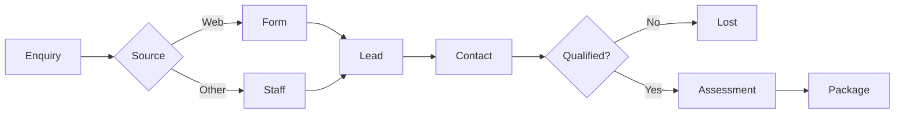

> Sales pipeline, lead tracking, and onboarding

---

## Quick Links

| Resource | Link |
|----------|------|
| **Portal** | [Lead List](https://tc-portal.test/staff/leads) |
| **Nova Admin** | [Leads](https://tc-portal.test/nova/resources/leads) |

---

## TL;DR

- **What**: Track prospective consumers from enquiry through to package activation
- **Who**: Growth team, Care Partners
- **Key flow**: Enquiry → Qualification → Assessment → Package Created
- **Watch out**: Leads sync to Zoho CRM - changes propagate bidirectionally

---

## Key Concepts

| Term | What it means |
|------|---------------|
| **Lead** | Prospective consumer who has enquired about services |
| **Lead Stage** | Pipeline position (New, Contacted, Qualified, Won/Lost) |
| **Lead Owner** | Sales team member assigned to lead |
| **Lead Source** | Origin of enquiry (web, phone, referral, hospital) |
| **Conversion** | When a lead becomes an active package/recipient |

---

## How It Works

### Main Flow: Lead to Package



---

## Lead Stages

| Stage | Description |
|-------|-------------|
| **New** | Initial enquiry received |
| **Contacted** | First contact made |
| **Qualified** | Meets criteria for HCP |
| **Proposal** | Service proposal sent |
| **Won** | Converted to package |
| **Lost** | Did not convert |

---

## Business Rules

| Rule | Why |
|------|-----|
| **Email required** | Need contact method for follow-up |
| **One active lead per email** | Prevent duplicates |
| **Can't delete converted leads** | Audit trail for package history |

---

## Who Uses This

| Role | What they do |
|------|--------------|
| **Growth Team** | Create leads, track pipeline, follow up |
| **Care Partners** | Convert qualified leads to packages |

---

## Open Questions

| Question | Context |
|----------|---------|
| **Why don't LeadSource and LeadActivity models exist?** | Docs reference these models but they don't exist in codebase |
| **Why don't lead_sources and lead_activities tables exist?** | Referenced tables not found - data stored in JSON metadata instead |
| **How is lead source tracked without a model?** | Source is stored in `tracking_meta` JSON field with UTM parameters |
| **How are activities tracked without LeadActivity?** | Journey steps tracked in `journey_meta` JSON field |
| **What triggers Zoho sync vs Klaviyo sync?** | Both integrations exist but sync logic unclear |

---

## Technical Reference

<details>
<summary><strong>Models & Database</strong></summary>

### Models (Actual - differs from docs)

**Note**: `LeadSource.php` and `LeadActivity.php` do NOT exist.

```
domain/Lead/Models/
├── Lead.php                 # Main lead model with JSON metadata
├── LeadContent.php          # Onboarding content/resources
├── LeadOwner.php            # Portal user model
└── LeadResource.php         # Downloadable materials
```

### Tables

| Table | Purpose |
|-------|---------|
| `leads` | Lead records with JSON metadata columns |

**Note**: `lead_sources` and `lead_activities` tables do NOT exist.

### JSON Metadata Fields

Lead uses 3 JSON fields instead of separate tables:

| Field | Purpose | Data Class |
|-------|---------|------------|
| `tracking_meta` | UTM params, device, referrer, landing page | `LeadTrackingMetaData` |
| `recipient_meta` | Recipient details, care needs, living situation | `LeadRecipientMetaData` |
| `journey_meta` | Journey progress/completion tracking | `LeadJourneyStepData` |

</details>

<details>
<summary><strong>Lead Stages (Enum-based)</strong></summary>

Stages tracked via `LeadJourneyStageEnum`, not database table:

**Tracking Stages:**
- `UNKNOWN` → "T-Unknown"
- `NEVER_SPOKEN_TO_MAC` → "T-Never Spoken to MAC"

**Monitoring Stages:**
- `INITIATED_MAC_REFERRAL` → "M-Initiated MAC Referral"
- `RAS_IN_PROGRESS` → "M-RAS in Progress"
- `RECEIVING_CHSP` → "M-Receiving CHSP"
- `ACAT_BOOKED` → "M-ACAT Booked"
- `ACAT_ASSESSMENT_CONDUCTED` → "M-ACAT Assessment Conducted"

**Billing Stages:**
- `ALLOCATED_HCP` → "B-Allocated HCP"
- `ACTIVE` → "B-Active"
- `INACTIVE` → "B-Inactive"

</details>

<details>
<summary><strong>Zoho CRM Integration</strong></summary>

Bidirectional sync fully implemented:

| Component | Purpose |
|-----------|---------|
| `SyncLeadsToZohoJob` | TC Portal → Zoho sync |
| `UpdateLeadFromZohoAction` | Zoho → TC Portal sync |
| `CheckIfZohoLeadIsValidAction` | Validates Zoho lead has required fields |
| `LeadSyncStatusEnum` | NOT_SYNCED, SYNCED, NEED_RESYNC, SYNCED_FROM_ZOHO |

Maps 81 fields to Zoho including Portal_ID, Trilogy_Care_ID, recipient details.

After Zoho sync, leads are also synced to Klaviyo via `UpsertKlaviyoProfileAction`.

</details>

---

## Related

### Domains

- [Package Contacts](/features/domains/package-contacts) — converted leads become recipients

### Integrations

- [Zoho CRM](/features/integrations/zoho-crm) — bidirectional lead sync

---

## Current Challenges

From Fireflies meetings (Aug 2025 - Jan 2026):

| Challenge | Impact |
|-----------|--------|
| **Fast Lane onboarding** | Need rapid pathway from lead to service delivery |
| **Zoho CRM integration** | Bidirectional sync for TCID and booking data |
| **Assessment booking delays** | Two-week advance booking limits |
| **Client cohort tracking** | Three distinct client cohorts identified |

---

## Fast Lane Integration

### Lead to Service Acceleration

Fast Lane onboarding connects lead management to rapid service delivery:

| Phase | Description |
|-------|-------------|
| **Lead capture** | Enquiry received via portal or CRM |
| **Fast qualification** | Rapid eligibility assessment |
| **SimplyBook integration** | Booking links in lead emails |
| **Expedited assessment** | Streamlined assessment scheduling |

---

## CRM Integration

### Zoho CRM Sync

| Feature | Status |
|---------|--------|
| **TCID integration** | Custom fields in SimplyBook |
| **Booking sync** | API integration (planned) |
| **Lead data** | Bidirectional sync |
| **Activity tracking** | Timeline sync to CRM |

---

## Client Cohorts

Three client cohorts identified in onboarding:

| Cohort | Description |
|--------|-------------|
| **Self-managed** | Clients managing their own packages |
| **Family-assisted** | Family members involved in care decisions |
| **Full-support** | Requires comprehensive coordinator support |

---

## Status

**Maturity**: Production
**Pod**: Growth
**Owner**: Growth Team

---

## Source Meetings

| Date | Meeting | Key Topics |
|------|---------|------------|
| Jan 30, 2026 | BRP January 26 | Fast Lane, onboarding integration |
| Oct 3, 2025 | SimplyBook POC | CRM sandbox integration, TCID |
| Sep 10, 2025 | DD Integration | Three client cohorts, CRM integration |
