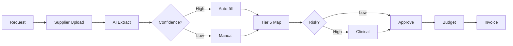
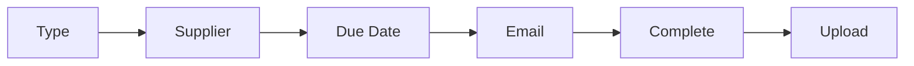
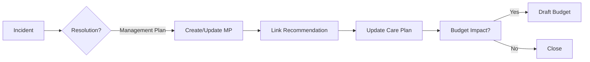
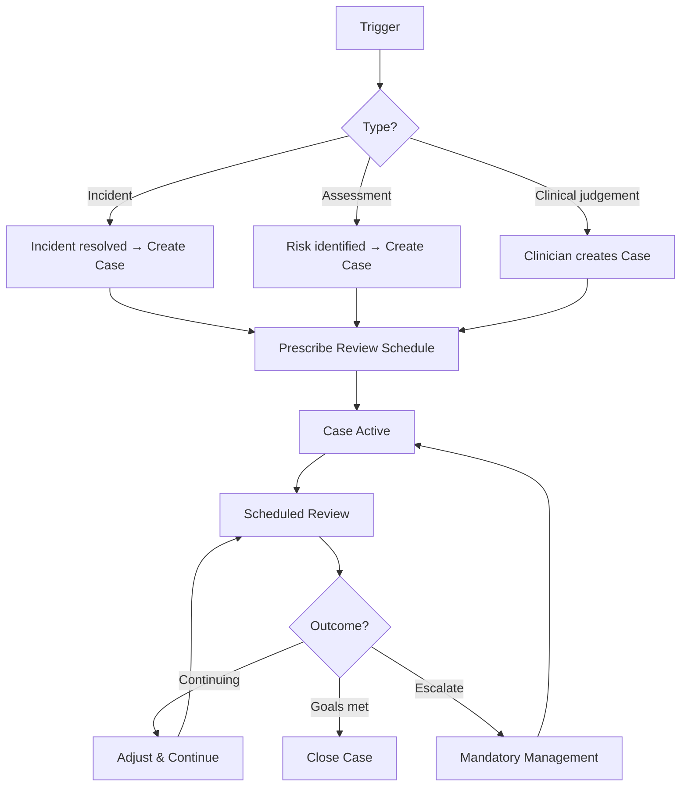
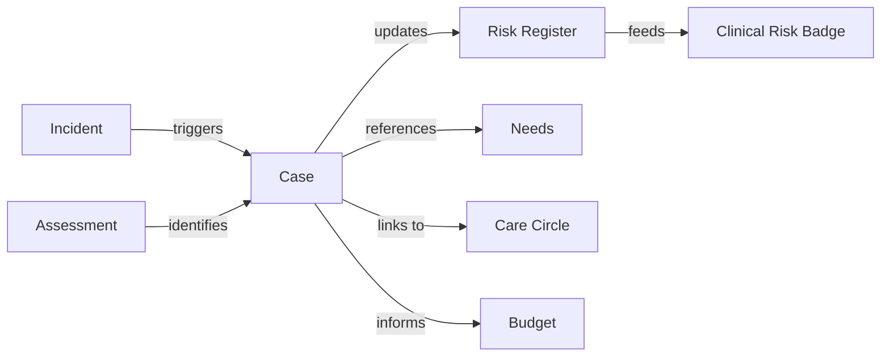

> Clinical recommendations driving service delivery, incident resolution, and budget allocation

---

## Quick Links

| Resource | Link |
|----------|------|
| **Portal** | [Package Care Plan](https://tc-portal.test/staff/packages/{id}/care-plan) |
| **Nova Admin** | [Assessments](https://tc-portal.test/nova/resources/assessments) |

---

## TL;DR

- **What**: Upload and manage clinical recommendations/prescriptions that justify services and items in care plans
- **Who**: Care Partners, Clinical Team, Assessment Team, Suppliers
- **Key flow**: Assessment Request → Supplier Completes → AI Extraction → Recommendation Linked to Budget
- **Watch out**: Items require valid recommendations linked to tier 5 ISO codes for billing compliance

---

## Key Concepts

| Term | What it means |
|------|---------------|
| **Management Plan** | Clinical document (OT letter, GP prescription) recommending services or items |
| **Recommendation** | Specific service or item recommended within a management plan |
| **Prescription** | Alternative term for recommendation - formal clinical direction |
| **Tier 5 ISO Code** | Standard classification code for billing and claims |
| **Inclusion** | Formal approval process for adding recommended items to budgets |

---

## How It Works

### Main Flow: Assessment to Budget



### Other Flows

<details>
<summary><strong>Care Partner Upload</strong> — internal document submission</summary>

Care partners can upload assessment documents directly without supplier involvement.


</details>

<details>
<summary><strong>Supplier Assessment Request</strong> — external professional engagement</summary>

Request assessments from registered suppliers (OTs, GPs, etc.)



</details>

---

## Business Rules

| Rule | Why |
|------|-----|
| **Tier 5 mapping required** | ATHM billing compliance requires ISO code classification |
| **Low-risk items self-approved** | Care partners can approve without clinical review |
| **High-risk items require clinical review** | 10% audit sample for governance compliance |
| **Funding secured before budget** | Inclusion approval must precede budget entry |
| **Multiple professionals allowed** | Some items can be prescribed by various health professionals |
| **Incident resolution creates MP** | When an incident resolves via "Management plan", the MP links to the incident |
| **Care plan review on incident** | Incidents mandate care plan review per SAH Manual s8.6.2, which may update MPs |

---

## Incident Resolution Pathway

Management plans serve as a key resolution pathway for clinical incidents. When an incident's resolution is set to "Management plan" (`IncidentResolutionEnum::MANAGEMENT_PLAN`), a clinical recommendation is created or updated to address the incident's root cause.



### Regulatory Context

The Support at Home Program Manual (V4.2) requires:
- **Section 8.6**: Care plans must include "strategies for the identification and management of risks"
- **Section 8.6.2**: Care plan review triggered when "risks emerge or an incident occurs"
- **Section 8.7**: Incidents must be recorded in care notes or a dedicated IMS
- **Standard 5, Outcome 5.1**: Clinical governance framework must cover incident-driven management plans

---

## Risk Classification

| Risk Level | Examples | Approval |
|------------|----------|----------|
| **Low** | Continence aids, basic mobility items | Care Partner |
| **Medium** | Complex equipment, home modifications | Clinical Review (sample) |
| **High** | Significant clinical interventions | Full Clinical Review |

---

## AI Features

### Document Analysis

The system uses AI to:

- **Extract assessor details** (name, registration number, role)
- **Identify client information** (name, date of birth)
- **Parse recommendations** from free-text documents
- **Map to Tier 5 codes** automatically
- **Flag low-confidence** extractions for manual review

### Visual Indicators

- **Spark stars** indicate AI-generated fields
- **Confidence scores** show extraction reliability
- **Manual override** always available

---

## Common Issues

<details>
<summary><strong>Issue: Invoice on hold - no matching recommendation</strong></summary>

**Symptom**: Invoice stuck in "on hold" status

**Cause**: No tier 5 mapping exists for the billed item

**Fix**: Care partner must link assessment recommendation to service plan item, or initiate new inclusion

</details>

<details>
<summary><strong>Issue: AI extraction incorrect</strong></summary>

**Symptom**: Wrong data pre-filled from document

**Cause**: Low AI confidence or unusual document format

**Fix**: Use manual override to correct fields; AI learns from corrections

</details>

---

## Who Uses This

| Role | What they do |
|------|--------------|
| **Care Partners** | Request assessments, upload documents, approve low-risk items |
| **Clinical Team** | Review high-risk recommendations, provide governance |
| **Suppliers** | Complete assessment requests, upload documentation |
| **Assessment Team** | Coordinate assessment scheduling and follow-up |

---

## Technical Reference

<details>
<summary><strong>Models & Database</strong></summary>

### Models

```
domain/Assessment/Models/
├── Assessment.php              # Main assessment record
├── AssessmentRequest.php       # Request to supplier
├── Recommendation.php          # Individual recommendation
└── TierFiveMapping.php         # ISO code mappings

domain/Package/Models/
├── PackageInclusion.php        # Inclusion approval
└── ServicePlanItem.php         # Budget/service items
```

### Tables

| Table | Purpose |
|-------|---------|
| `assessments` | Assessment document records |
| `assessment_requests` | Requests sent to suppliers |
| `recommendations` | Extracted recommendations |
| `tier_five_mappings` | ISO code reference data |
| `package_inclusions` | Approved inclusions |

</details>

<details>
<summary><strong>Actions & Services</strong></summary>

```
domain/Assessment/Actions/
├── CreateAssessmentRequestAction.php
├── ProcessAssessmentUploadAction.php
├── ExtractRecommendationsAction.php      # AI extraction
├── MapToTierFiveAction.php
└── ApproveRecommendationAction.php
```

</details>

---

## Integration Points

### Budget Integration

- Recommendations link to service plan items
- Funding stream validation before budget entry
- Draft budgets created for new items

### Claims Integration

- Tier 5 mapping enables claims submission via API
- Multiple assessments can recommend same item (latest/verified preferred)
- OT recommendations prioritized in hierarchy

### Supplier Integration

- Supplier selection filtered by assessment type
- Prioritized by: existing relationships, location, fees
- Onboarding invite for non-registered suppliers

---

## Testing

### Factories & Seeders

```php
// Create assessment with recommendations
$assessment = Assessment::factory()
    ->hasRecommendations(3)
    ->create();

// Create pending assessment request
AssessmentRequest::factory()
    ->pending()
    ->forSupplier($supplier)
    ->create();
```

### Key Test Scenarios

- [ ] AI extracts recommendations from uploaded document
- [ ] Low-confidence items flagged for manual review
- [ ] Tier 5 mapping applied correctly
- [ ] Low-risk items approved by care partner
- [ ] High-risk items routed to clinical review
- [ ] Recommendation links to budget item
- [ ] Invoice released when recommendation mapped

---

## Open Questions

| Question | Context |
|----------|---------|
| **Why no Assessment domain?** | Docs describe full domain but all assessment logic is in Package/Need/Risk domains |
| **Where is Tier 5 mapping?** | No TierFiveMapping model or table - how are ISO codes managed? |
| **PackageInclusion model?** | Docs claim it exists but doesn't - how are inclusions tracked? |

---

## Technical Reference (Corrected)

<details>
<summary><strong>Implementation Status</strong></summary>

**IMPORTANT**: Management Plans/Assessments domain **DOES NOT EXIST** as documented. Assessment processing is distributed across Package, Need, and Risk domains.

### What Does NOT Exist

| Claimed | Status |
|---------|--------|
| `domain/Assessment/Models/Assessment.php` | NOT FOUND |
| `domain/Assessment/Models/AssessmentRequest.php` | NOT FOUND |
| `domain/Assessment/Models/Recommendation.php` | NOT FOUND |
| `domain/Assessment/Models/TierFiveMapping.php` | NOT FOUND |
| `domain/Package/Models/PackageInclusion.php` | NOT FOUND |
| `domain/Package/Models/ServicePlanItem.php` | NOT FOUND |
| All claimed Assessment actions | NOT FOUND |
| `assessments` table | NOT FOUND |
| `recommendations` table | NOT FOUND |
| `tier_five_mappings` table | NOT FOUND |

### What Actually Exists

```
app/Models/AdminModels/
├── AssessmentType.php          # Basic lookup model
└── AssessmentStages.php        # Basic lookup model

domain/Package/Actions/
└── ParseAssessmentDocument.php  # Parses PDFs, extracts to Need/Risk

domain/Need/Actions/
└── ExtractAndCreatePackageNeeds.php  # LLM-based extraction

domain/Risk/Actions/
└── ExtractAndCreatePackageRisks.php  # LLM-based extraction

domain/Bill/Actions/
└── FindRecommendedServiceAction.php  # LLM service recommendations
```

### Actual Flow

```
Assessment PDF Upload
    → ParseAssessmentDocument (Package domain)
    → Document Extractor API
    → ExtractAndCreatePackageNeeds (Need domain)
    → ExtractAndCreatePackageRisks (Risk domain)
    → Data stored in PackageNeed and Risk models
```

Assessments are treated as **processes/workflows** rather than first-class domain entities.

</details>

---

## Future Direction: Clinical Pathways / Cases

Based on Feb 2026 discussions with Marianne (Clinical Governance), management plans are being reframed as **Clinical Pathways** or **Cases** — prescribed, ongoing clinical management pathways distinct from reactive incident response.

### Terminology Shift
- Management plans may be renamed to **Clinical Pathways** or **Cases** (terminology TBD)
- Cases are distinct from incidents: incident = response/reaction, case = prescribed ongoing management
- Previously called "clinical pathways" internally

### How Cases Differ from Incidents

| Aspect | Incident | Case / Clinical Pathway |
|--------|----------|------------------------|
| **Nature** | Reactive — something happened | Proactive — prescribed ongoing management |
| **Duration** | Point-in-time event | Ongoing with review cycle |
| **Outcome** | Investigation + resolution | Structured care pathway with reviews |
| **Trigger** | Event occurrence | Incident resolution, assessment, or clinical judgement |
| **Closure** | When investigation complete | When pathway goals met or no longer needed |

### Case Types

| Type | Trigger | Mandatory? | Example |
|------|---------|------------|---------|
| **Mandatory** | Duty of care — high DOR/DOI, elder abuse | Yes | Person with repeated falls + hospitalisation; suspected elder abuse |
| **Recommended** | Incident follow-up, clinical assessment | No | Post-fall monitoring; medication management after GP review |
| **Self-Service** | Low risk, client capable | No | Resource articles on falls prevention; nutrition guidance |

#### Duty of Care Scenarios
- **Dignity of Risk (DOR)**: Client wants to stay home despite safety concerns — "I don't care if I fall over and die, so be it" — document and respect
- **Duty of Care (DOI)**: Risk becomes so serious that mandatory intervention is required regardless of client preference
- **Elder Abuse**: External party harming the client — mandatory reporting to police
- **Mandatory Management**: "We are not comfortable — this is mandatory"

### Case Lifecycle



### Relationship to Other Domains



### Case Business Rules

| Rule | Why |
|------|-----|
| **Mandatory cases cannot be declined** | Duty of care — regulatory and ethical obligation |
| **Review schedule must be set at creation** | Ensures follow-up doesn't get missed |
| **Case closure requires documented outcome** | Audit trail for governance |
| **Incidents can trigger cases automatically** | Reduces manual handoff between incident resolution and ongoing management |
| **Self-service resources are alternative, not replacement** | Clinician decides if case or self-service is appropriate |

### Current State vs Future State

| Aspect | Current (CRM) | Future (Portal) |
|--------|---------------|-----------------|
| **Name** | Management Plans | Clinical Pathways / Cases |
| **Location** | Zoho CRM | Portal |
| **Visibility** | Care partners can't see | Integrated with client record |
| **Trigger** | Manual creation | Automated from incidents/assessments |
| **Risk linkage** | None | Bidirectional — cases update risk register |
| **Review cycle** | Ad-hoc | Prescribed schedule with reminders |

### Management Plan QR (Quick Reference) Guide

Marianne has created a structured quick reference guide for care partners handling management plan follow-ups. Covers common clinical scenarios with decision-tree question flows:

- **Hospitalisation** — discharge status, summary, home supports, GP notification
- **Continuity of Care** — service gaps, care need changes, non-engagement reasons
- **Mental Health** — mood/behaviour changes, professional support, resources awareness
- **Cognition** — daily task management, cognitive support, review referrals
- **Wound Care** — wound type/location, management plan, nursing needs, healing status, supplies funding
- **Falls (hospitalised)** — discharge info, falls alarm, mobility, changed care needs, care plan update
- **Falls (not hospitalised)** — reason for no medical attention, GP status, mechanism, injuries, head injury protocol

See [Management Plan QR Guide](/initiatives/Clinical-And-Care-Plan/Future-State-Care-Planning/context/rich_context/Management%20Plan%20QR%20Guide) for the full guide.

### Pain Points (To Address)
- Marianne planning care partner + clinician survey on MP pain points
- Current MPs in CRM are lengthy (1000+ words), care partners must manually relay
- Focus on quick wins (~10% improvement) while building toward comprehensive redesign
- Care partners should be involved in co-design from the start (previous rollout was "jumped on them")

---

## Related

### Domains

- [Care Plan](/features/domains/care-plan) — recommendations feed into care plans
- [Budget](/features/domains/budget) — approved items added to budgets
- [Supplier](/features/domains/supplier) — suppliers provide assessments
- [Claims](/features/domains/claims) — tier 5 codes enable claims
- [Incident Management](/features/domains/incident-management) — incidents resolve via management plans
- [Risk Management](/features/domains/risk-management) — risks inform clinical recommendations

### Initiatives

| Epic | Status | Description |
|------|--------|-------------|
| Assessments Module | In Development | AI-powered assessment processing |
| [CLI - Clinical Portal Uplift](/initiatives/Clinical-And-Care-Plan/Clinical-Portal-Uplift/) | Start (P2) | Management Plans & Risk Update |
| [ICM - Incident Management](/initiatives/Clinical-And-Care-Plan/Incident-Management/) | Backlog (P3) | Incident → MP resolution pathway |

---

## Status

**Maturity**: In Development (V1)
**Pod**: Clinical & Care Plan
**Owner**: Romy B

---

## Source Documents

| Document | Date | Author | Location |
|----------|------|--------|----------|
| Management Plan QR Guide | 2025 | Marianne (Clinical Governance) | [rich_context](/initiatives/Clinical-And-Care-Plan/Future-State-Care-Planning/context/rich_context/) |

---

## Source Meetings

| Date | Meeting | Key Topics |
|------|---------|------------|
| Feb 11, 2026 | Clinical Product Requirements (Marianne) | Reframing MPs as clinical pathways/cases; incident-triggered cases; mandatory vs recommended; self-service resources alternative |
| Nov 17, 2025 | Assessments/prescriptions module | Terminology, AI extraction, tier 5 mapping, clinical governance |
| Sep 29, 2025 | Clinical Meeting - Project Activate | Clinical governance, risk profiles, dignity of risk forms |
| Sep 3, 2025 | Care/Clinical/Assessment Teams | Assessment workflow, incident management, system limitations |
