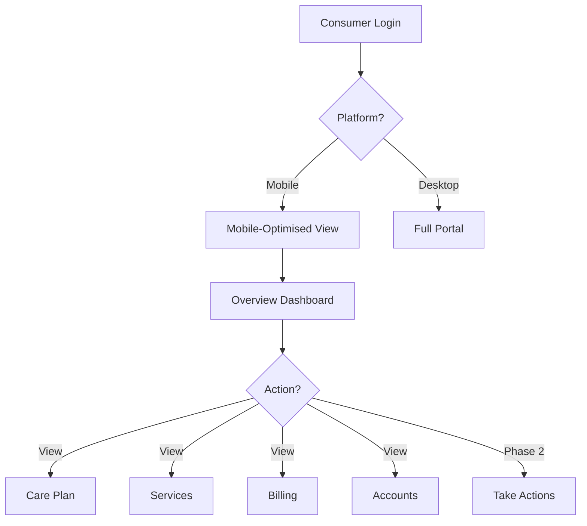
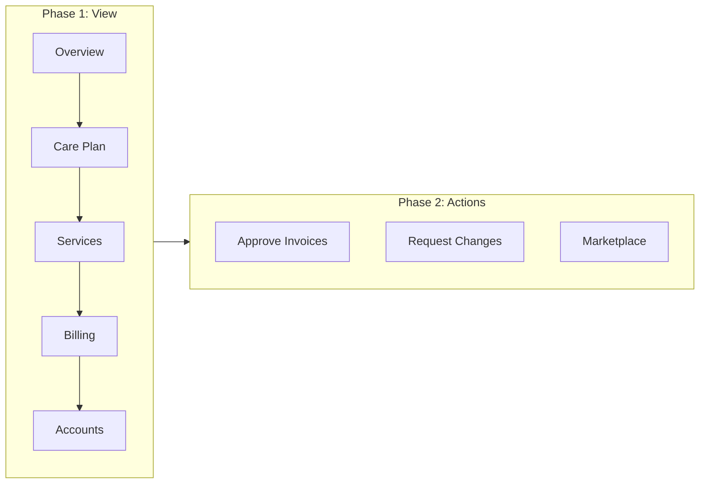
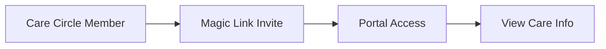
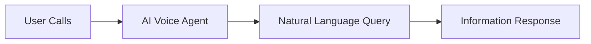

> Mobile-first access to care information for 314,000+ recipients

---

## Quick Links

| Resource | Link |
|----------|------|
| **Portal** | Consumer portal (URL TBD) |
| **Figma** | Mobile designs (TBD) |

---

## TL;DR

- **What**: Mobile-optimised consumer experience for viewing care plans, budgets, services, and billing
- **Who**: Consumers (recipients and their care circles)
- **Key flow**: Phase 1 (view information) → Phase 2 (actions and transactions)
- **Watch out**: Consumer mobile experience is distinct from coordinator mobile - different needs and interfaces

---

## Key Concepts

| Term | What it means |
|------|---------------|
| **Consumer Portal** | Mobile-first interface for recipients to access their care information |
| **Care Circle** | Family members and carers with access to recipient's portal |
| **MVP Core Pages** | 5 essential pages: Overview, Care Plan, Services, Billing, Accounts |
| **Moonmart** | Future marketplace for consumer goods and services |
| **Conversational UI** | AI-powered voice interface for users preferring phone interactions |

---

## How It Works

### Main Flow: Consumer Mobile Experience



### Phased Delivery



### Other Flows

<details>
<summary><strong>Care Circle Access</strong> — family and carers viewing recipient information</summary>

Care circle members can access the consumer portal to view their loved one's care information, requiring appropriate contact data quality.



</details>

<details>
<summary><strong>AI Conversational Interface</strong> — voice-first interaction for accessibility</summary>

Planned voice interface for older users who prefer phone interactions over app navigation.



</details>

---

## Business Rules

| Rule | Why |
|------|-----|
| **Mobile-first design** | 314,000+ recipients need simple, accessible interfaces |
| **Phase 1: View only** | MVP focuses on information access before enabling transactions |
| **Contact data quality** | Clean contact data required before care circle invitations |
| **Distinct from coordinator** | Consumer and coordinator mobile experiences have different requirements |

---

## Feature Flags

| Flag | What it controls | Default |
|------|------------------|---------|
| `consumer-mobile-mvp` | Phase 1 mobile experience | Off |
| `moonmart-marketplace` | Consumer marketplace feature | Off |
| `ai-voice-interface` | Conversational UI for phone users | Off |

---

## MVP Core Pages

| Page | Purpose | Phase |
|------|---------|-------|
| **Overview** | Dashboard with key information at a glance | 1 |
| **Care Plan** | View needs, goals, and care plan details | 1 |
| **Services** | View scheduled and available services | 1 |
| **Billing** | View invoices and payment history | 1 |
| **Accounts** | Manage profile and care circle contacts | 1 |

---

## Design Principles

| Principle | Implementation |
|-----------|---------------|
| **Mobile-friendly budgets** | Card-based UI replacing complex tables |
| **Simplified navigation** | 5 core pages, not full coordinator functionality |
| **Accessibility** | Voice interface option for users who prefer phone |
| **Care circle inclusion** | Easy sharing with family members and carers |

---

## Who Uses This

| Role | What they do |
|------|--------------|
| **Consumers (Recipients)** | View their own care information, budgets, and services |
| **Care Circle Members** | View loved one's care information with appropriate access |
| **Older Users** | Interact via AI voice interface (future) |

---

## Technical Reference

<details>
<summary><strong>Frontend Pages</strong></summary>

Planned mobile-optimised pages:

```
resources/js/Pages/Consumer/
├── Overview.vue           # Mobile dashboard
├── CarePlan/
│   └── Index.vue          # Care plan view
├── Services/
│   └── Index.vue          # Service list
├── Billing/
│   └── Index.vue          # Invoice history
└── Account/
    └── Index.vue          # Profile and care circle
```

</details>

<details>
<summary><strong>Related Components</strong></summary>

Dependencies on existing systems:

- Care Plan domain for needs and goals
- Budget domain for mobile-friendly budget cards
- Notifications domain for push notifications
- Package Contacts for care circle management

</details>

---

## Testing

### Key Test Scenarios

- [ ] Mobile viewport displays correctly
- [ ] Core 5 pages load and display data
- [ ] Care circle member can access with appropriate permissions
- [ ] Budget displays as mobile-friendly cards
- [ ] Touch interactions work correctly

---

## Related

### Domains

- [Care Plan](/features/domains/care-plan) — care plan data displayed in mobile view
- [Budget](/features/domains/budget) — mobile-friendly budget card interface
- [Notifications](/features/domains/notifications) — push notifications for mobile users
- [Package Contacts](/features/domains/package-contacts) — care circle contact management
- [Onboarding](/features/domains/onboarding) — consumer invitation and magic link flow

### Future Initiatives

| Initiative | Status | Description |
|------------|--------|-------------|
| Moonmart Marketplace | Planned | Consumer goods and services marketplace |
| AI Voice Interface | Planned | Conversational UI for phone-preferring users |
| Phase 2 Actions | Planned | Invoice approval, change requests |

---

## Roadmap

### Q1/Q2 2026 Targets

| Milestone | Description |
|-----------|-------------|
| Contact data cleanup | Improve contact data quality for care circle invites |
| Care circle prioritisation | Enable family/carer portal access |
| Mobile-friendly budget UI | Card-based design replacing tables |
| MVP 5 pages | Overview, Care Plan, Services, Billing, Accounts |

### Future Considerations

| Feature | Notes |
|---------|-------|
| **Moonmart** | New consumer marketplace experience |
| **AI Conversational UI** | Voice interface for older users |
| **Phase 2 Actions** | Enable transactions, not just viewing |

---

## Open Questions

| Question | Context |
|----------|---------|
| **React Native vs Vue?** | MOB1 initiative plans React Native app, but current responsive web uses Vue |
| **Feature flags not created?** | `consumer-mobile-mvp`, `moonmart-marketplace`, `ai-voice-interface` don't exist in codebase |

---

## Technical Reference (Corrected)

<details>
<summary><strong>Implementation Status</strong></summary>

**IMPORTANT**: No dedicated Consumer mobile pages exist. Mobile experience is via **responsive web design**.

### What Actually Exists

**Recipient Pages** (responsive web, not dedicated mobile):
```
resources/js/Pages/Recipient/
├── Bills/Create.vue, Edit.vue, PackageBillList.vue, Show.vue
├── Contacts/RecipientAddContact.vue, RecipientEditContact.vue, RecipientShowContact.vue
└── PackageDetails.vue

resources/js/Pages/Dashboard/
└── RecipientDashboard.vue    # Uses Tailwind responsive utilities
```

### Mobile Strategy

Current approach uses **Tailwind responsive design** on existing pages:
- `grid-cols-12`, `md:col-span-6`, `lg:col-span-4` patterns
- No separate Consumer/ directory

### Planned: React Native App (MOB1)

Initiative docs plan a **separate React Native app** (not Vue):
- React Native for iOS/Android
- Laravel Sanctum API auth
- Firebase Cloud Messaging for push
- Phase 1: mostly read-only + key actions

### Feature Flags That Exist

| Flag | Status |
|------|--------|
| `recipient-bill-submission` | ✅ Active - enables bill submission |
| `consumer-mobile-mvp` | ❌ Not created |
| `moonmart-marketplace` | ❌ Not created |
| `ai-voice-interface` | ❌ Not created |

</details>

---

## Status

**Maturity**: Planning (responsive web exists, native app planned)
**Pod**: Consumer Experience
**Target**: Q1/Q2 2026 MVP
