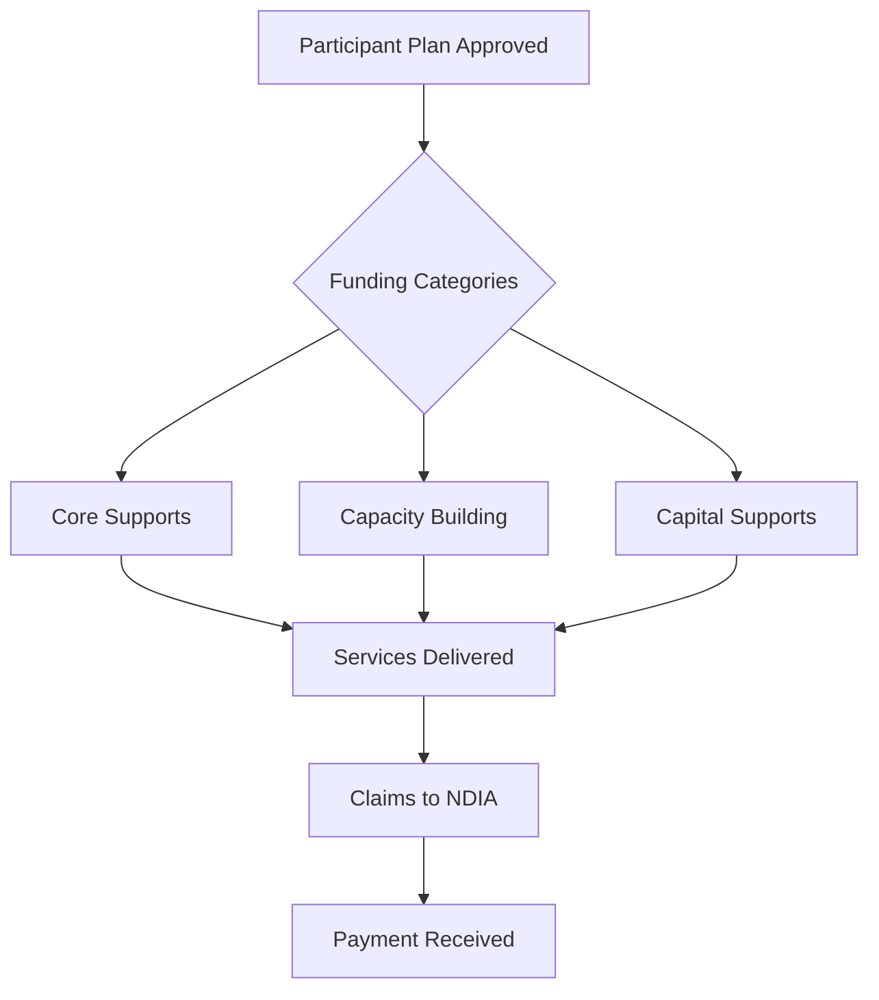
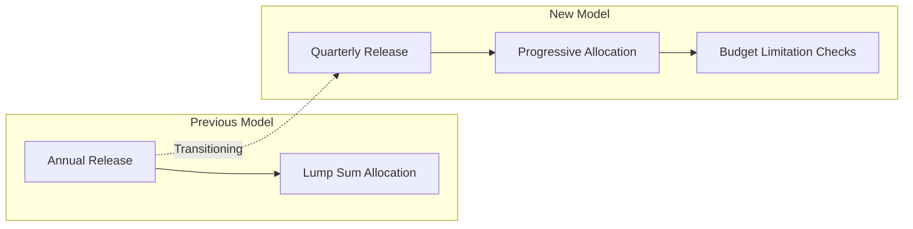

> Disability support funding coordination and worker compliance

---

## Quick Links

| Resource | Link |
|----------|------|
| **External** | [NDIS Official Site](https://www.ndis.gov.au/) |
| **Care Vicinity** | [CareVicinity Platform](https://carevicinity.com.au/) |

---

## TL;DR

- **What**: Government funding scheme for Australians with permanent and significant disabilities
- **Who**: NDIS participants, Support Coordinators, Care Vicinity workers, Compliance team
- **Key flow**: Participant plan approved -> Services delivered -> Claims submitted to NDIA
- **Watch out**: Funding is shifting from annual to quarterly releases; budget limitations must be enforced in Care Vicinity

---

## Key Concepts

| Term | What it means |
|------|---------------|
| **NDIS** | National Disability Insurance Scheme - federal funding for disability support services |
| **NDIA** | National Disability Insurance Agency - administers the NDIS |
| **Plan** | Funding allocation for a participant covering specific support categories |
| **Support Coordinator** | Helps participants implement their NDIS plans |
| **NDIS Worker Screening** | Background check required for workers supporting NDIS participants |
| **Care Vicinity** | Trilogy-owned marketplace platform for NDIS, DVA, and My Aged Care workers |

---

## How It Works

### NDIS Funding Model



### Quarterly Funding Transition



The NDIS is transitioning from annual to quarterly funding releases, requiring budget limitation mechanisms in Care Vicinity to prevent overspend.

---

## Business Rules

| Rule | Why |
|------|-----|
| **Quarterly funding releases** | Shifting from annual to quarterly allocations |
| **Budget limitations required** | Prevent overspend within funding periods |
| **NDIS Worker Screening mandatory** | All workers must have valid clearance |
| **Plan-managed vs Self-managed** | Different claiming processes based on management type |
| **Support category alignment** | Services must match funded support categories |

---

## Compliance Requirements

### NDIS Worker Screening

Workers supporting NDIS participants must maintain valid NDIS Worker Screening clearances. This is tracked in TC Portal through:

| Check | Status Tracking |
|-------|-----------------|
| **NDIS Worker Screening Clearance** | Document tag: `NDIS Worker` |
| **Expiry monitoring** | Rejection reason: `NDIS_CLEARANCE_EXPIRED` |
| **Missing details** | Rejection reason: `NDIS_CLEARANCE_MISSING_DETAILS` |

This clearance is grouped with Police Check under the `POLICE_NDIS` document rejection category.

---

## Platform Relationship

### Care Vicinity

NDIS services are primarily delivered through **Care Vicinity**, a Trilogy-owned marketplace platform:

| Capability | TC Portal | Care Vicinity |
|------------|-----------|---------------|
| Participant management | HCP focus | NDIS/DVA/MAC workers |
| Worker marketplace | No | Yes |
| Funding claims | Services Australia | NDIA |
| Plan management | Limited | Core feature |
| Budget limitations | N/A | In Development |

### TC Portal NDIS Support

Within TC Portal, NDIS is supported through:

1. **Worker Screening Compliance** - NDIS clearance tracking for suppliers
2. **Document Management** - NDIS Worker document tags and rejection reasons
3. **Supplier Portal** - NDIS clearance upload and verification

---

## Who Uses This

| Role | What they do |
|------|--------------|
| **NDIS Participants** | Receive funded disability support services |
| **Support Coordinators** | Help participants implement their plans |
| **Care Vicinity Workers** | Deliver services to participants (separate platform) |
| **Compliance Team** | Verify NDIS worker screening clearances |
| **Finance Team** | NDIS claims reconciliation |

---

## Technical Reference

<details>
<summary><strong>Enums & Configuration</strong></summary>

### Document Tags

```php
// domain/Document/Enums/DocumentTagEnum.php
#[Label('NDIS Worker')]
case NDIS_WORKER = 'NDIS Worker';
```

### Rejection Reasons

```php
// domain/Document/Enums/DocumentRejectionReasonEnum.php
#[Label('NDIS Worker Screening Clearance - Expired clearance')]
case NDIS_CLEARANCE_EXPIRED = 'NDIS_CLEARANCE_EXPIRED';

#[Label('NDIS Worker Screening Clearance - Missing details')]
case NDIS_CLEARANCE_MISSING_DETAILS = 'NDIS_CLEARANCE_MISSING_DETAILS';
```

### Rejection Categories

```php
// domain/Document/Enums/DocumentRejectionReasonCategoryEnum.php
case POLICE_NDIS = 'POLICE_NDIS';  // Groups Police Check and NDIS clearances
```

</details>

<details>
<summary><strong>Related Tables</strong></summary>

| Table | Purpose |
|-------|---------|
| `supplier_documents` | NDIS clearance documents |
| `document_tags` | Tag for NDIS Worker documents |

</details>

---

## Integration Points

### Related Government Programs

| Program | Relationship |
|---------|--------------|
| **DVA** | Some veterans have dual DVA/NDIS funding |
| **My Aged Care** | Participants may transition to HCP at 65 |
| **Home Care Packages** | Separate funding stream, different claiming API |

### Care Vicinity Platform

Care Vicinity handles:
- NDIS worker marketplace
- Plan budget tracking
- Service booking and delivery
- NDIA claiming (planned)

---

## Roadmap Considerations

| Area | Consideration |
|------|---------------|
| **Budget limitations** | Care Vicinity needs quarterly budget tracking |
| **Quarterly release alignment** | Systems must adapt to new funding cadence |
| **NDIA API integration** | Different from Services Australia aged care API |
| **Worker screening automation** | Streamline clearance verification |
| **Dual funding coordination** | DVA/NDIS overlap handling |

---

## Related

### Domains

- [DVA](/features/domains/dva) - Related government funding program
- [Claims](/features/domains/claims) - Government claims (Services Australia focus)
- [Budget](/features/domains/budget) - Funding allocation and tracking
- [Supplier](/features/domains/supplier) - Worker screening and compliance

### External

- [Care Vicinity](https://carevicinity.com.au/) - NDIS/DVA worker marketplace
- [NDIS Quality and Safeguards Commission](https://www.ndiscommission.gov.au/) - Regulatory body

---

## Open Questions

| Question | Context |
|----------|---------|
| **Zoho NDIS expiry mapping gap?** | `NDIS_Worker_Screening_Expiry_Date` parsed but NOT in `getZohoDocumentMappings()` |
| **Care Vicinity integration?** | Separate platform - TC Portal only soft-deletes Care Vicinity workers |

---

## Technical Reference (Verified)

<details>
<summary><strong>Implementation Status</strong></summary>

### What Actually Exists

NDIS in TC Portal is **worker screening compliance only** - not full NDIS management.

```
domain/Document/Enums/
├── DocumentTagEnum.php           # NDIS_WORKER case
├── DocumentRejectionReasonEnum.php
│   ├── NDIS_CLEARANCE_EXPIRED
│   └── NDIS_CLEARANCE_MISSING_DETAILS
└── DocumentRejectionReasonCategoryEnum.php
    └── POLICE_NDIS                # Groups Police + NDIS

domain/Supplier/Enums/
└── ZohoSupplierTagEnum.php       # CARE_VICINITY_WORKERS

domain/Supplier/Actions/
└── SoftDeleteSuppliersWithCareVicinityWorkersTag.php
```

### Zoho Integration Gap

`SupplierZohoExpiryData.php` parses `NDIS_Worker_Screening_Expiry_Date` but it's **NOT included** in `DocumentTagRepository::getZohoDocumentMappings()`.

### Care Vicinity Workers

TC Portal **excludes** Care Vicinity workers (soft delete action exists) rather than managing them - NDIS services handled on separate Care Vicinity platform.

</details>

---

## Status

**Maturity**: Production (worker screening only)
**Pod**: Care Vicinity / DVA Team
**Owner**: TBD

---

## Research Sources

| Source | Key Topics |
|--------|------------|
| Fireflies meetings (2 NDIS coordination meetings) | Budget limitations, quarterly funding transition |
| DVA domain research | Dual funding coordination with DVA |
| Supplier compliance research | NDIS clearance tracking requirements |
