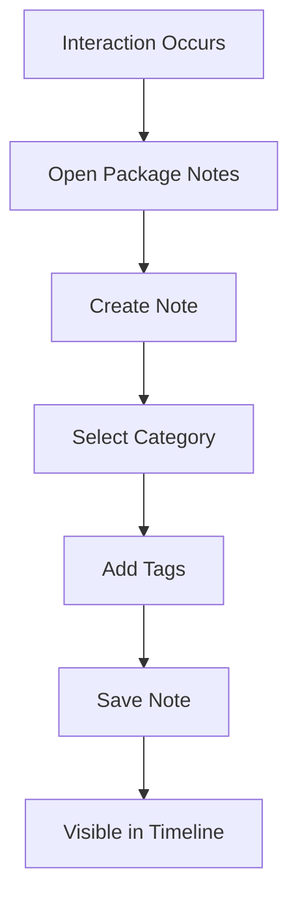

> Internal notes and communication logging

---

## Quick Links

| Resource | Link |
|----------|------|
| **Portal** | [Package Notes](https://tc-portal.test/staff/packages/{id}/notes) |
| **Nova Admin** | [Notes](https://tc-portal.test/nova/resources/notes) |

---

## TL;DR

- **What**: Document all internal communications, observations, and interactions about recipients
- **Who**: Care Coordinators, Care Partners, all staff
- **Key flow**: Interaction Occurs → Create Note → Categorise → Searchable History
- **Watch out**: Notes are internal - use appropriate language as they may be audited

---

## Key Concepts

| Term | What it means |
|------|---------------|
| **Note** | Text entry documenting an interaction or observation |
| **Note Category** | Classification (Check-in, Clinical, Admin, Incident, etc.) |
| **Note Tag** | Additional metadata for filtering and search |
| **Author** | User who created the note |

---

## How It Works

### Main Flow: Note Creation



---

## Note Categories

| Category | Use For |
|----------|---------|
| **Check-in** | Regular recipient contact |
| **Clinical** | Health-related observations |
| **Administrative** | Admin tasks, paperwork |
| **Incident** | Issues, complaints, incidents |
| **Call Summary** | Phone call documentation |
| **Email** | Email correspondence notes |

---

## Business Rules

| Rule | Why |
|------|-----|
| **Author cannot be changed** | Accountability and audit trail |
| **Notes cannot be deleted** | Compliance and audit requirements |
| **Timestamp immutable** | Accurate historical record |

---

## Who Uses This

| Role | What they do |
|------|--------------|
| **Care Coordinators** | Log daily interactions, calls, observations |
| **Care Partners** | Document decisions, escalations |
| **All Staff** | Record relevant interactions |

---

## Open Questions

| Question | Context |
|----------|---------|
| **NoteCategory as model vs enum?** | Docs show model but code uses NoteCategoryEnum (50+ categories) |
| **Note deletion policy?** | Docs say "cannot be deleted" but code has soft deletes |
| **Organisation as noteable?** | Code references but unclear if used |
| **Care coordinator visibility on bill notes?** | Code has TODO - is this planned? |

---

## Technical Reference

<details>
<summary><strong>Models & Database</strong></summary>

### Models

**Note**: Categories are NOT a model - they're an enum with 50+ types

```
domain/Note/Models/
├── Note.php                 # Main note with soft deletes, Scout search
└── NoteTaggable.php         # Polymorphic pivot for tagging users/teams
```

**No NoteCategory or NoteTag models** - functionality via:
- `NoteCategoryEnum` - 50+ categories with role-based visibility
- `NoteTaggable` - polymorphic tagging to User and Team

### Tables

| Table | Purpose |
|-------|---------|
| `notes` | Note records (note_categories is JSON column) |
| `note_taggables` | Polymorphic user/team tagging |

### Key Properties

| Property | Purpose |
|----------|---------|
| `is_published` | Visibility to tagged users |
| `can_organisation_see` | Care coordinator access |
| `can_child_see` | Recipient/representative access |
| `notify_care_partner` | Notify case manager when created |
| `note_categories` | JSON array of NoteCategoryEnum values |

</details>

<details>
<summary><strong>Noteable Models</strong></summary>

Notes can be attached to:
- **Package** - most common use
- **Bill** - invoice processing notes
- **CareCoordinator** - coordinator notes
- **Supplier** - supplier notes

</details>

<details>
<summary><strong>Check-in Tracking</strong></summary>

Check-in notes update Package dates automatically:
- `ext_check_in_date` - External (care coordinator) check-ins
- `int_check_in_date` - Internal check-ins

Check-in categories: `CHECK_IN`, `CALD_CHECK_IN_COMPLETE`, `DIRECT_CARE_CHECK_IN`, etc.

</details>

---

## Related

### Domains

- [Coordinator Portal](/features/domains/coordinator-portal) — notes accessed from dashboard
- [Care Plan](/features/domains/care-plan) — clinical notes inform care planning

---

## Status

**Maturity**: Production
**Pod**: Duck, Duck Go (Care Coordination)
