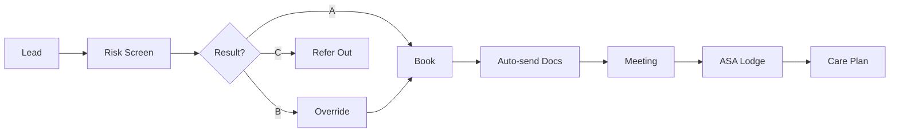

> Sales to service activation in 24 hours

---

## Quick Links

| Resource | Link |
|----------|------|
| **Portal** | [Package Onboarding](https://tc-portal.test/staff/packages/{id}/onboarding) |
| **CRM** | Zoho Onboarding Module |
| **Booking** | SimplyBook Assessment Scheduling |

---

## TL;DR

- **What**: Fast-track client onboarding from lead to active package in 24 hours
- **Who**: Sales Team, Assessment Team, Care Partners, Clinical Team
- **Key flow**: Lead → Risk Screening → Booking → Assessment Meeting → Package Active
- **Watch out**: Only new packages qualify; transfers follow 2-week standard process

---

## Key Concepts

| Term | What it means |
|------|---------------|
| **Fast Lane** | 24-hour onboarding pathway for new packages |
| **Standard BAU** | 2-week onboarding for transfer packages |
| **Risk Screening** | AI-powered assessment at point of sale |
| **IAT** | Integrated Assessment Tool (aged care assessment data) |
| **HCA** | Home Care Agreement (client contract) |
| **ASA** | Approval of Services Agreement (lodged with My Aged Care) |

---

## How It Works

### Main Flow: Fast Lane Onboarding



### Package Type Routing

| Package Type | Process | Turnaround |
|--------------|---------|------------|
| **New Package** | Fast Lane | 24 hours |
| **Transfer Package** | Standard BAU | 2 weeks (aligned with exit dates) |

---

## Business Rules

| Rule | Why |
|------|-----|
| **New packages only** | Transfers must align with exit dates from previous providers |
| **All IAT ages accepted** | No 12-month cutoff - simplified from previous process |
| **Must pass risk screening** | ~2% flagged for clinical review |
| **Commencement = booking date** | No fixed 14-day window |
| **24-hour clinical review** | Flagged cases reviewed within 24 hours |

---

## Risk Assessment Tool

### Three-Tier Outcomes

| Outcome | Description | Action |
|---------|-------------|--------|
| **A** | Standard self-managed | Proceed with Fast Lane |
| **B** | Coordinator model recommended | Client can override with clinical review |
| **C** | Model unsuitable | Refer to fully managed providers |

### AI-Powered Features

- Downloads and analyzes ACAT/IAT support plans
- Extracts structured data using Trilogy AI
- Includes complementary risk questions
- Assesses client technology capability
- Identifies changes since assessment

---

## Common Issues

<details>
<summary><strong>Issue: Client not appearing in Fast Lane</strong></summary>

**Symptom**: New client following standard 2-week process

**Cause**: May be classified as transfer package or flagged by risk screening

**Fix**: Check package type and risk assessment outcome in CRM

</details>

<details>
<summary><strong>Issue: Assessment meeting not scheduled</strong></summary>

**Symptom**: Client stuck after risk screening

**Cause**: SimplyBook link not sent or coordinator not responding

**Fix**: Verify email delivery and follow up with assessment team

</details>

---

## Who Uses This

| Role | What they do |
|------|--------------|
| **Sales Team** | Complete risk assessment, initiate Fast Lane |
| **Assessment Team** | Conduct assessment meetings, complete HCA |
| **Care Partners** | Receive activated packages, begin service delivery |
| **Clinical Team** | Review flagged cases within 24 hours |

---

## Open Questions

| Question | Context |
|----------|---------|
| **Supplier onboarding documentation?** | Completely separate flow with own models but not documented here |
| **OnboardingController scope?** | Only has `updateWelcomeTour()` method - is this intentional? |
| **Risk screening implementation?** | AI-powered screening mentioned but models not found in code |
| **Automation trigger location?** | Where are HCA email, DD link triggers implemented? |
| **7-step form structure?** | Documentation mentions but code structure unclear |

---

## Two Onboarding Systems

**Note**: TC Portal has TWO distinct onboarding systems:

### 1. Client/Package Onboarding (Fast Lane)
Tracked via `Package.stage` with `PackageStageEnum`:
- `ON_BOARDING` → `ACTIVE` → `TERMINATED`
- Uses `HasStageHistory` trait for audit trail
- External tools: Vibe, Trilogy AI, SimplyBook

### 2. Supplier Onboarding (Separate Domain)
Tracked via dedicated `SupplierOnboarding` model:
- 9 sequential steps (0-8)
- 7 status states
- Documented in [Supplier Management](/features/domains/supplier)

---

## Technical Reference

<details>
<summary><strong>Models & Database</strong></summary>

### Package Onboarding

```
domain/Package/Models/Package.php
  - stage: PackageStageEnum (ON_BOARDING, ACTIVE, TERMINATED)
  - Uses HasStageHistory trait

domain/Package/Enums/PackageStageEnum.php
```

### Analytics

```
app/Analytics/OnboardingPackages.php
  - Counts packages in ON_BOARDING stage
  - 30-day change tracking
```

</details>

<details>
<summary><strong>Systems Integration</strong></summary>

| System | Role |
|--------|------|
| **Vibe Assessment Tool** | Risk assessment and IAT analysis |
| **Trilogy AI** | Data extraction from support plans |
| **CRM (Zoho)** | Lead management, onboarding module |
| **SimplyBook** | Assessment meeting booking |
| **Portal** | Care plan delivery, HCA signing |
| **My Aged Care** | ASA lodgement, funding validation |
| **MyOB** | Invoice creation on "signed" status |

</details>

<details>
<summary><strong>Automation</strong></summary>

Automated triggers on status changes:
- HCA email sent
- Direct debit signup link
- Care preference survey
- Assessment reminder
- Care plan delivery

**Note**: Trigger implementation location unclear from codebase research.

</details>

---

## Financial Integration

### Direct Debit

- Bank account: **$0.25-0.50** per transaction
- Credit card: **2%** processing fee
- Usage: **70-80%** clients use direct debit
- Trigger: Client progression to "signed" status

### Interim Funding

- **60% package funding** available immediately
- Allows earlier service commencement
- Auto-scales to 100% upon full approval

---

## Testing

### Key Test Scenarios

- [ ] New package routes to Fast Lane
- [ ] Transfer package routes to Standard BAU
- [ ] Risk assessment outcome A proceeds immediately
- [ ] Risk assessment outcome B allows client override
- [ ] Risk assessment outcome C refers externally
- [ ] SimplyBook booking link sent automatically
- [ ] HCA auto-sent on booking confirmation
- [ ] ASA lodged at CP sent status

---

## Related

### Domains

- [Lead Management](/features/domains/lead-management) — leads convert via Fast Lane
- [Care Plan](/features/domains/care-plan) — care plan delivered post-onboarding
- [Booking System](/features/domains/booking-system) — SimplyBook scheduling

### Initiatives

| Epic | Status | Description |
|------|--------|-------------|
| [Fast-Lane](/initiatives/Consumer-Lifecycle/Fast-Lane/) | Live | Full initiative documentation |

---

## Status

**Maturity**: Production (Live Oct 2025)
**Pod**: Grow, Care, Clinical, Ops
**Owner**: Jackie P

---

## Key Metrics

| Metric | Target |
|--------|--------|
| **New package turnaround** | 24 hours |
| **Client drop-off rate** | Reduced from ~10% |
| **Questionnaire chase time** | Eliminated |
| **Clinical review turnaround** | 24 hours |

---

## Source Meetings

| Date | Meeting | Key Topics |
|------|---------|------------|
| Sep 15, 2025 | Project Fast Track - Halfway Check In | Eligibility redesign, IAT AI tool |
| Sep 17, 2025 | Referral Forms for Fast Lane | Form modifications, coordinator integration |
| Sep 29, 2025 | Fast Lane - Questionnaire Discussion | Person-centered questionnaire redesign |
| Oct 3, 2025 | Fast Lane Onboarding Process | Process now live, automation enhancements |
