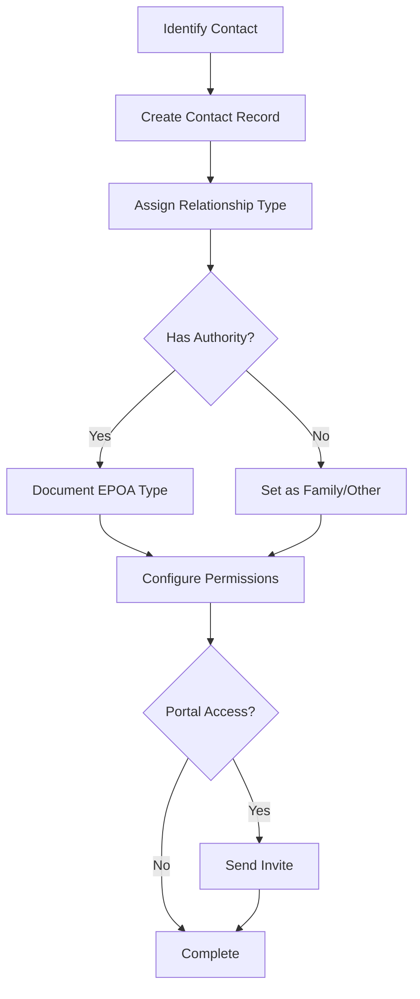

> Representatives, EPOAs, and family members

---

## Quick Links

| Resource | Link |
|----------|------|
| **Portal** | [Package Contacts](https://tc-portal.test/staff/packages/{id}/contacts) |
| **Nova Admin** | [Package Contacts](https://tc-portal.test/nova/resources/package-contacts) |

---

## TL;DR

- **What**: Manage people connected to a recipient's care package (reps, EPOAs, family)
- **Who**: Care Partners, Admin staff
- **Key flow**: Add Contact → Set Role/Authority → Configure Access → Notify
- **Watch out**: EPOA types have different authority levels - check documentation requirements

---

## Key Concepts

| Term | What it means |
|------|---------------|
| **Authority Representative** | Person authorised to make decisions on behalf of recipient |
| **EPOA** | Enduring Power of Attorney holder |
| **Main Contact** | Primary contact for communications |
| **Care Circle** | All contacts associated with a package |
| **Portal Access** | Whether contact can log into recipient portal |

---

## How It Works

### Main Flow: Add Contact



---

## EPOA Types

| Type | Authority |
|------|-----------|
| **Medical** | Health and treatment decisions |
| **Financial** | Financial and administrative decisions |
| **General** | Broad decision-making authority |

---

## Business Rules

| Rule | Why |
|------|-----|
| **EPOA requires documentation** | Legal authority must be verified |
| **One main contact per package** | Clear primary point of contact |
| **Portal access requires email** | Needed for login credentials |

---

## Who Uses This

| Role | What they do |
|------|--------------|
| **Care Partners** | Manage contacts, set up portal access |
| **Admin Staff** | Verify EPOA documentation |
| **Contacts** | Access recipient portal (if granted) |

---

## Open Questions

| Question | Context |
|----------|---------|
| **Representative vs Contact terminology?** | Codebase uses PackageRepresentative but UI shows "Contacts" - clarify naming |
| **Care circle contact visibility?** | Which contacts appear in care circle view vs full contacts list |
| **Phone/email on care circle table?** | Recently added per PR #5798 - verify UI implementation |

---

## Technical Reference

<details>
<summary><strong>Models & Database</strong></summary>

### Models

```
domain/PackageContact/Models/
├── PackageRepresentative.php          # Main contact model (NOT PackageContact)
├── PackageRepresentativeType.php      # Relationship/authority types
└── PackageRepresentativeAggregateRoot.php  # Event sourcing aggregate

domain/PackageContact/Events/
├── PackageRepresentativeCreated.php
├── PackageRepresentativeUpdated.php
└── PackageRepresentativeDeleted.php

domain/PackageContact/Projectors/
└── PackageRepresentativeProjector.php
```

**Note**: Model is `PackageRepresentative` not `PackageContact` as suggested by UI terminology.

### Tables

| Table | Purpose |
|-------|---------|
| `package_representatives` | Contact records (NOT package_contacts) |
| `package_representative_types` | Relationship and authority types |

### Event Sourcing

Package contacts use event sourcing:
- **Aggregate**: `PackageRepresentativeAggregateRoot`
- **Events**: Created, Updated, Deleted
- **Projector**: `PackageRepresentativeProjector`

</details>

---

## Related

### Domains

- [Care Plan](/features/domains/care-plan) — contacts receive care plan copies
- [Statements](/features/domains/statements) — contacts may receive statements
- [Notifications](/features/domains/notifications) — contacts receive notifications

---

## Status

**Maturity**: Production
**Pod**: Duck, Duck Go (Care Coordination)
