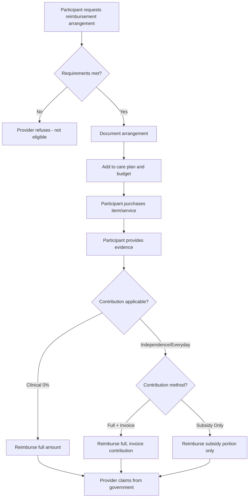

# Reimbursements

Reimbursements allow participants to pay for services or items upfront and seek reimbursement from their provider. This is common for self-managed participants and specific service types.

## Government References

| Section | Topic | Manual Reference |
|---------|-------|------------------|
| 10.7 | Reimbursements overview | V4.2, Page 138-140 |
| 10.7.1 | Reimbursement for service list items | V4.2, Page 139 |
| 10.7.2 | Reimbursements and participant contributions | V4.2, Page 140 |
| 11.5.4 | Reimbursement for third-party services | V4.2, Page 151-152 |
| 11.5.5 | Third-party reimbursements and contributions | V4.2, Page 152 |
| 13.6.1 | Reimbursement for assistive technology | V4.2, Page 178-179 |

## Types of Reimbursements

### 1. Service List Items (10.7.1)
Items on the Support at Home service list where reimbursement may be practical:
- Nursing care consumables (e.g., continence pads)
- Prescribed nutrition

### 2. Third-Party Services (11.5.4)
When participant pays a third-party worker directly and seeks reimbursement.

### 3. Assistive Technology (13.6.1)
When participant sources and purchases AT products directly.

## Requirements Before Reimbursement

All reimbursement types share common requirements:

| Requirement | Description |
|-------------|-------------|
| **On Service/AT-HM List** | Item or service must be on approved list |
| **Approved to Receive** | Participant approved per Notice of Decision and support plan |
| **In Care Plan** | Service/item outlined in care plan |
| **In Budget** | Price included in individualised budget |
| **Documented Agreement** | Reimbursement arrangement discussed and documented |
| **Pre-Approval** | Arrangement agreed BEFORE purchase/service |

### Additional Requirements for Third-Party Services
- Provider must be registered to deliver the service
- Provider must have engaged the worker
- Worker screening completed

## Contribution Handling

Two approaches for handling participant contributions under reimbursement:

### Option 1: Full Reimbursement + Invoice
1. Provider reimburses participant for full cost
2. Provider invoices participant for their contribution
3. Follows normal invoice cycle

### Option 2: Subsidy Only
1. Provider reimburses only the government subsidy amount
2. Participant retains their contribution portion

**Important**: Clinical services have no contribution (0%), so full reimbursement applies.

## Evidence Requirements

| Type | Evidence Required |
|------|-------------------|
| **Service List Items** | Invoice/receipt showing item and price |
| **Third-Party Services** | Invoice/receipt as confirmation of service delivery |
| **Assistive Technology** | Invoice/receipt showing product and price |

Providers must retain evidence to support claims and ensure compliance.

## Claiming Rules

| Rule | Requirement |
|------|-------------|
| **Claiming Deadline** | Within 60 days after end of funding period/quarter |
| **Evidence Retention** | Provider must retain records to support claims |
| **Documentation** | Reimbursement arrangement must be documented |

## Business Rules

| Rule | Why |
|------|-----|
| **Pre-approval required** | Agreement must exist BEFORE purchase/service |
| **Provider can refuse** | Services outside requirements can be refused |
| **Must be on approved list** | Only service list or AT-HM list items |
| **Care plan inclusion** | Item must be in care plan and budget |
| **60-day claim window** | Claims must be finalised within deadline |
| **Document contribution method** | Must record how contribution will be collected |

## Workflow



## TC Portal Implementation

### Current Features
- Bill processing for reimbursement invoices
- Participant contribution tracking
- Service plan item budgeting

### Future Considerations
- Reimbursement request workflow
- Pre-approval tracking and documentation
- Contribution method selection per arrangement
- Evidence upload for participant receipts
- Automated contribution calculation
- Self-management reimbursement portal

## Common Scenarios

### Scenario 1: Nursing Consumables
Participant buys continence products at pharmacy:
1. Arrangement pre-agreed and documented
2. Participant purchases and keeps receipt
3. Submits receipt to provider
4. Provider reimburses (clinical = 0% contribution)
5. Provider claims from government

### Scenario 2: Third-Party Physiotherapist
Self-managed participant uses their preferred physio:
1. Provider engages and screens physio as third-party worker
2. Arrangement documented in care plan
3. Participant pays physio directly
4. Provides invoice to provider
5. Provider reimburses (minus contribution or full + invoices later)
6. Provider claims from government

### Scenario 3: Assistive Technology
Participant finds better price on shower chair:
1. OT prescription on file (if required)
2. Arrangement pre-agreed
3. Participant purchases from preferred supplier
4. Provides receipt to provider
5. Provider reimburses (contribution method as agreed)
6. Provider claims with AT-HM Tier 5 code

## Open Questions

| Question | Context |
|----------|---------|
| **Will full reimbursement workflow be built?** | Currently only a boolean flag on bills - no request/approval workflow |
| **Pre-approval tracking?** | Government manual requires pre-approval but no code tracks it |
| **Contribution method handling?** | Two options documented but no code implements selection |

---

## Technical Reference

<details>
<summary><strong>Implementation Status</strong></summary>

**IMPORTANT**: Reimbursements are implemented as a **bill attribute**, not a full workflow domain.

### What Actually Exists

**Bill Model** (`app/Models/Bill/Bill.php`):
- `is_reimbursement` boolean flag only
- No dedicated workflow or approval process

**BillData** (`app/Data/Bill/BillData.php`):
```php
isReimbursement: (bool) ($zohoBill->Received_via_Reimbursement_Request_Form || $zohoBill->Type === 'Reimbursement')
```

**On-Hold Reasons** (`app/Enums/Bill/BillOnHoldReasonsEnum.php`):
- `NO_PROOF_OF_PAYMENT_REIMBURSEMENT`
- `NO_SOURCE_INVOICE_REIMBURSEMENT`

**MYOB Integration**:
- Uses different vendor IDs for reimbursements
- `Supplier::REIMBURSEMENT_ID = 14448` (hardcoded)

### What Does NOT Exist

| Feature from Docs | Status |
|-------------------|--------|
| Reimbursement request workflow | ❌ Not implemented |
| Pre-approval tracking | ❌ Not implemented |
| Contribution method selection | ❌ Not implemented |
| Evidence upload portal | ❌ Not implemented |
| 60-day deadline enforcement | ❌ Not implemented |
| Self-management portal | ❌ Not implemented |

</details>

---

## Related Domains

- [Self-Management](./self-management.md) - Reimbursement common for self-managed participants
- [Third-Party Services](./third-party-services.md) - Third-party worker reimbursement process
- [Assistive Technology & Home Modifications](./assistive-technology-home-modifications.md) - AT reimbursement requirements
- [Participant Contributions](./contributions.md) - Contribution rates and collection
- [Service Confirmation](./service-confirmation.md) - Evidence requirements
- [Claims](./claims.md) - Claiming reimbursed services
- [Bill Processing](./bill-processing.md) - Processing reimbursement invoices
