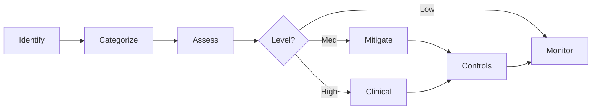
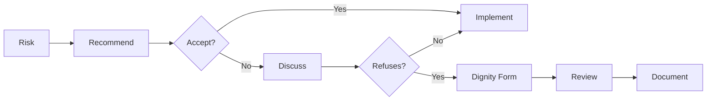
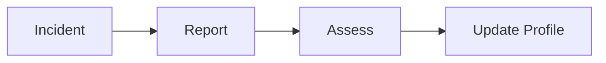

> Identify, assess, and manage client risks across the care journey

---

## Quick Links

| Resource | Link |
|----------|------|
| **Portal** | [Package Risk Profile](https://tc-portal.test/staff/packages/{id}/care-plan/risks) |
| **Nova Admin** | [Risks](https://tc-portal.test/nova/resources/risks) |
| **CRM** | Zoho Risk Module |

---

## TL;DR

- **What**: Systematic identification and management of client risks (falls, medication, cognitive, etc.)
- **Who**: Care Partners, Clinical Team, POD Leaders
- **Key flow**: Risk Identified → Categorized → Documented → Monitored → Reviewed
- **Watch out**: Dual documentation in Portal and CRM during transition; dignity of risk forms required for client refusals

---

## Key Concepts

| Term | What it means |
|------|---------------|
| **Risk** | Potential hazard or concern affecting client safety or wellbeing |
| **Risk Category** | Standardized classification (falls, medication, cognitive, skin integrity, etc.) |
| **Risk Profile** | Collection of identified risks for a client |
| **Dignity of Risk** | Client's right to make choices that may involve risk |
| **Risk Matrix** | Framework for assessing risk severity and likelihood |
| **Clinical Escalation** | Pathway for high-risk situations requiring clinical input |

---

## How It Works

### Main Flow: Risk Management



### Other Flows

<details>
<summary><strong>Dignity of Risk</strong> — client choice management</summary>

When clients refuse recommended services despite identified risks.



</details>

<details>
<summary><strong>Incident-Linked Risk</strong> — risk from incidents</summary>



</details>

---

## Risk Categories

| Category | Examples | Typical Triggers |
|----------|----------|------------------|
| **Falls** | History of falls, mobility issues, environmental hazards | Most common risk in aged care |
| **Medication** | Polypharmacy, non-compliance, high-risk medications | Clinical review required |
| **Cognitive** | Dementia, confusion, decision-making capacity | Impacts consent processes |
| **Skin Integrity** | Pressure injuries, wounds, fragile skin | Nursing input needed |
| **Nutrition** | Malnutrition risk, swallowing difficulties | Dietitian referral |
| **Social** | Isolation, carer stress, abuse risk | Welfare considerations |
| **Mental Health** | Depression, anxiety, behavioral concerns | Clinical pathways |

---

## Risk Matrix

### Severity Levels

| Level | Description | Examples |
|-------|-------------|----------|
| **1 - Minor** | Temporary discomfort, no lasting impact | Minor skin tear |
| **2 - Moderate** | Requires intervention, recoverable | UTI requiring antibiotics |
| **3 - Major** | Significant harm, extended recovery | Fall with fracture |
| **4 - Severe** | Life-threatening or permanent impact | Serious adverse event |

### Likelihood Levels

| Level | Description | Frequency |
|-------|-------------|-----------|
| **1 - Rare** | Unlikely to occur | <1% chance |
| **2 - Unlikely** | Could occur but not expected | 1-10% chance |
| **3 - Possible** | Might occur | 10-50% chance |
| **4 - Likely** | Will probably occur | >50% chance |

### Risk Rating

| | Minor (1) | Moderate (2) | Major (3) | Severe (4) |
|---|---|---|---|---|
| **Likely (4)** | Medium | High | Critical | Critical |
| **Possible (3)** | Low | Medium | High | Critical |
| **Unlikely (2)** | Low | Low | Medium | High |
| **Rare (1)** | Low | Low | Low | Medium |

---

## Business Rules

| Rule | Why |
|------|-----|
| **Standardized categories** | Consistent risk classification across all packages |
| **Clinical escalation for high risk** | Ensures appropriate oversight |
| **Dignity of risk documented** | Legal protection and audit compliance |
| **Dual system documentation** | Portal for structured data, CRM for notes (transitioning) |
| **POD leader oversight** | Accountability for risk management in their portfolio |
| **Regular review required** | Risks must be reviewed periodically |

---

## Clinical Governance

### Escalation Pathways

| Risk Level | Action | Timeframe |
|------------|--------|-----------|
| **Low** | Care partner manages | Routine monitoring |
| **Medium** | POD leader review | Within 48 hours |
| **High** | Clinical team involvement | Within 24 hours |
| **Critical** | Immediate clinical escalation | Same day |

### Clinical Team Role

- Review high-risk situations
- Provide clinical recommendations
- Support capacity assessments
- Advise on dignity of risk decisions
- Document clinical notes and reasoning

---

## Common Issues

<details>
<summary><strong>Issue: Risk not appearing in care plan</strong></summary>

**Symptom**: Identified risk missing from care plan document

**Cause**: Risk documented in CRM but not Portal, or vice versa

**Fix**: Update risk profile in Portal; ensure both systems aligned during transition

</details>

<details>
<summary><strong>Issue: Dignity of risk form not attached</strong></summary>

**Symptom**: Client refused service but no documentation

**Cause**: Form not completed or not linked to incident/risk

**Fix**: Complete editable dignity of risk form in CRM and attach to risk profile

</details>

<details>
<summary><strong>Issue: Clinical escalation delayed</strong></summary>

**Symptom**: High-risk situation not reviewed in time

**Cause**: No notification system, relies on tagging

**Fix**: Use Teams tagging to clinicians; planned automation improvements

</details>

---

## Who Uses This

| Role | What they do |
|------|--------------|
| **Care Partners** | Identify risks, document in Portal, escalate as needed |
| **POD Leaders** | Oversee risk management, review dignity of risk forms |
| **Clinical Team** | Review high-risk situations, provide clinical guidance |
| **Assessment Team** | Initial risk identification during onboarding |

---

## Incident-Linked Risk Updates

The revised incident management process (Sep 2025) strengthens the link between incidents and risk profiles:

- **Incidents trigger risk profile review**: Mandatory under Support at Home Program Manual s8.6.2
- **Trend tracking on incidents**: New form captures "Has this happened before?" and "Part of a trend?" — feeds directly into risk trend analysis
- **Harm classification maps to risk severity**: Incident harm tiers (Severe → Clinical Notification) align with risk matrix severity levels
- **Clinical governance review**: Monthly governance committee reviews all incidents flagged as "deterioration" for frailty monitoring, chronic disease monitoring, and mental health risk monitoring
- **Incident → Case → Risk**: When an incident triggers a clinical pathway/case, the case lifecycle includes risk register updates

### Future State: Whole-of-Client Residual Risk Framework (Risk Radar)

Maryanne has provided the complete clinical risk framework (Feb 2026) — ready for dev pickup. This replaces subjective high/medium/low ratings with an evidence-based, system-driven residual-risk model:

**How it works**:
1. **Client questionnaire** — 16 clinical risk areas assessed via plain-language questions → Consequence level (0-4: Negligible to Extreme)
2. **Mitigation effectiveness** — per domain, clinicians assess whether controls are Strong (2), Partial (1), or None (0) using structured decision prompts
3. **Residual risk** — consequence adjusted by mitigation. A high falls risk with strong mitigation = lower residual risk than the raw score suggests
4. **Traffic-light synthesis** — 5 domain residual risks → single Green/Amber/Red status per client

**5 Clinical Risk Domains**:
- Functional Ability (Falls, Mobility, Continence, Cognitive Decline, Dementia)
- Clinical Health Status (Chronic Disease, Infection, Polypharmacy, Chronic Pain, End of Life)
- Mental Health & Psychosocial (Cognitive Decline, Dementia, Mental Health)
- Nutritional & Sensory Health (Nutrition & Hydration, Oral Health, Sensory Impairment)
- Safety Risks (Choking/Swallowing, Pressure Injuries/Wounds, Falls)

**Key principle**: Whole-of-client assessment — a client with a high falls risk but strong mitigation and stability across other domains is NOT automatically "high risk". The system assesses residual risk, not raw consequence alone.

**Two-level architecture**: This client-level framework is complementary to the **Organisational Risk Management Procedure** (ISO 31000 aligned, Feb 2026) which governs corporate/strategic/operational risks. Different audiences, different purposes. Future integration may bridge client risk patterns into the org register.

See [Risk Scoring Framework](/context/concepts/risk-scoring-framework) for the full concept.
See [Risk Radar epic](/initiatives/Clinical-And-Care-Plan/Risk-Radar/) for implementation spec.
See [Incident Management domain](/features/domains/incident-management) for the incident → risk linkage.

---

## Open Questions

| Question | Context |
|----------|---------|
| **Dignity of risk forms table?** | Documented but table doesn't exist — where are forms stored? |
| **RiskAssessment model?** | Documented but doesn't exist — assessments via `comprehensive_risks_data` JSON instead? |
| **Residual risk aggregation formula?** | Maryanne provided consequence + mitigation model but exact formula for domain → traffic-light thresholds TBD |
| **Mapping 28 existing categories to 16 risk areas?** | New framework has 16 risk areas; existing system has 28 categories. Need mapping strategy (extend, replace, or layer) |
| **Clinical risk badge on client profile?** | Traffic-light badge (Green/Amber/Red) — included in Risk Radar Phase 1 spec |

---

## Technical Reference (Corrected)

<details>
<summary><strong>Models & Database</strong></summary>

### Models (Actual)

```
domain/Risk/Models/
├── Risk.php                    # Main risk model with comprehensive_risks_data JSON
├── RiskCategory.php            # Categories with label, colour_code, order
└── Riskable.php                # Polymorphic pivot (risk_id, riskable_id, riskable_type)

app/Nova/
├── Risk.php                    # Nova admin resource
├── RiskCategory.php            # Nova admin resource
└── Riskable.php                # Nova admin resource
```

**NOT FOUND**: `PackageRisk.php`, `RiskAssessment.php` - uses polymorphic `Riskable` instead

### Tables (Actual)

| Table | Purpose | Status |
|-------|---------|--------|
| `risks` | Risk records with comprehensive_risks_data JSON | ✅ Exists |
| `risk_categories` | Standardized categories | ✅ Exists |
| `riskables` | Polymorphic pivot (risks ↔ packages/needs) | ✅ Exists |
| `package_risk_stored_events` | Event sourcing | ✅ Exists |
| `dignity_of_risk_forms` | Client refusal docs | ❌ NOT FOUND |

### Event Sourcing

```
domain/Risk/EventSourcing/
├── Aggregates/PackageRiskAggregate.php
├── Events/PackageRiskCreated.php, Updated.php, Deleted.php
├── PackageRiskProjector.php
└── PackageRiskStoredEvent.php
```

### Enums (60+ risk-specific enums)

```
domain/Risk/Enums/
├── ActivityIntolerance/        # 6 enums
├── AllergiesEnhancement/       # 3 enums
├── Choking/                    # 4 enums
├── ClinicalEquipment/          # 11 enums
├── CognitionEnhancement/       # 5 enums
├── Continence/                 # 4 enums
├── Falls/                      # 5 enums
└── [20+ more categories...]
```

</details>

<details>
<summary><strong>Actions (Actual)</strong></summary>

```
domain/Package/Actions/PackageRisk/    # Note: subfolder, not flat
├── CreatePackageRisk.php              # Uses event sourcing
├── UpdatePackageRisk.php
├── DeletePackageRisk.php
└── GetPackageRiskOptionsAction.php

domain/Risk/Actions/
└── ExtractAndCreatePackageRisks.php   # Document extraction
```

**NOT FOUND**: `EscalateRiskAction.php`, `CompleteDignityOfRiskAction.php`

</details>

---

## System Integration

### Portal vs CRM

| Aspect | Portal | CRM (Zoho) |
|--------|--------|------------|
| **Structured data** | Primary source | Notes and context |
| **Risk profiles** | Updated here | Referenced |
| **Care plan generation** | Pulls from here | N/A |
| **Clinical notes** | Limited | Primary |
| **Dignity of risk forms** | Viewing | Editable |

### Future State

- Single source of truth in Portal
- Automated notifications on risk changes
- Dashboard visibility for care partners
- Clinical review workflow in Portal

---

## Testing

### Factories & Seeders

```php
// Create package with risks
$package = Package::factory()
    ->hasRisks(3, ['category' => 'falls'])
    ->create();

// Create high-risk assessment
PackageRisk::factory()
    ->highRisk()
    ->requiresClinicalReview()
    ->create();
```

### Key Test Scenarios

- [ ] Risk created with correct category
- [ ] Risk matrix calculates rating correctly
- [ ] High risk triggers clinical escalation
- [ ] Dignity of risk form links to risk
- [ ] Risk appears in care plan document
- [ ] Risk review date scheduling works

---

## Related

### Domains

- [Care Plan](/features/domains/care-plan) — risks feed into care plans
- [Management Plans](/features/domains/management-plans) — clinical recommendations address risks
- [Complaints](/initiatives/Work-Management/Complaints-Management/) — incidents may identify new risks

### Initiatives

| Epic | Status | Description |
|------|--------|-------------|
| Clinical-And-Care-Plan | Active | Risk profile enhancements |

---

## Status

**Maturity**: Production
**Pod**: Duck, Duck Go (Care Coordination)
**Owner**: Sian H / Clinical Team

---

## Source Meetings

| Date | Meeting | Key Topics |
|------|---------|------------|
| Feb 11, 2026 | Clinical Product Requirements (Marianne) | Evidence-based risk scoring framework, clinical risk badge, incident → risk linkage, Maslow-based needs hierarchy |
| Sep 29, 2025 | Clinical Meeting - Project Activate | Dignity of risk forms, clinical escalation, risk profiles |
| Sep 3, 2025 | Care/Clinical/Assessment Teams | Incident management, system limitations, regulatory requirements |
| Dec 20, 2024 | Clinical and Care: Reform Readiness | Clinical supervision, quality assurance, pod structure |
