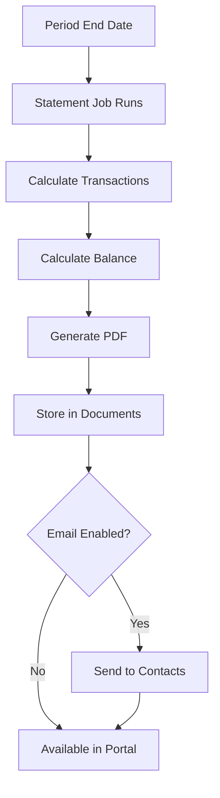

> Transaction history and client statements

---

## Quick Links

| Resource | Link |
|----------|------|
| **Portal** | [Package Statements](https://tc-portal.test/staff/packages/{id}/statements) |
| **Nova Admin** | [Statements](https://tc-portal.test/nova/resources/statements) |

---

## TL;DR

- **What**: Generate periodic financial statements showing funding usage and balance
- **Who**: Finance Team, Recipients/Contacts, Care Partners
- **Key flow**: Period Ends → Generate Statement → PDF Created → Email Sent
- **Watch out**: Statements are sent automatically - check recipient preferences

---

## Key Concepts

| Term | What it means |
|------|---------------|
| **Statement** | Periodic summary of financial transactions |
| **Transaction** | Individual financial movement (payment, refund, contribution) |
| **Statement Period** | Date range covered by statement |
| **Balance** | Remaining funds at statement date |

---

## How It Works

### Main Flow: Statement Generation



---

## Statement Types

| Type | Frequency | Status |
|------|-----------|--------|
| **Monthly** | End of month | ✅ Implemented |
| **Quarterly** | End of quarter | ❌ Not implemented |
| **Ad-hoc** | On request | ❌ Not implemented |
| **Year-end** | Annual | ❌ Not implemented |

**Note**: Only monthly statements are currently implemented in code.

---

## Business Rules

| Rule | Why |
|------|-----|
| **Monthly statements mandatory** | Compliance requirement for HCP |
| **Statement date immutable** | Accurate historical record |
| **Transactions frozen on statement** | Can't modify past statements |

---

## Who Uses This

| Role | What they do |
|------|--------------|
| **Finance Team** | Generate statements, handle queries |
| **Recipients/Contacts** | Receive and review statements |
| **Care Partners** | Explain statements to recipients |

---

## Open Questions

| Question | Context |
|----------|---------|
| **October 2025 special case?** | Hardcoded `isOct2025` flag - temporary or permanent? |
| **Payment date vs transaction date?** | Meeting says "use payment date" but code uses transaction date |
| **No Statement domain folder?** | Statements split across app/Models, app/Jobs, domain/* |
| **VC funding approval workflow?** | Manual confirmation feature mentioned but unclear location |

---

## Technical Reference

<details>
<summary><strong>Models & Database</strong></summary>

### Models

**Note**: There is NO `domain/Statement/` folder. Models are in `/app/Models/`:

```
app/Models/
├── PackageStatement.php           # Main statement linked to packages
├── StatementsHistory.php          # Tracks generation batches
└── PaymentStatementDownload.php   # Tracks SA API statement downloads
```

### Related Data Classes

```
domain/Transaction/Data/TransactionData.php
domain/CareCoordinatorFee/Data/View/CareCoordinatorFeesMonthlyStatementViewData.php
app/Data/PackageStatement/PackageStatementData.php
```

### Tables

| Table | Purpose |
|-------|---------|
| `package_statements` | Statement records |
| `statements_histories` | Batch tracking (statement_month, is_ready, is_released, zip_generated) |
| `packages_oct_statement_balances` | October 2025 special balance calculations |

</details>

<details>
<summary><strong>Jobs</strong></summary>

```
app/Jobs/Statements/                          # Note: plural "Statements"
├── GenerateStatementsManagerJob.php          # Batch orchestration (20-package chunks)
├── GenerateStatementJob.php                  # Core logic per package
└── EmailStatementsJob.php                    # Distribution to recipients
```

</details>

<details>
<summary><strong>Balance Types</strong></summary>

Statements track three balance types:
- **Government-held balance** - Funds held by Services Australia
- **TC-held balance** - Funds held by Trilogy Care
- **Commonwealth funds** - Government funding allocation

Recipient preferences stored in:
- `package.meta['statement_emails']` - Email recipients
- `package.meta['statement_mail_in']` - Physical statement flag
- `PackageRepresentative.receives_statements` - Representative opt-in

</details>

---

## Related

### Domains

- [Budget](/features/domains/budget) — funding allocation shown on statements
- [Contributions](/features/domains/contributions) — contributions appear on statements
- [Documents](/features/domains/documents) — statement PDFs stored here
- [Emails](/features/domains/emails) — statement notification emails

---

## Status

**Maturity**: Production
**Pod**: Finance
