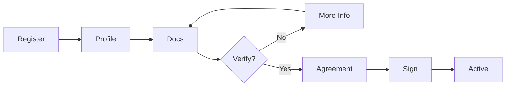

> Supplier onboarding, agreements, and verification

---

## Quick Links

| Resource | Link |
|----------|------|
| **Portal** | [Supplier List](https://tc-portal.test/staff/suppliers) |
| **Supplier Portal** | [Supplier Login](https://tc-portal.test/supplier) |
| **Nova Admin** | [Suppliers](https://tc-portal.test/nova/resources/suppliers) |

---

## TL;DR

- **What**: Manage service providers from onboarding through ongoing relationship
- **Who**: Operations Team, Suppliers, Bill Processors
- **Key flow**: Register → Verify → Agreement Signed → Submit Invoices
- **Watch out**: Suppliers must be verified before they can submit invoices

---

## Key Concepts

| Term | What it means |
|------|---------------|
| **Supplier** | External service provider delivering care services |
| **Onboarding** | Process of registering and verifying a new supplier |
| **Agreement** | Service terms, rates, and conditions |
| **Verification** | ABN validation, insurance, worker screening checks |
| **Supplier Portal** | Self-service interface for suppliers |

---

## How It Works

### Main Flow: Supplier Onboarding



---

## Verification Checks

| Check | What it validates |
|-------|-------------------|
| **ABN Lookup** | Valid Australian Business Number |
| **Insurance** | Current liability insurance |
| **Worker Screening** | NDIS/Aged Care worker checks |
| **Qualifications** | Required certifications |

---

## Business Rules

| Rule | Why |
|------|-----|
| **Must be verified to invoice** | Only approved suppliers can submit bills |
| **Agreement required** | Service terms must be agreed before work |
| **Insurance must be current** | Compliance and risk management |

---

## Who Uses This

| Role | What they do |
|------|--------------|
| **Suppliers** | Register, manage profile, submit invoices |
| **Operations Team** | Onboard suppliers, verify compliance |
| **Bill Processors** | Match invoices to verified suppliers |

---

## Open Questions

| Question | Context |
|----------|---------|
| **SupplierAgreement/Service/Verification models?** | Docs list but don't exist - replaced by DTOs and controllers |
| **Portal vs Supplier stage?** | `portal_stage` vs `stage` on model - when is each used? |
| **Multi-supplier per ABN?** | 117 suppliers affected, manual workaround in place |
| **Price cap approval authority?** | Who approves when supplier exceeds price cap? |
| **Digital platform pricing?** | How should Mable/Kevinity pricing be handled? |

---

## Technical Reference

<details>
<summary><strong>Models & Database</strong></summary>

### Models

**Note**: Several documented models don't exist. Actual models:

```
domain/Supplier/Models/
├── Supplier.php                    # Main supplier entity
├── SupplierOnboarding.php          # Onboarding workflow tracking
├── SupplierPortalStage.php         # Event-sourced portal stage transitions
└── SupplierServiceStatus.php       # Service verification status per type
```

**SupplierAgreement, SupplierService, SupplierVerification do NOT exist**. Functionality via:
- `SupplierAgreementData` DTO + `SupplierAgreementController`
- Service status via `SupplierServiceStatus` model
- Verification via Heavy/Lite verification actions

### Tables

| Table | Purpose |
|-------|---------|
| `suppliers` | Supplier records |
| `supplier_onboardings` | Onboarding progress tracking |
| `supplier_portal_stages` | Portal stage audit trail (event sourced) |
| `supplier_service_statuses` | Service-level verification status |

### Key Enums

- `PortalStageEnum` - Portal progression stages
- `SupplierStageEnum` - Supplier lifecycle stages
- `OnboardingStepEnum` - 9 steps (0-8)
- `SupplierOnboardingStatusEnum` - 7 status values

</details>

<details>
<summary><strong>Actions (35+ in domain)</strong></summary>

Key verification and onboarding actions:

```
domain/Supplier/Actions/
├── LiteVerificationVerifyAction.php            # Light verification
├── HeavyVerificationSubmitDocumentAction.php   # Document-based verification
├── ChooseHeavyVerificationPathwayAction.php    # Pathway selection
├── UpdateSupplierServicePricesForLocation.php  # Location-based pricing
├── TrackSupplierOnboardingStageAction.php      # Stage progression
├── UpdateSupplierPortalStageAction.php         # Event-sourced updates
├── CheckDuplicateBankDetailsByAbnAction.php    # Fraud prevention
└── [30+ more actions]
```

</details>

<details>
<summary><strong>Event Sourcing</strong></summary>

```
domain/Supplier/EventSourcing/
├── Aggregates/SupplierOnboardingAggregateRoot.php
├── Events/SupplierPortalStageChangedEvent.php
└── Projectors/SupplierOnboardingProjector.php
```

</details>

<details>
<summary><strong>Frontend Pages</strong></summary>

```
resources/js/Pages/
├── Suppliers/                  # Staff supplier management
│   ├── Index.vue
│   ├── Show.vue
│   └── ...
└── Supplier/                   # Supplier portal
    ├── Dashboard.vue
    ├── Profile.vue
    └── Invoices/
```

</details>

---

## Related

### Domains

- [Bill Processing](/features/domains/bill-processing) — suppliers submit invoices
- [Budget](/features/domains/budget) — suppliers linked to service plan items
- [Documents](/features/domains/documents) — supplier agreements stored here

---

## Current Challenges

From Fireflies meetings (Aug 2025 - Jan 2026):

| Challenge | Impact |
|-----------|--------|
| **Price cap management** | Need automated supplier price cap enforcement |
| **EFTsure integration** | Fraud prevention for supplier payments |
| **Self-termination workflow** | Missing clear process for supplier offboarding |
| **Document validation** | Expanded rejection reasons needed for compliance |
| **NDIS clearance tracking** | Police check documents under NDIS requirements |
| **Agreement variations** | Supplier agreement change workflow unclear |

---

## Fraud Prevention

### EFTsure Integration

- Fraud prevention system for verifying supplier bank details
- Validates payment destinations before processing
- Part of payment workflow to prevent fraudulent payments

---

## Self-Service Features

| Feature | Status | Description |
|---------|--------|-------------|
| **Supplier Portal** | Production | Invoice submission, profile management |
| **Self-Termination** | In Development | Suppliers can initiate offboarding |
| **Document Upload** | Production | Compliance document self-service |
| **Agreement Signing** | Production | Digital signature for agreements |

---

## Supplier Communications

### Invoice Status Updates

Three types of supplier communication for bill statuses:
1. **Approval notifications** — invoice processed and paid
2. **On-hold notifications** — issues requiring supplier action
3. **Rejection notifications** — invoice cannot be processed

---

## Status

**Maturity**: Production
**Pod**: Operations
**Owner**: Dave H

---

## Source Meetings

| Date | Meeting | Key Topics |
|------|---------|------------|
| Jan 21, 2026 | Supplier Weekly Touchpoint | Self-termination, expanded rejection reasons, document view bug |
| Jan 14, 2026 | OHB Dev Alignment | Supplier-bill linkage, AI classification by supplier |
| Dec 22, 2025 | Invoice Classification | Supplier matching, AI training data |
| Aug 2025 | Collections Project | EFTsure fraud prevention, price caps |
