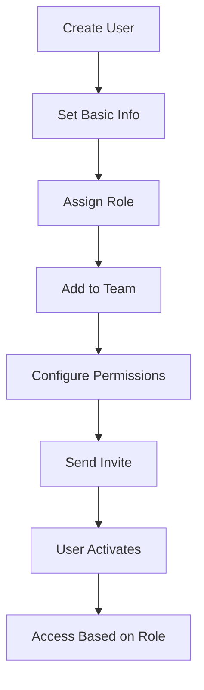

> User management, permissions, and team pods

---

## Quick Links

| Resource | Link |
|----------|------|
| **Nova Admin** | [Users](https://tc-portal.test/nova/resources/users) |
| **Nova Admin** | [Roles](https://tc-portal.test/nova/resources/roles) |
| **Nova Admin** | [Teams](https://tc-portal.test/nova/resources/teams) |

---

## TL;DR

- **What**: Manage users, their roles, permissions, and team assignments
- **Who**: Admins, Team Leaders
- **Key flow**: Create User → Assign Role → Add to Team → Access Granted
- **Watch out**: Role changes take effect immediately - plan permission changes carefully

---

## Key Concepts

| Term | What it means |
|------|---------------|
| **User** | Individual with Portal access |
| **Role** | Set of permissions (Care Partner, Coordinator, Admin, etc.) |
| **Team** | Group of users (e.g., SM+, HCP East) |
| **Permission** | Specific action allowed (view, edit, approve, etc.) |
| **Team Pod** | Functional grouping of team members |

---

## How It Works

### Main Flow: User Setup



---

## User Roles

| Role | Access Level | Primary Functions |
|------|--------------|-------------------|
| **Admin** | Full system | All functions, user management |
| **Care Partner** | Case management | Approvals, oversight, budgets |
| **Care Coordinator** | Day-to-day | Calls, notes, task completion |
| **Bill Processor** | Finance ops | Invoice processing |
| **Finance** | Financial | Payments, claims, statements |
| **Supplier** | External | Invoice submission, profile |
| **Recipient** | Client portal | View statements, approve invoices |

---

## Team Pods

Teams organised by:
- **Package Type**: Self-Managed, Fully Coordinated
- **Region**: Geographic areas
- **Function**: Clinical, Quality, Growth, Finance

---

## Business Rules

| Rule | Why |
|------|-----|
| **One primary role per user** | Clear permission boundaries |
| **Team assignment required** | Users must belong to a team |
| **Deactivation over deletion** | Preserve audit trail |

---

## Who Uses This

| Role | What they do |
|------|--------------|
| **Admins** | Create users, manage roles and teams |
| **Team Leaders** | Manage team membership |

---

## Open Questions

| Question | Context |
|----------|---------|
| **Why team_user pivot instead of Spatie's model_has_roles?** | Codebase uses both Spatie permissions AND custom team_user pivot - what's the relationship? |
| **Where is team-based package assignment?** | CV Permissions discussions mention team-based client assignments but implementation unclear |
| **Role.php vs Spatie Role?** | Custom Role model exists alongside Spatie's - how do they interact? |

---

## Technical Reference

<details>
<summary><strong>Models & Database</strong></summary>

### Package Used

Uses **Spatie Laravel-Permission v6.12** for role/permission management.

### Models

**Note**: Models are in `domain/` not `app/Models/` as previously documented.

```
domain/User/Models/
├── User.php                    # Main user model with HasRoles trait
└── Interfaces/UserInterface.php

domain/Role/Models/
└── Role.php                    # Extends Spatie\Permission\Models\Role

domain/Permission/Models/
└── Permission.php              # Extends Spatie\Permission\Models\Permission

domain/Team/Models/
└── Team.php                    # Custom team model
```

### Tables (Spatie Convention)

| Table | Purpose |
|-------|---------|
| `users` | User accounts |
| `roles` | Role definitions (Spatie) |
| `permissions` | Permission definitions (Spatie) |
| `model_has_roles` | User-role assignments (NOT role_user) |
| `model_has_permissions` | Direct permission assignments |
| `role_has_permissions` | Role-permission mappings |
| `teams` | Team structures |
| `team_user` | Team membership (custom pivot) |

**Note**: `role_user` table does NOT exist - Spatie uses `model_has_roles` instead.

### Key Traits

- `HasRoles` - Spatie trait on User model
- `HasPermissions` - Spatie trait for permission checks

</details>

<details>
<summary><strong>Permission Checking</strong></summary>

```php
// Via Spatie methods
$user->hasRole('admin');
$user->hasPermissionTo('edit articles');
$user->can('edit articles');

// Via middleware
Route::middleware(['role:admin'])->...
Route::middleware(['permission:edit articles'])->...
```

</details>

---

## Related

### Domains

- [Coordinator Portal](/features/domains/coordinator-portal) — team dashboards
- [Task Management](/features/domains/task-management) — task assignment by team

### Integrations

- [WorkOS](/features/integrations/workos) — SSO authentication

---

## Status

**Maturity**: Production
**Pod**: Platform
