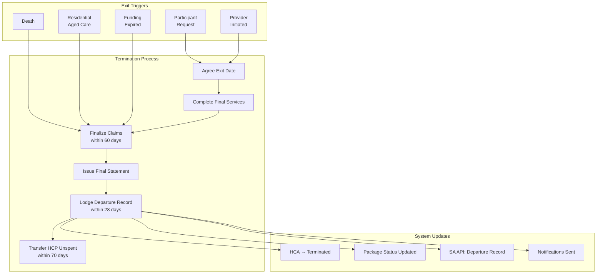

> Managing the exit of clients from Trilogy Care services — from voluntary exit to death to residential care transition

---

## Quick Links

| Resource | Link |
|----------|------|
| **Portal** | Package termination not yet in Portal (Zoho-based) |
| **Linear** | [PLA-1119: Terminate Flow with Compliance](https://linear.app/trilogycare/issue/PLA-1119) |
| **SA API Spec** | `app-modules/aged-care-api/OpenAPI/Aged_Care_API_-_Support_at_Home_Entry_Departure-1.0.0.yaml` |
| **SaH Manual** | Chapter 12: Ceasing and temporarily stopping services |

---

## TL;DR

- **What**: End a client's package/HCA when they leave Trilogy Care services
- **Who**: Care Partners, Admins, automated triggers (death, RAC entry)
- **Key flow**: Exit Initiated → Final Services → Final Claims → Departure Lodged → Funds Transferred
- **Watch out**:
  - Must lodge SA Departure within **28 days** of exit
  - Must finalise ALL claims within **60 days** of exit
  - Must transfer HCP unspent to SA within **70 days**

---

## Key Concepts

| Term | What it means |
|------|---------------|
| **Termination** | Portal/HCA term for ending a client relationship |
| **Departure** | Services Australia API term for exiting a funding classification |
| **Cessation Date** | The effective end date of the package |
| **ACER** | Aged Care Entry Record — must have matching Departure record |
| **HCP Unspent** | Legacy Home Care Package funds that must be returned to SA or participant |
| **Exit Reason** | Why the client is leaving (drives downstream actions) |
| **Offboarding** | Internal term for preparing client exit documentation and checklist |
| **End of Life Package** | Distinct package type for palliative/EOL clients with specific termination handling |

---

## How It Works

### Main Flow: Client Termination



### Other Flows

<details>
<summary><strong>Death of Participant</strong> — immediate exit</summary>

When a participant dies, special rules apply:

| Action | Detail |
|--------|--------|
| Exit date | Date of death |
| Update My Aged Care | Portal + phone call to prevent communications |
| Claims deadline | 60 days from date after death |
| HCP unspent | Refund to estate |

No notice period required. Services cease immediately.

</details>

<details>
<summary><strong>Entry to Residential Aged Care</strong> — automatic exit</summary>

When a participant enters residential aged care (nursing home):

| Action | Detail |
|--------|--------|
| Exit date | Same as RAC entry date |
| Auto-exit | Participant auto-exited from SaH on RAC entry |
| Claims on exit day | Can claim SaH services on the transition day |
| AT-HM | Outgoing provider should coordinate with incoming on in-progress AT-HM |

Departure reason: `TORES` (To Residential Aged Care)

</details>

<details>
<summary><strong>Provider-Initiated Cessation</strong> — requires 14 days notice</summary>

Provider can cease services only if:
- Participant can no longer be cared for at home with available resources
- Participant no longer needs services
- Needs better met by other funded aged care
- Participant intentionally caused serious injury to worker
- Participant didn't comply with worker safety rights
- Non-payment of contributions (without negotiated arrangement)
- Participant moved to location not serviced

**Requirements:**
- 14 days written notice before services end
- Notice must include: reason, end date, complaint rights, advocacy info
- Must ensure continuity of care arrangements

</details>

<details>
<summary><strong>Funding Reallocation (Inactive)</strong> — automatic after 4 quarters</summary>

If no services delivered for **4 consecutive quarters** (1 year):
- Funding reduced to zero
- Funding reallocated to Priority System
- Participant must contact My Aged Care to reactivate

> **Care management exception:** Monthly care management should continue even if services temporarily stopped (unless participant declines).

</details>

<details>
<summary><strong>End of Life Package Termination</strong> — special handling</summary>

End of Life (EOL) packages are a distinct package type with specific termination considerations:

| Aspect | Detail |
|--------|--------|
| Package type | Tagged as EOL in portal for visibility |
| Prognosis variability | Some clients outlive expected timelines, becoming higher risk |
| Care management | Continue monthly care management until death |
| Budget handling | Special considerations for co-contributions during palliative care |

> **Note**: EOL clients may have both a regular package and an EOL package running concurrently. Each requires separate termination handling.

</details>

<details>
<summary><strong>High-Risk Client Offboarding</strong> — contingency planning</summary>

For high-risk vulnerable clients (HRVC), care teams prepare **offboarding documents** as contingency:

| Step | Action |
|------|--------|
| 1 | Draft offboarding document when client becomes high-risk |
| 2 | Keep document updated for potential future use |
| 3 | Meet contact criteria before proceeding (e.g., documented outreach attempts) |
| 4 | Finalize offboarding plan only after criteria satisfied |

**Contact Criteria Example:**
- Multiple phone contact attempts documented
- Email outreach completed
- Welfare checks conducted (if no response)

</details>

<details>
<summary><strong>Early-Stage Termination (Onboarding Drop-off)</strong> — before services begin</summary>

Clients may exit during onboarding before services fully commence:

| Metric | Current | Target |
|--------|---------|--------|
| Drop-off rate | ~5% | 2-3% |

**Common reasons:**
- Changed mind about services
- Moved to different provider before starting
- Health decline requiring immediate RAC entry
- Death during onboarding period

> These terminations still require departure records but may have simpler claim handling (fewer/no services to finalise).

</details>

---

## Termination Reasons

### Portal/HCA Reasons (Internal)

| Reason | When to use | Notes required |
|--------|-------------|----------------|
| **Transition to another provider** | Client moving to different provider | No |
| **Entry to residential care** | Client entering nursing home | No |
| **Death** | Client has passed away | No |
| **Voluntary exit from program** | Client choosing to leave | No |
| **Other** | Doesn't fit above | Yes |

### Services Australia Departure Codes

| Code | Reason | Use Case |
|------|--------|----------|
| `TERMS` | Care recipient terminated service | Participant-initiated exit |
| `DECEA` | Deceased | Death of participant |
| `TORES` | To residential aged care | Entering nursing home |
| `MOVED` | Moved out of service area | Relocation |
| `CEASE` | Provider ceased providing service | Provider-initiated (14 days notice) |
| `THOSP` | To hospital | Extended hospitalisation |
| `FNDEX` | Funding classification expired | Auto when no claims for 4 quarters |
| `OTHER` | Other | Fallback |
| `AUTO` | Auto departure (read-only) | System-triggered |

---

## Business Rules

### Two-Way Communication Requirement

Home Care Agreements require **two-way communication** between provider and client:
- Clients must inform providers if they wish to discontinue services
- Some older clients mistakenly believe they must keep packages indefinitely
- Clear messaging about rights and responsibilities prevents resource wastage and improves service flow

> **Insight from Care Team**: Clear communication expectations in HCA agreements support mutual accountability and prevent situations where clients unknowingly block access for others.

### Care Management Fees at Termination

Special handling required for care management fee claims at termination:
- Claims for care management can be submitted up to the cessation date
- For deceased clients, final care management claims follow the 60-day window from date of death
- Edge cases (e.g., death mid-month) require pro-rata calculation

### Compliance Timeframes

| Rule | Why | Timeframe |
|------|-----|-----------|
| **Lodge departure record** | SA must be notified of exit | 28 days from exit |
| **Finalise all claims** | Can't claim after window closes | 60 days from exit |
| **Transfer HCP unspent to SA** | Government funds must be returned | 70 days from exit |
| **Refund participant-portion unspent** | Their money, not government's | Direct to participant/estate |
| **Share budget info with new provider** | Continuity of care | 28 days from exit |
| **Issue final statement** | Client transparency | After final claims |
| **14 days notice for provider-initiated** | Regulatory requirement | Before exit date |

---

## Provider Obligations on Exit

| Step | Action | Timeframe |
|------|--------|-----------|
| 1 | Agree exit date with participant | Before exit |
| 2 | Complete delivery of services | Up to exit date |
| 3 | Lodge departure record to SA | **28 days** from exit |
| 4 | Finalize ALL claims | **60 days** from exit |
| 5 | Issue final invoice & statement | After final claims |
| 6 | Share budget info with incoming provider | **28 days** from exit |
| 7 | Refund participant-portion HCP unspent | To participant/estate |
| 8 | Transfer Commonwealth HCP unspent to SA | **70 days** from exit |

---

## Feature Flags

| Flag | What it controls | Default |
|------|------------------|---------|
| *None yet* | Termination workflow is planned, not yet built | - |

---

## Common Issues

<details>
<summary><strong>Issue: Departure record rejected by SA</strong></summary>

**Symptom**: Departure API returns error

**Cause**: Entry record doesn't exist, or mismatch in care recipient ID / entry category

**Fix**: Verify the entry record exists for this classification. Use SA Debug tool on package sidebar to check entry/departure status.

</details>

<details>
<summary><strong>Issue: Claims rejected after termination</strong></summary>

**Symptom**: Claims submitted but rejected

**Cause**: Claim submitted after 60-day window, or for dates after exit date

**Fix**: Can only claim for services delivered up to and including exit date, within 60-day window. Late claims require documented reason.

</details>

<details>
<summary><strong>Issue: Package shows terminated but bills still processing</strong></summary>

**Symptom**: Terminated package has bills in workflow

**Cause**: Bills submitted before termination but not yet processed

**Fix**: Bills can still be processed for services before cessation date. Check service dates against cessation date.

</details>

---

## Who Uses This

| Role | What they do |
|------|--------------|
| **Care Partner** | Initiate termination, complete exit checklist |
| **Admin** | Approve termination, lodge SA departure, manage final claims |
| **System** | Auto-terminate on death/RAC entry triggers, send notifications |
| **Finance** | Process final claims, issue final statement, transfer funds |

---

## Technical Reference

<details>
<summary><strong>Enums & Status</strong></summary>

### Package Status (via Zoho currently)

```
ONBOARDING → ACTIVE → TERMINATED
```

### Care Coordinator Stage

```php
// app/Enums/CareCoordinatorStageEnum.php
case ONBOARDING = 'ONBOARDING';
case APPROVED = 'APPROVED';
case TERMINATED = 'TERMINATED';  // Red colour
```

### Bill On-Hold Reasons

```php
// app/Enums/Bill/BillOnHoldReasonsEnum.php
case TERMINATED = 'TERMINATED';

// app/Enums/Bill/BillRejectedReasonsEnum.php
case TERMINATED_WITH_INSUFFICIENT_FUNDS = 'TERMINATED_WITH_INSUFFICIENT_FUNDS';
case SUPPLIER_TERMINATED = 'SUPPLIER_TERMINATED';
```

</details>

<details>
<summary><strong>Models & Database</strong></summary>

### Key Fields

```php
// domain/Package/Models/Package.php
'cessation_date'  // The exit date
```

### Tables

| Table | Purpose |
|-------|---------|
| `packages` | Has `cessation_date` for termination |
| `care_coordinators` | Has stage including TERMINATED |

</details>

<details>
<summary><strong>Services Australia API</strong></summary>

### Entry/Departure Connector

```
app-modules/aged-care-api/src/Http/Integrations/Connectors/EntryDeparture/
├── EntryDeparture.php              # Main connector
├── Resource/
│   ├── Entries.php                 # Entry operations
│   └── Departures.php              # Departure operations
└── Requests/
    ├── Entries/
    │   ├── AgedcareEntry1Post.php  # Create entry
    │   └── AgedcareEntry1Delete.php # Delete entry
    └── Departures/
        ├── AgedcareDeparture1Post.php   # Create departure
        ├── AgedcareDeparture1Put.php    # Update departure
        ├── AgedcareDeparture1Get.php    # Get departure
        ├── AgedcareDeparture1Details.php # Departure details
        └── AgedcareDeparture1Delete.php  # Delete departure
```

### Departure API Endpoint

```
POST /departure/v1
```

**Required Fields:**
- `careRecipientId` - Must match entry
- `serviceNapsId` - Must match entry
- `entryCategoryCode` - ON, AT, HM, RC, EL
- `departureDate` - Must be in the past
- `departureReasonCode` - One of the valid codes

**Response Status:**
- `Held` - Awaiting manual action
- `Rejected` - Departure rejected
- `Deleted` - Departure deleted
- `Accepted` - Will be processed

</details>

<details>
<summary><strong>Debug Tools</strong></summary>

### SA Debug Controller

```php
// app-modules/aged-care-api/src/Http/Controllers/SaDebugController.php
// Provides debug panel on package sidebar for entry/departure status
```

See [DUC-10](https://linear.app/trilogycare/issue/DUC-10) - Entry/departure GET debug added to SA debug API tool.

</details>

---

## Testing

### Key Test Scenarios

- [ ] Termination with valid reason updates package status
- [ ] Departure record lodged to SA within 28 days
- [ ] Claims rejected after 60-day window
- [ ] Bills for services after cessation date rejected
- [ ] Death trigger auto-terminates package
- [ ] RAC entry trigger auto-terminates with TORES code
- [ ] HCP unspent transfer initiated within 70 days
- [ ] Final statement generated after termination

### Manual Testing

1. Find a test package in Portal
2. Set cessation date in Zoho
3. Verify package status updates
4. Check SA Debug panel for departure record
5. Submit bill for date after cessation - should reject

---

## Related

### Domains

- [Home Care Agreement](./home-care-agreement.md) — HCA termination triggers package termination
- [Claims](./claims.md) — 60-day final claiming window
- [Services Australia API](./services-australia-api.md) — Departure record lodgement
- [Budget](./budget.md) — Final statement and HCP unspent handling

### Epics

| Epic | Status | Description |
|------|--------|-------------|
| [[HCA] Client HCA](../../initiatives/Consumer-Lifecycle/Client-HCA) | Planned | US15: Terminate Flow with Compliance |
| [PLA-1119](https://linear.app/trilogycare/issue/PLA-1119) | Backlog | Termination wizard with SA integration |
| [PLA-1114](https://linear.app/trilogycare/issue/PLA-1114) | Backlog | Basic terminate and reactivate |
| [PLA-72](https://linear.app/trilogycare/issue/PLA-72) | Reviewing | Package Termination (legacy) |

### Research

- [Claims SaH Research](../../context/6.Industry/claims-sah-research.md) — Section 6: Entry, Departure & Termination

---

## Open Questions

| Question | Context |
|----------|---------|
| **When will Portal termination be built?** | PLA-1119, PLA-1114 in backlog - SA API ready |
| **None technical** | Documentation accurate - enums, API, Package model all verified |

---

## Technical Reference (Verified)

All technical components documented in this file were verified to exist:

- ✅ `CareCoordinatorStageEnum::TERMINATED`
- ✅ `BillOnHoldReasonsEnum::TERMINATED`, `TERMINATION_DATE`
- ✅ `BillRejectedReasonsEnum` termination reasons (4 cases)
- ✅ `Package::$cessation_date` with date cast
- ✅ `Package::TERMINATED_PACKAGE_PAY_DEADLINE_DAYS = 30`
- ✅ `getBillDeadlineDateAttribute()` method
- ✅ SA Departure API connector and all CRUD operations
- ✅ `SaDebugController` with `departure()` method
- ✅ Frontend `useTerminatedPackage.js` composable
- ✅ `SupplierStageEnum::TERMINATED`

---

## Status

**Maturity**: Planned (Zoho-based currently, Portal API ready)
**Pod**: Consumer Lifecycle
**Owner**: TBD

---

## To Document

> **TODO**: The following items need to be incorporated into this document:
>
> - [ ] **Security of Tenure** — Regulatory protections around client's right to remain with provider; limits on provider-initiated termination
> - [ ] **Zoho CRM Termination Module** — Existing termination workflow is well-documented in Zoho; needs to be referenced/migrated here
