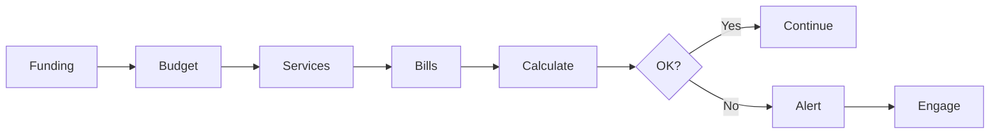

> Package utilisation tracking and reporting

---

## Quick Links

| Resource | Link |
|----------|------|
| **Portal** | [Utilisation Dashboard](https://tc-portal.test/staff/utilisation) |
| **Portal** | [Package Utilisation](https://tc-portal.test/staff/packages/{id}/utilisation) |

---

## TL;DR

- **What**: Track how much of a recipient's HCP funding is being used
- **Who**: Care Partners, Finance Team, Care Coordinators
- **Key flow**: Funding Received → Services Delivered → Spend Tracked → Utilisation Reported
- **Watch out**: Under Support at Home, low utilisation (<75%) triggers interventions

---

## Key Concepts

| Term | What it means |
|------|---------------|
| **Utilisation Rate** | Percentage of funding spent vs available |
| **Unspent Funds** | Funding not used within the period |
| **Quarterly Budget** | Funding allocation for each quarter |
| **Rollover** | Unspent funds carried to next period |

---

## How It Works

### Main Flow: Utilisation Tracking



---

## Support at Home Impact

Under Support at Home (SaH), utilisation becomes critical:

| Metric | Threshold | Action |
|--------|-----------|--------|
| **Target** | ≥75% | Healthy utilisation |
| **Warning** | 50-74% | Engagement nudges triggered |
| **Critical** | <50% | Escalation to Care Partner |

**Key Changes**:
- **Use-it-or-lose-it** rules reduce rollover flexibility
- Revenue tied directly to utilisation rates
- Low utilisation impacts package viability

---

## Business Rules

| Rule | Why |
|------|-----|
| **Weekly utilisation updates** | Timely visibility for interventions |
| **Alerts at thresholds** | Proactive engagement before funding lost |
| **Historical tracking** | Trend analysis and forecasting |

---

## Who Uses This

| Role | What they do |
|------|--------------|
| **Care Partners** | Monitor package utilisation, intervene when low |
| **Care Coordinators** | Engage recipients to increase service uptake |
| **Finance Team** | Report on portfolio utilisation |

---

## Three Utilisation Metrics

| Metric | Description |
|--------|-------------|
| **Spent** | Actual spend to date from processed bills |
| **Planned** | Budgeted spend from service plan items |
| **Projected** | Forecast based on current trajectory |

---

## Traffic Light System

| Status | Threshold | Meaning |
|--------|-----------|---------|
| 🟢 Green | ≥75% | Healthy utilisation |
| 🟡 Amber | 50-74% | Warning - engagement needed |
| 🔴 Red | <50% | Critical - escalation required |

Thresholds are config-driven and can be adjusted per package level.

---

## Open Questions

| Question | Context |
|----------|---------|
| **Pacing delta calculation?** | How projected vs actual trajectory is calculated |
| **VC impact on projected amounts?** | VC funding streams can inflate projected figures |
| **Quarterly rollover rules under SaH?** | Use-it-or-lose-it impact on calculations |

---

## Technical Reference

<details>
<summary><strong>Models & Database</strong></summary>

### Models

```
domain/Funding/Models/
├── PackageUtilisation.php              # Main utilisation tracking
├── Funding.php                         # Services Australia funding
└── FundingStream.php                   # Funding source reference

domain/Budget/Models/
└── BudgetPlan.php                      # Provides planned amounts
```

**Note**: Utilisation lives in `domain/Funding/` not `domain/Utilisation/`.

### Tables

| Table | Purpose |
|-------|---------|
| `package_utilisations` | Utilisation records with spent/planned/projected |
| `fundings` | Services Australia funding allocations |

### Calculation

Utilisation is calculated from:
- **Spent**: Sum of processed bills for period
- **Planned**: Sum of budget plan items for period
- **Projected**: Algorithm based on current spend rate

</details>

<details>
<summary><strong>Jobs</strong></summary>

```
app/Jobs/
├── CalculatePackageUtilisationJob.php  # Recalculates utilisation metrics
└── SendUtilisationAlertsJob.php        # Triggers on threshold breach
```

</details>

---

## Related

### Domains

- [Budget](/features/domains/budget) — utilisation against budget allocation
- [Bill Processing](/features/domains/bill-processing) — spend from processed bills
- [Coordinator Portal](/features/domains/coordinator-portal) — utilisation alerts on dashboard

---

## Current Challenges

From Fireflies meetings (Aug 2025 - Jan 2026):

| Challenge | Impact |
|-----------|--------|
| **First quarter delays** | Typically only 30% utilization due to time-to-service |
| **Accrued funds** | 72% of clients with 10k+ funds with Trilogy >1 year |
| **Target gap** | Current 70%, ambitious goal 90% |
| **Pacing visibility** | Delta visualization needed |
| **VC complication** | VC funding streams can inflate projected amounts |

---

## Utilisation Targets

| Period | Target | Reality |
|--------|--------|---------|
| **Q1** | 70% | Typically 30% (time-to-service delays) |
| **Q2-Q4** | 70% | Current standard target |
| **Optimal** | 90% | Ambitious organizational goal |

---

## Accrued Funds Analysis

| Metric | Value |
|--------|-------|
| **Clients with 10k+ unspent** | 72% of portfolio |
| **Tenure threshold** | Over 1 year with Trilogy |
| **Implication** | Significant unutilized funding across caseloads |

---

## Pacing & Forecasting

### Features in Development

| Feature | Description |
|---------|-------------|
| **Pacing delta visualization** | Show projected vs actual spend trajectory |
| **Budget audit logs** | Track changes affecting utilization |
| **Funding configurator modal** | Better funding stream management |
| **Improved client view** | Mobile-friendly budget visibility |

---

## VC Impact on Utilisation

| Issue | Impact |
|-------|--------|
| **Inflated projections** | VC funding streams can inflate projected funding |
| **Unconfirmed funds** | Causing payment holds |
| **Manual verification** | Needed for finance approval |

---

## Status

**Maturity**: Production
**Pod**: Duck, Duck Go
**Owner**: Matt A

---

## Source Meetings

| Date | Meeting | Key Topics |
|------|---------|------------|
| Jan 29, 2026 | Planning Session | Pacing delta visualization |
| Jan 20, 2026 | VCF Meeting | VC impact on utilization |
| Jun 9, 2025 | Budget V2 Kick Off | Utilization targets, quarterly tracking |
| Multiple | Budget Interviews | 72% with accrued funds |
