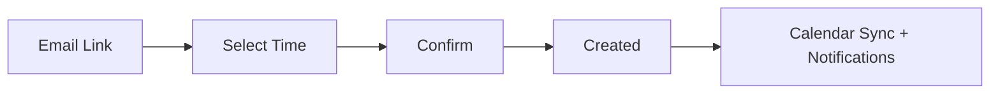
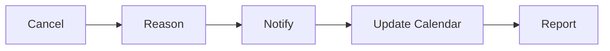

> Assessment and appointment scheduling with calendar integration

---

## Quick Links

| Resource | Link |
|----------|------|
| **SimplyBook** | [Admin Dashboard](https://trilogycare.simplybook.me/v2/) |
| **Portal** | Booking links embedded in emails |
| **Outlook** | Synced calendars for providers |

---

## TL;DR

- **What**: Centralized booking system replacing Calendly for assessment scheduling
- **Who**: Assessment Team, Care Partners, Clients, Providers
- **Key flow**: Email Link → Client Books → Calendar Synced → Notifications Sent
- **Watch out**: Two-week advance booking limit enforced; unique links prevent double-booking

---

## Key Concepts

| Term | What it means |
|------|---------------|
| **SimplyBook** | Booking platform replacing Calendly |
| **Provider** | Staff member who conducts appointments |
| **Service Type** | Category of appointment (assessment, review, clinical) |
| **Booking Link** | URL sent to clients for self-service scheduling |
| **TCID** | Trilogy Care ID - primary identifier for CRM integration |

---

## How It Works

### Main Flow: Client Booking

### Other Flows

<strong>Staff-Side Booking</strong> — internal scheduling

Providers can book appointments directly without client involvement.

<strong>Cancellation Flow</strong> — managing changes

---

## Business Rules

| Rule | Why |
|------|-----|
| **Two-week advance limit** | Prevents indefinite scheduling delays |
| **No double bookings** | Generic links enforce one booking per client |
| **Unique provider links** | Route to specific calendars when needed |
| **Outlook sync required** | Calendar activation in settings |
| **Cancellation reasons tracked** | Supports no-show and cancellation reporting |

---

## SimplyBook vs Calendly

| Feature | SimplyBook | Calendly |
|---------|------------|----------|
| **Cost** | ~$2/year | ~$15/year |
| **API quality** | Clean, structured | "Word vomit" format |
| **Built-in analytics** | Yes | Limited |
| **TCID integration** | Custom fields | Manual entry (corrupted data) |
| **Double-booking prevention** | Automatic | Required manual unique links |
| **Outlook sync** | Instant | Manual |

---

## Integration Architecture

### Current Integrations

| System | Integration Type | Purpose |
|--------|-----------------|---------|
| **Outlook** | Calendar sync | Provider availability and bookings |
| **Zoho CRM** | API (planned) | TCID and booking data sync |
| **Klaviyo** | API (planned) | Centralized email/SMS communications |
| **Databricks** | API | Reporting and analytics |
| **Portal** | Booking links | Embedded in client communications |

### API Capabilities

- Meeting link generation
- Booking management (create, update, cancel)
- Statistics and analytics
- Provider performance data
- Custom fields (TCID integration)

---

## Common Issues

<strong>Issue: Duplicate calendar entries</strong>

**Symptom**: Same meeting appears multiple times in Outlook

**Cause**: Multiple sync attempts or test meetings not cleared

**Fix**: Delete all test meetings, disable sync, resync fresh

<strong>Issue: Booking link not working</strong>

**Symptom**: Client reports link error or no availability

**Cause**: Provider calendar not synced or availability not configured

**Fix**: Verify provider schedule and calendar sync in SimplyBook settings

<strong>Issue: Client booked multiple times</strong>

**Symptom**: Same client has multiple assessment bookings

**Cause**: Using old Calendly generic links

**Fix**: Use SimplyBook links which prevent double-booking automatically

---

## Who Uses This

| Role | What they do |
|------|--------------|
| **Assessment Team** | Manage bookings, conduct appointments |
| **Care Partners** | View scheduled assessments, coordinate with clients |
| **Providers** | Manage personal availability, view schedules |
| **Clients** | Self-service booking via email links |
| **Admins** | Configure services, manage templates, reporting |

---

## Technical Reference

<strong>Configuration</strong>

### Admin Settings

| Setting | Location | Purpose |
|---------|----------|---------|
| **Calendar sync** | Custom Features | Outlook integration |
| **Email templates** | Settings > Notifications | Booking confirmations |
| **SMS settings** | Settings > Notifications | Text reminders |
| **Service types** | Services | Assessment categories |
| **Provider schedules** | Providers | Availability management |

### Booking Link Types

| Type | Use Case |
|------|----------|
| **Generic link** | Standard client bookings |
| **Provider-specific** | Route to specific calendar |
| **Service-specific** | Filter by appointment type |

<strong>Email Templates</strong>

Templates can be customized per service/team:
- Booking confirmation
- Reminder (24h, 1h)
- Cancellation confirmation
- Reschedule notification
- No-show follow-up

---

## Reporting & Analytics

### Available Metrics

| Metric | Source |
|--------|--------|
| **Booking volume** | Statistics endpoint |
| **Provider utilization** | Performance analytics |
| **Cancellation rates** | Cancellation tracking |
| **No-show rates** | Attendance reporting |
| **Time to book** | Booking analytics |

### Dashboards

- Power Automate workflows for real-time tracking
- Databricks integration for unified reporting
- CRM sync for client journey analytics

---

## Rollout Strategy

### Phase 1: Pilot (Current)

- Assessment team providers only
- Grant and Holly as initial users
- Limited service types

### Phase 2: Expansion

- All assessment booking partners
- CRM API integration
- Full email template suite

### Phase 3: Full Deployment

- Coordinator bookings
- Portal notifications
- Client-facing app integration

---

## Testing

### Key Test Scenarios

- [ ] Client booking via email link
- [ ] Double-booking prevention
- [ ] Outlook calendar sync
- [ ] Cancellation with reason
- [ ] Email notifications sent
- [ ] Provider availability respected
- [ ] Two-week limit enforced
- [ ] Stress test: 50 concurrent bookings

---

## Related

### Domains

- [Onboarding](/features/domains/onboarding) — booking integrated with Fast Lane
- [Lead Management](/features/domains/lead-management) — booking links in lead emails
- [Management Plans](/features/domains/management-plans) — assessment scheduling

### Initiatives

| Epic | Status | Description |
|------|--------|-------------|
| SimplyBook Implementation | In Progress | Calendly replacement project |

---

## Status

**Maturity**: In Development (Pilot)
**Pod**: Assessment, Care
**Owner**: Marleze S

---

## Source Meetings

| Date | Meeting | Key Topics |
|------|---------|------------|
| Dec 11, 2025 | Simplybook Check-in | Calendar sync, email templates, phased rollout |
| Oct 3, 2025 | Simplybook POC Testing Wrap-up | API advantages, Calendly comparison, CRM sandbox |
| Sep 15, 2025 | Simplybook POC Planning | Gap analysis, Outlook integration, unique links |
| Sep 11, 2025 | Simplybook POC Technical Planning | Cost comparison, API requirements, TCID integration |
