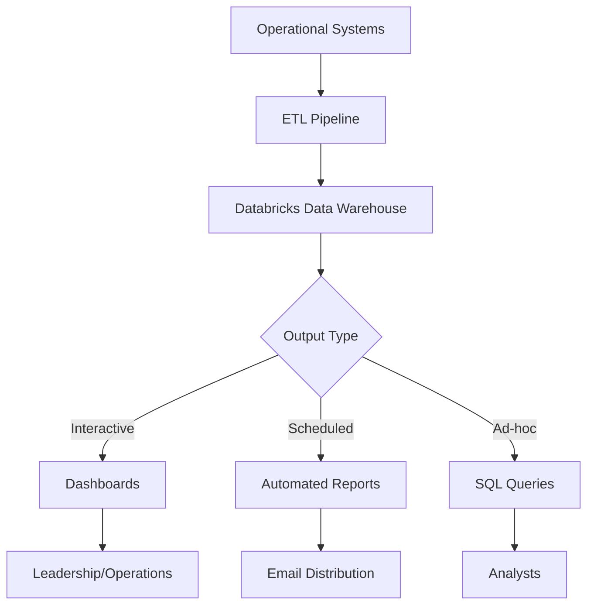
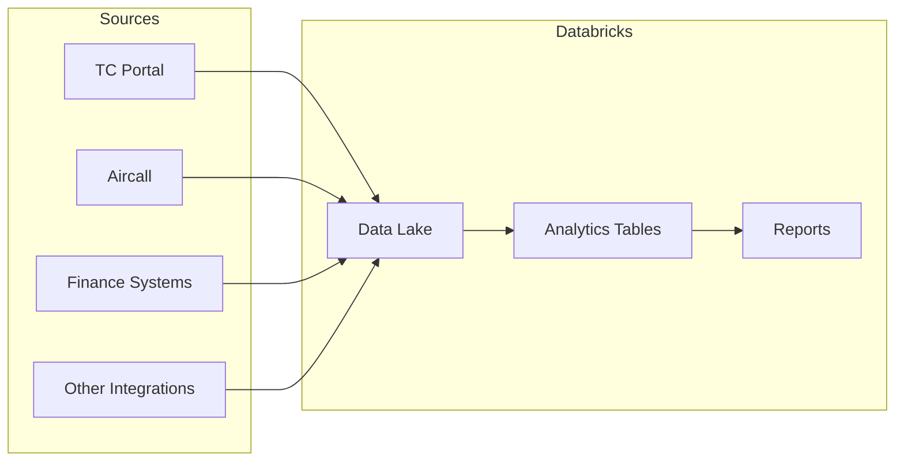

> Unified analytics platform for business intelligence and operational insights

---

## Quick Links

| Resource | Link |
|----------|------|
| **Databricks** | [Databricks Workspace](https://databricks.com) |

---

## TL;DR

- **What**: Data warehouse and analytics platform consolidating data from multiple operational systems
- **Who**: Leadership, Operations, Finance, Product teams
- **Key flow**: Operational Data -> ETL Pipeline -> Databricks -> Dashboards/Reports
- **Watch out**: Replacing Metabase for performance-sensitive reports; data freshness varies by source

---

## Key Concepts

| Term | What it means |
|------|---------------|
| **Data Warehouse** | Centralized repository combining data from multiple systems |
| **ETL Pipeline** | Extract-Transform-Load process moving data into Databricks |
| **Dashboard** | Visual report showing metrics and KPIs |
| **Automated Report** | Scheduled report generated and distributed via Databricks |

---

## How It Works

### Main Flow: Data Pipeline

### Data Sources

### Other Flows

<strong>Aircall Call Metrics</strong> - telephony analytics

Call data from Aircall flows into Databricks for call metrics dashboards, enabling performance tracking and operational insights.

<strong>Automated Status Reports</strong> - scheduled distribution

Databricks generates and distributes status reports on a schedule, replacing manual reporting processes.

---

## Business Rules

| Rule | Why |
|------|-----|
| **Data freshness varies** | Some data syncs hourly, some daily - check timestamps |
| **Metabase for legacy reports** | Some reports still in Metabase during transition |
| **No PII in ad-hoc exports** | Data governance requires care with exports |

---

## Why Databricks

| Previous Approach | Issue | Databricks Solution |
|-------------------|-------|---------------------|
| Metabase | Performance issues with complex queries | Optimised for large-scale analytics |
| Amplitude | Data loss affecting product reporting | Reliable data pipeline with backups |
| Manual reports | Time-consuming, error-prone | Automated generation and distribution |
| Siloed data | Cross-domain insights difficult | Unified data warehouse |

---

## Who Uses This

| Role | What they do |
|------|--------------|
| **Leadership** | View dashboards, receive automated reports |
| **Operations** | Monitor call metrics, track KPIs |
| **Finance** | Access financial reporting, reconciliation data |
| **Product** | Analyse feature usage, user behaviour |
| **Data Analysts** | Build queries, create dashboards |

---

## Technical Reference

<strong>Integration Points</strong>

### Data Sources

| System | Data Type | Sync Frequency |
|--------|-----------|----------------|
| TC Portal | Operational data | TBD |
| Aircall | Call metrics | TBD |
| Finance | Transaction data | TBD |

### Outputs

| Output | Purpose |
|--------|---------|
| Dashboards | Interactive visualisations |
| Automated Reports | Scheduled email/Slack distribution |
| SQL Interface | Ad-hoc analysis |

---

## Related

### Domains

- [Reporting](/features/domains/reporting) - reporting requirements and outputs
- [Bill Processing](/features/domains/bill-processing) - financial data source
- [Budget](/features/domains/budget) - budget data for financial analytics

### Integrations

- Aircall - telephony call metrics
- Metabase - legacy reporting (being phased out)
- Amplitude - product analytics (supplemented by Databricks)

---

## Status

**Maturity**: In Development
**Pod**: Data/Platform
**Owner**: TBD

---

## Roadmap

| Phase | Focus | Status |
|-------|-------|--------|
| 1 | Core infrastructure setup | In Progress |
| 2 | Aircall call metrics dashboards | Planned |
| 3 | Automated status reports | Planned |
| 4 | Metabase migration | Planned |
| 5 | Cross-domain analytics | Planned |
