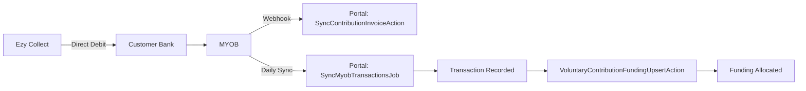

> External debt collection integration (no direct API integration)

---

## TL;DR

- **What**: External debt collection platform for payment reminders and direct debit
- **Who**: Finance team (operates in Ezy Collect directly)
- **Key flow**: Ezy Collect collects payment → MYOB receives → Portal syncs transaction
- **Watch out**: NO direct API integration - Ezy Collect is external-only

---

## Open Questions

| Question | Context |
|----------|---------|
| **Where is Ezy Collect API code?** | NO API integration exists in codebase - Ezy Collect operates externally |
| **Fee Payer model?** | Documented in collections.md but doesn't exist |
| **Direct Debit Authority model?** | Documented but doesn't exist |

---

## What's Actually Implemented

### NO Direct Integration ❌

The codebase does **NOT** contain:
- Ezy Collect API client
- Direct debit form handling
- Payment reminder automation
- Collection schedule tracking

### What Portal DOES Have

Portal acts as **read-only receiver** of payment data from MYOB:

#### 1. Contribution Invoice Sync (MYOB → Portal)

**Location**: `domain/Contribution/`

| Component | File |
|-----------|------|
| Model | `ContributionInvoice.php` |
| Action | `SyncContributionInvoiceAction.php` |
| Projector | `ContributionInvoiceProjector.php` |

**Route**: `POST /contributionInvoices/webhook/sync`

Receives webhook from MYOB when AR invoices are created/updated.

#### 2. Transaction Sync (MYOB → Portal)

**Location**: `domain/Transaction/`

| Component | File |
|-----------|------|
| Job | `SyncMyobTransactionsJob.php` |
| Model | `Transaction.php` |

Fetches all transactions from MYOB daily, marks bills as paid.

#### 3. Voluntary Contribution Funding

**Location**: `domain/Funding/`

**Action**: `VoluntaryContributionFundingUpsertAction.php`

Syncs VC transactions from MYOB (account 2480) to funding streams.

---

## Actual Payment Flow

---

## Related Documentation

- [Collections Domain](../domains/collections.md) - Documents planned vs actual implementation
- [MYOB Integration](./myob.md) - Actual transaction sync

---

## Status

**Maturity**: External (no direct integration)
**Pod**: Finance
