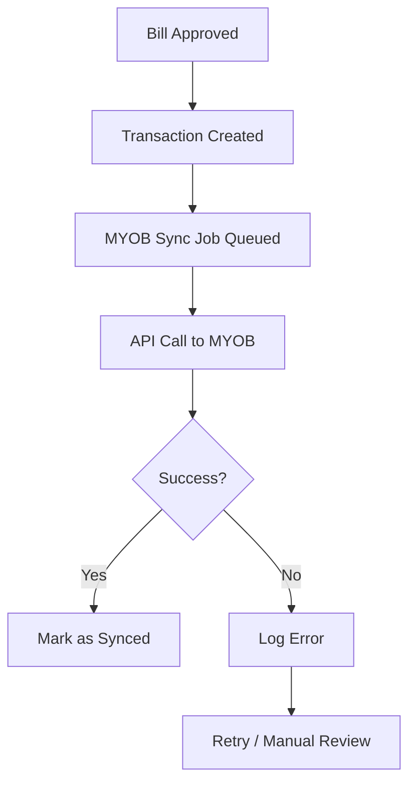

> Accounting integration and transaction sync

---

## Quick Links

| Resource | Link |
|----------|------|
| **Nova Admin** | [MYOB Sync Status](https://tc-portal.test/nova/resources/myob-transactions) |

---

## TL;DR

- **What**: Sync approved payments and transactions to MYOB AccountRight
- **Who**: Finance Team, System (automated jobs)
- **Key flow**: Bill Approved → Transaction Created → Synced to MYOB
- **Watch out**: Sync failures need manual review - check Horizon for failed jobs

---

## Key Concepts

| Term | What it means |
|------|---------------|
| **Transaction** | Financial movement synced to MYOB |
| **Chart of Accounts** | Mapping of Portal categories to MYOB accounts |
| **Sync Status** | Whether transaction has been pushed to MYOB |

---

## How It Works

### Main Flow: Transaction Sync



---

## Business Rules

| Rule | Why |
|------|-----|
| **Only approved transactions sync** | Draft/pending don't go to MYOB |
| **Account mapping required** | All categories must map to MYOB accounts |
| **Idempotent sync** | Same transaction won't create duplicates |

---

## Who Uses This

| Role | What they do |
|------|--------------|
| **Finance Team** | Monitor sync status, resolve errors |
| **System** | Automated sync jobs via Horizon |

---

## Open Questions

| Question | Context |
|----------|---------|
| **None** | Documentation corrected - paths now match actual codebase |

---

## Technical Reference (Corrected)

<details>
<summary><strong>Models & Database</strong></summary>

### Actual Models

**Note**: The `domain/Accounting/` folder does NOT exist. MYOB models are in `domain/Myob/` and `domain/Transaction/`:

```
domain/Myob/Models/
└── MyobSyncHistory.php           # Tracks sync status (module, date, last_record, latest_synced_at)

domain/Transaction/Models/
└── Transaction.php               # Contains myob_sub_account, myob_vendor_id, account mappings
```

### Actual Tables

| Table | Purpose |
|-------|---------|
| `transactions` | Transaction data with MYOB fields (myob_sub_account, myob_vendor_id, account) |
| `myob_sync_histories` | Tracks sync status per module |
| `myob_oauth_settings` | Stores MYOB API credentials |
| `bills` | Contains myob_reference_number, myob_vendor_id, myob_sync_failed_at, myob_sync_failed_reason |

</details>

<details>
<summary><strong>Jobs (Actual)</strong></summary>

Jobs exist under domain folders, NOT `app/Jobs/Myob/`:

```
domain/Transaction/Jobs/
├── SyncMyobTransactionsJob.php           # Main sync job (ShouldBeUnique, ShouldQueue)
└── SyncMyobTransactionsBySubAccountsJob.php

domain/Myob/Jobs/
├── SyncBillToMyobJob.php                  # Syncs bills to MYOB
└── SyncSupplierVendorFromMyobJob.php      # Syncs supplier vendors from MYOB
```

</details>

<details>
<summary><strong>Full Domain Structure</strong></summary>

```
domain/Myob/
├── Actions/
│   ├── MyobBankDetailsWebhookAction.php
│   ├── CheckMyobIfBillExistsAction.php
│   ├── MyobCreateOrUpdateVendorAction.php
│   ├── FetchMyobVendorsByBankDetailsAction.php
│   └── Assembler/ (bill item data assemblers)
├── Console/Commands/
│   └── MassUpdateMyobVendorsCommand.php
├── Data/ (DTOs for MYOB operations)
├── Jobs/
│   ├── SyncBillToMyobJob.php
│   └── SyncSupplierVendorFromMyobJob.php
├── Models/
│   └── MyobSyncHistory.php
├── Repositories/
│   └── MyobSyncHistoryRepository.php
├── Routes/
│   └── myobRoutes.php
├── Services/
│   └── MyobService.php
└── Providers/
    └── MyobServiceProvider.php
```

</details>

---

## Related

### Domains

- [Bill Processing](/features/domains/bill-processing) — approved bills create transactions
- [Supplier](/features/domains/supplier) — supplier records sync to MYOB

### Integrations

- [MYOB Acumatica](/features/integrations/myob-acumatica) — API integration details

---

## Status

**Maturity**: Production
**Pod**: Finance
