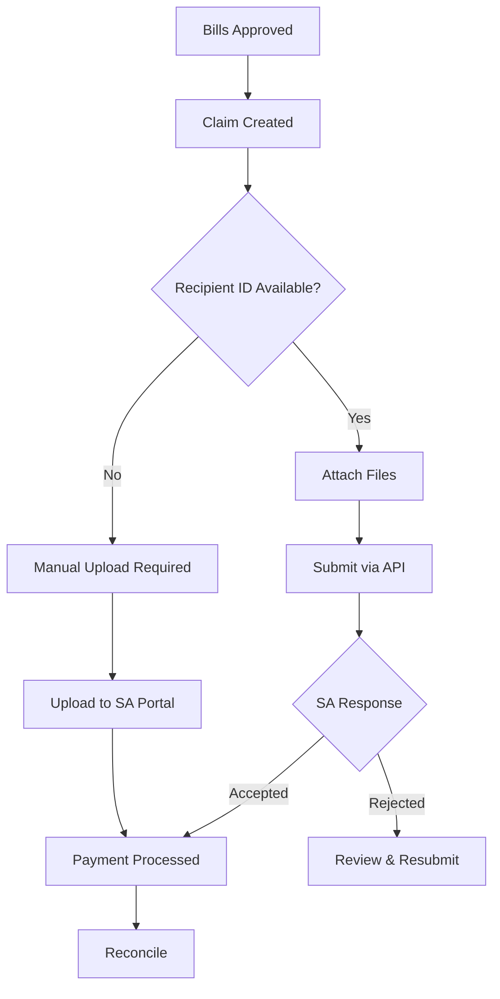
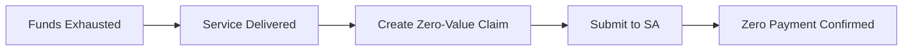
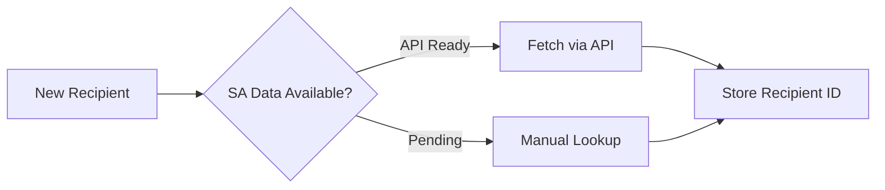

> Government API integration for aged care claims and compliance

---

## Quick Links

| Resource | Link |
|----------|------|
| **Portal** | [Claims Dashboard](https://tc-portal.test/staff/claims) |
| **Nova Admin** | [Claims](https://tc-portal.test/nova/resources/claims) |

---

## TL;DR

- **What**: API integration with Services Australia for submitting Support at Home claims and retrieving recipient data
- **Who**: Finance Team, System (automated jobs), Compliance Team
- **Key flow**: Bill Approved --> Claim Created --> API Submission --> Response Processed --> Payment Received
- **Watch out**: Currently at 17% integration progress with December deadline; manual uploads still needed for some claims

---

## Key Concepts

| Term | What it means |
|------|---------------|
| **Services Australia (SA)** | Government department managing aged care payments and compliance |
| **Support at Home (SaH)** | New aged care program replacing Home Care Packages |
| **PRODA** | Provider Digital Access - authentication system for SA APIs |
| **Care Recipient ID** | SA-issued identifier required for all claim submissions |
| **304 Compliance** | Regulatory requirements for aged care providers |
| **Zero-Value Claim** | Claim submitted after funds exhausted (required for compliance) |

---

## How It Works

### Main Flow: Claim Submission via API



### Other Flows

<details>
<summary><strong>Zero-Value Claim</strong> - funds exhausted but claim required</summary>

Even when package funds are exhausted, claims must still be submitted to Services Australia. These result in zero payment but maintain compliance records.



</details>

<details>
<summary><strong>Recipient Data Retrieval</strong> - getting recipient IDs from SA</summary>

Care recipient data availability from Services Australia is pending integration. Currently requires manual lookup.



</details>

---

## Business Rules

| Rule | Why |
|------|-----|
| **Recipient ID required** | Claims must include SA-issued care recipient ID |
| **File attachments mandatory** | Supporting documentation required for claim validation |
| **Zero-value claims submitted** | Compliance requirement even after funds exhausted |
| **304 compliance validation** | All claims checked against 304 regulatory requirements |
| **No backdating** | Claims cannot be backdated for care management services |

---

## Integration Status

| Metric | Value |
|--------|-------|
| **Integration Progress** | 17% |
| **Target Deadline** | December 2025 (ongoing) |
| **Soft Launch Status** | Successful |
| **Manual Workaround** | Required for certain claims |

---

## Technical Constraints

| Constraint | Impact |
|------------|--------|
| **Recipient data pending** | SA recipient data availability not yet integrated |
| **File upload requirements** | Attachments must meet SA format specifications |
| **Manual uploads needed** | Some claims require portal upload due to API limitations |
| **PRODA authentication** | Requires valid PRODA credentials for API access |

---

## Who Uses This

| Role | What they do |
|------|--------------|
| **Finance Team** | Monitor API submission status, handle rejections |
| **System** | Automated claim submission and response processing |
| **Compliance Team** | Ensure 304 requirements met, audit submissions |
| **Care Partners** | Ensure recipient IDs captured for claims |

---

## Open Questions

| Question | Context |
|----------|---------|
| **None** | Documentation corrected - paths now match actual codebase |

---

## Technical Reference (Corrected)

<details>
<summary><strong>Architecture Overview</strong></summary>

The Services Australia integration uses a **three-layer architecture**:

1. **API Integration Layer**: `app-modules/aged-care-api/` (Saloon HTTP client with OpenAPI connectors)
2. **Domain Event Sourcing**: `domain/ServicesAustralia/` (Event-sourced aggregates for Claim and Invoice sync)
3. **Application Models**: `app/Models/` (Traditional Eloquent models for claims data)

</details>

<details>
<summary><strong>API Connectors (Actual)</strong></summary>

Uses **Saloon HTTP client** with OpenAPI-generated connectors:

```
app-modules/aged-care-api/src/Http/Integrations/Connectors/
├── Claim/
│   ├── Claim.php
│   ├── Resource/ReadClaim.php, SubmitClaim.php
│   └── Requests/
│       ├── ReadClaim/AgedcareClaimSahDetails1Get.php
│       └── SubmitClaim/AgedcareClaimSahClaim1Post.php
├── Invoice/
├── EntryDeparture/
├── IndividualContribution/
├── PaymentStatement/
├── ProviderSearch/
├── ReferenceData/
├── ServiceProviderAccountSummary/
└── ServiceProviderSummary/
```

</details>

<details>
<summary><strong>Event-Sourced Domain (Actual)</strong></summary>

**Note**: `domain/Claims/` does NOT exist. The actual structure is `domain/ServicesAustralia/`:

```
domain/ServicesAustralia/
├── Claim/ (10 files)
│   ├── Actions/
│   │   ├── GetClaim.php
│   │   ├── ListClaims.php
│   │   └── SyncClaimsFromServicesAustralia.php
│   ├── EventSourcing/
│   │   ├── Aggregates/ServicesAustraliaClaimAggregateRoot.php
│   │   ├── Events/ServicesAustraliaClaimSyncedEvent.php
│   │   ├── Projectors/ServicesAustraliaClaimProjector.php
│   │   └── Reactors/ServicesAustraliaClaimReactor.php
│   └── Models/ServicesAustraliaClaim.php
│
└── Invoice/ (16 files)
    ├── Actions/GetInvoice.php, GetInvoiceItem.php, SyncInvoiceFromServiceAustralia.php
    ├── EventSourcing/ (aggregates, events, projectors for Invoice + InvoiceItem)
    └── Models/ServicesAustraliaInvoice.php, ServicesAustraliaInvoiceItem.php
```

</details>

<details>
<summary><strong>Application Models (Actual)</strong></summary>

**Note**: `IndividualPaymentAgreement.php` does NOT exist. Actual models:

```
app/Models/
├── ClaimRecipient.php              # ✅ EXISTS
├── ClaimRecipientIpa.php           # Replaces "IndividualPaymentAgreement"
└── ClaimRecipientPayment.php       # Payment tracking

app/Models/AdminModels/
└── Claim.php                       # Nova admin model
```

</details>

<details>
<summary><strong>CSV Fallback</strong></summary>

For non-API claiming:

```
domain/Claim/
├── Enums/ClaimCsvSubmissionStatus.php
├── Models/ClaimCsvSubmission.php
├── Http/Controllers/ClaimCsvSubmissionController.php
└── Jobs/ClaimCsvSubmissionJob.php
```

</details>

<details>
<summary><strong>Authentication</strong></summary>

Uses **PRODA** for authentication via middleware:

**File**: `app-modules/aged-care-api/src/Http/Integrations/AttachFreshProdaHeaders.php`

Automatically attaches PRODA headers to all SA API requests.

</details>

---

## Related

### Domains

- [Claims](/features/domains/claims) - claim processing and reconciliation
- [Budget](/features/domains/budget) - funding allocation affected by claim payments
- [Bill Processing](/features/domains/bill-processing) - approved bills generate claims
- [Compliance](/features/domains/compliance) - 304 requirements and audit trails

### Program Context

- Support at Home (SaH) program transition driving integration requirements
- Replacing existing Home Care Package claiming processes

---

## Status

**Maturity**: In Development
**Pod**: Finance
**Target**: December 2025

---

## Source Meetings

| Date | Meeting | Key Topics |
|------|---------|------------|
| Jan 2026 | SaH Training Sessions | API integration, compliance requirements |
| Dec 2025 | API Progress Updates | 17% integration, technical constraints |
| Dec 2025 | Soft Launch Review | Successful initial claiming API deployment |
