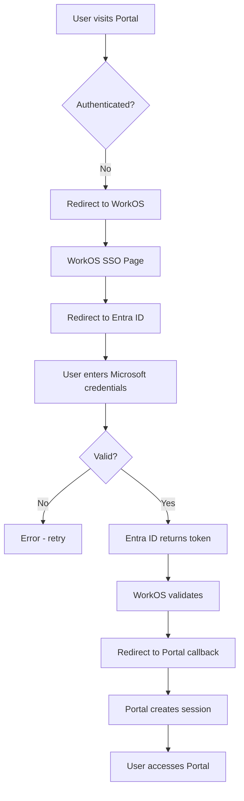
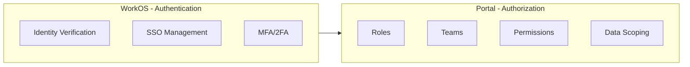

> Enterprise SSO and identity management for secure portal access

---

## Quick Links

| Resource | Link |
|----------|------|
| **WorkOS Dashboard** | [WorkOS Admin](https://dashboard.workos.com/) |
| **Related Initiative** | [Roles & Permissions Refactor](/initiatives/Infrastructure/Roles-And-Permissions-Refactor) |

---

## TL;DR

- **What**: External authentication provider for enterprise SSO via Microsoft Entra ID
- **Who**: All portal users (staff authenticate via WorkOS; authorization remains portal-native)
- **Key flow**: User → WorkOS SSO → Entra ID → Portal session created
- **Watch out**: WorkOS handles authentication only; all permissions/authorization managed in Portal database

---

## Key Concepts

| Term | What it means |
|------|---------------|
| **SSO** | Single Sign-On - one login for multiple systems |
| **WorkOS** | Third-party authentication-as-a-service provider |
| **Entra ID** | Microsoft's identity platform (formerly Azure AD) |
| **Authentication** | Verifying who you are (handled by WorkOS) |
| **Authorization** | What you can do (handled by Portal natively) |
| **Directory Sync** | Automatic user provisioning from identity providers |

---

## How It Works

### Main Flow: SSO Authentication



### Authentication vs Authorization Split



### Other Flows

<details>
<summary><strong>New User Provisioning</strong> - when staff join</summary>

New employees are synced from Employment Hero, which triggers user creation. On first login, WorkOS authenticates via Entra ID and links the identity.


</details>

<details>
<summary><strong>Session Management</strong> - token refresh</summary>

Sessions are managed by Laravel Sanctum after initial WorkOS authentication. Token refresh happens transparently.

</details>

---

## Business Rules

| Rule | Why |
|------|-----|
| **Authentication only** | WorkOS verifies identity; Portal controls permissions |
| **No WorkOS organizations** | $125/org cost prohibitive; Portal manages orgs natively |
| **Entra ID for staff** | Microsoft 365 integration for internal users |
| **Portal-native authorization** | WorkOS can't provide app-level permission granularity |
| **Feature-flagged rollout** | SSO enabled incrementally via `WORKOS_SSO_ENABLED` |

---

## Feature Flags

| Flag | What it controls | Default |
|------|------------------|---------|
| `WORKOS_SSO_ENABLED` | Enables SSO login option | Off (env var) |

---

## Architecture Decisions

### Why WorkOS + Portal Authorization?

1. **Cost**: WorkOS organizations cost $125/org/month - not viable for external orgs (suppliers, coordinators)
2. **Granularity**: WorkOS can't control UI-level permissions (e.g., hiding a card based on role)
3. **Flexibility**: Portal-native permissions allow business teams to manage access without engineering

### What WorkOS Handles

- SSO authentication flow
- Identity provider integrations (Entra ID)
- MFA/2FA enforcement
- Session security

### What Portal Handles

- Role assignment (6-8 core roles, down from 37)
- Team membership (15-20 teams from Employment Hero)
- Permission bundles
- Dashboard routing based on team
- Data scoping

---

## Who Uses This

| Role | What they do |
|------|--------------|
| **All Staff** | Authenticate via Microsoft SSO |
| **Platform Team** | Configure WorkOS integration, manage feature flags |
| **IT/Security** | Manage Entra ID connections, audit access |

---

## Open Questions

| Question | Context |
|----------|---------|
| **Fortify pipeline integration?** | `config/fortify.php` line 147-148 has TODO comment - login pipeline integration not yet implemented |

---

## Technical Reference (Corrected)

<details>
<summary><strong>Configuration</strong></summary>

### Environment Variables

| Variable | Purpose |
|----------|---------|
| `WORKOS_API_KEY` | API authentication (in config as `secret`) |
| `WORKOS_CLIENT_ID` | OAuth client identifier |
| `WORKOS_REDIRECT_URL` | Callback URL after auth |
| `WORKOS_ORG_ID` | Organization identifier |
| `WORKOS_SSO_ENABLED` | Feature toggle (default: true in `config/workos.php`) |
| `WORKOS_API_AUTH_ENABLED` | API-specific auth flag (`app-modules/api/config.php`) |

### Configuration Files

- `config/workos.php` - Primary WorkOS configuration
- `config/services.php` - Third-party services (lines 37-42)

</details>

<details>
<summary><strong>Integration Points (Actual)</strong></summary>

**Note**: `WorkOSController.php` does NOT exist. Authentication uses Laravel WorkOS package's request class:

```
routes/web/auth.php
├── AuthKitAuthenticationRequest    # Handles OAuth callback

app/Providers/FortifyServiceProvider.php
├── Feature::active('workos-auth')  # Feature flag check
├── WorkOS::configure()             # WorkOS setup
└── SSO class                       # Authorization URL generation

app/Http/Middleware/CheckHasLogin.php
└── Skips has_login check for WorkOS users
```

### Composer Packages

```json
"laravel/workos": "*",
"workos/workos-php-laravel": "^4.2"
```

</details>

<details>
<summary><strong>Database Schema</strong></summary>

**Migration**: `2025_06_09_131649_modify_users_table_add_workos_id.php`

Added columns to `users` table:
- `workos_id` - WorkOS user identifier
- `workos_organisation_id` - WorkOS org identifier

</details>

<details>
<summary><strong>Feature Flag</strong></summary>

**Flag name**: `workos-auth`

**Check location**: `FortifyServiceProvider.php` line 44

```php
Feature::active('workos-auth')
```

Controls whether WorkOS OAuth URL is rendered on login page.

</details>

<details>
<summary><strong>User Handling</strong></summary>

**UserLoggedInListener** (`domain/User/Listeners/`):
- Checks if user has `workos_id`
- If WorkOS user, skips standard login handling
- Comment: "If the user has a WorkOS ID, we early return as WorkOS handles user management"

</details>

<details>
<summary><strong>Related Systems</strong></summary>

| System | Integration |
|--------|-------------|
| **Microsoft Entra ID** | Identity provider for staff SSO |
| **Employment Hero** | Source of truth for user/team data |
| **Laravel Sanctum** | Session management post-authentication |
| **Spatie Permissions** | Authorization (being refactored) |

</details>

---

## Testing

### Key Test Scenarios

- [ ] SSO redirect initiates correctly
- [ ] Valid Entra ID credentials create Portal session
- [ ] Invalid credentials show appropriate error
- [ ] Feature flag disables SSO when off
- [ ] Existing users matched on SSO first login
- [ ] New users provisioned correctly

### Manual Testing

1. Enable `WORKOS_SSO_ENABLED=true` in `.env`
2. Navigate to login page
3. Click "Sign in with Microsoft"
4. Complete Entra ID authentication
5. Verify Portal session created

---

## Related

### Domains

- [Authentication](/features/domains/authentication) - login flows
- [Teams & Roles](/features/domains/teams-roles) - authorization managed here
- [Onboarding](/features/domains/onboarding) - new user flows

### Initiatives

| Epic | Status | Description |
|------|--------|-------------|
| [Roles & Permissions Refactor](/initiatives/Infrastructure/Roles-And-Permissions-Refactor) | Planning | Auth/authz architecture changes |

---

## Status

**Maturity**: Planned
**Pod**: Platform
**Owner**: Adam Pooler

---

## Implementation Timeline

| Phase | Description | Status |
|-------|-------------|--------|
| **Phase 1** | WorkOS + Entra ID SSO (behind feature flag) | Partial |
| **Phase 2** | Role consolidation (37 → 6-8 roles) | Planning |
| **Phase 3** | Employment Hero team sync | Planning |
| **Phase 4** | Portal-native permission management UI | Planning |

---

## Source Context

| Source | Key Information |
|--------|-----------------|
| Roles & Permissions PRD (Nov 2025) | Auth/authz split, cost concerns, 6-8 role target |
| Big Room Planning | Consolidation from 37 roles to 6 core + 15-20 teams |
| Infrastructure team | WorkOS partially working behind feature flag |
